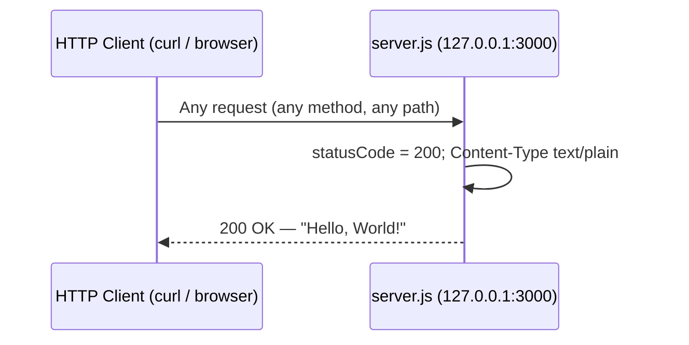

# hello_world — Hello World HTTP Server

A minimal Node.js HTTP server that returns a constant `Hello, World!` response for every request (Source: server.js:1-42).

## Table of Contents

- [Overview](#overview)
- [Features](#features)
- [Tech Stack](#tech-stack)
- [Prerequisites](#prerequisites)
- [Installation](#installation)
- [Running the Server](#running-the-server)
- [API Documentation](#api-documentation)
- [How It Works](#how-it-works)
- [Deployment](#deployment)
- [Project Structure](#project-structure)
- [Testing](#testing)
- [License](#license)
- [Decision Log](#decision-log)

## Overview

`hello_world` is a minimal HTTP server built exclusively on the Node.js core `http` module (Source: server.js:6). It listens on the loopback interface and responds to **every** incoming request — regardless of HTTP method or path — with an HTTP `200` status, a `text/plain` content type, and the body `Hello, World!\n` (Source: server.js:28-32). The project has **zero third-party dependencies** (Source: package-lock.json). It serves as a minimal reference implementation of a Node.js HTTP server.

## Features

- **Single-file server** — the entire application lives in `server.js` (Source: server.js:1-42).
- **Zero dependencies** — uses only the Node.js core `http` module; no external packages are installed (Source: server.js:6; package-lock.json).
- **Constant plain-text response** — returns `200 OK` with the body `Hello, World!\n` for any method and any path; the request is never inspected (Source: server.js:28-32).
- **Loopback binding** — listens on `127.0.0.1:3000` (Source: server.js:12, server.js:17).

## Tech Stack

| Component | Details |
|-----------|---------|
| Runtime | Node.js |
| Server library | Node.js core `http` module only (Source: server.js:6) |
| External dependencies | None — zero packages (Source: package-lock.json) |

## Prerequisites

| Requirement | Notes |
|-------------|-------|
| Node.js | A currently supported Node.js LTS release — for example, Node.js 22 LTS or 24 LTS (current as of July 2026 per the [official Node.js release schedule](https://nodejs.org/en/about/previous-releases)); verified on Node.js 22.x. The project does not pin an engine version in `package.json` (Source: package.json:1-11). |
| npm | Bundled with the Node.js runtime (see the [Node.js download page](https://nodejs.org/en/download)); used only for the (dependency-free) install step (Source: package-lock.json:1-13). |

> The project declares no `engines` field in `package.json` (Source: package.json:1-11), so any currently supported Node.js LTS runtime is sufficient. Consult the [official Node.js release schedule](https://nodejs.org/en/about/previous-releases) for the current list of supported LTS versions.

## Installation

```bash
git clone <repository-url>
cd hello_world
npm install
```

`npm install` completes without installing anything because the project has **zero dependencies** (Source: package-lock.json).

## Running the Server

```bash
node server.js
```

On startup the server logs the address it is bound to (Source: server.js:40-42):

```text
Server running at http://127.0.0.1:3000/
```

> **Entry point note:** Start the server with `node server.js`.
>
> - Do **not** use `npm start` — no `start` script is defined in `package.json` (Source: package.json:6-8).
> - Do **not** use `node index.js` — the `main` field names `index.js`, but that file does not exist in the repository. The actual entry point is `server.js` (Source: package.json:5).

## API Documentation

The server exposes a single behavior: it answers **every** request identically. It does not inspect the request, so the HTTP method, path, query string, and body are all ignored (Source: server.js:28-32).

### Endpoint Reference

| Method | Path | Status | Content-Type | Response Body |
|--------|------|--------|--------------|----------------|
| `ANY` | `/*` (any path) | `200 OK` | `text/plain` | `Hello, World!\n` |

_Source: server.js:28-32_

### Example Request

```bash
curl -i http://127.0.0.1:3000/
```

Expected response — HTTP `200`, `Content-Type: text/plain`, `Content-Length: 14`, and the body `Hello, World!`:

```text
HTTP/1.1 200 OK
Content-Type: text/plain
Date: <current date>
Connection: keep-alive
Keep-Alive: timeout=5
Content-Length: 14

Hello, World!
```

The response body `Hello, World!\n` is 14 bytes, which is reflected by `Content-Length: 14` (Source: server.js:31).

### Request Lifecycle



## How It Works

A construct-by-construct walkthrough of `server.js`:

1. **Import the HTTP module** — `const http = require('http');` loads the Node.js core `http` module, the only module the server needs (Source: server.js:6).
2. **Define the host constant** — `const hostname = '127.0.0.1';` sets the loopback interface the server binds to (Source: server.js:12).
3. **Define the port constant** — `const port = 3000;` sets the TCP port the server listens on (Source: server.js:17).
4. **Create the server with a request handler** — `http.createServer((req, res) => { ... })` registers a callback that runs for every request (Source: server.js:28-32). Inside the handler:
   - `res.statusCode = 200;` sets the HTTP status to `200 OK` (Source: server.js:29).
   - `res.setHeader('Content-Type', 'text/plain');` sets the response content type (Source: server.js:30).
   - `res.end('Hello, World!\n');` writes the response body and ends the response (Source: server.js:31).
5. **Start listening** — `server.listen(port, hostname, () => { ... })` binds the server to `127.0.0.1:3000` and, once listening, logs `Server running at http://127.0.0.1:3000/` from the startup callback (Source: server.js:40-42).

## Deployment

For anything beyond local development, run the server under a process manager or in a container so that it restarts on failure and survives reboots. The examples below are generic.

**Using pm2:**

```bash
npm install -g pm2
pm2 start server.js --name hello_world
pm2 save
```

**Using systemd (unit sketch):**

```ini
[Unit]
Description=hello_world HTTP server
After=network.target

[Service]
ExecStart=/usr/bin/node /path/to/server.js
Restart=always

[Install]
WantedBy=multi-user.target
```

**Using a container (Dockerfile sketch):**

```dockerfile
FROM node:22-alpine
WORKDIR /app
COPY . .
RUN npm install
EXPOSE 3000
CMD ["node", "server.js"]
```

> **⚠️ Loopback binding caveat:** The server binds to `127.0.0.1` (Source: server.js:12), so it is reachable **only from the local host** and will not accept traffic from other machines as-is. To expose it externally, either:
>
> - place it behind a reverse proxy (for example, Nginx) that listens on a public interface and forwards to `127.0.0.1:3000`, or
> - change the bind host in `server.js` (for example, to `0.0.0.0`).
>
> The port is fixed at `3000` in source (Source: server.js:17). Both host and port are hard-coded module constants — there are no environment variables or configuration files — so changing them means editing `server.js`. Do not edit `package.json` for this.

## Project Structure

```text
.
├── server.js          # The HTTP server (documented here)
├── package.json       # npm manifest (name, version, license)
├── package-lock.json  # npm lockfile (zero dependencies)
├── README.md          # This documentation
├── DECISIONS.md       # Decision log (rationale)
├── LoginTest.java     # Unrelated test fixture — not part of this app
├── industry.csv       # Unrelated reference dataset — not part of this app
├── test.py.txt        # Unrelated fixture (empty) — not part of this app
├── test.txt.txt       # Unrelated fixture (empty) — not part of this app
├── 100Pages.pdf       # Unrelated binary fixture — not part of this app
├── demo.jpg           # Unrelated binary fixture — not part of this app
└── sample.doc         # Unrelated binary fixture — not part of this app
```

Only `server.js` carries the documented application logic. The Java, CSV, text, and binary files (`LoginTest.java`, `industry.csv`, `test.py.txt`, `test.txt.txt`, `100Pages.pdf`, `demo.jpg`, `sample.doc`) are **unrelated test fixtures and are not part of the documented application**.

## Testing

Automated tests are **not configured** for this project. The `test` script in `package.json` intentionally exits with an error (Source: package.json:7):

```bash
npm test
# > hello_world@1.0.0 test
# > echo "Error: no test specified" && exit 1
#
# Error: no test specified
```

Running `npm test` fails by design. There is no test suite to execute.

## License

This project is licensed under the **MIT License** (Source: package.json:10). The author is `hxu` (Source: package.json:9). There is no separate `LICENSE` file in the repository; the license is declared in `package.json`.

## Decision Log

See [DECISIONS.md](./DECISIONS.md) for the rationale behind key documentation decisions — what was decided, the alternatives considered, why each choice was made, and the risks it carries.
