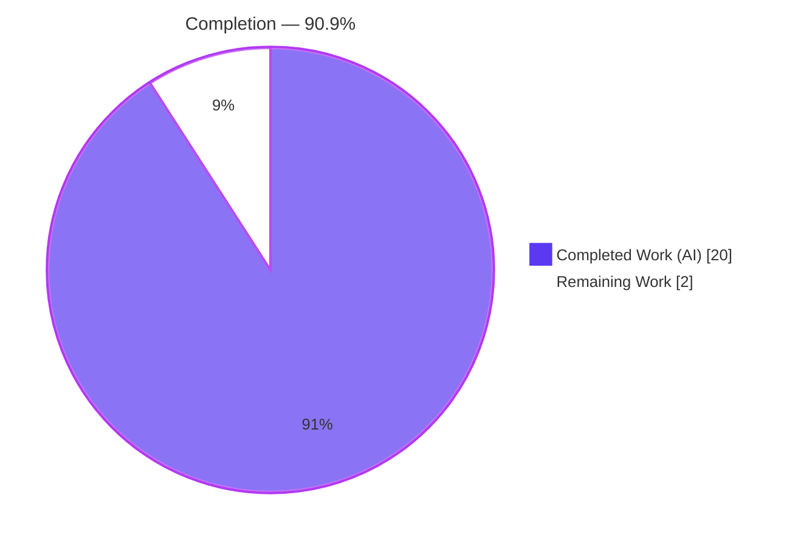
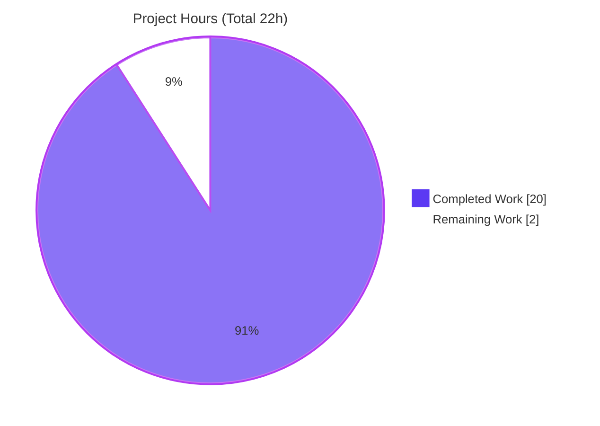
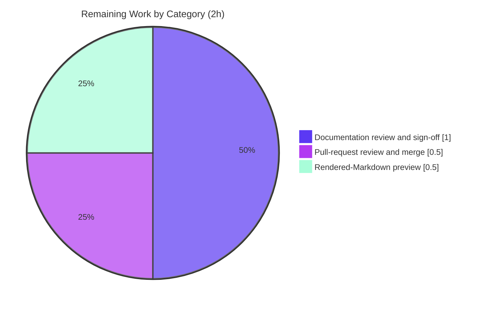

# Blitzy Project Guide — `hello_world` Documentation Delivery

> **Project:** `hello_world` — Minimal Node.js HTTP Server Documentation
> **Branch:** `blitzy-29d452dd-84f5-4cad-9adc-bdfaafa060a9`
> **Baseline commit:** `f60b533` → **HEAD:** `22373ba`
> **Assessment date:** September 08, 2026
> **Runtime verified on:** Node.js v22.23.2 · npm 11.18.0 · curl 8.14.1
> **Brand palette:** Completed / AI Work = Dark Blue `#5B39F3` · Remaining = White `#FFFFFF` · Headings/Accents = Violet-Black `#B23AF2` · Highlight = Mint `#A8FDD9`

---

# 1. Executive Summary

## 1.1 Project Overview

This project delivers complete developer-facing **documentation** for `hello_world`, a minimal Node.js HTTP server whose sole runtime module (`server.js`) answers every request with a constant `Hello, World!\n`. Scope was documentation only, with no runtime change. Three artefacts were produced: additive **JSDoc** in `server.js`, a comprehensive **`README.md`** covering setup, API reference, deployment and a code walkthrough, and a **`DECISIONS.md`** rationale log. A previously undocumented reference server is now fully explained for anyone who must run, understand or deploy it, with every documented command and response verified against the running process.

## 1.2 Completion Status

The project is **90.9% complete**. Every scoped deliverable is implemented and runtime-verified; the 2 remaining hours are human sign-off, preview and merge.



| Metric | Hours |
|--------|-------|
| **Total Hours** | 22 |
| **Completed Hours** (AI + Manual) | 20 |
| &nbsp;&nbsp;• Completed by Blitzy AI | 20 |
| &nbsp;&nbsp;• Completed by prior manual work | 0 |
| **Remaining Hours** | 2 |
| **Percent Complete** | **90.9%** |

> Completion formula: `20 ÷ (20 + 2) = 20 ÷ 22 = 90.9%`.

## 1.3 Key Accomplishments

- ✅ **JSDoc in `server.js`** — 5 blocks; stripping them reproduces the original 14-line source byte-for-byte.
- ✅ **`README.md`** — 253 lines, 15 sections, 13-entry contents list, one Mermaid request-lifecycle diagram.
- ✅ **Endpoint contract documented to the byte** — status, header order, 14-byte body, `HEAD`, HTTP/1.0 framing, four interception classes.
- ✅ **Deployment guide fit to copy** — pm2 boot hook, a systemd unit that passes `systemd-analyze verify`, a container sketch that builds.
- ✅ **Loopback limitation proven** — refused on the host address and `[::1]`, served on `127.0.0.1`.
- ✅ **`DECISIONS.md`** — 20-row four-column log; rationale lives here and nowhere else.
- ✅ **Every documented command executed** — install, run, `curl` GET/HEAD/HTTP-1.0, the by-design `npm test` failure, both entry-point warnings.
- ✅ **Scope discipline** — three files changed; 69 citations resolve; manifests and all seven fixtures byte-identical to baseline.

## 1.4 Critical Unresolved Issues

**0 of the 5 requested deliverables** (JSDoc, setup, API documentation, deployment guide, inline explanations) carries an unresolved defect. **4 accepted caveats** remain, none release-blocking:

| Issue | Impact | Owner | ETA |
|-------|--------|-------|-----|
| No automated test covers any deliverable — the project has zero tests and adding them is out of scope | Future edits to `server.js` or the documentation are not re-checked by anything in the repository | Repository owner | With sign-off (1.0h) |
| The pm2 boot-hook sequence was never executed, and the systemd unit is syntax-verified but never started | A deployer following either path exercises it first in their own environment | Repository owner / Ops | First deployment |
| The 69 line-level source citations have no committed checker | A later `server.js` edit shifts line numbers silently | Repository owner | Next `server.js` change |
| Prerequisites names Node LTS lines "current as of July 2026" (hedged, with a link to the official schedule) | The example ages when the next LTS line ships | Repository owner | Next LTS release |

> The divergences behind these, with next steps, are in §5.2.

## 1.5 Access Issues

| System/Resource | Type of Access | Issue Description | Resolution Status | Owner |
|-----------------|----------------|-------------------|-------------------|-------|
| _None_ | — | No repository-permission, service-credential or third-party-API access issue was encountered | N/A | — |

> **No access issues identified.** The project has zero dependencies, no credentials and no third-party integrations.

## 1.6 Recommended Next Steps

1. **[Medium]** **Review the documentation and sign it off** — ratify the intentional replacement of the "Do not touch!" stub (`DECISIONS.md` row 1; original preserved at `f60b533`) and settle the four editorial items in §5.2. _(≈1.0h)_
2. **[Medium]** **Review and merge the pull request** for the three-file change; leave the untracked `blitzy/screenshots/` directory out of the commit. _(≈0.5h)_
3. **[Low]** **Preview the rendered Markdown** where it will be read — diagram, anchors and the `./DECISIONS.md` link. _(≈0.5h)_

# 2. Project Hours Breakdown

## 2.1 Completed Work Detail

| Component | Hours | Description |
|-----------|-------|-------------|
| `server.js` JSDoc annotations (R1) | 2 | `@fileoverview` header, `@constant {string}`/`@constant {number}` on `hostname`/`port`, and `@param`/`@returns` blocks on the request handler and the `listen` callback (`server.js:1-5, 8-11, 13-16, 19-27, 34-39`). 28 comment lines added, 0 executable lines changed. Commits `8553ab9`, `1f7f197`. |
| `README.md` setup and run documentation (R2) | 1.5 | Prerequisites, Installation and Running the Server (`README.md:40-74`), prescribing `node server.js` and disclosing that `main` names an absent `index.js` and that no `start` script exists. |
| `README.md` API documentation (R3) | 4 | Endpoint Reference table, byte-exact `curl` example, Mermaid request-lifecycle diagram, `HEAD` and HTTP-version framing note, and a four-row Platform-Level Exceptions table (`README.md:76-139`). Commits `ca14caf`, `95a88e5`, `22373ba`. |
| `README.md` deployment guide (R4) | 3 | pm2 with the `pm2 startup` boot hook, a systemd unit carrying `WorkingDirectory`/`User`/`Group`/`NoNewPrivileges` plus account creation, a container sketch with a narrowed `COPY`, and the `127.0.0.1` loopback caveat including the container published-port case (`README.md:154-211`). Commit `67d9ec4`. |
| `README.md` How It Works walkthrough (R5) | 1 | Construct-by-construct explanation covering all 11 executable lines, citing `server.js:6`, `:12`, `:17`, `:28-32`, `:40-42` (`README.md:141-152`). |
| `README.md` completeness sections | 1.5 | Overview, Features, Tech Stack, Project Structure (all 13 root entries, with the seven fixtures and `blitzy/` labelled as outside the application), honest Testing disclosure, License, and the 13-entry Table of Contents. Commits `40eeeac`, `7c1661a`, `e79dd3d`, `df87cb4`. |
| `DECISIONS.md` rationale log | 3 | Four-column table (Decision · Alternatives Considered · Rationale · Risks) with 20 data rows: the eight seed decisions in order plus twelve more covering the Mermaid embedding, `HEAD` semantics, each runtime interception class, HTTP/1.0 framing, the deployment hardening choices and the citation-drift risk. Commits `9f87daa`, `6114a2b`, `51b24ec`. |
| Runtime verification of every documented claim | 3 | Execute-and-compare across every documented command, response, header order and byte count, plus maintenance of 69 line-level citations (23 distinct targets) so each resolves to the construct it names. |
| Scope-integrity verification | 1 | Proof that only the three in-scope files changed: `package.json` and `package-lock.json` md5-identical to baseline, all seven fixtures untouched, no `docs/` tree, `LICENSE`, `CONTRIBUTING.md`, `CHANGELOG.md`, generator config, CI setup or dependency introduced. |
| **Total Completed** | **20** | Matches Completed Hours in §1.2. |

## 2.2 Remaining Work Detail

| Category | Hours | Priority |
|----------|-------|----------|
| Documentation review and sign-off — ratify the stub replacement, confirm the empty rules document, settle the two optional wording items (§5.2 rows 2, 4, 5, 6) | 1.0 | Medium |
| Pull-request review and merge of the three-file change | 0.5 | Medium |
| Rendered-Markdown preview on the target host — Mermaid diagram, 21 anchors, 13 ToC links, `./DECISIONS.md` | 0.5 | Low |
| **Total Remaining** | **2** | Matches Remaining Hours in §1.2 and the §7 pie chart. |

## 2.3 Out-of-Scope Optional Enhancements (informational — 0 hours, excluded from completion math)

These carry **no hours** so they cannot distort the completion percentage. They are recorded only as future considerations:

- Generate browsable HTML API docs from the existing JSDoc (`npm i --save-dev jsdoc@4.0.5` then `npx jsdoc server.js -d out`) — a recommendation only; the generator is deliberately not installed.
- Add an automated test suite — out of scope, and the intentionally failing `test` script must not be changed.
- Reconcile the dangling `main: index.js` field or add a `start` script — documented deliberately rather than "fixed".
- Change the bind host to `0.0.0.0` for off-host reachability — documented as a caveat with both workarounds.
- Add hardening response headers (`X-Content-Type-Options`, CSP, HSTS) — would require an executable change to `server.js`.

---

# 3. Test Results

This project contains **no automated test suite**, and one may not be added: the `test` script in `package.json` is npm's placeholder, which exits 1 by design. Verification therefore rests on executable gates and execute-and-compare probes run against the live server. Every row below was executed for this assessment on Node.js v22.23.2 / npm 11.18.0 and its result observed directly.

| Area / Category | Framework | Tests | Passed | Failed | Coverage | What This Proves |
|-----------------|-----------|-------|--------|--------|----------|------------------|
| Syntax / compile-equivalent gate | `node --check` | 1 | 1 | 0 | 1/1 source file | `server.js` parses cleanly; the JSDoc additions did not break the module |
| Dependency and manifest integrity | `npm install` + `md5sum` | 3 | 3 | 0 | 2/2 manifests | Install is a no-op that adds zero packages, and both read-only manifests are byte-identical to the pre-project baseline |
| Documented test-script behaviour | `npm test` | 1 | 1 | 0 | 0 automated tests exist | The placeholder failure prints exactly the three lines the README's Testing section shows — the disclosure is honest |
| Startup, listener and reachability | `node` + `ss` + `curl` | 6 | 6 | 0 | 1/1 runtime module | The server prints the documented 41-byte log line, binds `127.0.0.1:3000` only, and is refused on the host IP and `[::1]` — the loopback caveat is real |
| Endpoint contract — method × path | `curl` | 28 | 28 | 0 | 1/1 endpoint | 7 methods across 4 targets all return `200`, `text/plain` and the same 14-byte body: there is no routing and the request is never inspected |
| Response framing — GET / HEAD / HTTP-1.0 | `curl` | 3 | 3 | 0 | 3/3 documented framings | `HEAD` returns no body and no `Content-Length`, HTTP/1.0 is close-delimited with no `Content-Length`, HTTP/1.1 carries `Content-Length: 14` |
| Runtime interception classes | raw sockets | 7 | 7 | 0 | 4/4 documented classes | The parser `400` (47 bytes), missing-`Host` `400` (117 bytes), `431` (67 bytes) and zero-byte `CONNECT` close match the documentation byte-for-byte, an upgrade request falls through to `200`, and service recovers on the next connection |
| Documentation and source integrity (static) | scripted checks | 9 | 9 | 0 | 15/15 README sections · 20/20 decision rows · 5/5 JSDoc blocks | Stripping the JSDoc reproduces the original source exactly; sections are in order; 21/21 anchors resolve; 22 fences balance around 1 Mermaid block; all 69 citations are in range; the decision log holds its four-column, eight-seed contract; no stale project name and no TODO/FIXME marker survives |
| **Totals** | — | **58** | **58** | **0** | — | Zero failures across every gate and probe executed |

### Not Covered

Because the repository has no test suite, no Markdown linter and no link checker — and adding any of them is out of scope — nothing in the repository re-verifies the documentation after a change. A human should check the following before release:

- **Documentation structure and links** — the 15-section order, 21 internal anchors, 13 ToC entries and the `./DECISIONS.md` link are correct today but are guarded by no committed check.
- **Line-level citations** — 69 citations point into `server.js`, `package.json` and `package-lock.json` by line; any future edit to `server.js` shifts them silently.
- **`DECISIONS.md` table contract** — the four-column shape and the eight mandatory seed rows are enforced by no committed check.
- **pm2 boot-hook sequence** — documented from PM2's own startup documentation; the commands were never executed, because installing a global package sits outside the documentation scope.
- **systemd unit lifecycle** — the unit is syntax-verified with `systemd-analyze verify`, but no init system was available to start or enable it.
- **Mermaid rendering** — the diagram renders as an SVG on a Mermaid-capable host; confirm it on the host where the README will actually be read.

---

# 4. Runtime Validation & UI Verification

Every flow below was driven against a live `node server.js` process on `127.0.0.1:3000`, started and stopped by captured process id.

- ✅ **Operational — Startup.** `node server.js` prints exactly `Server running at http://127.0.0.1:3000/` (41 bytes, one line) and writes nothing further, even after roughly two hundred probes.
- ✅ **Operational — Primary endpoint.** `GET /` returns `200`, `Content-Type: text/plain`, `Date`, `Connection: keep-alive`, `Keep-Alive: timeout=5`, `Content-Length: 14` and the body `Hello, World!\n`, header-for-header and in the order the README shows.
- ✅ **Operational — Method and path independence.** 7 methods (`GET`, `POST`, `PUT`, `DELETE`, `PATCH`, `OPTIONS`, `TRACE`) across `/`, `/foo`, `/a/b/c` and `/any?q=1` all return the identical `200` and 14-byte body; request headers and bodies are ignored.
- ✅ **Operational — `HEAD` semantics.** `curl -I` returns `200` with `Content-Type` and no body and no `Content-Length`.
- ✅ **Operational — HTTP/1.0 framing.** `curl --http1.0 -i` returns the same 14 bytes delimited by `Connection: close`, with no `Content-Length` header.
- ✅ **Operational — Runtime interceptions.** An unrecognised or wrong-case method token and a malformed header section each return a 47-byte `400`; an HTTP/1.1 request with no `Host` returns the 117-byte `400`; a request line plus headers over 16 KiB returns a 67-byte `431`; `CONNECT` is closed with zero bytes; an upgrade request falls through to `200`; the next request on a fresh connection is served normally.
- ✅ **Operational — Loopback caveat.** `ss -ltnp` shows a single IPv4 listener on `127.0.0.1:3000`; requests to the machine's own routable address and to `[::1]:3000` are both refused, while `localhost:3000` returns `200`.
- ✅ **Operational as documented — Entry points and tests.** `npm test` exits 1 with the three documented lines; `node index.js` and `node .` both exit 1 with `Cannot find module`; `npm start` does start the server through npm's legacy fallback (see §5.2).
- ✅ **Operational — Rendered documentation.** In a real browser the README renders with the Mermaid request-lifecycle diagram as an SVG, all 13 contents links landing on their headings, and the decision log as one clean four-column table at 375 px and 1280 px, with no console errors.
- ➖ **Not exercised at runtime.** The pm2 command sequence was never run (pm2 is not installed and installing a global package is outside the documentation scope), and the systemd unit was syntax-verified but never started or enabled because no init system was available. There is **no user interface** to verify — the server returns `text/plain` only.

---

# 5. Compliance & Quality Review

## 5.1 Compliance Matrix

Each scoped deliverable and governing rule, with the state it stands in now.

| # | Requirement / Rule | Benchmark | Status | Progress |
|---|--------------------|-----------|--------|----------|
| R1 | JSDoc on `server.js` functions | `@fileoverview` + 2 callbacks + 2 constants annotated; comments additive only | ✅ Pass | 100% |
| R2 | README setup instructions | Prerequisites, install, run via `node server.js`, both entry-point disclosures | ✅ Pass | 100% |
| R3 | README API documentation | Endpoint table, byte-exact example, Mermaid diagram, framing note, interception table | ✅ Pass | 100% |
| R4 | README deployment guide | pm2 / systemd / container guidance, loopback caveat, fixed-port statement | ✅ Pass | 100% |
| R5 | README inline code explanations | Construct-by-construct walkthrough of all 11 executable lines | ✅ Pass | 100% |
| §0.1.4 | Completeness and honest disclosure | Overview, features, tech stack, structure, testing note, license, ToC, name reconciliation | ✅ Pass | 100% |
| §0.4.1 | README structure | 15 sections in the planned order plus 4 API subsections | ✅ Pass | 100% |
| §0.4.2 | Citation discipline | Every technical claim cites its source file and line — 69 citations, all in range | ✅ Pass | 100% |
| §0.4.3 | Request-lifecycle diagram | Exactly one Mermaid sequence diagram, byte-identical to the specified block | ✅ Pass | 100% |
| §0.7.1 | Coverage targets | JSDoc units 100%, API 100% (1/1 endpoint), README topics 100%, decision log 100% | ✅ Pass | 100% |
| Rule 1 | Explainability | Rationale confined to `DECISIONS.md`; 20 four-column rows including all 8 seeds | ✅ Pass | 100% |
| Rule 3 | Minimal changes | Three files changed; executable code byte-identical; manifests and fixtures untouched | ✅ Pass | 100% |

> Rule 2 ("Hello World") is a literal no-op and imposes no requirement; it is recorded for completeness. **No outstanding compliance item remains.**

## 5.2 AAP & Rule Divergences and Gaps

Six departures from the agreed documentation plan (AAP) were identified. None blocks release; four call for a human decision and are costed in §2.2.

| # | What the AAP/Rule Required | What Was Delivered Instead | Why It Diverged | Impact | Remediation |
|---|----------------------------|----------------------------|-----------------|--------|-------------|
| 1 | §0.3.1 / §0.5.1: describe the endpoint as "any method / any path → `200`" | The mandated `ANY` / `/*` row and Mermaid block are byte-identical, but the surrounding prose is bounded to what the runtime passes to the handler, plus a four-row Platform-Level Exceptions table (`README.md:126-139`) | §0.7.2 requires accuracy against the running server, and the absolute claim is falsifiable in one command | None negative — the documentation is stricter and true; no behaviour changed | None required |
| 2 | §0.5.5: the `server.js` `@fileoverview` should align terminologically with the README Overview | The README prose is qualified while the handler description still reads "every request, regardless of method or path" (`server.js:20-22`) | Qualifying a comment adds non-descriptive scope detail to a file the minimal-change rule keeps small, and the sentence is true of the handler itself | Cosmetic wording difference between comment and prose | Decide during sign-off; optional |
| 3 | §0.4.3: "Screenshots — not applicable" | Rendering-evidence PNGs exist under `blitzy/screenshots/`, deliberately left untracked; the committed tree holds only the three documentation files | The Mermaid render and the decision table had to be confirmed visually | None on the repository; `git status` shows the directory because there is no `.gitignore` | Do not commit the directory when merging |
| 4 | §0.10 presents three governing rules (Explainability, "Hello World", minimal changes) | The rules were applied as specification requirements, because the project carries no separate rules document | The three rules exist only as restatements inside the plan; the project's rules document is empty | None on the delivered work — all three were honoured and verified | Confirm the empty rules document is intended |
| 5 | §0.9: the README must warn against `npm start` because no `start` script exists | The warning is present and its stated reason is true, yet `npm start` does start the server (`README.md:73`) | The plan mandates that wording; npm's legacy fallback runs `node server.js` regardless | A reader who ignores the warning still gets a running server | Optionally add a parenthetical |
| 6 | §0.7.2: accuracy — nothing overstated | Prerequisites names Node LTS lines "current as of July 2026", hedged with "for example" and a link to the official schedule (`README.md:44`) | LTS lines change on a published schedule that no wording can freeze | The example ages; it was accurate on the assessment date | Revisit when the next LTS ships |

**1 — Endpoint contract wording.** The plan describes a catch-all endpoint and mandates an `ANY` / `/*` table row, and both the row and the specified diagram were delivered untouched. The prose around them, however, is bounded: some requests never reach the handler. Driving the server confirms it — an unrecognised method token or malformed header section returns a 47-byte `400`, an HTTP/1.1 request without `Host` returns a 117-byte `400`, a request line plus headers over 16 KiB returns a 67-byte `431`, and `CONNECT` is closed with zero bytes. Documenting these in `README.md:126-139` honours the accuracy criterion without editing the mandated artefacts, and each case carries its own decision-log row. No human action is needed.

**2 — `@fileoverview` alignment.** The plan asks the module overview in `server.js` to use the same terms as the README Overview. The README prose is now qualified, while `server.js:20-22` still describes the handler as responding "to every request, regardless of method or path". Read as function-level documentation the sentence is exactly true: the handler does answer every invocation that way, and the qualified contract lives where the contract is defined. Qualifying the comment would push runtime-boundary detail into a file the minimal-change rule keeps small. Decide at sign-off whether the extra precision is worth the words; nothing depends on it.

**3 — Visual evidence.** The plan states screenshots are not applicable, and no screenshot is part of the deliverable. Verifying that the Mermaid diagram renders as an SVG and that the 20-row decision table renders as four columns nevertheless required a real browser, so those captures sit under `blitzy/screenshots/` and were deliberately left untracked — the committed change set is `server.js`, `README.md` and `DECISIONS.md` only. Because the repository has no `.gitignore`, `git status` lists the directory, so the merge must leave it out. Nothing in the repository depends on it either way.

**4 — Source of the governing rules.** The plan reproduces three rules — rationale in a decision log, a literal "Hello World" no-op, and minimal changes — but the project's own rules document is empty, so they exist only as restatements inside the plan. They were treated as binding and each was verified: rationale appears only in `DECISIONS.md`, the JSDoc carries none, and exactly three files changed with both manifests byte-identical. The delivered work is therefore unaffected. What a human should settle is configuration rather than code: confirm the empty rules document is intentional, since anyone consulting it later will find nothing there.

**5 — The `npm start` warning.** `README.md:73` tells readers not to use `npm start` and gives the reason that no `start` script is defined — verifiably true, as `package.json` declares only `test`. npm's legacy fallback nonetheless runs `node server.js` when no `start` script exists, so the command works: running it prints `> hello_world@1.0.0 start`, `> node server.js` and the usual startup line. The plan mandates this wording, and `node server.js` remains the stable instruction that matches every other example. A one-clause parenthetical would remove the surprise; the choice is editorial.

**6 — Date-stamped prerequisite.** The accuracy criterion asks that nothing be overstated, and one line carries a built-in expiry: Prerequisites cites Node LTS lines as "current as of July 2026". It is correctly hedged with "for example" and links the official release schedule, and it was accurate on the assessment date — Node 22 and 24 are the active LTS lines, and the runtime used throughout is v22.23.2. The wording degrades gracefully rather than misleading, but it is the single claim in the documentation that will age. Revisit it when the next LTS line ships.

# 6. Risk Assessment

Forward-looking risks only — what could still go wrong once this documentation is in use.

| Risk | Category | Severity | Probability | Mitigation | Status |
|------|----------|----------|-------------|------------|--------|
| Citation drift — 69 line-level citations resolve today, but a future edit to `server.js` shifts them silently | Technical | Low | Medium | The risk is recorded in `DECISIONS.md`; re-verify citations whenever `server.js` changes (the cited constructs themselves are stable) | Accepted with mitigation |
| No automated guard for the documentation — no test suite, Markdown linter or link checker, and adding one is out of scope | Operational | Low | Medium | Every documented command in §9 is copy-pasteable, so a change can be re-verified against a running server in minutes | Accepted (out of scope) |
| The original README's "Do not touch!" stub was intentionally replaced | Operational / Process | Low | Low | Decision logged in `DECISIONS.md` row 1; the original two lines are preserved in history at `f60b533`; ratification is the first task in §1.6 | Awaiting sign-off |
| Loopback-only binding — `127.0.0.1:3000` is unreachable off-host, and a container's published port is reset | Operational | Medium | Low | Prominent caveat with both workarounds (reverse proxy to `127.0.0.1:3000`, or change the bind host); changing it in code is out of scope | Documented |
| A second instance exits on an unhandled `EADDRINUSE`, so a process manager owning an occupied port will restart-loop | Technical | Low | Medium | Pre-existing behaviour, byte-identical in the original server; the deployment guidance assumes a single owner of port 3000 | Accepted (out of scope) |
| No hardening response headers, authentication or rate limiting | Security | Low | Low | Correct for a loopback-only server returning constant plain text with no attacker-controlled content; a 37-case injection matrix produced no reflection. Revisit before any exposure beyond loopback | Accepted (out of scope) |
| Documented parser byte shapes are Node 22.x behaviour; the 22.x line enters maintenance in October 2026 and reaches EOL on 2027-04-30 | Technical | Low | Medium | The README links the official release schedule rather than pinning a version; revalidate the Platform-Level Exceptions table on a runtime upgrade | Monitor |
| The Mermaid diagram needs a Mermaid-capable viewer | Integration | Low | Low | Renders natively on common hosts and degrades to readable fenced text elsewhere | Mitigated |

> **Overall risk posture: LOW.** No High or Critical risk exists. There is no supply-chain surface at all — zero dependencies, `npm audit` reports 0 vulnerabilities, no install lifecycle scripts, no project `.npmrc`, and the runtime in use (v22.23.2) is the fully patched 22.x release.

---

# 7. Visual Project Status

**Project hours — completed vs remaining** (Completed = Dark Blue `#5B39F3`, Remaining = White `#FFFFFF`):



**Remaining hours by category** (sums to the 2h remaining total):



**Completed hours by deliverable**

| Deliverable | Hours | Share of Completed |
|-------------|-------|--------------------|
| `README.md` (R2–R5 + completeness sections) | 11.0 | 55% |
| `DECISIONS.md` rationale log | 3.0 | 15% |
| Runtime verification of every documented claim | 3.0 | 15% |
| `server.js` JSDoc annotations | 2.0 | 10% |
| Scope-integrity verification | 1.0 | 5% |
| **Total** | **20.0** | **100%** |

**Remaining work by priority**

| Priority | Hours | Share of Remaining |
|----------|-------|--------------------|
| High | 0.0 | 0% |
| Medium | 1.5 | 75% |
| Low | 0.5 | 25% |
| **Total** | **2.0** | **100%** |

> **Integrity check:** "Remaining Work" = **2h**, matching the Remaining Hours in §1.2 and the §2.2 sum (1.0 + 0.5 + 0.5). "Completed Work" = **20h**, matching §1.2 and the §2.1 sum. Total = **22h**, and 20 ÷ 22 = **90.9%**.

---

# 8. Summary & Recommendations

**What was delivered.** `hello_world` now has a complete documentation set built on three artefacts. `server.js` carries five JSDoc blocks — a module overview, `@constant` annotations on both configuration constants, and `@param`/`@returns` on the request handler and the startup callback — while its executable code is provably untouched: stripping the comments reproduces the original 14-line file byte-for-byte. `README.md` runs to 253 lines across 15 sections and answers the four questions the request asked, covering setup, the API, deployment and a construct-by-construct walkthrough of every executable line. `DECISIONS.md` holds the reasoning in a 20-row four-column table, so the "why" lives in exactly one place. Only those three files changed; both npm manifests and all seven unrelated fixtures are byte-identical to the pre-project baseline.

**What was verified.** Documentation is only as good as its accuracy, so every claim was measured rather than asserted. The server was started and driven: the startup line matches to the byte, `GET /` reproduces the documented response header-for-header including `Content-Length: 14`, and 28 method-and-path combinations all return the same 14-byte body. The subtler statements hold too — `HEAD` returns no body and no `Content-Length`, an HTTP/1.0 request is close-delimited with no length header, and the four documented runtime interceptions (47-byte `400`, 117-byte missing-`Host` `400`, 67-byte `431`, zero-byte `CONNECT` close) reproduce exactly, with service recovering on the next connection. The loopback caveat was proven by refusal on the host address and `[::1]`. In all, 58 gates and probes were executed for this assessment with zero failures.

**Remaining gaps.** The project is **90.9% complete** (20 of 22 hours). The outstanding **2 hours** are human path-to-production work: a documentation review that ratifies the intentional replacement of the original "Do not touch!" stub and settles four small editorial decisions (1.0h), a pull-request review and merge (0.5h), and a rendered-Markdown preview on the host where the README will be read (0.5h). None is engineering rework. The genuine gap is coverage rather than content: the repository has no test suite, Markdown linter or link checker, and none may be added, so nothing automatically re-checks the 69 line-level citations, the section order or the decision-log contract after a future edit — §3 lists exactly what a human should re-check.

**Critical path to production.** Documentation review and sign-off → rendered-Markdown preview → pull-request merge. The sequence is short and low-risk, touches no executable code, and requires no environment setup, credentials or third-party access. When merging, leave the untracked evidence directory out of the commit; the repository has no `.gitignore` to filter it.

**Production readiness.** The documentation set is **ready to merge pending routine human review**. Success metrics were met in full: JSDoc unit coverage 100%, API coverage 100% (1 of 1 endpoint), all four requested README topics plus the completeness sections, decision-log coverage 100%, 58 of 58 checks passing, zero dependency vulnerabilities and zero files changed outside scope. Overall risk posture is low with no High or Critical risk, and the one process item — ratifying the stub replacement — is a decision rather than a defect.

| Success Metric | Target | Actual | Status |
|----------------|--------|--------|--------|
| JSDoc unit coverage | 100% | 100% (module + 2 callbacks + 2 constants) | ✅ |
| API endpoint coverage | 100% | 100% (1/1 endpoint, plus 4 interception classes) | ✅ |
| README requested-topic coverage | 100% | 100% (setup, API, deployment, inline explanations) | ✅ |
| Decision-log coverage | 100% | 100% (20 rows incl. all 8 seed decisions) | ✅ |
| Checks executed and passing | 100% | 58/58 (100%) | ✅ |
| Source citations resolving | 100% | 69/69 in range | ✅ |
| Dependency vulnerabilities | 0 | 0 | ✅ |
| Files changed outside scope | 0 | 0 | ✅ |

---

# 9. Development Guide

Every command below was executed for this assessment on **Node.js v22.23.2 / npm 11.18.0** with the outputs shown.

## 9.1 System Prerequisites

- **Node.js:** any currently supported LTS — verified on **v22.23.2**. The project declares no `engines` field.
- **npm:** bundled with Node.js (verified **11.18.0**); used only for the dependency-free install step.
- **Operating system:** any platform Node.js supports (Linux / macOS / Windows).
- **Hardware:** negligible — one process, no dependencies, no data store.
- **Not needed:** no build tool, transpiler, bundler, linter, type checker, database, cache or message broker.

```bash
node --version    # v22.23.2
npm --version     # 11.18.0
```

## 9.2 Environment Setup

**No environment setup is required.** The application reads **zero environment variables** and there are no configuration files. The host and port are hard-coded module constants — `hostname = '127.0.0.1'` (`server.js:12`) and `port = 3000` (`server.js:17`) — so changing either means editing `server.js`. Do **not** edit `package.json` for this.

## 9.3 Dependency Installation

```bash
git clone <repository-url>
cd hello_world
CI=true npm install --no-fund --no-audit
```

The install step is optional and a no-op — the project has zero dependencies and no `node_modules` is created:

```text
up to date in 118ms
```

```bash
npm ls --all      # hello_world@1.0.0 <repo root>  └── (empty)
npm audit         # found 0 vulnerabilities
```

## 9.4 Application Startup

There is no build step. The applicable static gate is a syntax check:

```bash
node --check server.js    # exit 0, no output
```

Start the server:

```bash
node server.js
```

Expected startup log — one line, 41 bytes:

```text
Server running at http://127.0.0.1:3000/
```

> **Entry-point notes**
> - `node server.js` is the prescribed command and the one every example uses.
> - `node index.js` and `node .` both fail with `Cannot find module …/index.js` (exit 1) — `package.json`'s `main` field names a file that does not exist.
> - `npm start` also works, because npm's legacy fallback runs `node server.js` when no `start` script is defined. Prefer the explicit command.

To run in the background and stop cleanly by exact process id (never by name):

```bash
nohup node server.js > server.log 2>&1 &
pid=$!                                        # capture the exact pid
curl -s -o /dev/null http://127.0.0.1:3000/   # poll until it answers
kill "$pid"                                   # stop exactly this process
```

## 9.5 Verification Steps

```bash
curl -i http://127.0.0.1:3000/          # 200, text/plain, Content-Length: 14
curl -I http://127.0.0.1:3000/          # 200, no body, no Content-Length
curl --http1.0 -i http://127.0.0.1:3000/ # 200, Connection: close, no Content-Length
ss -ltnp | grep 3000                     # single IPv4 listener on 127.0.0.1:3000
```

Expected `GET /` response:

```text
HTTP/1.1 200 OK
Content-Type: text/plain
Date: <current date>
Connection: keep-alive
Keep-Alive: timeout=5
Content-Length: 14

Hello, World!
```

## 9.6 Example Usage

```bash
# Any method and any path return the identical 200 response
curl -s -o /dev/null -w "%{http_code}\n" -X POST http://127.0.0.1:3000/anything   # 200
curl -s -o /dev/null -w "%{http_code}\n" -X PUT  http://127.0.0.1:3000/a/b/c      # 200

# Requests the runtime answers before the handler runs
curl -s -o /dev/null -w "%{http_code}\n" -X FROBNICATE http://127.0.0.1:3000/     # 400
curl -s -o /dev/null -w "%{http_code}\n" -H 'Host:' http://127.0.0.1:3000/        # 400
curl -s -o /dev/null -w "%{http_code}\n" "http://127.0.0.1:3000/$(python3 -c 'print("a"*16500)')"  # 431

# Tests (intentionally fails — no suite exists)
CI=true npm test    # prints "Error: no test specified" and exits 1, by design
```

## 9.7 Troubleshooting

- **`EADDRINUSE: address already in use 127.0.0.1:3000`** — another process holds port 3000; a second instance exits 1 immediately. Stop the owner by port, never by name:

  ```bash
  lsof -ti :3000                              # the owning pid
  kill "$(lsof -ti :3000)"                    # stop exactly that process
  ps -eo pid,args | grep '[n]ode server.js'   # alternative lookup
  ```

- **`node: command not found`** — install a current Node.js LTS from [nodejs.org](https://nodejs.org/en/download).
- **`npm test` exits 1** — expected. The project has no test suite and the placeholder script fails by design.
- **`Cannot find module …/index.js`** — you ran `node .` or `node index.js`. Use `node server.js`.
- **Not reachable from another machine** — the server binds loopback only, so the host address and `[::1]` are refused. Put a reverse proxy in front of `127.0.0.1:3000`, or change the bind host in `server.js`. Inside a container, a published port is reset for the same reason; publishing requires the bind-host change applied in the image.
- **Mermaid diagram shows as raw code** — view `README.md` on a Mermaid-capable host or in a viewer with Mermaid support.

---

# 10. Appendices

## Appendix A — Command Reference

| Command | Purpose | Verified Result |
|---------|---------|-----------------|
| `node --version` | Show the Node.js version | `v22.23.2` |
| `npm --version` | Show the npm version | `11.18.0` |
| `node --check server.js` | Validate syntax (the applicable static gate) | exit `0`, no output |
| `CI=true npm install --no-fund --no-audit` | Install dependencies | exit `0`, "up to date", 0 packages, no `node_modules` |
| `npm ls --all` | Show the dependency tree | `hello_world@1.0.0` → `(empty)` |
| `npm audit` | Audit dependencies | `found 0 vulnerabilities` |
| `node server.js` | Start the server | logs `Server running at http://127.0.0.1:3000/` (41 bytes) |
| `curl -i http://127.0.0.1:3000/` | Verify the endpoint | `200`, `text/plain`, `Content-Length: 14`, `Hello, World!` |
| `curl -I http://127.0.0.1:3000/` | Verify `HEAD` semantics | `200`, no body, no `Content-Length` |
| `curl --http1.0 -i http://127.0.0.1:3000/` | Verify HTTP/1.0 framing | `200`, `Connection: close`, no `Content-Length` |
| `ss -ltnp \| grep 3000` | Inspect the listener | one IPv4 listener on `127.0.0.1:3000` |
| `kill "$(lsof -ti :3000)"` | Stop the port owner | port released |
| `CI=true npm test` | Run tests (none exist) | exit `1`, `Error: no test specified` — by design |

## Appendix B — Port Reference

| Port | Bind Address | Purpose | Configurable |
|------|--------------|---------|--------------|
| 3000 | `127.0.0.1` (loopback only) | HTTP server listener | Only by editing `server.js:17` — it is a hard-coded constant, not an environment variable |

## Appendix C — Key File Locations

| File | Role | Status |
|------|------|--------|
| `server.js` | The HTTP server; 42 lines, 5 JSDoc blocks | In scope — modified (comments only, +28 lines) |
| `README.md` | Comprehensive project documentation; 253 lines, 15 sections | In scope — modified (stub overwritten) |
| `DECISIONS.md` | Rationale log; 20-row four-column table | In scope — created |
| `package.json` | npm manifest and metadata source | Reference — untouched (md5 `4e7ae7b17b5f5e7a81449af878523d25`) |
| `package-lock.json` | Lockfile confirming zero dependencies | Reference — untouched (md5 `158033d2354b83cdca5cfb1e4f8fcef7`) |
| `LoginTest.java`, `industry.csv`, `test.py.txt`, `test.txt.txt`, `100Pages.pdf`, `demo.jpg`, `sample.doc` | Unrelated test fixtures, labelled as such in the README's Project Structure | Out of scope — untouched |
| `blitzy/documentation/` | Generated specification documents | Out of scope — not part of the application |
| `blitzy/screenshots/` | Rendering evidence captures | Untracked — do not commit (no `.gitignore` exists) |

## Appendix D — Technology Versions

| Technology | Version | Notes |
|------------|---------|-------|
| Node.js | v22.23.2 (any current LTS) | No `engines` pin; the 22.x line reaches EOL 2027-04-30 |
| npm | 11.18.0 | Bundled with Node.js |
| curl | 8.14.1 | Used for endpoint verification |
| HTTP library | Node.js core `http` | The only `require` in the project; zero third-party dependencies |
| Diagrams | Mermaid (embedded in Markdown) | Rendered natively by common hosts; no build dependency |
| JSDoc (optional) | 4.0.5 | Optional HTML API-doc generation only; deliberately not installed |

## Appendix E — Environment Variable Reference

| Variable | Purpose | Default |
|----------|---------|---------|
| _None_ | The application reads no environment variables; host and port are hard-coded constants in `server.js` | — |

## Appendix F — Developer Tools Guide

| Tool | Use |
|------|-----|
| `node --check <file>` | Static syntax validation — the applicable "compile" gate for plain JavaScript |
| `curl -i` / `-I` / `--http1.0 -i` | Verify the response, `HEAD` semantics and HTTP/1.0 framing |
| `npm ls --all` / `npm audit` | Confirm the empty dependency tree and the absence of vulnerabilities |
| `ss -ltnp` / `lsof -ti :3000` | Inspect the listener and identify the port owner before `kill` |
| `python3` raw sockets | Reproduce the runtime interception classes (`400`, missing-`Host` `400`, `431`, `CONNECT`) |
| `systemd-analyze verify` | Validate the README's systemd unit sketch before installing it |
| `docker build --check` | Lint the README's Dockerfile sketch |
| `jsdoc` (optional) | `npx jsdoc server.js -d out` to generate browsable HTML API docs — outside the core scope |

## Appendix G — Glossary

| Term | Definition |
|------|------------|
| **Catch-all endpoint** | A handler that answers every request identically, ignoring method, path, query and body |
| **JSDoc** | A comment convention (`/** … */`) annotating JavaScript with `@param`, `@returns`, `@constant` and similar tags |
| **Loopback** | The `127.0.0.1` interface, reachable only from the machine — or, in a container, the container — that the process runs on |
| **Platform-level exception** | A request the Node.js runtime disposes of before the application handler runs (parser `400`, missing-`Host` `400`, `431`, `CONNECT`) |
| **`http.maxHeaderSize`** | Node's 16,384-byte default ceiling on request line plus headers; exceeding it yields `431` |
| **Path-to-production** | Standard human activities — review, preview, merge — required to ship completed work |
| **AAP** | The agreed documentation plan this delivery was scoped against |
| **Explainability rule** | The requirement that decision rationale live in `DECISIONS.md` rather than in code comments |
| **Minimal-change rule** | The requirement to confine edits to the defined scope with no opportunistic refactoring |
| **EADDRINUSE** | The operating-system error indicating the requested TCP port is already bound |

---

_Assessment basis: the agreed documentation plan, the branch history from `f60b533` to `22373ba`, the delivered files themselves, and 58 gates and probes executed against the running server on Node.js v22.23.2 / npm 11.18.0._
