# Technical Specification

# 1. Introduction

## 1.1 Executive Summary

The following table summarizes the repository at a glance, drawn directly from its README and manifests.

| Attribute | Value (as found in the repository) |
|---|---|
| Repository title (`README.md`) | `hao-backprop-test` |
| npm package name (`package.json`) | `hello_world` |
| Version / License | `1.0.0` / MIT |
| Declared entry point (`main`) | `index.js` (file not present — see §1.3) |
| De-facto runnable entry point | `server.js` (Node.js built-in `http`) |
| External runtime dependencies | None (`package-lock.json` records no dependency tree) |
| Stated purpose (`README.md`) | "test project for backprop integration" |
| Version control state | Single commit, "Add files via upload" |

**Project overview.** `hao-backprop-test` is a small, single-directory, polyglot repository. Its `README.md` states plainly that it is a "test project for backprop integration" and instructs readers "Do not touch!". The only executable artifact is `server.js`, a minimal Node.js HTTP server that listens on the loopback address `127.0.0.1:3000` and returns the plain-text response `Hello, World!` for every request. The remainder of the repository is a heterogeneous set of static artifacts: a controlled-vocabulary dataset (`industry.csv`), an incomplete Java class (`LoginTest.java`), two empty placeholder text files (`test.py.txt`, `test.txt.txt`), and three binary documents/images (`100Pages.pdf`, `demo.jpg`, `sample.doc`).

**Core business problem.** This repository is not a line-of-business application; it does not model a commercial domain, persist data, or serve external customers. The need it addresses is an engineering/tooling one: providing a compact, deterministic, and stable fixture that an external "backprop" integration process can ingest and exercise. Its heterogeneity — multiple languages, several data and document formats, and deliberate edge cases (empty files, an incomplete source stub, and an entry-point mismatch) — makes it a representative miniature corpus for such integration testing.

**Key stakeholders and users.** The repository names very few actors directly; the table below records those evidenced in the files and marks any inference explicitly.

| Stakeholder / User | Evidence in repository | Role |
|---|---|---|
| Package author (`hxu`) | `package.json` `author` field | Original author of the Node package |
| "backprop" integration process | `README.md` purpose statement | Automated consumer the fixture is built to exercise |
| Test-harness namespace | `LoginTest.java` package `com.blitzyTest` | Indicates the artifacts originate from a test harness |
| Integration / QA engineers (inferred) | Implied by the fixture's stated purpose | Run and observe the integration against this fixture |

**Expected business impact and value proposition.** The value of the repository is operational rather than commercial:

- **Reproducibility** — a zero-dependency, single-commit footprint makes it trivial to clone, run, and reproduce with no external package resolution.
- **Determinism** — `server.js` returns a constant response for every request, providing a stable baseline for integration checks.
- **Coverage of formats** — a single small repository combines JavaScript, Java, CSV, PDF, JPEG, and legacy DOC content plus empty files, exercising tooling that must handle diverse artifact types in one pass.
- **Stability by design** — the explicit "Do not touch!" guidance signals that the fixture is meant to remain constant so results stay comparable over time.

## 1.2 System Overview

This overview describes the repository's context, its constituent artifacts, and the observable signals by which its behavior can be judged. Every statement is grounded in the eleven tracked files; where the prompt calls for information (such as market positioning or formal KPIs) that the repository does not contain, that absence is stated plainly.

### 1.2.1 Project Context

**Business context and market positioning.** The repository is an internal test fixture, not a market-facing product. `README.md` describes it as a "test project for backprop integration," and no marketing, product, pricing, or domain-modeling artifacts exist anywhere in the tree. Consequently there is no commercial market positioning to report; the repository's "position" is strictly that of an integration-test target.

**Current system limitations (replacement/upgrade posture).** This is a new, standalone fixture rather than a replacement for a prior system. Its Git history consists of a single commit, "Add files via upload," and it carries no migration scripts, legacy modules, or version history that would indicate it supersedes an existing application. The only observable "limitations" are intrinsic to its minimalism: it performs no routing, holds no state, and integrates no services (detailed in §1.2.2 and §1.3).

**Integration with the existing enterprise landscape.** The README declares "backprop integration" as the reason the repository exists, and the Java package name `com.blitzyTest` indicates the artifacts were produced within a test-harness namespace. Integration occurs at the repository/artifact level — an external process reads and processes the files — rather than through any runtime interface. There is no runtime integration surface in the code: `server.js` binds only to the loopback interface `127.0.0.1:3000`, exposes no externally reachable API, and contains no clients for databases, message queues, identity providers, or third-party services. No environment-based configuration is present; the host and port are hard-coded.

### 1.2.2 High-Level Description

**Primary system capabilities.** The repository provides three observable capabilities:

- **A static HTTP endpoint.** `server.js` starts a Node.js HTTP server that answers every request — regardless of method or path — with HTTP `200`, `Content-Type: text/plain`, and the body `Hello, World!`.
- **A controlled-vocabulary dataset.** `industry.csv` supplies a single-column list of 43 industry categories under an `Industry` header, usable as canonical lookup data.
- **A representative multi-format corpus.** The remaining artifacts (an incomplete Java class, two empty text files, and PDF/JPEG/DOC binaries) provide diverse content types for an ingestion process to traverse.

**Major system components.** The table below inventories the artifacts and their roles.

| Component | Path(s) | Kind | Role / Behavior |
|---|---|---|---|
| HTTP server | `server.js` | Node.js (`http`) | Listens on `127.0.0.1:3000`; returns `200` `text/plain` `Hello, World!` for every request; logs the listening URL |
| Package manifest | `package.json` | npm metadata | Declares `hello_world@1.0.0`, MIT, `main: index.js`, and a `test` script that intentionally fails |
| Dependency lockfile | `package-lock.json` | npm lockfile v3 | Pins only the root package; declares no external dependencies |
| Industry reference data | `industry.csv` | CSV dataset | One `Industry` column with 43 category values |
| Java class stub | `LoginTest.java` | Java source | `com.blitzyTest.LoginTest` with an incomplete `main()` (lone `Web` token); non-compilable |
| Placeholder text files | `test.py.txt`, `test.txt.txt` | Text (empty) | 0-byte placeholder artifacts |
| Binary sample assets | `100Pages.pdf`, `demo.jpg`, `sample.doc` | PDF / JPEG / legacy DOC | Static document & image assets; unreferenced by code |

The following diagram shows the one runtime path (client → server → static response) and the set of standalone artifacts that no runtime code references.

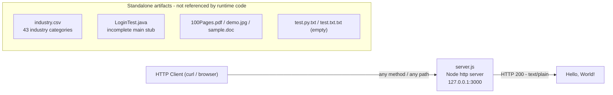

**Core technical approach.** The runnable component relies exclusively on the Node.js standard library (`require('http')`) with zero third-party dependencies, no web framework, and no router. It creates a server via `http.createServer`, ignores the request object entirely, and writes a fixed synchronous response. The repository is polyglot but unintegrated: the JavaScript runtime artifact and the Java stub coexist without any shared build, and no tooling compiles, links, or otherwise connects them.

### 1.2.3 Success Criteria

**Measurable objectives and KPIs.** The repository defines **no** formal key performance indicators, service-level agreements, uptime targets, latency budgets, or automated pass/fail gate. In fact, the only test hook — `package.json`'s `test` script — intentionally exits with an error (`echo "Error: no test specified" && exit 1`). Any KPI-style measurement would therefore have to be imposed externally; none is declared in the code.

In place of invented metrics, the table below lists the **observable acceptance signals** that can be verified directly from the artifacts.

| Observable signal | How it can be verified | Source |
|---|---|---|
| Server starts and logs its URL | Run `node server.js`; observe "Server running at http://127.0.0.1:3000/" | `server.js` |
| Every request returns `200` with body `Hello, World!` | `curl http://127.0.0.1:3000/` | `server.js` |
| Package resolves with no external dependencies | `npm ci` installs only the root package | `package.json`, `package-lock.json` |
| Industry vocabulary parses to 43 values under `Industry` | Parse `industry.csv` | `industry.csv` |

**Critical success factors.** Given the fixture's purpose, the factors that keep it useful are: remaining unchanged and stable over time (the README's "Do not touch!" guidance), preserving its zero-dependency minimalism so it installs anywhere, and maintaining the deterministic constant response that makes integration results comparable across runs.

## 1.3 Scope

This section bounds what the repository actually contains and does, versus what it deliberately does not. Boundaries are stated exactly as implemented in the eleven tracked files; the repository contains no separate requirements or roadmap document, so scope is derived from the artifacts themselves.

### 1.3.1 In-Scope

**Core features and functionalities.** The capabilities present in the repository are limited and each is backed by a specific artifact.

| Capability | Backing artifact(s) |
|---|---|
| Static HTTP endpoint returning a constant response for any request | `server.js` |
| npm package identity and reproducible, dependency-free install | `package.json`, `package-lock.json` |
| Static industry controlled vocabulary (43 categories) | `industry.csv` |
| Representative multi-format artifact corpus (source stub, empty text, binaries) | `LoginTest.java`, `test.py.txt`, `test.txt.txt`, `100Pages.pdf`, `demo.jpg`, `sample.doc` |

The single "user workflow" supported at runtime is: start the server with `node server.js`, then issue any HTTP request to `http://127.0.0.1:3000/` and receive `Hello, World!`. There is no other interactive workflow, and there are no runtime integrations (see §1.3.2).

**Implementation boundaries.** The table below records the boundaries as they exist in the code.

| Dimension | Boundary as implemented |
|---|---|
| System boundary | A single Node.js process; the server binds to loopback `127.0.0.1:3000` and is reachable only locally |
| User groups | None defined; no authentication, roles, or accounts — the "consumer" is any local HTTP client or the backprop process reading the files |
| Geographic / market coverage | None; loopback-only. `industry.csv` is an English-language, US-style industry taxonomy of 43 entries |
| Data domains | One controlled vocabulary (industry categories) plus static document/image binaries; no dynamic, user-supplied, or persisted data |

### 1.3.2 Out-of-Scope

**Explicitly excluded features and capabilities.** The following are absent from the repository and are therefore out of scope for the system as it stands.

| Excluded area | Notes / evidence |
|---|---|
| Request routing, query/body parsing, dynamic content | `server.js` ignores the request object; identical response for all paths and methods |
| Authentication / authorization | Despite the `LoginTest.java` name, no auth logic exists; the class is an empty stub |
| Persistence and databases | No database clients, ORM, or storage code present |
| External / third-party integrations, message queues | No service clients or integration configuration present |
| Automated testing and CI/CD | The `test` script intentionally fails; no workflow, pipeline, or build files are tracked |
| Configuration management (env vars, secrets) | Host and port are hard-coded; no `.env` or config files exist |
| Runtime use of `industry.csv` or the binary assets | No code references these files; they are standalone |
| Java build/compilation and JS↔Java interoperation | `LoginTest.java` is non-compilable; no shared build; the languages are unintegrated |
| Declared `index.js` entry point | `package.json` `main` points to `index.js`, which does not exist |
| Containerization, deployment, orchestration | No `Dockerfile`, manifests, or deployment descriptors are present |
| Observability / monitoring | Only a single `console.log` at startup; no metrics, tracing, or health checks |

**Future phase considerations.** The repository documents no roadmap, issues, TODO markers, or version history beyond the initial "Add files via upload" commit, so no future phases are planned within it. The only signals of unfinished work are the incomplete `main()` body in `LoginTest.java` (a lone `Web` token) and the declared-but-absent `index.js`; neither is accompanied by any documented plan.

**Unsupported use cases.** As implemented, the system cannot serve as a production web service, cannot authenticate or manage users, cannot serve dynamic or route-specific content, cannot be built or run as a Java application, and offers no programmatic API for querying the `industry.csv` vocabulary or the binary documents.

## 1.4 References

The following repository artifacts were inspected as evidence for this section. All are located at the repository root; the repository contains no subdirectories.

- `README.md` — established the project title (`hao-backprop-test`), its stated purpose ("test project for backprop integration"), and the "Do not touch!" immutability guidance.
- `server.js` — established the sole runnable component: a Node.js `http` server bound to `127.0.0.1:3000` returning `200 text/plain "Hello, World!"` for every request.
- `package.json` — established package identity (`hello_world@1.0.0`), MIT license, the declared `main: index.js`, the intentionally failing `test` script, and the absence of dependencies.
- `package-lock.json` — confirmed lockfile v3 with no dependency tree (zero external npm packages).
- `LoginTest.java` — established the `com.blitzyTest.LoginTest` class with an incomplete, non-compilable `main()` (lone `Web` token) and no authentication logic.
- `industry.csv` — established the single-column `Industry` controlled vocabulary of 43 category values.
- `test.py.txt` — confirmed a 0-byte empty placeholder file.
- `test.txt.txt` — confirmed a 0-byte empty placeholder file.
- `100Pages.pdf` — confirmed a binary PDF 1.7 asset (~9.1 MB), unreferenced by code.
- `demo.jpg` — confirmed a binary JPEG/EXIF image asset (~2.1 MB), unreferenced by code.
- `sample.doc` — confirmed a binary legacy MS Word (OLE2) document (~96 KB), unreferenced by code.
- Repository root (`/`) — established the flat, single-directory structure containing exactly eleven tracked files and no subfolders.
- Git metadata (`git ls-files`, `git log`, `git status`) — confirmed the eleven tracked files, the single "Add files via upload" commit, a clean working tree, and the absence of CI/build/config files.

# 2. Product Requirements

## 2.1 Feature Catalog

This catalog decomposes the `hao-backprop-test` repository into discrete, independently verifiable features. Because the repository is a minimal, single-directory test fixture (see §1.1 Executive Summary, §1.2 System Overview, and §1.3 Scope), the feature set is deliberately small and every feature is backed by specific tracked files. No capability is claimed here that is not directly present in the code; where a requested attribute (for example, a formal SLA) does not exist in the repository, that absence is stated plainly rather than invented.

`README.md` is a cross-cutting document rather than a feature: it declares the repository's purpose ("test project for backprop integration") and its stability mandate ("Do not touch!"), which govern all features below. The five features are indexed here and detailed in the following sub-sections.

| Feature ID | Feature Name | Priority | Status |
|---|---|---|---|
| F-001 | Static HTTP "Hello, World!" Server | Critical | Completed |
| F-002 | Node.js Package Manifest & Dependency Lockfile | High | Completed |
| F-003 | Industry Controlled-Vocabulary Dataset | Medium | Completed |
| F-004 | Java "LoginTest" Entry-Point Stub | Low | In Development |
| F-005 | Multi-Format Integration Fixture Corpus | Medium | Completed |

**Catalog conventions.** *Priority* reflects each feature's centrality to the fixture's runtime purpose (the HTTP server is the only runnable capability, hence Critical). *Status* reflects the observed state of the underlying artifact: "Completed" denotes an artifact that behaves fully as written, while "In Development" denotes an artifact that is present but incomplete (`LoginTest.java` does not compile). *Category* is recorded per feature in its metadata table.

### 2.1.1 F-001: Static HTTP "Hello, World!" Server

| Attribute | Value |
|---|---|
| Unique ID | F-001 |
| Feature Name | Static HTTP "Hello, World!" Server |
| Feature Category | Runtime Web Service |
| Priority Level | Critical |
| Status | Completed |

**Description**

- **Overview:** `server.js` creates a Node.js HTTP server via `http.createServer` that listens on the loopback address `127.0.0.1:3000` and returns an identical response — HTTP `200`, `Content-Type: text/plain`, body `Hello, World!\n` — to every request. The request object is ignored entirely, so method, path, headers, and body do not affect the response.
- **Business Value:** Provides the deterministic, constant runtime behavior that makes the repository a stable, reproducible integration target for the external "backprop" process described in §1.1.
- **User Benefits:** A local HTTP client (for example `curl` or a browser) or an automated integration process receives a predictable response with no setup beyond running `node server.js`; the zero-dependency design means there is no install step.
- **Technical Context:** Built exclusively on Node's standard-library `http` module (`require('http')`) with no framework, router, or middleware. The response is written synchronously and the listening URL is logged at startup:

```javascript
res.statusCode = 200;
res.setHeader('Content-Type', 'text/plain');
res.end('Hello, World!\n');
```

**Dependencies**

| Dependency Type | Detail |
|---|---|
| Prerequisite Features | None — runs independently and does not require F-002 to execute |
| System Dependencies | Node.js runtime with the built-in `http` module; TCP port 3000 free on the loopback interface |
| External Dependencies | None (`package-lock.json` records no dependency tree) |
| Integration Requirements | Exposes a single loopback HTTP endpoint at `http://127.0.0.1:3000/`, reachable only locally; no external API surface, TLS, or authentication |

### 2.1.2 F-002: Node.js Package Manifest & Dependency Lockfile

| Attribute | Value |
|---|---|
| Unique ID | F-002 |
| Feature Name | Node.js Package Manifest & Dependency Lockfile |
| Feature Category | Build & Packaging Configuration |
| Priority Level | High |
| Status | Completed |

**Description**

- **Overview:** `package.json` declares the npm package identity (`name` `hello_world`, `version` `1.0.0`, `description` "Hello world in Node.js", `main` `index.js`, `author` `hxu`, `license` MIT) plus a single `test` script. `package-lock.json` (lockfileVersion 3) pins only the root package and declares an empty dependency graph.
- **Business Value:** Establishes a reproducible, zero-dependency install so the fixture clones and runs anywhere without external package resolution (the reproducibility value described in §1.1).
- **User Benefits:** `npm ci` / `npm install` resolves only the root package, yielding a deterministic footprint with no third-party downloads.
- **Technical Context:** The declared `main` (`index.js`) does not exist in the repository, so the de-facto entry point is `server.js`. The `test` script intentionally fails (`echo "Error: no test specified" && exit 1`). No `engines` field pins a Node.js version, and no `dependencies` or `devDependencies` are declared.

**Dependencies**

| Dependency Type | Detail |
|---|---|
| Prerequisite Features | None |
| System Dependencies | npm / Node.js toolchain to interpret the manifest and lockfile |
| External Dependencies | None declared |
| Integration Requirements | Encloses the F-001 source file within the same npm project; there is no code-level linkage between the manifest and `server.js` |

### 2.1.3 F-003: Industry Controlled-Vocabulary Dataset

| Attribute | Value |
|---|---|
| Unique ID | F-003 |
| Feature Name | Industry Controlled-Vocabulary Dataset |
| Feature Category | Static Reference Data |
| Priority Level | Medium |
| Status | Completed |

**Description**

- **Overview:** `industry.csv` is a single-column CSV with the header `Industry` followed by 43 category values (from `Accounting/Finance` through `Other`), forming a controlled vocabulary / canonical lookup list.
- **Business Value:** Supplies a small, well-formed, deterministic tabular dataset that represents structured content within the fixture corpus.
- **User Benefits:** Any CSV reader can parse it to yield exactly 43 values; the taxonomy is stable and self-describing via its header.
- **Technical Context:** An English-language, US-style industry taxonomy of 43 entries. It is standalone — no runtime code in the repository reads or consumes it (confirmed in §1.3.2).

**Dependencies**

| Dependency Type | Detail |
|---|---|
| Prerequisite Features | None |
| System Dependencies | None at runtime (static file); an external CSV parser is required to consume it |
| External Dependencies | None |
| Integration Requirements | None in code; available only as a file for an external process to read (artifact-level integration) |

### 2.1.4 F-004: Java "LoginTest" Entry-Point Stub

| Attribute | Value |
|---|---|
| Unique ID | F-004 |
| Feature Name | Java "LoginTest" Entry-Point Stub |
| Feature Category | Source Artifact / Placeholder |
| Priority Level | Low |
| Status | In Development |

**Description**

- **Overview:** `LoginTest.java` declares package `com.blitzyTest` and a public class `LoginTest` containing a `public static void main(String[] args)` entry point. The method body contains only the bare token `Web`, which is a syntax error, so the file does not compile. Despite the name, the class contains no login or authentication logic.
- **Business Value:** Serves as a representative Java source artifact within the multi-language fixture and as a deliberate edge case (an incomplete, non-compilable source file) for tooling that must handle imperfect inputs — one of the "deliberate edge cases" noted in §1.1.
- **User Benefits:** Provides a Java-language sample in the corpus; the `com.blitzyTest` package name signals its test-harness origin.
- **Technical Context:** Non-compilable as written; contains no imports, fields, constructors, or helper methods; is not wired into any build; and has no JavaScript-to-Java interoperation.

**Dependencies**

| Dependency Type | Detail |
|---|---|
| Prerequisite Features | None |
| System Dependencies | A JDK would be required to compile and run, but compilation currently fails |
| External Dependencies | None |
| Integration Requirements | None; not integrated with the Node.js artifacts or any build pipeline |

### 2.1.5 F-005: Multi-Format Integration Fixture Corpus

| Attribute | Value |
|---|---|
| Unique ID | F-005 |
| Feature Name | Multi-Format Integration Fixture Corpus |
| Feature Category | Test Fixture Content |
| Priority Level | Medium |
| Status | Completed |

**Description**

- **Overview:** A set of heterogeneous static artifacts that broaden the fixture's format coverage: two 0-byte text placeholders (`test.py.txt`, `test.txt.txt`) and three binary documents/images — `100Pages.pdf` (PDF 1.7), `demo.jpg` (JPEG/EXIF), and `sample.doc` (legacy OLE2 Word 97-2003).
- **Business Value:** Combines multiple content types — empty files, PDF, JPEG, and legacy DOC — in one small repository so that an ingestion process must traverse diverse artifact types in a single pass (the "coverage of formats" value described in §1.1).
- **User Benefits:** A single clone yields a representative multi-format corpus, including deliberate edge cases such as empty files.
- **Technical Context:** All items are standalone and unreferenced by runtime code; the two text placeholders are 0 bytes; the binaries are identifiable by their file-format magic bytes.

**Dependencies**

| Dependency Type | Detail |
|---|---|
| Prerequisite Features | None |
| System Dependencies | None at runtime; appropriate viewers/readers are required to open the binaries externally |
| External Dependencies | None |
| Integration Requirements | None in code; consumed only by an external ingestion process at the file level |

## 2.2 Functional Requirements

This section specifies the functional requirements for each feature catalogued in §2.1, using the identifier format `F-XXX-RQ-YYY` (feature ID, then a zero-padded requirement sequence). Requirements are written to be directly testable against the tracked files.

**Legend.** *Priority* uses the MoSCoW scale (Must-Have / Should-Have / Could-Have). *Complexity* is High / Medium / Low. Where the repository defines no value for a requested attribute — notably *Performance Criteria* and *Compliance Requirements* — that absence is stated explicitly rather than inferred; the repository declares no formal SLAs, KPIs, or performance budgets (see §1.2.3 Success Criteria). Two requirements are recorded as **not-yet-met** to reflect the observed state: `F-002-RQ-004` (the declared `index.js` entry point is absent) and `F-004-RQ-002` (the Java `main` body does not compile). To respect the four-column limit, acceptance criteria are presented in a companion table keyed by requirement ID.

### 2.2.1 F-001: Static HTTP "Hello, World!" Server

**Requirement Details**

| Requirement ID | Description | Priority | Complexity |
|---|---|---|---|
| F-001-RQ-001 | The server binds and listens on host `127.0.0.1`, port `3000` | Must-Have | Low |
| F-001-RQ-002 | Every request receives HTTP `200`, `Content-Type: text/plain`, body `Hello, World!\n`, independent of method/path/headers | Must-Have | Low |
| F-001-RQ-003 | The server uses only the Node.js built-in `http` module (no third-party dependencies) | Must-Have | Low |
| F-001-RQ-004 | The server logs its listening URL at startup | Should-Have | Low |

**Acceptance Criteria**

| Requirement ID | Acceptance Criteria |
|---|---|
| F-001-RQ-001 | Running `node server.js` starts a process that listens on `127.0.0.1:3000` with no bind error |
| F-001-RQ-002 | Any method against any path (e.g., `curl http://127.0.0.1:3000/anything`) returns status `200`, header `Content-Type: text/plain`, and body `Hello, World!` |
| F-001-RQ-003 | `server.js` imports only `require('http')`; the app runs with no `npm install` step |
| F-001-RQ-004 | Console output includes `Server running at http://127.0.0.1:3000/` |

**Technical Specifications**

| Aspect | Specification |
|---|---|
| Input Parameters | None consumed — the request object (`req`) is ignored; host `127.0.0.1` and port `3000` are hard-coded constants |
| Output/Response | Fixed HTTP `200`, `Content-Type: text/plain`, body `Hello, World!\n` |
| Performance Criteria | None defined in the repository; the handler writes the constant response synchronously (no latency/throughput target exists — see §1.2.3) |
| Data Requirements | None; no state is read, stored, or persisted |

**Validation Rules**

| Rule Type | Rule |
|---|---|
| Business Rules | Deterministic constant response for all requests; behavior must remain stable per the README "Do not touch!" mandate |
| Data Validation | None — no request input is parsed or validated |
| Security Requirements | Binds to loopback only (not externally reachable); no authentication, authorization, or TLS is implemented |
| Compliance Requirements | None declared in the repository |

### 2.2.2 F-002: Node.js Package Manifest & Dependency Lockfile

**Requirement Details**

| Requirement ID | Description | Priority | Complexity |
|---|---|---|---|
| F-002-RQ-001 | Declare package identity: `name` `hello_world`, `version` `1.0.0`, `license` MIT | Must-Have | Low |
| F-002-RQ-002 | Guarantee a reproducible, zero-dependency install | Must-Have | Low |
| F-002-RQ-003 | Provide an npm `test` lifecycle script | Could-Have | Low |
| F-002-RQ-004 | Declare a `main` entry point | Should-Have | Low |

**Acceptance Criteria**

| Requirement ID | Acceptance Criteria |
|---|---|
| F-002-RQ-001 | `package.json` and `package-lock.json` both record `hello_world` `1.0.0` and MIT |
| F-002-RQ-002 | `npm ci` installs only the root package; `package-lock.json` `packages` contains solely the root entry (no dependency tree) |
| F-002-RQ-003 | `npm test` executes the configured script; it currently exits `1` by design (`echo "Error: no test specified" && exit 1`) |
| F-002-RQ-004 | `package.json` `main` is present and set to `index.js`; **not-yet-met**: `index.js` is absent, so `node .` fails (documented mismatch) |

**Technical Specifications**

| Aspect | Specification |
|---|---|
| Input Parameters | Static JSON manifest/lockfile fields consumed by the npm CLI |
| Output/Response | A resolved package definition; `npm ci`/`install` produce a root-only install |
| Performance Criteria | None defined |
| Data Requirements | Self-contained JSON; no external data |

**Validation Rules**

| Rule Type | Rule |
|---|---|
| Business Rules | MIT-licensed, zero-dependency footprint to preserve reproducibility |
| Data Validation | Must be valid JSON conforming to the npm manifest and lockfile v3 schemas |
| Security Requirements | No secrets/credentials stored; zero dependencies means no third-party supply-chain surface |
| Compliance Requirements | MIT license declared; no other compliance controls present |

### 2.2.3 F-003: Industry Controlled-Vocabulary Dataset

**Requirement Details**

| Requirement ID | Description | Priority | Complexity |
|---|---|---|---|
| F-003-RQ-001 | Provide a single-column CSV with header `Industry` | Must-Have | Low |
| F-003-RQ-002 | Contain exactly 43 industry category values | Must-Have | Low |
| F-003-RQ-003 | Be a well-formed CSV parseable to 43 discrete values | Should-Have | Low |

**Acceptance Criteria**

| Requirement ID | Acceptance Criteria |
|---|---|
| F-003-RQ-001 | Line 1 of `industry.csv` equals `Industry` |
| F-003-RQ-002 | The file contains 43 data rows (lines 2–44), the last of which is `Other` |
| F-003-RQ-003 | A CSV parser yields 43 non-empty values under the single `Industry` column |

**Technical Specifications**

| Aspect | Specification |
|---|---|
| Input Parameters | None (static file) |
| Output/Response | 43 industry category strings under one `Industry` column when parsed |
| Performance Criteria | None defined |
| Data Requirements | 44 total lines (1 header + 43 values); English-language, US-style taxonomy |

**Validation Rules**

| Rule Type | Rule |
|---|---|
| Business Rules | Controlled vocabulary — the values are a fixed, curated list |
| Data Validation | Single column; header present; no empty rows |
| Security Requirements | None (public, non-sensitive reference data) |
| Compliance Requirements | None declared |

### 2.2.4 F-004: Java "LoginTest" Entry-Point Stub

**Requirement Details**

| Requirement ID | Description | Priority | Complexity |
|---|---|---|---|
| F-004-RQ-001 | Declare class `com.blitzyTest.LoginTest` with a `public static void main(String[] args)` entry point | Must-Have | Low |
| F-004-RQ-002 | Provide an executable `main` body | Should-Have | Medium |

**Acceptance Criteria**

| Requirement ID | Acceptance Criteria |
|---|---|
| F-004-RQ-001 | `LoginTest.java` declares `package com.blitzyTest;` and `public class LoginTest` with the `main` signature |
| F-004-RQ-002 | **Not-yet-met** — the body contains only the bare token `Web`, so `javac LoginTest.java` fails to compile (feature is In Development) |

**Technical Specifications**

| Aspect | Specification |
|---|---|
| Input Parameters | `String[] args` declared on `main` (unused) |
| Output/Response | None — the class produces no output because it does not compile |
| Performance Criteria | None defined |
| Data Requirements | None |

**Validation Rules**

| Rule Type | Rule |
|---|---|
| Business Rules | Represents an intentionally incomplete source artifact within the fixture |
| Data Validation | None |
| Security Requirements | None — the class contains no logic despite the "Login" name |
| Compliance Requirements | None declared |

### 2.2.5 F-005: Multi-Format Integration Fixture Corpus

**Requirement Details**

| Requirement ID | Description | Priority | Complexity |
|---|---|---|---|
| F-005-RQ-001 | Provide binary document/image assets in PDF, JPEG, and legacy DOC formats | Must-Have | Low |
| F-005-RQ-002 | Provide empty (0-byte) text placeholder files | Could-Have | Low |
| F-005-RQ-003 | Keep all corpus assets standalone (unreferenced by runtime code) | Should-Have | Low |

**Acceptance Criteria**

| Requirement ID | Acceptance Criteria |
|---|---|
| F-005-RQ-001 | `100Pages.pdf` begins with `%PDF-1.7`; `demo.jpg` begins with the JPEG/EXIF marker `FF D8 FF E1`; `sample.doc` begins with the OLE2 signature `D0 CF 11 E0` |
| F-005-RQ-002 | `test.py.txt` and `test.txt.txt` are both 0 bytes |
| F-005-RQ-003 | No tracked source file references any corpus asset by name |

**Technical Specifications**

| Aspect | Specification |
|---|---|
| Input Parameters | None (static files) |
| Output/Response | Raw file bytes when read by an external process |
| Performance Criteria | None defined |
| Data Requirements | Five files: two 0-byte text placeholders plus three binaries (PDF ~9.45 MB, JPEG ~2.12 MB, DOC ~98 KB) |

**Validation Rules**

| Rule Type | Rule |
|---|---|
| Business Rules | Corpus must span multiple content types to exercise format-diverse ingestion |
| Data Validation | File-format magic bytes identify each binary; text placeholders must be empty |
| Security Requirements | None (static, non-executable sample assets) |
| Compliance Requirements | None declared |

## 2.3 Feature Relationships

This section documents only the relationships that are directly evident in the repository. The overriding finding is that the features are almost entirely **decoupled**: each is realized by distinct file(s) that neither import nor invoke one another. The relationships that do exist are a packaging relationship and a shared reliance on the Node.js platform.

### 2.3.1 Feature Dependency Map

There are **no inter-feature code dependencies**. `server.js` (F-001) imports only the Node.js built-in `http` module and references no other feature. `industry.csv` (F-003), `LoginTest.java` (F-004), and the corpus assets (F-005) are fully standalone and are not read by any runtime code (confirmed in §1.3.2 Out-of-Scope). The only observable relationships are:

- **Packaging (F-002 → F-001):** `package.json` / `package-lock.json` enclose the `server.js` source within one npm project. This is an organizational relationship only — there is no code linkage, and `server.js` runs via `node server.js` without the manifest.
- **Shared platform (F-001, F-002 → Node.js):** F-001 uses the built-in `http` module at runtime; F-002 targets the same Node.js/npm toolchain.
- **Artifact-level ingestion (external → all features):** the repository's stated purpose is to be ingested by an external "backprop" process (`README.md`), which reads the files rather than calling any runtime interface.

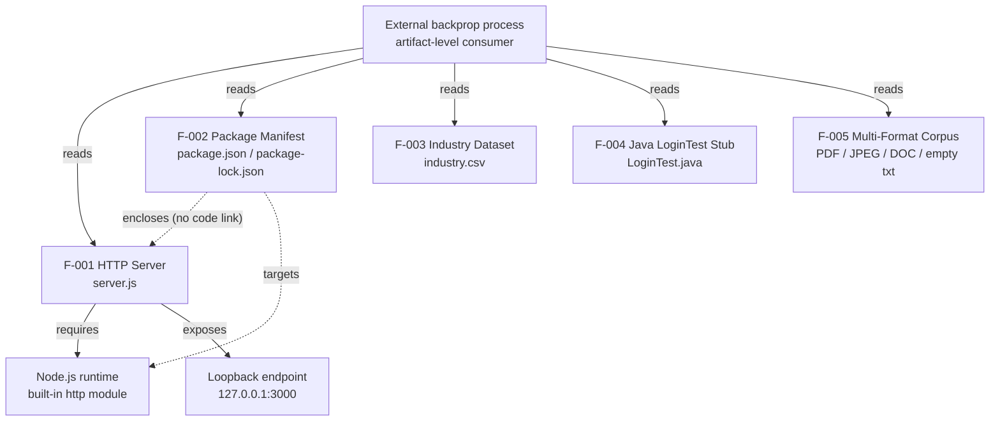

Solid edges denote runtime relationships; dashed edges denote the packaging relationship; the `reads` edges from the external consumer denote artifact-level (file) ingestion, not runtime calls. The single runtime request/response path (client → server → constant response) is depicted in the §1.2.2 High-Level Description flowchart.

### 2.3.2 Integration Points

The system exposes exactly one runtime integration point and one artifact-level integration point. No database, message-queue, identity-provider, or third-party service integrations exist anywhere in the code (per §1.3.2).

| Integration Point | Type | Provided By | Notes |
|---|---|---|---|
| `http://127.0.0.1:3000/` | Runtime HTTP (loopback) | F-001 | Local only; constant `200` `text/plain` response; no external exposure, TLS, or auth |
| Repository files | Artifact-level (read-only) | All features / repository | Ingested by the external backprop process; no runtime API, no callbacks |

### 2.3.3 Shared Components

There are **no shared application-level components or modules**. The repository is flat (no `src/`, `utils/`, or common library directory), and each feature's file stands on its own. The only shared element is a **platform capability**, not repository-authored code.

| Shared Element | Kind | Consumed By | Notes |
|---|---|---|---|
| Node.js `http` module | Platform standard library | F-001 (runtime); F-002 (targets runtime) | Provided by the Node.js runtime, not authored in this repository; no repo module is imported by more than one feature |

### 2.3.4 Common Services

There are **no common services**. The repository contains no shared service layer and no cross-cutting infrastructure — specifically, no authentication/authorization service, no persistence/data-access service, no configuration service, and no logging, metrics, tracing, or health-check service (per §1.3.2). The only logging is a single `console.log` statement local to F-001 that prints the listening URL at startup; it is not a shared service and is not consumed by any other feature.

## 2.4 Implementation Considerations

These considerations reflect the system **as implemented**. Because the repository is a stable test fixture governed by a "Do not touch!" mandate — with no CI/CD, deployment, scaling, or configuration tooling (per §1.3.2) — several dimensions are intentionally minimal or not applicable. Those are stated as such rather than populated with assumed targets.

### 2.4.1 F-001: Static HTTP "Hello, World!" Server

| Dimension | Consideration |
|---|---|
| Technical Constraints | Node.js built-in `http` only (no framework or router); host/port hard-coded to `127.0.0.1:3000` with no environment-based override; single-file implementation; request object not parsed |
| Performance Requirements | None defined; the handler writes a constant response synchronously on Node's single-threaded event loop; no latency or throughput target exists (§1.2.3) |
| Scalability Considerations | No clustering, worker threads, or load-balancing configuration; a single process bound to loopback; the server is not designed to scale |
| Security Implications | Loopback-only binding limits exposure to the local host; there is no TLS, authentication, authorization, input validation, or rate limiting — acceptable only because the endpoint is not externally reachable |
| Maintenance Requirements | Governed by the README "Do not touch!" guidance; no automated tests guard behavior (the `test` script fails by design), so any change would be manual and unverified by CI |

### 2.4.2 F-002: Node.js Package Manifest & Dependency Lockfile

| Dimension | Consideration |
|---|---|
| Technical Constraints | Must remain a valid npm manifest and lockfile v3; `main` references a non-existent `index.js`; no `engines` field pins a Node.js version; zero dependencies by design |
| Performance Requirements | None; installation is trivially fast because the dependency graph is empty |
| Scalability Considerations | Not applicable — static configuration; a zero-dependency install reproduces trivially on any clone |
| Security Implications | No third-party supply-chain surface (no dependencies); no secrets stored in the manifest; the lockfile fixes reproducible resolution |
| Maintenance Requirements | Manifest and lockfile must be kept in sync; the `main`/`index.js` mismatch and the intentionally failing `test` script are known items that would require attention if the fixture were ever productionized |

### 2.4.3 F-003: Industry Controlled-Vocabulary Dataset

| Dimension | Consideration |
|---|---|
| Technical Constraints | Single-column CSV; a fixed 43-value controlled vocabulary; English/US-style taxonomy; no schema file or validation code accompanies it |
| Performance Requirements | None; the small file parses effectively instantly |
| Scalability Considerations | Static, small dataset requiring no pagination or streaming; growth would be a manual edit to the file |
| Security Implications | Non-sensitive public reference data with no PII; read-only |
| Maintenance Requirements | Categories are edited manually; because no code consumes the file, there is no downstream consumer to keep in sync |

### 2.4.4 F-004: Java "LoginTest" Entry-Point Stub

| Dimension | Consideration |
|---|---|
| Technical Constraints | Non-compilable as written (a lone `Web` token in `main`); no build integration; no JDK toolchain is configured in the repository |
| Performance Requirements | Not applicable — the class does not compile or run |
| Scalability Considerations | Not applicable |
| Security Implications | None — despite the "Login" name there is no logic, no credentials, and no authentication flow |
| Maintenance Requirements | Making it functional would require completing the `main` body and adding a build; the feature is currently In Development |

### 2.4.5 F-005: Multi-Format Integration Fixture Corpus

| Dimension | Consideration |
|---|---|
| Technical Constraints | Static binary and empty-text files; two 0-byte placeholders; large binaries (including a multi-megabyte PDF) are tracked directly in Git without Git LFS |
| Performance Requirements | None; the files are read directly by external tooling |
| Scalability Considerations | Repository clone size is dominated by these binaries; adding more large assets increases clone size because no Git LFS is configured |
| Security Implications | Static, non-executable sample assets; the repository executes no active content from them |
| Maintenance Requirements | Assets should remain stable per the fixture mandate; because no code references them, there is no synchronization burden |

## 2.5 Requirements Traceability and Constraints

This section traces every requirement in §2.2 back to the artifact that satisfies it and records the assumptions and constraints that bound the requirements. It provides the audit trail linking features, requirements, source files, and verification methods.

### 2.5.1 Requirements Traceability Matrix

Each requirement maps to exactly one feature and one or more backing artifacts. "Status" reflects the observed state: **Met** requirements behave as written; **Not-yet-met** requirements are recorded honestly to reflect the fixture's incomplete artifacts.

| Requirement ID | Feature | Backing Artifact(s) | Verification Method / Status |
|---|---|---|---|
| F-001-RQ-001 | F-001 | `server.js` | Run `node server.js`; process listens on `127.0.0.1:3000` — Met |
| F-001-RQ-002 | F-001 | `server.js` | `curl` any path/method returns `200` `text/plain` `Hello, World!` — Met |
| F-001-RQ-003 | F-001 | `server.js`, `package-lock.json` | Source imports only `require('http')`; lockfile has no dependency tree — Met |
| F-001-RQ-004 | F-001 | `server.js` | Startup log prints `Server running at http://127.0.0.1:3000/` — Met |
| F-002-RQ-001 | F-002 | `package.json`, `package-lock.json` | Identity fields record `hello_world` `1.0.0` MIT — Met |
| F-002-RQ-002 | F-002 | `package-lock.json` | `npm ci` installs only the root package (no dependency tree) — Met |
| F-002-RQ-003 | F-002 | `package.json` | `npm test` runs the configured script (exits `1` by design) — Met (script present) |
| F-002-RQ-004 | F-002 | `package.json` | `main` is `index.js`, but `index.js` is absent so `node .` fails — Not-yet-met |
| F-003-RQ-001 | F-003 | `industry.csv` | Header line equals `Industry` — Met |
| F-003-RQ-002 | F-003 | `industry.csv` | 43 data rows (lines 2–44), last value `Other` — Met |
| F-003-RQ-003 | F-003 | `industry.csv` | CSV parser yields 43 non-empty values — Met |
| F-004-RQ-001 | F-004 | `LoginTest.java` | Declares `com.blitzyTest.LoginTest` with `main(String[])` — Met |
| F-004-RQ-002 | F-004 | `LoginTest.java` | `javac` fails on the lone `Web` token — Not-yet-met |
| F-005-RQ-001 | F-005 | `100Pages.pdf`, `demo.jpg`, `sample.doc` | Magic bytes match PDF/JPEG/OLE2 signatures — Met |
| F-005-RQ-002 | F-005 | `test.py.txt`, `test.txt.txt` | Both files are 0 bytes — Met |
| F-005-RQ-003 | F-005 | Repository-wide | No tracked source references any corpus asset — Met |

**Coverage summary.** All five features (F-001–F-005) are represented; 16 requirements are traced in total, of which 14 are Met and 2 are Not-yet-met (`F-002-RQ-004`, `F-004-RQ-002`), the latter reflecting the declared-but-absent `index.js` and the non-compilable Java stub respectively.

### 2.5.2 Assumptions and Constraints

**Assumptions.**

- The external "backprop" integration process is outside this repository; the requirements here describe only what the repository itself provides for that process to ingest (`README.md`, §1.1).
- Verifying the runtime requirements assumes a local environment with Node.js installed (F-001, F-002); verifying F-004 would require a JDK. Neither toolchain version is pinned by the repository.
- No user-supplied product/requirements document exists in the repository; scope and requirements are derived directly from the tracked artifacts (§1.3).

**Constraints.**

| Constraint | Impact | Source |
|---|---|---|
| Loopback-only binding (`127.0.0.1:3000`) | Endpoint is reachable only on the local host | `server.js`; §1.3.1 |
| Host/port hard-coded, no configuration | Cannot relocate the endpoint without editing source | `server.js`; §1.3.2 |
| Declared `main` (`index.js`) is absent | `node .` fails; de-facto entry is `node server.js` | `package.json`; §1.3.2 |
| `test` script intentionally fails; no CI/CD | No automated verification gate exists | `package.json`; §1.2.3 |
| `LoginTest.java` is non-compilable | The Java feature cannot build or run | `LoginTest.java`; §1.3.2 |
| README "Do not touch!" stability mandate | Changes are discouraged; the fixture must stay constant for comparable results | `README.md`; §1.1 |
| No Node `engines` pin; no Git LFS | Runtime version is unbounded; large binaries inflate clone size | `package.json`; repository layout |
| Zero third-party dependencies | No supply-chain surface; installs anywhere | `package-lock.json`; §1.1 |

**Requirement versioning.** All requirements in §2.2 are traced against a single-commit repository state ("Add files via upload"), constituting the version 1.0 requirements baseline — aligned with the `package.json` `version` `1.0.0`. The repository contains no changelog, issue tracker, roadmap, or TODO markers (§1.3.2), so there is no requirement revision history to track beyond this baseline; any future change to the tracked files would establish the next baseline.

## 2.6 References

The following repository artifacts and technical-specification sections were examined as evidence for the features, requirements, relationships, and constraints documented in this section.

**Repository files**

- `server.js` - Established F-001: the Node.js built-in `http` server on `127.0.0.1:3000` returning a constant `200` `text/plain` `Hello, World!` response for every request; source of all F-001 requirements and acceptance criteria.
- `package.json` - Established F-002 identity (`hello_world` `1.0.0`, MIT, author `hxu`), the `main: index.js` declaration, and the intentionally failing `test` script.
- `package-lock.json` - Confirmed the zero-dependency graph (lockfile v3, root package only) underpinning F-002-RQ-002 and F-001-RQ-003.
- `industry.csv` - Established F-003: the single-column `Industry` controlled vocabulary of 43 categories (header + rows 2–44 ending in `Other`).
- `LoginTest.java` - Established F-004: the `com.blitzyTest.LoginTest` class with a `main` method whose lone `Web` token makes it non-compilable (Not-yet-met F-004-RQ-002).
- `test.py.txt` - Established part of F-005: a 0-byte text placeholder.
- `test.txt.txt` - Established part of F-005: a 0-byte text placeholder.
- `100Pages.pdf` - Established part of F-005: a PDF binary asset (multi-megabyte; PDF magic bytes).
- `demo.jpg` - Established part of F-005: a JPEG/EXIF binary asset.
- `sample.doc` - Established part of F-005: a legacy OLE2 (Word 97–2003) binary asset.
- `README.md` - Cross-cutting document establishing the repository's purpose ("test project for backprop integration") and the "Do not touch!" stability mandate governing all features.

**Repository folders**

- Repository root (flat, single directory) - Confirmed there are no subdirectories and therefore no `src/`, `tests/`, `config/`, or CI/CD folders — the basis for the "no shared components / no common services" findings in §2.3.

**Cross-referenced technical-specification sections**

- 1.1 Executive Summary - Repository identity, the "backprop integration" purpose, and the reproducibility/determinism/format-coverage value proposition cited across §2.1 and §2.4.
- 1.2 System Overview - The three observable capabilities, the component inventory, the runtime request/response flowchart (§1.2.2), and the "no formal KPIs/SLAs" finding (§1.2.3) referenced throughout §2.2–§2.4.
- 1.3 Scope - The in-scope capabilities (§1.3.1) and out-of-scope absences (§1.3.2) that bound the feature catalog, integration points, and constraints in §2.3 and §2.5.

# 3. Technology Stack

## 3.1 Programming Languages

This section inventories every programming language and machine-readable format that appears in the `hao-backprop-test` repository, mapped to the specific artifact that uses it. The repository is a minimal, polyglot **test fixture** (README.md: "test project for backprop integration. Do not touch!"), so its language footprint is intentionally small: exactly one language is runnable (JavaScript on Node.js), one is present only as a non-compiling stub (Java), and the remaining artifacts are declarative data/markup formats. **No language, runtime, or toolchain version is pinned anywhere in the repository** — there is no `engines` field, no `.nvmrc`, no `pom.xml`/`build.gradle`, and no `.tool-versions` file — so the version signals below are derived from the syntax the sources actually use and from the reference environment, not from an enforced constraint.

| Component (Feature) | Artifact(s) | Language / Format | Version signal (observed) | Runnable? |
|---|---|---|---|---|
| Static HTTP server (F-001) | `server.js` | JavaScript on Node.js | ES6+ (ECMAScript 2015+) syntax; CommonJS modules | Yes — the only executable program |
| npm manifest & lockfile (F-002) | `package.json`, `package-lock.json` | JSON | `lockfileVersion: 3` | No — declarative |
| Java entry-point stub (F-004) | `LoginTest.java` | Java (Java SE) | Standard `public static void main(String[])`; no version declared | No — does not compile |
| Industry vocabulary (F-003) | `industry.csv` | CSV | Single column, header + 43 rows | No — static data |
| Project documentation | `README.md` | Markdown | 2-line document | No — static docs |

The following diagram maps the languages/formats to their artifacts and to the runtime/CLI that executes or manages them. Only the JavaScript path is wired to a runtime; the Java stub and the data/documentation artifacts are standalone and referenced by no code.

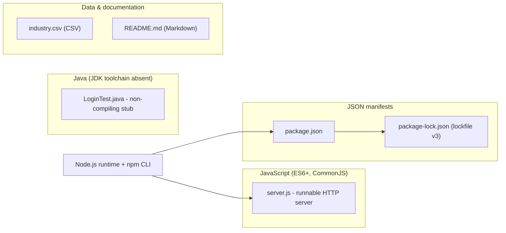

### 3.1.1 JavaScript on Node.js (Primary, Runnable)

JavaScript is the only executable language in the repository. `server.js` (14 lines) is the single runnable artifact and the de-facto entry point (invoked as `node server.js`). It is written against the **CommonJS** module system — it acquires the HTTP capability with a single `require` call — and uses ES6+ (ECMAScript 2015 and later) language features, specifically `const` bindings, an arrow-function request handler, and a template literal for the startup log line:

```javascript
const http = require('http');
console.log(`Server running at http://${hostname}:${port}/`);
```

**Selection criteria / justification.** JavaScript-on-Node.js is the natural fit for the fixture's single runtime capability: a Node.js "Hello, World!" HTTP server can be expressed in a handful of lines using only the runtime's own standard library, requiring no compilation step and no third-party packages (see §3.2 and §3.3). This maximizes portability and determinism — the two qualities that matter most for a stable integration target that must "stay constant for comparable results" (§2.5.2).

**Version and constraints.** The repository does **not** pin a Node.js version: `package.json` declares no `engines` field, so any runtime that provides the long-stable `http` core module will run the server. Because the code relies only on APIs that have existed since early Node.js releases, it is effectively forward-compatible across modern runtimes. As external reference, <cite index="14-1,14-3,14-4">Node.js 24.x ("Krypton") is a Long-Term-Support line that will continue to receive updates through to the end of April 2028</cite>, and <cite index="18-20,18-21,18-22">new major versions branch every six months, with even-numbered versions released in April and odd-numbered versions in October, and the previous even-numbered major transitioning to LTS in coordination with each new odd-numbered release</cite>. The reference environment used to validate this specification runs Node.js v22.23.1 with npm 11.1.0, but this is an observed toolchain, not a repository-mandated one.

### 3.1.2 Java (Non-Compiling Entry-Point Stub)

Java is present solely as a source stub. `LoginTest.java` declares `package com.blitzyTest;` and a single `public class LoginTest` containing a conventional Java SE entry point, `public static void main(String[] args)`. The method body, however, contains only the dangling token `Web`, which is a syntax error, so **the class does not compile** (`F-004-RQ-002` is recorded as Not-yet-met in §2.5.1).

**Selection criteria / justification.** Java is not used to deliver any runtime behavior; it exists to provide a representative second-language artifact in the multi-format fixture corpus (§2.1, F-004). Despite the `LoginTest` name, it contains no authentication logic of any kind.

**Version and constraints.** No Java/JDK version is declared or pinned anywhere in the repository, and no build tooling is present (there is no `pom.xml`, `build.gradle`, `Makefile`, or `.github` build workflow). The Java source and the JavaScript runtime coexist but are **entirely unintegrated** — no shared build compiles, links, or otherwise connects them. Making the stub functional would require both completing the `main` body and introducing a JDK toolchain and build definition that the repository currently lacks.

### 3.1.3 Data, Configuration & Markup Formats

Alongside the two programming languages, the repository uses three declarative formats. These are not programming languages but they define the project's configuration and data surface and are therefore part of the technology footprint:

- **JSON** — `package.json` and `package-lock.json` express the npm package identity and dependency lock. The lockfile records `lockfileVersion: 3` (analyzed in §3.3).
- **CSV** — `industry.csv` is a single-column controlled vocabulary: an `Industry` header followed by 43 category rows (last value `Other`). It is well-formed, US-style English taxonomy data and is not referenced by any code.
- **Markdown** — `README.md` is a two-line document that states the project name and its "test project for backprop integration. Do not touch!" purpose and stability mandate.

### 3.1.4 Language Selection Criteria and Constraints (Summary)

The table consolidates why each language/format is present and the constraints that bound it.

| Language / Format | Rationale (as evidenced) | Key constraints / security implications |
|---|---|---|
| JavaScript (Node.js) | Trivially runnable HTTP endpoint using only the standard library; zero build step; deterministic | No `engines` version pin (runtime version unbounded); single-threaded event loop; no dynamic `eval` of external input, keeping the executable surface minimal |
| Java (Java SE) | Representative second-language source artifact for the fixture corpus | Non-compiling as written; no JDK toolchain or build configured; unintegrated with the JS runtime |
| JSON | npm package identity + reproducible, dependency-free install | Must remain a valid manifest/lockfile; `main` references a non-existent `index.js` (§2.5.2) |
| CSV | Static industry controlled vocabulary | Static, non-sensitive public reference data; no consuming code, so no schema/validation enforced |
| Markdown | Human-facing project description and stability mandate | Documentation only; carries the "Do not touch!" governance signal |

Overall, the language selection reflects a deliberate minimalism: a single runnable, dependency-free JavaScript program plus static, declarative companions. This keeps the runtime attack surface small (no third-party code executes; see §3.3) while the unpinned runtime version and the non-compiling Java stub are the principal language-level constraints a future maintainer would need to address.

## 3.2 Frameworks & Libraries

A defining characteristic of this repository's technology stack is what it **omits**: it uses **no application or web framework and no third-party libraries whatsoever**. The only framework-grade building block is the **Node.js standard library**, and within it, a single core module. This is confirmed directly by `server.js` (which imports only `http`) and by `package-lock.json`, whose dependency tree is empty (see §3.3). This subsection documents the one runtime building block that is present and records the categories of frameworks/libraries that are deliberately absent, with the compatibility implications of that choice.

| Framework / Library category | Present? | Evidence | Notes |
|---|---|---|---|
| Node.js standard library (`http` core module) | Yes | `server.js`: `require('http')` | Bundled with the runtime; not an external package |
| Web/application framework (Express, Koa, Fastify, Hapi, NestJS) | No | `package.json` has no dependencies; `server.js` uses raw `http` | No routing/middleware layer exists |
| Front-end framework (React, Vue, Angular) | No | No front-end sources or build config in the repository | Out of scope (§1.3.2) |
| Utility/support libraries (lodash, axios, dotenv, etc.) | No | Empty `package-lock.json` dependency tree | Zero supporting libraries |
| Test framework (Jest, Mocha, Vitest) | No | `package.json` `test` script prints an error and exits `1` | No test runner installed |
| Java frameworks / build (Spring, JUnit, Maven, Gradle) | No | No `pom.xml`/`build.gradle`; `LoginTest.java` imports nothing | Java stub uses no libraries |

### 3.2.1 Node.js Core `http` Module (Sole Runtime Building Block)

The runnable component is built exclusively on the Node.js core `http` module. `server.js` imports it with `const http = require('http')` and constructs the server directly:

```javascript
const server = http.createServer((req, res) => { /* constant response */ });
server.listen(port, hostname, () => { /* startup log */ });
```

Because `http` ships as part of the Node.js runtime, its version is exactly the runtime's version — there is no separately installed package and therefore no separate version to pin, resolve, or audit. The handler ignores the `req` object entirely and writes a fixed `200`/`text/plain`/`Hello, World!` response, so no request-parsing, routing, templating, or serialization library is required.

### 3.2.2 Deliberate Absence of a Web/Application Framework

No web framework (such as Express, Koa, Fastify, Hapi, or NestJS) is present. `package.json` declares no `dependencies`, and `server.js` performs its single responsibility using the core `http` API alone.

**Justification.** For a fixture whose sole runtime requirement is to return one constant response for any request (F-001), a framework would add dependency weight, install time, and supply-chain surface with no functional benefit. Using the core module directly keeps the server a self-contained, single-file program that installs and runs identically on any Node.js host, directly supporting the "Do not touch!" stability mandate and the zero-dependency posture recorded in §2.4.2. The trade-off — accepted intentionally here — is the absence of a routing layer, middleware, input validation, and content negotiation, which §1.3.2 lists as explicitly out of scope.

### 3.2.3 Absence of Supporting Libraries and Test Frameworks

Beyond the missing web framework, the repository includes **no** supporting utility libraries (no HTTP clients, configuration loaders, loggers, or data-parsing helpers) and **no** test framework. The only test hook is `package.json`'s `test` script, which is a placeholder that intentionally fails (`echo "Error: no test specified" && exit 1`); there is no Jest, Mocha, or Vitest dependency to execute real tests (§2.5.1, `F-002-RQ-003`). On the Java side, `LoginTest.java` declares no imports and there is no build system, so no Java framework (Spring), test library (JUnit), or build tool (Maven/Gradle) participates.

### 3.2.4 Compatibility Requirements

The compatibility posture follows directly from the zero-framework, zero-dependency design:

- **No inter-package version conflicts are possible.** With an empty dependency tree, there are no transitive versions to reconcile and no peer-dependency constraints to satisfy (§3.3).
- **Runtime-API compatibility only.** The single external contract is the Node.js core `http` API, which is long-stable; the server is therefore compatible with any modern Node.js runtime without modification, consistent with the absence of an `engines` pin (§3.1.1).
- **Security implication.** Because no framework or library code executes at runtime, the framework/library supply-chain attack surface is effectively nil; the only code that runs is the repository's own `server.js` against the vetted Node.js standard library.

## 3.3 Open Source Dependencies

The repository participates in the **npm** open-source ecosystem for package identity and dependency locking, but its actual open-source dependency inventory is **empty**: it declares and pins **zero third-party packages**. This subsection documents the dependency-management tooling and registry, the (empty) dependency inventory, the lockfile format and reproducibility guarantees, the license, and the resulting supply-chain security posture. All findings are grounded in `package.json` and `package-lock.json`.

### 3.3.1 Dependency Management Tooling and Registry

Dependencies are managed with **npm** (the Node.js package manager) via two artifacts:

- `package.json` — the manifest, declaring the package identity `hello_world@1.0.0` (MIT), `main: index.js`, and a single `test` script. It contains **no** `dependencies`, `devDependencies`, `peerDependencies`, or `optionalDependencies` blocks.
- `package-lock.json` — the lockfile, which pins the exact resolved tree. Its `packages` map contains only the root project under the `""` key; there are no `node_modules/*` entries.

No custom registry is configured anywhere in the repository (there is no `.npmrc`), so npm resolves against its default public registry. Because the dependency graph is empty, no packages are actually fetched from any registry during installation.

### 3.3.2 Declared Dependencies (Inventory)

The complete open-source dependency inventory is captured in the table below. Only the root package itself is present; there are no runtime or development dependencies.

| Package | Version | Type | Source / Registry | License |
|---|---|---|---|---|
| `hello_world` (this project) | `1.0.0` | Root package (self) | Local; not published to a registry | MIT |
| — (runtime dependencies) | — | `dependencies` | None declared | — |
| — (development dependencies) | — | `devDependencies` | None declared | — |

Consequently, `npm ci` or `npm install` resolves and installs **only the root package**, producing no `node_modules` third-party tree (§2.5.1, `F-002-RQ-002`). The Node.js core `http` module used by `server.js` (§3.2.1) is part of the runtime and is therefore **not** an npm dependency.

### 3.3.3 Lockfile Format and Reproducibility

`package-lock.json` declares `"lockfileVersion": 3` and `"requires": true`. As external reference for this format: <cite index="1-5">lockfileVersion 3 is the lockfile version used by npm v7 and later, without the backwards-compatibility affordances of earlier formats</cite>, and <cite index="9-6,6-8">it is the format npm v9 produces — running an install under npm 9 automatically upgrades an older `package-lock.json` to lockfile version 3</cite>. Pinning the resolution in the committed lockfile is what guarantees a reproducible, deterministic install across machines; with an empty dependency tree, that reproducibility is trivially perfect (every clone installs an identical, dependency-free package).

### 3.3.4 Licensing

Both `package.json` and `package-lock.json` declare the project license as **MIT**, a permissive open-source license. No third-party licenses are transitively pulled in, because there are no third-party packages. There is no `LICENSE` file tracked in the repository; the license is asserted only through the manifest/lockfile fields.

### 3.3.5 Open-Source Supply-Chain Security Posture

The zero-dependency design directly minimizes supply-chain risk:

- **No third-party attack surface.** With no declared or transitive dependencies, there is no external package code to be compromised, typo-squatted, or exploited; `npm audit` has nothing to flag (§2.4.2).
- **Reproducible, offline-friendly installs.** Because nothing is fetched from a registry, installation cannot be affected by upstream package removal, version yanking, or registry availability.
- **Residual considerations.** The only supply-chain-adjacent variables are (a) the unpinned Node.js runtime version (no `engines` field, §3.1.1) and (b) the npm CLI version used to (re)generate the lockfile, which governs the `lockfileVersion` written. Neither introduces third-party code, but both are worth pinning if the fixture were ever hardened for production use.

## 3.4 Third-Party Services

The system integrates with **no external or third-party services of any kind**. `server.js` binds only to the loopback interface `127.0.0.1:3000`, contains no outbound clients or SDKs, and reads no configuration for external endpoints; §1.3.2 records the corresponding out-of-scope items. The only "integration" the repository participates in is **artifact-level**: an external "backprop" process reads and processes the tracked files (per `README.md` and §1.2.1), which is not a runtime service dependency. The table summarizes each service category the default technology stack would normally cover, and the evidence for its absence here.

| Service category | Present? | Evidence |
|---|---|---|
| External APIs / integrations | No | `server.js` imports only `http`; no HTTP client, SDK, or webhook code exists |
| Authentication services (e.g., Auth0/OAuth/OIDC) | No | No identity-provider client; `LoginTest.java` is an empty stub with no auth logic (§1.3.2) |
| Monitoring / observability / APM | No | Only one `console.log` at startup; no metrics, tracing, or health-check endpoints (§1.3.2) |
| Cloud services (AWS/GCP/Azure) | No | No cloud SDKs, credentials, service config, or IaC files in the repository |

### 3.4.1 External APIs and Integrations

There are no external API integrations. The runnable server neither calls outbound services nor exposes an integrable API surface beyond the single loopback endpoint that returns a constant `Hello, World!` response. There is no message-queue client, no third-party REST/GraphQL client, and no environment-based configuration that would point the code at any external system (host and port are hard-coded).

### 3.4.2 Authentication Services

No authentication or authorization service is used. Despite the name of the `LoginTest.java` artifact, it contains no credentials, no identity-provider client (such as Auth0, Okta, or a generic OAuth/OIDC library), and no authentication flow — it is a non-compiling stub (§3.1.2). The HTTP server performs no authentication and treats all requests identically.

### 3.4.3 Monitoring and Observability Tools

No monitoring, metrics, tracing, logging-aggregation, or application-performance-monitoring (APM) service is integrated. The sole observability signal in the entire codebase is a single `console.log` statement that prints the listening URL at startup (§2.4.1); there are no health-check routes, no `/metrics` endpoint, and no telemetry exporters.

### 3.4.4 Cloud Services

No cloud-provider services are used. The repository contains no AWS/GCP/Azure SDKs, no service credentials or environment configuration, and no infrastructure-as-code (there is no Terraform, CloudFormation, or equivalent). The server is designed to run as a single local process on loopback, not against any managed cloud service.

**Security implication.** The absence of external integrations means there are **no third-party credentials, tokens, or secrets** stored or transmitted, and the server performs **no outbound network egress**. Combined with loopback-only binding, this yields a minimal external-exposure profile for the fixture — at the cost (accepted by design) of the TLS, authentication, and monitoring that a production, internet-facing service would require (§2.4.1).

## 3.5 Databases & Storage

The system uses **no database, no object storage service, and no caching layer**. It holds no dynamic or persisted runtime state: the HTTP server returns a hard-coded constant and never reads or writes data, and §1.3.2 explicitly places persistence, databases, and storage services out of scope. The only durable "storage" mechanism is **static files committed to the Git repository**. The table summarizes each storage concern and the evidence for it.

| Storage concern | Present? | Evidence / mechanism |
|---|---|---|
| Primary database (relational or NoSQL) | No | No DB driver/ORM in `package.json`; `server.js` performs no data access |
| Secondary database / analytics store | No | No secondary datastore code or configuration exists |
| Caching layer (Redis, Memcached, in-process) | No | No cache client or in-memory cache; the response is a compile-time constant |
| Object / blob storage service (e.g., S3) | No | No storage SDK or bucket configuration in the repository |
| Static file storage | Yes | Files versioned in Git: `industry.csv`, `100Pages.pdf`, `demo.jpg`, `sample.doc` |

### 3.5.1 Primary and Secondary Databases

There is no primary or secondary database. `package.json` declares no database driver or ORM (no client for MongoDB, PostgreSQL, MySQL, SQLite, or any other engine), and `server.js` contains no data-access code — it neither opens a connection nor issues a query. No connection strings, credentials, or schema/migration files exist anywhere in the repository.

### 3.5.2 Data Persistence Strategy

The persistence strategy is **static, version-controlled files** rather than a runtime datastore:

- **Runtime state is ephemeral and constant.** The only "data" the server serves is the literal string `Hello, World!`, embedded in `server.js`. It is reconstructed in memory on each start and never persisted; there is no session, no write path, and no state that survives beyond the process.
- **Reference data is a committed file.** The industry controlled vocabulary lives entirely in `industry.csv` (a header plus 43 rows) and is edited by hand and committed to Git; no code loads it at runtime (§2.4.3).
- **Binary assets are committed files.** `100Pages.pdf`, `demo.jpg`, and `sample.doc` are stored directly in the repository as static assets referenced by no code.

### 3.5.3 Caching Solutions

No caching solution is present. There is no distributed cache client (such as Redis or Memcached) and no in-process/response cache — none is needed because the response is a fixed constant computed with no I/O, and there is no upstream data source whose results could be cached.

### 3.5.4 Storage Services

No managed storage service (such as an S3-compatible object store) is used. In its place, large binary assets are tracked **directly in Git without Git LFS** (§2.4.5); Git itself is therefore the de-facto storage backend for these files. As noted in §2.4.5, this means the multi-megabyte binaries dominate repository clone size, and adding further large assets would inflate it, because no large-file-storage mechanism is configured.

**Security implication.** All stored data is **read-only, non-sensitive, and version-controlled**: `industry.csv` is a public industry taxonomy with no PII, and the binaries are static, non-executable sample documents (§2.4.3, §2.4.5). Because there is no database or storage service, there are **no data-store credentials, connection secrets, or write paths** to secure.

## 3.6 Development & Deployment

The development and deployment toolchain is intentionally minimal. There is **no build system, no containerization, and no CI/CD pipeline** in the repository; development relies only on the Node.js runtime, the npm CLI, and Git, and "deployment" is a single manual command. This is consistent with §1.3.2 (which lists CI/CD, containerization, deployment, and orchestration as out of scope) and §2.4 (which notes changes are manual and unverified by any pipeline).

| Concern | Tooling / mechanism | Present? | Evidence |
|---|---|---|---|
| Development runtime | Node.js runtime | Yes | `server.js` executed via `node server.js` |
| Package/script tooling | npm CLI | Yes | `package.json` + `package-lock.json` |
| Version control | Git | Yes | Single commit `f60b533` "Add files via upload" |
| Build system | (none) | No | Interpreted JS; no build/transpile/bundle script |
| Containerization | Docker | No | No `Dockerfile` or `docker-compose.*` |
| CI/CD pipeline | (none) | No | No `.github/` workflows or pipeline files |

### 3.6.1 Development Tools

Three tools constitute the entire development environment:

- **Node.js runtime** — executes the single runnable artifact directly (`node server.js`). No transpiler or loader is involved because the source is plain CommonJS JavaScript (§3.1.1).
- **npm CLI** — reads `package.json`/`package-lock.json` for package identity and dependency locking and runs the declared `test` script. The reference environment observed while validating this specification is Node.js v22.23.1 with npm 11.1.0, though the repository pins neither.
- **Git** — the version-control system; the repository history consists of a single commit. There are no editor/linter/formatter configuration files (no `.editorconfig`, `.eslintrc`, `.prettierrc`, or `tsconfig.json`), so the project is editor-agnostic.

### 3.6.2 Build System

There is **no build system**. The JavaScript runtime component is interpreted, so it requires no compilation, transpilation, or bundling step — it runs as authored. The only npm script defined is `test`, which is a placeholder that intentionally exits with an error rather than building or testing anything (§3.2.3). The Java stub would require a compiler and a build definition to produce runnable output, but neither a JDK toolchain nor a build tool (Maven/Gradle) is configured (§3.1.2), so nothing in the repository is built.

### 3.6.3 Containerization

There is **no containerization**. The repository contains no `Dockerfile`, no `docker-compose.*`, and no other container or orchestration manifests. The server is intended to run as a bare local Node.js process bound to loopback, not inside a container or an orchestrator such as Kubernetes.

### 3.6.4 CI/CD and Deployment

There is **no CI/CD**. No `.github/` directory, workflow file, or other pipeline definition exists, so there is no automated build, test, or deployment gate; and because the `test` script fails by design, even a naïvely wired pipeline would not pass (§2.5.1). Deployment is therefore a manual, single-step operation: clone the repository and run `node server.js`. (Note that `node .` would fail, because `package.json`'s declared `main` entry, `index.js`, does not exist — the de-facto entry point is `server.js`, per §2.5.2.) The end-to-end workflow is:


**Integration requirements between components.** The components are loosely coupled and require little integration: `package.json`/`package-lock.json` bind the package identity to the Node.js runtime that executes `server.js`; Git stores every artifact; and there is deliberately **no** cross-language build linking the JavaScript and Java sources (§3.1.2). The single runtime integration point is the loopback HTTP endpoint `127.0.0.1:3000`.

**Security implication.** With no CI/CD system, there are **no pipeline secrets, deploy keys, or registry-publish credentials** to manage, and the package is not published to any registry. The trade-off is the absence of any automated verification gate: because the runtime version is unpinned (§3.1.1) and no tests run, correctness and reproducibility depend entirely on the fixture remaining unchanged per the README "Do not touch!" mandate.

## 3.7 References

This subsection lists every artifact, cross-referenced specification section, and external source cited as evidence for the Technology Stack.

### 3.7.1 Repository Artifacts

- `server.js` - established the sole runnable component: a Node.js core-`http` HTTP server using CommonJS (`require`) and ES6+ syntax, binding loopback `127.0.0.1:3000` and returning a constant `200`/`text/plain`/`Hello, World!` response with zero third-party dependencies.
- `package.json` - established the npm manifest: identity `hello_world@1.0.0`, MIT license, `main: index.js`, a `test` script that intentionally fails, and the absence of any `dependencies`/`devDependencies`/`engines` fields.
- `package-lock.json` - established `lockfileVersion: 3` and an empty dependency tree (only the root package under the `""` key), confirming zero pinned third-party packages.
- `LoginTest.java` - established the Java SE entry-point stub (`package com.blitzyTest; public static void main(String[])`) that does not compile (lone `Web` token) and pulls in no libraries or build tooling.
- `industry.csv` - established the CSV controlled-vocabulary format (an `Industry` header plus 43 category rows) used as static, code-unreferenced reference data.
- `README.md` - established the project's identity and "test project for backprop integration. Do not touch!" purpose and stability mandate.
- `100Pages.pdf`, `demo.jpg`, `sample.doc` - established the static binary assets tracked directly in Git (no Git LFS), informing the static file-storage discussion.
- `test.py.txt`, `test.txt.txt` - confirmed the presence of 0-byte placeholder text artifacts in the fixture corpus.
- `/` (repository root) - established the flat repository layout (11 tracked files, no subfolders) and the absence of any `Dockerfile`, `.github/` workflows, IaC, `pom.xml`/`build.gradle`, `Makefile`, `tsconfig.json`, `.npmrc`, `.env`, or `index.js`.

### 3.7.2 Cross-Referenced Specification Sections

- `§1.2 System Overview` - corroborated the fixture framing, the three observable capabilities, and the polyglot-but-unintegrated technical approach.
- `§1.3 Scope` - corroborated the out-of-scope items (routing, auth, persistence, integrations, CI/CD, containerization, monitoring, configuration management).
- `§2.1 Feature Catalog` - provided the F-001…F-005 feature identifiers used throughout this section.
- `§2.4 Implementation Considerations` - corroborated per-feature technical constraints (Node built-in `http` only, no `engines` pin, lockfile v3, non-compiling Java, binaries without Git LFS, security posture).
- `§2.5 Requirements Traceability and Constraints` - corroborated the `main`/`index.js` mismatch, the intentionally failing `test` script, and the unpinned-toolchain / zero-dependency constraints.

### 3.7.3 External Web Sources

- [web] npm documentation and community references (docs.npmjs.com; abrahamberg.com; dev.to) - confirmed that `lockfileVersion: 3` is the lockfile format used by npm v7+ without backwards-compatibility affordances.
- [web] Microsoft component-detection issue tracker; dev.to - confirmed that npm v9 emits `lockfileVersion: 3` by default and auto-upgrades older lockfiles on install.
- [web] Node.js release notes (nodejs.org, v24.11.0 "Krypton") - confirmed that Node.js 24.x is an LTS line supported through the end of April 2028 (external version reference; not pinned by the repository).
- [web] Node.js Release Working Group (github.com/nodejs/Release) - confirmed the semi-annual major-release cadence and the even-numbered-line LTS promotion model used as external version context.

# 4. Process Flowchart

## 4.1 System Workflows

Because `hao-backprop-test` is a minimal, single-process integration **test fixture** rather than a business application (established in §1.2 System Overview, §1.3 Scope, and §2.1 Feature Catalog), its runtime behavior reduces to a very small set of workflows. The only executable artifact is `server.js` (feature F-001), a Node.js HTTP server that returns an identical response to every request. There are no user accounts, no multi-step transactions, no downstream systems, and no persisted data. Accordingly, this section documents the two workflows that actually exist — a one-time **server bootstrap** and a stateless **request/response cycle** — and, consistent with the rest of this specification, states plainly where template elements such as routing decisions, event pipelines, or batch jobs are absent.

All diagrams below are authored in Mermaid.js. Swim lanes are rendered as subgraphs, each representing one participating actor or system boundary: the operator, the `server.js` process running on the Node.js runtime, and the local HTTP client.

### 4.1.1 Core Business Processes

The fixture exposes exactly one end-to-end runtime capability — serving a constant HTTP response (feature F-001, requirements F-001-RQ-001 through F-001-RQ-004 in §2.2.1). The "end-to-end user journey" therefore has just two touchpoints: an **operator** who starts the process, and a **local HTTP client** that issues a request and receives `Hello, World!`. No business-domain process (order, payment, onboarding, etc.) exists in the repository.

#### High-Level System Workflow

The following diagram gives the system-level view across the three participating boundaries. The operator starts the process; the runtime binds to the loopback interface and, once listening, answers any client request with the same response.

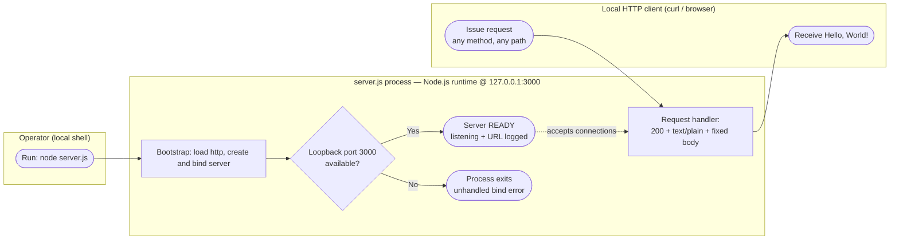

The dashed edge denotes that a READY server accepts subsequent connections; it is a temporal relationship, not a data dependency. The whole system lives inside a single process on the loopback interface, so there is no network hop to any other component.

#### Detailed Process Flow — Server Bootstrap (F-001)

`server.js` performs a fixed, linear startup sequence: load the built-in `http` module, define the hard-coded host/port constants (`127.0.0.1` / `3000`), register the request handler via `http.createServer`, and call `server.listen(...)` (§2.2.1, requirements F-001-RQ-001, F-001-RQ-003, F-001-RQ-004). The only branch is the socket-bind step, which is resolved by the OS/Node runtime rather than by application code.

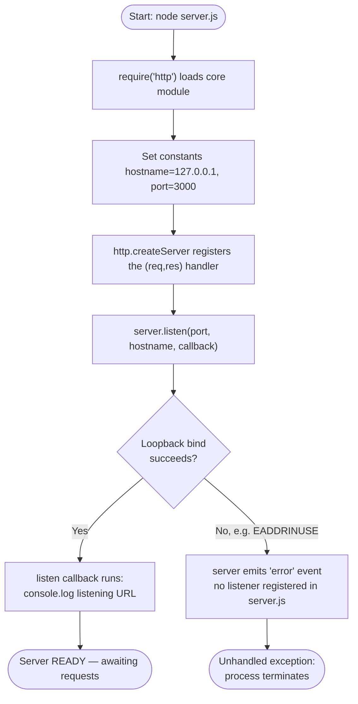

The `Yes` branch is the normal path and the only outcome the code explicitly supports: the listen callback logs `Server running at http://127.0.0.1:3000/` and the server becomes READY. The `No` branch reflects Node.js runtime behavior when the loopback port cannot be bound (for example, `EADDRINUSE`): because the 14-line `server.js` registers **no** `'error'` event listener, the emitted error is unhandled and the process terminates. This is examined further under Error Handling (§4.3.2). This process-level bootstrap is the internal detail behind the operator-facing deployment flow already shown in §3.6.4 (`git clone` → `npm ci` → `node server.js`).

#### Detailed Process Flow — Request/Response Handling (F-001)

Every inbound request follows one **unconditional** path. The `createServer` callback ignores the `req` object entirely — no routing, no query/body parsing, no header inspection, and no validation — and writes a fixed `200 / text/plain / Hello, World!` response (§2.2.1, F-001-RQ-002).

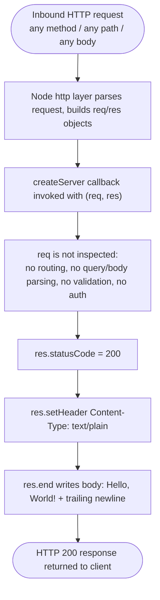

**Decision points.** This process contains **zero application-level decision points** — method, path, headers, and body do not change the outcome, so no decision diamonds appear in the request path. The single decision in the entire system is the bootstrap bind check shown in the previous diagram.

The table below summarizes both core workflows against the flowchart template's required elements (start/end points, touchpoints, decisions, and error terminals).

| Aspect | Bootstrap workflow | Request/response workflow |
|---|---|---|
| Trigger / start | Operator runs `node server.js` | Any HTTP request to `127.0.0.1:3000` |
| User touchpoint | Local shell (operator) | Local HTTP client (curl / browser) |
| Decision points | 1 — loopback bind success/failure (runtime-level) | 0 — identical response for all inputs |
| Terminal (success) | Server READY, listening URL logged | HTTP `200` `Hello, World!` returned |
| Terminal (failure) | Unhandled bind error → process exit | None handled in code (see §4.3.2) |
| Timing/SLA | None defined (see §4.2.1) | Synchronous constant write; no SLA defined |

### 4.1.2 Integration Workflows

Per §2.3.2, the system has exactly two integration points and no others: (1) a single **runtime** integration point — the loopback HTTP endpoint `http://127.0.0.1:3000/` — and (2) an **artifact-level** integration point — the repository files, which the external "backprop" process reads. Both are documented below as sequence diagrams. There is no inter-service data flow, no outbound API client, no message broker, and no scheduler anywhere in the code.

#### Runtime Integration — HTTP Request Sequence

This sequence shows the loopback request/response interaction. The `req` object is delivered to the handler but never inspected, and the exchange is synchronous and stateless.

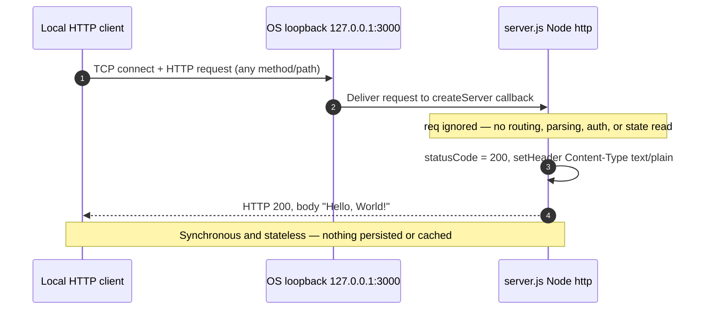

#### Artifact-Level Integration — Backprop Ingestion Sequence

The repository's stated purpose (`README.md`: "test project for backprop integration") is fulfilled at the **file level**: an external process reads the tracked files rather than calling any runtime interface (§2.3.1). This is the closest thing the fixture has to a "batch" sequence — a single read-only pass over the eleven tracked artifacts — but it is performed by an external consumer, not by any code in this repository.

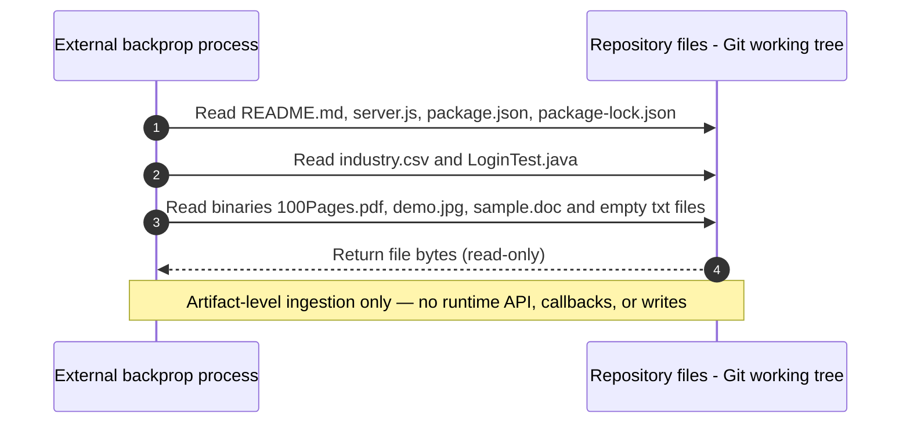

The two integration points are summarized below (consistent with §2.3.2):

| Integration point | Type | Provided by | Data flow | Protocol / mechanism |
|---|---|---|---|---|
| `http://127.0.0.1:3000/` | Runtime, loopback | F-001 (`server.js`) | Inbound request → constant response | HTTP/1.1 over TCP (Node `http`) |
| Repository files | Artifact-level, read-only | All artifacts | External process reads file bytes | Filesystem / Git working tree |

**Absent integration patterns.** The template's remaining integration categories do not apply to this repository and are recorded as absent to remove ambiguity:

- **Data flow between systems** — none; the process holds no state and communicates with no second system (§1.3.2).
- **API interactions (outbound)** — none; `server.js` imports only the built-in `http` module and makes no outbound calls, and there are no third-party service clients (§2.3.2, §3.4).
- **Event processing flows** — none; no event emitters/listeners, message queues, or publish/subscribe mechanisms are present (§1.3.2).
- **Batch processing sequences** — none within the repository; no scheduler, cron, or batch script exists. The only batch-like activity is the external ingestion pass shown above.

## 4.2 Flowchart Requirements and Validation Rules

This sub-section records the conventions that govern every diagram in §4, the system boundaries and timing constraints that apply to the workflows, and the validation, authorization, and compliance rules enforced at each step. Because the repository is a deterministic single-response fixture (§2.1, §2.2), most rule categories in the flowchart template evaluate to a plainly stated **absence** rather than an implemented control.

### 4.2.1 Flowchart Notation, System Boundaries, and Timing Considerations

**Notation.** All diagrams follow a single, consistent notation so that start/end points, process steps, decision diamonds, and system boundaries are unambiguous:

| Element | Mermaid syntax | Meaning in §4 |
|---|---|---|
| Terminator (start/end) | `(["text"])` stadium node | An entry point (operator action, inbound request) or terminal state (READY, response returned, process exit) |
| Process step | `["text"]` rectangle | A concrete action executed by code (e.g., `res.statusCode = 200`) |
| Decision | `{"text"}` diamond | A branch point; in this system the only branch is the loopback bind check |
| Swim lane / system boundary | `subgraph ... end` | One actor or process boundary (operator, `server.js` process, HTTP client) |
| Control/sequence flow | `-->` solid arrow | Ordered flow of control between steps |
| Temporal relationship | `-.->` dashed arrow | A "happens-after" relationship, not a data dependency |
| Sequence message / response | `->>` / `-->>` | Request message / response message in sequence diagrams |

**System boundaries.** The entire runtime executes within **one Node.js process** bound to the loopback interface `127.0.0.1:3000` (§1.3.1, F-001-RQ-001). Three boundaries are relevant to the workflows:

- **Operator boundary** — a local shell that launches `node server.js`; the only human touchpoint on the control plane.
- **Process/runtime boundary** — the `server.js` process on the Node.js runtime, which owns the `http` server and the request handler. Nothing crosses out of this boundary at runtime because there are no outbound clients.
- **Client boundary** — a local HTTP client (curl/browser) reachable only from the same host, since the server binds to loopback rather than `0.0.0.0` (§2.2.1 Security Requirements). The external "backprop" consumer sits at a separate **artifact boundary**, interacting with the repository files rather than the running process (§2.3.2).

**User touchpoints.** There are exactly two: the operator who starts the process, and the local HTTP client that issues requests. There are no authenticated users, roles, sessions, or UI (§1.3.1).

**Timing and SLA considerations.** The repository defines **no** timing constraints, latency budgets, throughput targets, or service-level agreements — this is stated explicitly in §1.2.3 (no KPIs/SLAs) and reiterated in the "Performance Criteria: none defined" rows of §2.2. The observable timing characteristics that follow from the code are:

- The request handler writes a fixed response **synchronously** (`res.statusCode` → `res.setHeader` → `res.end`), with no I/O, awaits, or timers, so per-request latency is dominated by Node's own request handling rather than any application work (§2.2.1).
- `server.js` configures **no** socket, header, request, or keep-alive timeouts; only the Node.js runtime's built-in defaults apply, and none are tuned in code.
- There are **no** retry timers, backoff intervals, or scheduled/batch windows, because no retry, queue, or scheduler exists (§4.1.2, §4.3.2).

### 4.2.2 Validation Rules, Authorization, and Compliance Checkpoints

The flowchart template calls for the business rules, data-validation requirements, authorization checkpoints, and regulatory-compliance checks that apply at each workflow step. These are drawn directly from the Validation Rules recorded per feature in §2.2 and reflect what the code actually enforces.

**Business rules.** The governing business rule for the runtime workflow is that the server must return a **deterministic constant response** to every request, and its behavior must remain stable in line with the README "Do not touch!" mandate (§2.2.1). The packaging rule for F-002 is a **zero-dependency, MIT-licensed** footprint to preserve reproducibility (§2.2.2). No other domain rules exist.

**Data validation.** The runtime request path performs **no data validation** — the `req` object (method, path, headers, body) is never parsed or checked (§2.2.1, §1.3.2). The only data-shape rules in the repository are static properties of the reference dataset (F-003): `industry.csv` must be a single-column, header-led CSV of exactly 43 values (§2.2.3, F-003-RQ-001 to F-003-RQ-003). These are properties of the file, not runtime validations, because no code reads or validates the CSV.

**Authorization checkpoints.** There are **none**. No authentication, authorization, roles, tokens, or TLS are implemented anywhere; the `LoginTest.java` name notwithstanding, that class contains no auth logic and does not compile (§1.3.2, §2.2.4). The single access-control-like property is the **network boundary**: binding to `127.0.0.1` makes the endpoint reachable only from the local host (a deployment-time security boundary, not a per-request authorization check — §2.2.1 Security Requirements).

**Regulatory compliance checks.** There are **none** declared or implemented; the only compliance-relevant artifact is the MIT license recorded in `package.json`/`package-lock.json` (§2.2.1, §2.2.2). No PII handling, audit logging, consent, or regulatory gates exist.

The matrix below maps each workflow step to the applicable rules, showing where controls exist and where they are deliberately absent:

| Workflow step | Business rule | Data validation | Authorization | Compliance |
|---|---|---|---|---|
| Bootstrap — bind & listen | Bind loopback only (`127.0.0.1:3000`) | None | None (network boundary only) | MIT license only |
| Request received | Respond identically to every request | None — `req` ignored | None — no auth check | None |
| Response written | Constant `200` `text/plain` `Hello, World!` | None | None | None |
| Package install (F-002) | Zero-dependency, reproducible install | Valid JSON per npm/lockfile-v3 schema | None | MIT license declared |

Because there is only one unconditional runtime path (§4.1.1), these rules are uniform across all requests — there is no step at which a request can be rejected, redirected, or escalated for authorization.

## 4.3 Technical Implementation Flows

This sub-section documents how state and errors are handled beneath the workflows of §4.1. Both areas are shaped by the same fact: `server.js` is a 14-line, stateless, dependency-free handler. The state model is therefore limited to the **process lifecycle**, and there is no application-level error-handling machinery — a reality captured faithfully below rather than embellished.

### 4.3.1 State Management

**State transitions.** The system has no business or session state; the only stateful entity is the **server process** itself, whose lifecycle is driven entirely by the bootstrap sequence (§4.1.1). The diagram below models that lifecycle. The self-transition on `Listening` emphasizes that handling a request causes **no** state mutation.

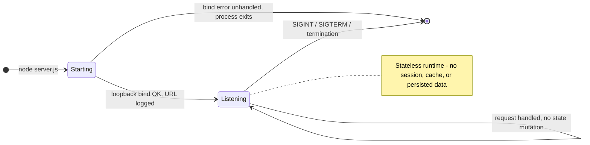

**Data persistence points.** There are **none**. The server reads, writes, and stores no data: no database client, no ORM, no file writes, and no session or key/value store exist anywhere in the repository (§1.3.2; §2.2.1 records that "no state is read, stored, or persisted"). The only durable storage is the Git working tree that holds the static artifacts (`industry.csv`, the binaries), which the running process never touches.

**Caching requirements.** There are **none**. No caching layer, in-memory cache, or CDN is present, and the handler sets no HTTP caching headers (`Cache-Control`, `ETag`, `Last-Modified`) — the only header written is `Content-Type: text/plain` (§2.2.1). The response body is a compile-time constant string, so there is nothing to cache.

**Transaction boundaries.** There are **none**. Each request is a single synchronous write (`res.statusCode` → `res.setHeader` → `res.end`) with no multi-step or atomic operation, and there is no database or external resource against which a transaction could be scoped.

| State / data concern | Present? | Behavior / evidence |
|---|---|---|
| Application / session state | No | Handler holds no state; `req` ignored (§2.2.1) |
| Data persistence points | No | No DB, no file writes, nothing persisted (§1.3.2) |
| Caching | No | No cache layer; no cache headers set (only `Content-Type`) |
| Transaction boundaries | No | Single synchronous write; no DB/transaction semantics |
| Process/runtime state | Yes (ephemeral) | In-memory lifecycle only: Starting → Listening → exit |

### 4.3.2 Error Handling

`server.js` contains **no** error-handling constructs — there is no `try`/`catch`, no `'error'` event listener on the server, request, response, or socket, and no error-reporting code (verified across the 14-line source). The flowchart below therefore documents the *inherent* outcomes of the Node.js runtime given that absence, separated into the startup path and the request path.

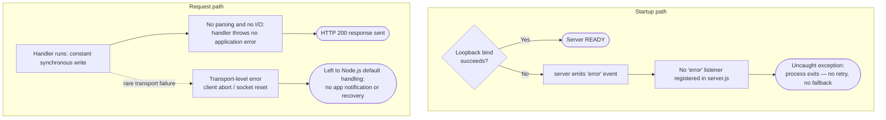

**Retry mechanisms.** None. There is no retry, backoff, or reconnection logic anywhere; a failed startup bind is terminal (the process exits) and is not retried.

**Fallback processes.** None. There is no fallback route, default error response, degraded mode, or circuit breaker. Because every request already returns the same response, there is no alternate path to fall back to.

**Error notification flows.** None. The only console output is the single startup `console.log` of the listening URL (§2.2.1, F-001-RQ-004), which is an informational message, not an error notification. There is no logging framework, no metrics/alerting, and no external error-reporting integration (§1.3.2 lists observability/monitoring as out of scope; §2.3.4 confirms no logging service).

**Recovery procedures.** Recovery is **manual only**: an operator re-runs `node server.js`. No process supervisor, restart policy, or orchestrator is configured — there is no PM2/systemd unit, and no container or Kubernetes restart policy, because containerization and CI/CD are absent (§3.6.3, §3.6.4).

| Error-handling concern | Implemented? | Evidence / behavior |
|---|---|---|
| `try`/`catch` or error middleware | No | None in `server.js` |
| `'error'` event listeners | No | None on server/request/response/socket |
| Retry mechanism | No | No retry/backoff/reconnect code |
| Fallback process | No | No fallback route, default error page, or circuit breaker |
| Error notification | No | Only a startup `console.log`; no logging/alerting framework |
| Recovery procedure | Manual | Operator re-runs `node server.js`; no supervisor/restart policy (§3.6) |

## 4.4 References

The following repository artifacts and Technical Specification sections were examined and cited as evidence for the workflows, diagrams, and rules in §4.

**Repository files**

- `server.js` - The only executable artifact; established the server bootstrap flow, the unconditional request/response handling flow, the loopback binding, the constant `200`/`text/plain`/`Hello, World!` response, the single startup `console.log`, and the complete absence of routing, validation, state, timeouts, and error handling.
- `package.json` - Established package identity, the intentionally-failing `test` script, the declared-but-absent `index.js` entry point, and the MIT license (compliance).
- `package-lock.json` - Established the zero-dependency (lockfile v3) footprint underlying the reproducible-install workflow.
- `README.md` - Established the fixture's purpose ("test project for backprop integration"), the "Do not touch!" stability mandate (a business rule), and the artifact-level backprop integration.
- `LoginTest.java` - Confirmed the absence of authentication/authorization logic (non-compilable stub despite the "Login" name).
- `industry.csv` - Established the static single-column, 43-value controlled-vocabulary dataset and its data-shape properties (referenced as a non-runtime data-validation example).
- `test.py.txt`, `test.txt.txt` - Confirmed 0-byte placeholder artifacts within the ingested corpus.
- `100Pages.pdf`, `demo.jpg`, `sample.doc` - Binary corpus assets read only by the external artifact-level ingestion sequence; unreferenced by runtime code.

**Repository structure**

- Repository root (`/`) - A single flat directory (no subfolders except `.git`); confirmed there is no `src/`, router, service layer, scheduler, queue, or configuration directory, which grounds the "absent integration/state/error-handling" findings throughout §4.

**Cross-referenced Technical Specification sections**

- `1.2 System Overview` - Fixture context and the single client → server → constant-response runtime path; the absence of KPIs/SLAs (§1.2.3) informing the Timing/SLA discussion.
- `1.3 Scope` - In-scope single user workflow and the explicit out-of-scope list (routing, auth, persistence, integrations, CI/CD, config, observability) that grounds the documented absences and system boundaries.
- `2.1 Feature Catalog` - Feature identifiers F-001 through F-005 used to label the workflows.
- `2.2 Functional Requirements` - Requirement IDs (F-001-RQ-001 through F-001-RQ-004, F-002-RQ-002 to F-002-RQ-004, F-003-RQ-001 to F-003-RQ-003) and the per-feature Validation Rules and "Performance Criteria: none" rows underpinning §4.2.
- `2.3 Feature Relationships` - The two integration points (§2.3.2) and the "no shared components/common services" findings (§2.3.4) used in §4.1.2.
- `3.4 Third-Party Services` - Confirmed the absence of outbound API/service clients cited in the "absent integration patterns" list.
- `3.6 Development & Deployment` - The manual `git clone` → `npm ci` → `node server.js` deployment flow and the absence of build/containerization/CI-CD and process supervisors, referenced by the bootstrap flow (§4.1.1) and recovery procedures (§4.3.2).

# 5. System Architecture

## 5.1 High-Level Architecture

This section describes the architecture of the `hao-backprop-test` repository as it actually exists in code. The system is deliberately minimal: a single runnable artifact — `server.js` — running as one Node.js process, accompanied by a set of static, non-executing artifacts (a package manifest and lockfile, a reference CSV, an incomplete Java stub, empty text placeholders, and binary sample documents). There is no multi-tier, microservice, or distributed architecture to describe; the value of this section is to document the real structure precisely and to state plainly which architectural concerns are intentionally absent. All statements are grounded in the eleven tracked files, and terminology is kept consistent with Sections 1–4.

### 5.1.1 System Overview

**Overall architecture style and rationale.** The runnable system is a **single-process, single-module, event-driven HTTP service** built directly on the Node.js standard library. `server.js` creates one HTTP server with `http.createServer`, binds it to the loopback interface `127.0.0.1:3000`, and serves a constant response. There is no application framework, no router, no service layer, and no separation into tiers — the entire runtime is 15 lines in a single file. This "nano-monolith" style is the natural consequence of the repository's stated purpose: `README.md` identifies it as a "test project for backprop integration" with a "Do not touch!" mandate, so the design optimizes for determinism, portability, and stability rather than feature richness or scalability.

**Key architectural principles and patterns.** The following principles are directly observable in the code:

- **Zero-dependency minimalism.** `package.json` declares no `dependencies`, and `package-lock.json` (lockfile version 3) pins only the root package, so the service relies exclusively on the Node.js built-in `http` module (`require('http')` on line 1 of `server.js`).
- **Event-driven, non-blocking I/O.** The service uses Node.js's single-threaded event loop; the request handler is a callback passed to `http.createServer`, following the reactor/callback pattern that the `http` module implements.
- **Statelessness and determinism.** The handler ignores the request object entirely and writes the same fixed response (`res.statusCode = 200`, `Content-Type: text/plain`, body `Hello, World!`) for every method and path, so behavior is fully deterministic and reproducible.
- **Loopback-only network boundary.** Binding to `127.0.0.1` (not `0.0.0.0`) confines the endpoint to the local host, minimizing external exposure by design.
- **Immutability / stability mandate.** The README's "Do not touch!" note establishes stability of the fixture as a first-class constraint.
- **Polyglot but unintegrated organization.** JavaScript (`server.js`) and Java (`LoginTest.java`) artifacts coexist with no shared build; no tooling compiles or links them together.

**System boundaries and major interfaces.** The system has one process boundary (a single Node.js process) and exposes exactly two interfaces:

- A **runtime HTTP interface** at `http://127.0.0.1:3000/` — loopback-only, synchronous request/response, constant `text/plain` body.
- An **artifact-level (file) interface** — the tracked repository files, which an external "backprop" process reads and ingests offline (there is no runtime API for this; it is read-only file access to the Git working tree).

The diagram below presents the architectural context: how the process is started, the single inbound runtime path, and the standalone artifacts that only the external consumer reads.

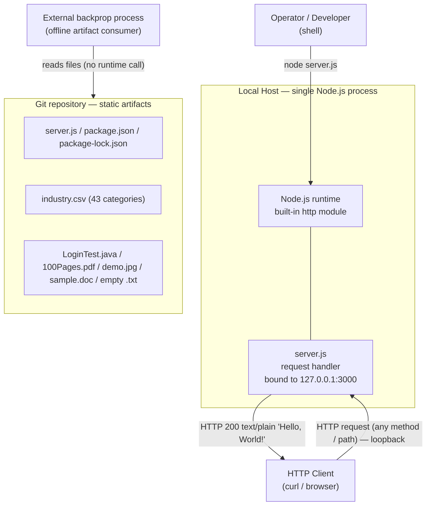

### 5.1.2 Core Components

The repository comprises one runtime component and four categories of static artifact. Because tables in this specification are limited to four columns, "Critical Considerations" for each component are captured in prose immediately after the table.

| Component | Primary Responsibility | Key Dependencies | Integration Points |
|---|---|---|---|
| HTTP Server (`server.js`, F-001) | Bind loopback `127.0.0.1:3000` and return constant HTTP `200` `text/plain` `Hello, World!` for every request | Node.js runtime; built-in `http` module only | Runtime HTTP endpoint `http://127.0.0.1:3000/` |
| Package Manifest & Lockfile (`package.json` / `package-lock.json`, F-002) | Declare package identity (`hello_world@1.0.0`, MIT) and pin a zero-dependency install | npm CLI; Node.js toolchain | npm tooling (`npm ci`); encloses F-001 (packaging only) |
| Industry Reference Dataset (`industry.csv`, F-003) | Provide a single-column controlled vocabulary of 43 industry categories | None (plain CSV text) | Artifact-level ingestion only (not read by runtime) |
| Java `LoginTest` Stub (`LoginTest.java`, F-004) | Declare a placeholder `com.blitzyTest.LoginTest` entry-point class | JDK/Java toolchain (not configured in repo) | Artifact-level ingestion only (non-compilable) |
| Multi-Format Corpus (`100Pages.pdf`, `demo.jpg`, `sample.doc`, `test.py.txt`, `test.txt.txt`, F-005) | Supply representative binary/text content types | None | Artifact-level ingestion only (referenced by no code) |

**Critical considerations by component:**

- **HTTP Server (F-001):** Single point of runtime behavior; registers no `'error'` listener and no `try`/`catch`, so a failed bind terminates the process (see §5.4). The declared `main` in `package.json` is `index.js`, which does not exist — the de-facto entry point is `server.js`, so `node .` fails while `node server.js` succeeds.
- **Package Manifest & Lockfile (F-002):** Enables reproducible, zero-dependency installs; however, no `engines` field pins a Node.js version, and the `test` script intentionally fails (`echo "Error: no test specified" && exit 1`).
- **Industry Reference Dataset (F-003):** Static, non-sensitive, version-controlled reference data; edited by hand and committed to Git; no runtime code loads it.
- **Java `LoginTest` Stub (F-004):** Contains only a dangling `Web` token in `main()`, so it is not valid compilable Java; despite the name it holds no authentication logic and no build definition (no Maven/Gradle) exists.
- **Multi-Format Corpus (F-005):** Large binaries (`100Pages.pdf` ≈ 9.4 MB, `demo.jpg` ≈ 2.1 MB, `sample.doc` ≈ 98 KB) are tracked directly in Git without Git LFS, dominating clone size; the two `.txt` files are 0-byte placeholders.

### 5.1.3 Data Flow Description

**Primary data flows between components.** There is a single runtime data flow and one offline artifact flow:

- **Runtime request/response flow.** An HTTP client on the local host issues any request to `127.0.0.1:3000`; the Node.js `http` module parses the transport-level request and invokes the `server.js` callback; the callback writes a constant response (`200`, `text/plain`, `Hello, World!\n`) and ends the response. No data flows *between* internal components because there is only one runtime component.
- **Offline artifact ingestion flow.** The external "backprop" process reads the tracked files from the Git working tree. This is a read-only, file-level flow that does not traverse the HTTP interface and does not invoke any runtime code.

**Integration patterns and protocols.** The runtime path uses **HTTP/1.1 over TCP** on the loopback interface in a synchronous request/response pattern. The artifact path uses **direct file-system reads** (batch/offline ingestion), not a network protocol.

**Data transformation points.** There are **none**. The response body is a compile-time constant string; the request object is never inspected, so there is no parsing, deserialization, validation, mapping, or serialization of input to output. The server neither transforms `industry.csv` nor any binary asset — those files are inert with respect to the runtime.

**Key data stores and caches.** There are **none** in the runtime. Consistent with §3.5 and §4.3.1, the system uses no database, no object/blob store, and no cache (distributed or in-process); it sets no HTTP cache headers (`Cache-Control`, `ETag`, `Last-Modified`). The only durable storage is the **static Git-versioned files** themselves, which the running process never reads or writes. Runtime "state" is limited to the ephemeral in-memory server process lifecycle described in §5.2.

### 5.1.4 External Integration Points

The system's genuinely *external* integration surface is limited. The HTTP endpoint is bound to loopback and is therefore reachable only from the local host, so the only cross-boundary integration is the artifact-level ingestion performed by the external backprop process. The table below documents both interfaces (column count kept to four); service-level expectations are described in prose beneath it because no SLA data is expressible as a table column here.

| System / Actor | Integration Type | Data Exchange Pattern | Protocol / Format |
|---|---|---|---|
| Local HTTP client (curl / browser) | Runtime, inbound (loopback-only) | Synchronous request/response | HTTP/1.1; `text/plain` body |
| External backprop process | Artifact-level, read-only (offline) | Batch file ingestion | File-system reads; mixed formats (JS, JSON, CSV, Java, PDF, JPEG, DOC, text) |

**SLA requirements.** No service-level agreements, uptime targets, latency budgets, throughput commitments, or error-rate objectives are defined anywhere in the repository (consistent with §1.2.3 and §3.4). The HTTP endpoint is not externally exposed (loopback-only) and has no availability guarantee; there is no monitoring, health check, or alerting to measure or enforce one. The artifact-level integration likewise has no timing or freshness SLA — the files change only when committed to Git, and the fixture is expected to remain stable under the README's "Do not touch!" mandate. Any SLA would have to be imposed externally by the consuming process; none is declared here.

## 5.2 Component Details

This section details each component along five dimensions — purpose/responsibilities, technologies/frameworks, interfaces/APIs, data-persistence requirements, and scaling considerations. Only one component (`server.js`) executes at runtime; the remaining components are static artifacts, documented more briefly because Sections 2 and 3 already cover them in depth. The required component-interaction, state-transition, and sequence diagrams follow in §5.2.3.

### 5.2.1 HTTP Server Component (server.js, F-001)

**Purpose and responsibilities.** `server.js` is the single runnable component and the whole of the runtime architecture. Its responsibilities are: (1) create an HTTP server, (2) bind and listen on the loopback interface `127.0.0.1:3000`, (3) return a constant `200` `text/plain` `Hello, World!\n` response to every request regardless of method or path, and (4) log the listening URL once at startup (`Server running at http://127.0.0.1:3000/`). These map to requirements F-001-RQ-001 through F-001-RQ-004.

**Technologies and frameworks used.** Node.js runtime with the **built-in `http` module only** (`const http = require('http')`) — CommonJS module system, ES6 arrow-function handler, and a template literal for the startup log. There is **no web framework** (no Express, Koa, Fastify, or Hapi) and no router; the response is produced by direct calls to the core `http` `ServerResponse` API. The repository pins no Node.js version (`package.json` has no `engines` field); the reference environment recorded while validating this specification was Node.js v22.23.1 with npm 11.1.0 (§3.6.1).

**Key interfaces and APIs.** The component exposes exactly one interface — the inbound HTTP endpoint `http://127.0.0.1:3000/` — and consumes exactly one API — the Node.js core `http` module. Internally it uses `http.createServer(callback)` to register the handler and `server.listen(port, hostname, callback)` to bind. Within the handler it uses three response operations: `res.statusCode = 200`, `res.setHeader('Content-Type', 'text/plain')`, and `res.end('Hello, World!\n')`. The `req` (request) object is received but never read, so no request-side API surface (headers, body, method, URL) is consumed.

**Data persistence requirements.** **None.** The handler performs no reads or writes: no database, no ORM, no file I/O, no session store, and no cache (§3.5, §4.3.1). The response string is a compile-time constant reconstructed in memory on each start; nothing survives process termination.

**Scaling considerations.** The service runs as **one single-threaded Node.js process** driven by the event loop. Because the handler is fully stateless and performs no blocking I/O, it is in principle trivially replicable; however, **no scaling mechanism is configured**: there is no use of the Node `cluster` module or `worker_threads`, no process supervisor (PM2/systemd), no container or orchestrator, and no load balancer or reverse proxy (§3.6.3, §3.6.4). The hostname and port are hard-coded with no environment override, so running two instances on the same host would collide on port 3000 (`EADDRINUSE`), and the loopback binding prevents distributing traffic across hosts. In practice the component scales only vertically (by the capacity of the single host and event loop), and no autoscaling, throughput target, or capacity plan exists (§1.2.3).

### 5.2.2 Supporting and Non-Runtime Artifacts

These components do not execute at runtime; they are packaging metadata and static content, and their architectural roles are summarized below.

- **Package Manifest & Lockfile (`package.json` / `package-lock.json`, F-002).** *Purpose:* declare package identity (`hello_world@1.0.0`, MIT) and pin a reproducible zero-dependency install. *Technologies:* npm metadata (JSON) and npm lockfile version 3. *Interfaces/APIs:* consumed by the npm CLI (`npm ci`, `npm test`); the `test` script is a placeholder that exits with an error. *Persistence:* version-controlled files in Git. *Scaling:* not applicable (build-time metadata); note the declared `main` (`index.js`) does not exist, so the working entry point is `server.js`.
- **Industry Reference Dataset (`industry.csv`, F-003).** *Purpose:* provide a single-column controlled vocabulary of 43 industry categories under an `Industry` header. *Technologies:* plain CSV text. *Interfaces/APIs:* none at runtime — consumed only by artifact-level ingestion. *Persistence:* static Git file, edited by hand. *Scaling:* not applicable.
- **Java `LoginTest` Stub (`LoginTest.java`, F-004).** *Purpose:* declare a placeholder `com.blitzyTest.LoginTest` class with a `public static void main`. *Technologies:* Java source (no JDK toolchain or Maven/Gradle build configured). *Interfaces/APIs:* nominally a JVM `main` entry point, but the body contains only a dangling `Web` token, so it does not compile and exposes no working interface. *Persistence:* static Git file. *Scaling:* not applicable.
- **Multi-Format Corpus (`100Pages.pdf`, `demo.jpg`, `sample.doc`, `test.py.txt`, `test.txt.txt`, F-005).** *Purpose:* supply representative binary and text content types for the external consumer. *Technologies:* PDF, JPEG, legacy DOC (OLE2), and two 0-byte text placeholders. *Interfaces/APIs:* none — referenced by no code. *Persistence:* tracked directly in Git **without Git LFS**, so they dominate clone size (§3.5.4). *Scaling:* not applicable; adding further large assets would inflate repository size.

### 5.2.3 Component Interaction and Behavior Diagrams

**Component interaction diagram.** The diagram below shows how the runtime pieces interact: an operator starts the process; inside the process the request-handler callback is registered with the Node core `http` module, which owns the TCP listener and HTTP parser and invokes the callback on each request; an HTTP client exchanges messages over loopback; and the npm CLI uses the manifest for packaging only (it does not wire into the running process).

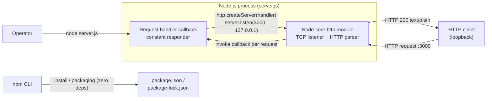

**State transition diagram.** The only stateful entity is the server process. Its lifecycle is instantiation → listening → termination; handling a request is a self-transition that mutates no state. (This is the architecture-level view of the process lifecycle detailed in §4.3.1.)

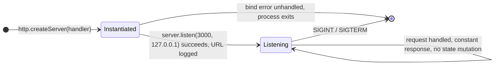

**Sequence diagram for the key flow.** The one runtime flow is request handling. The core `http` module parses the transport request and invokes the handler, which writes the fixed status, header, and body synchronously.

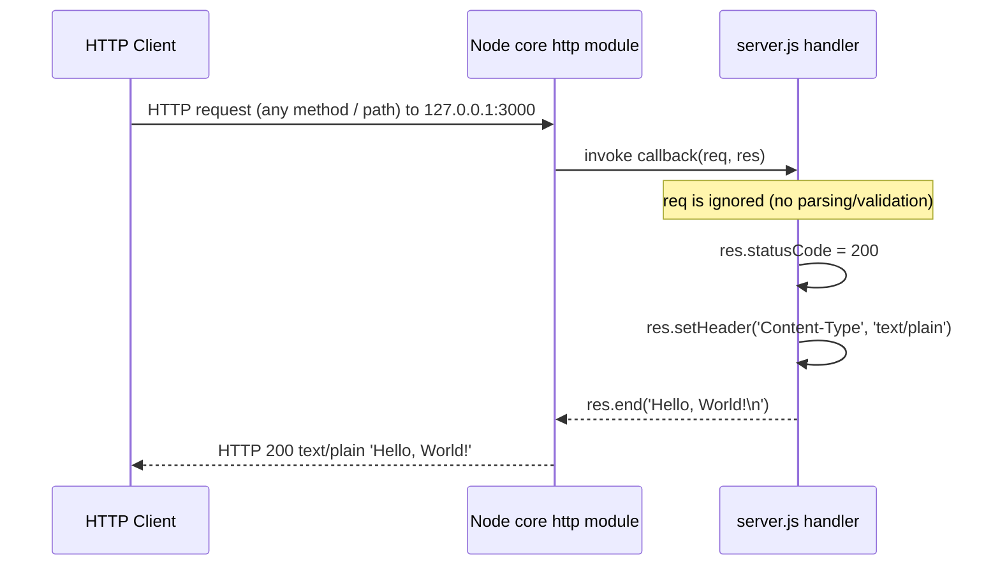

## 5.3 Technical Decisions

This section documents the architecture decisions that are evident in the codebase and the rationale behind them. Because the repository is a test fixture (`README.md`: "test project for backprop integration. Do not touch!") with a single 15-line runnable file, these decisions are reconstructed from the observed implementation rather than from a written design record; the consistent driver across all of them is **minimalism, determinism, portability, and stability**. Alternatives that a production service would typically adopt are listed to make each tradeoff explicit — they are documented as *not chosen*, not as recommendations.

### 5.3.1 Key Decisions and Tradeoffs

The table records each decision area, the observed decision, the common alternative that was not used, and the rationale/tradeoff. (Four-column limit observed.)

| Decision Area | Observed Decision | Alternative Not Used | Rationale / Tradeoff |
|---|---|---|---|
| Architecture style | Single-process, single-module Node.js service (`server.js`) | Web framework (Express/Koa/Fastify), microservices, serverless | Simplest possible deterministic fixture; tradeoff: no routing, middleware, or modular structure |
| Communication pattern | Synchronous HTTP/1.1 request/response over loopback | Async messaging, event streaming, gRPC, WebSockets | Matches a trivial request/response fixture; tradeoff: no push, streaming, or backpressure semantics |
| Data storage | None at runtime; static Git-versioned files only | Relational/NoSQL database, object store | No dynamic data to persist; tradeoff: no state survives the process |
| Caching strategy | No cache; no HTTP cache headers | Redis/Memcached, in-process cache, CDN, `ETag`/`Cache-Control` | Response is a constant computed with no I/O — nothing to cache; tradeoff: none for this workload |
| Security mechanism | Loopback-only bind; no TLS, no authN/authZ, no rate limiting | TLS termination, OAuth/OIDC, API keys, WAF/rate limiting | Local, non-sensitive fixture minimizes exposure; tradeoff: unsuitable for any external/production use |
| Dependency management | Zero third-party dependencies (Node core `http` only) | npm packages / frameworks / utility libraries | Maximizes portability & reproducibility, minimizes supply-chain risk; tradeoff: everything is hand-rolled |

**Architecture style decision and tradeoffs.** The service is a "nano-monolith": one process, one module, one responsibility. This eliminates framework overhead, transitive dependencies, and build steps, which keeps the fixture reproducible across environments and stable over time. The tradeoff is that it offers no extensibility surface — adding routes, middleware, or layered concerns would require introducing structure the fixture deliberately omits.

**Communication pattern choice.** The single loopback HTTP endpoint uses classic synchronous request/response. There is no need for asynchronous or streaming communication because the only runtime interaction is a client fetching a constant string, and the only other integration (backprop) is offline file ingestion (§5.1.4).

**Data storage solution rationale.** No datastore is used because the server holds no dynamic state and serves a compile-time constant (§3.5, §4.3.1). Reference and corpus data live as static, version-controlled files; Git is therefore the de-facto storage backend, accepted knowingly at the cost of clone size for the large binaries (no Git LFS).

**Caching strategy justification.** Caching is intentionally absent. The response requires no computation or I/O, so a cache would add complexity with zero benefit; correspondingly, the handler sets no cache-related headers (only `Content-Type: text/plain`).

**Security mechanism selection.** Security is achieved by **reducing attack surface** rather than by adding controls: binding to `127.0.0.1` keeps the endpoint off the network, and the absence of request parsing, external egress, credentials, and third-party services (§3.4) means there is little to attack. The explicit tradeoff is that the service provides none of the TLS, authentication, authorization, or input validation a production, internet-facing service would require.

### 5.3.2 Architecture Decision Records (ADRs)

The following compact ADRs capture the most consequential decisions. Status is marked "Accepted (in effect)" because each is observed as active in the current code; they are reconstructed from the implementation.

**ADR-01 — Build on the Node.js core `http` module with zero dependencies**

| Field | Detail |
|---|---|
| Status | Accepted (in effect) |
| Context | A trivial HTTP responder is needed as a stable, portable integration fixture |
| Decision | Use `require('http')` only; declare no `dependencies` in `package.json` (lockfile v3 pins only the root package) |
| Consequences | Maximum portability and reproducibility, no supply-chain surface; but no framework conveniences and all behavior is hand-written |

**ADR-02 — Bind to the loopback interface with no transport security or authentication**

| Field | Detail |
|---|---|
| Status | Accepted (in effect) |
| Context | The fixture must run locally and must not present an external attack surface |
| Decision | Bind `127.0.0.1:3000` (not `0.0.0.0`); implement no TLS, authentication, authorization, or rate limiting |
| Consequences | Minimal exposure and no secrets to manage; but the service is unreachable off-host and unfit for production/external use |

**ADR-03 — Serve a single constant response for all requests (no routing, no state)**

| Field | Detail |
|---|---|
| Status | Accepted (in effect) |
| Context | Deterministic, comparable output is needed across integration runs |
| Decision | Ignore the request object; always return `200` `text/plain` `Hello, World!\n` |
| Consequences | Fully deterministic and side-effect-free; but no dynamic behavior, input handling, or content negotiation |

**ADR-04 — Use no database and no cache; persist only static Git files**

| Field | Detail |
|---|---|
| Status | Accepted (in effect) |
| Context | There is no dynamic or shared state to store, and the response needs no acceleration |
| Decision | Omit all datastores and caches; keep reference/corpus data as version-controlled files |
| Consequences | Nothing to operate, secure, or scale on the data tier; but no persistence and large binaries inflate clone size (no Git LFS) |

### 5.3.3 Decision Tree

The decision tree below traces how the minimalist choices follow from the fixture's purpose. Solid branches are the paths taken; dotted branches show the "not chosen" alternatives a production service would have selected.

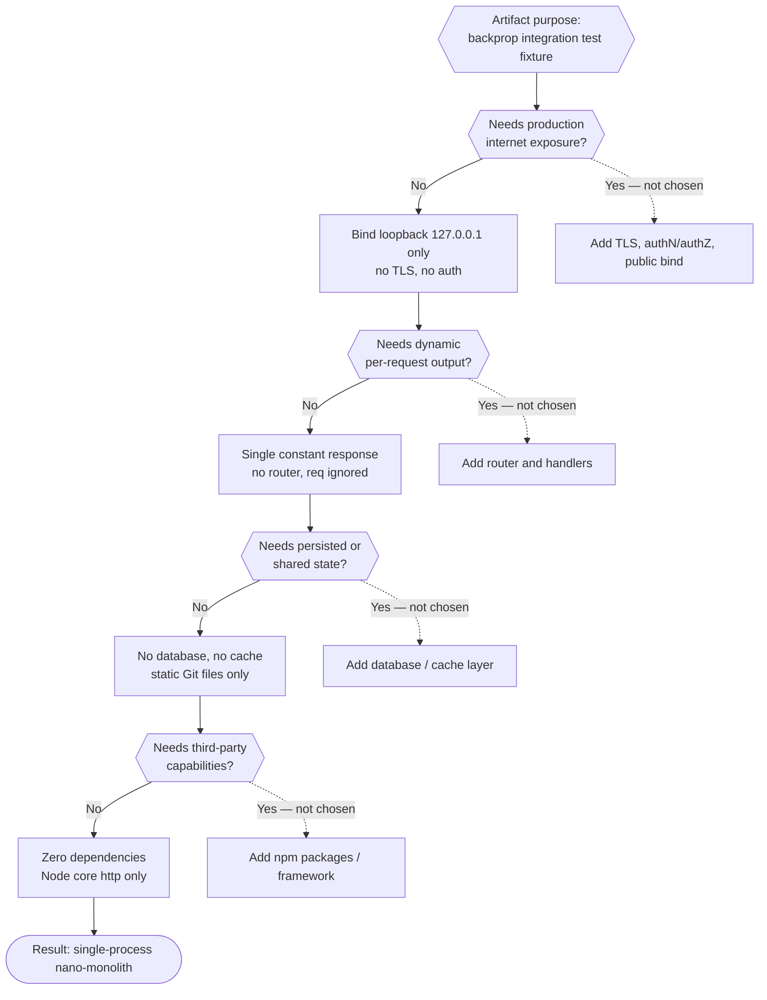

## 5.4 Cross-Cutting Concerns

Cross-cutting concerns in this system are almost entirely absent by design — a direct consequence of the 15-line, stateless, dependency-free server documented above. This section states plainly what exists and what does not, with evidence, so that readers do not assume production-grade capabilities that are not present. The summary table below is expanded in the subsections that follow.

| Cross-Cutting Concern | Implemented? | Mechanism / Evidence |
|---|---|---|
| Monitoring / metrics / health check | No | Only a startup `console.log`; no `/metrics` or health route (§3.4.3) |
| Logging | Minimal | Single `console.log` of the listening URL; no logging framework |
| Distributed tracing | No | No OpenTelemetry/Jaeger/Zipkin; no correlation IDs |
| Error handling (application-level) | No | No `try`/`catch` or `'error'` listeners; bind failure exits the process (§4.3.2) |
| Authentication / authorization | No | No identity provider, middleware, keys, or sessions (§3.4.2) |
| Performance targets / SLAs | No | None defined anywhere in the repository (§1.2.3) |
| Disaster recovery | Manual | Operator re-runs `node server.js`; Git is the source of truth; no supervisor/backup |

### 5.4.1 Monitoring, Observability, Logging, and Tracing

**Monitoring and observability approach.** There is no monitoring or observability stack. The server exposes no health-check route and no `/metrics` endpoint, integrates no application-performance-monitoring (APM) agent, and emits no telemetry (§3.4.3). Observability is limited to whatever the operator can infer from the process's console output and its liveness.

**Logging and tracing strategy.** Logging consists of exactly one statement — the startup `console.log` that prints `Server running at http://127.0.0.1:3000/` (F-001-RQ-004). There is no logging framework (such as Winston, Pino, or Bunyan), no log levels, no structured/JSON logging, and no per-request access log (the request object is never read). There is no distributed tracing: no OpenTelemetry or similar SDK, no trace/span propagation, and no correlation IDs. This is sufficient for a local fixture but provides no runtime insight beyond confirming that the process started.

### 5.4.2 Error Handling Patterns

`server.js` contains **no application-level error handling** — no `try`/`catch`, no `'error'` event listeners on the server/request/response/socket, and no error-reporting code (verified across the source and consistent with §4.3.2). The resulting behavior is therefore the Node.js runtime's default, which differs between the startup and request phases:

- **Startup phase.** If `server.listen` fails to bind (for example, port 3000 is already in use, `EADDRINUSE`), the `http` server emits an `'error'` event. Because no listener is registered, this becomes an uncaught exception and the **process exits** — there is no retry, no backoff, and no fallback port.
- **Request phase.** The handler performs only a constant synchronous write with no parsing or I/O, so it raises no application error and always returns `200`. A rare transport-level failure (client abort / socket reset) is left to Node.js default handling, with no application notification or recovery.
- **Recovery.** There is no fallback route, default error page, circuit breaker, or supervisor; recovery is manual (an operator re-runs `node server.js`).

The following diagram shows the error-handling flow across these phases and the manual recovery path (an architecture-level view of the flow detailed in §4.3.2).

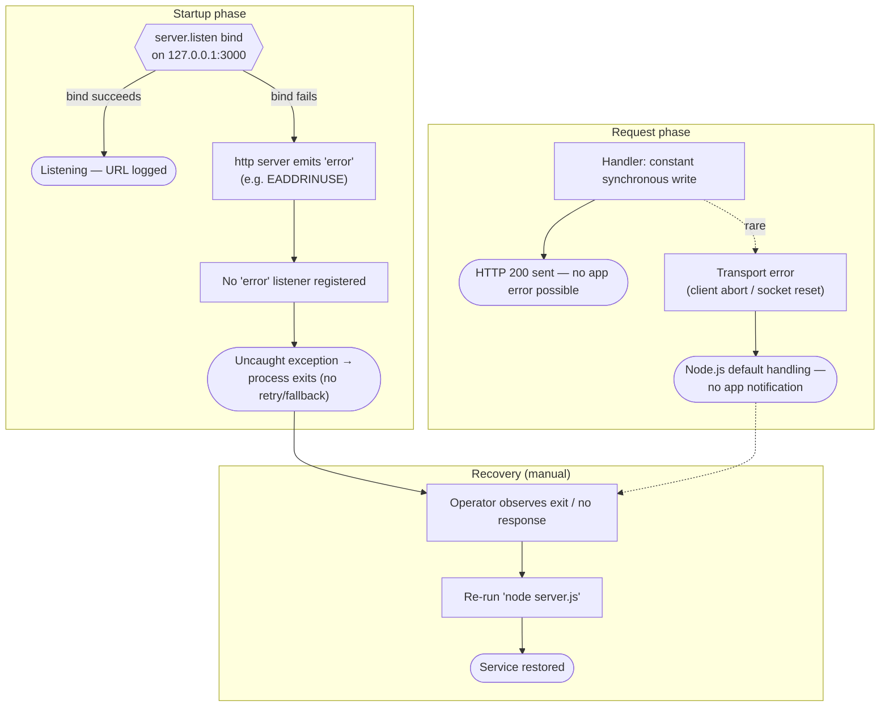

### 5.4.3 Authentication and Authorization

There is **no authentication or authorization framework**. The server registers no auth middleware, integrates no identity provider (no OAuth/OIDC, Auth0, Okta, or equivalent), and validates no API keys, tokens, or sessions; every request is treated identically and receives the same response (§3.4.2). Despite its name, `LoginTest.java` contains no authentication logic (it is a non-compiling stub). The system's only "access control" is the network boundary: binding to `127.0.0.1` restricts access to processes on the local host. There is no TLS, so traffic is unencrypted (acceptable only because it never leaves loopback).

### 5.4.4 Performance Requirements and SLAs

No performance requirements or service-level agreements are defined anywhere in the repository (§1.2.3). There are no latency budgets, throughput targets, concurrency limits, capacity plans, error-rate objectives, or uptime commitments, and there are no benchmarks or load tests. Architecturally, each request is served by a single small synchronous write with no I/O, database access, or computation, so per-request work is minimal and bounded; however, this is an observation about the code path, not a committed performance target. Any SLA would have to be defined and enforced externally — none exists here, and there is no monitoring in place to measure one.

### 5.4.5 Disaster Recovery Procedures

There is **no automated disaster-recovery capability**, and formal recovery objectives (RPO/RTO) are not defined. The relevant facts are:

- **Runtime recovery is manual.** If the process exits, an operator restores service by re-running `node server.js`. There is no process supervisor (PM2/systemd), no restart policy, and no container or Kubernetes self-healing (§3.6.3, §3.6.4).
- **The source of truth is Git.** All artifacts are recoverable by cloning the repository (a single commit, `f60b533` "Add files via upload"). There is no separate backup, replication, or failover mechanism because there is no dynamic state to lose — runtime state is ephemeral and the response is a constant.
- **Storage-recovery caveat.** Large binaries are tracked directly in Git without Git LFS (§3.5.4), so a clone reconstitutes the full corpus but incurs the associated repository size. There are no data-store credentials or backups to manage because no database or storage service exists (§3.5).

In short, "disaster recovery" for this fixture reduces to re-cloning from Git and restarting the process; this is adequate given the stateless, constant-response design but provides none of the redundancy or automated failover a production service would require.

## 5.5 References

The following repository artifacts, folders, and previously authored specification sections were examined as the evidence base for Section 5.

**Repository files inspected**

- `server.js` - The sole runtime component; established the single-process/event-driven architecture, the loopback bind (`127.0.0.1:3000`), the constant `200` `text/plain` `Hello, World!\n` response, the `http`-only dependency, the absence of error handling, and the single startup `console.log`.
- `package.json` - Established package identity (`hello_world@1.0.0`, MIT), the zero-dependency declaration, the intentionally failing `test` script, and the `main: index.js` vs. actual `server.js` entry-point mismatch.
- `package-lock.json` - Confirmed npm lockfile version 3 with only the root package pinned (zero external dependencies).
- `README.md` - Established the fixture purpose ("test project for backprop integration") and the "Do not touch!" stability mandate.
- `LoginTest.java` - Established the non-compilable Java stub (`com.blitzyTest.LoginTest` with a dangling `Web` token) and the polyglot-but-unintegrated organization; confirmed it contains no authentication logic.
- `industry.csv` - Established the static 43-category controlled-vocabulary dataset consumed only via artifact-level ingestion.
- `test.py.txt`, `test.txt.txt` - Confirmed 0-byte placeholder artifacts in the multi-format corpus.
- `100Pages.pdf`, `demo.jpg`, `sample.doc` - Established the binary sample assets tracked in Git without Git LFS, referenced by no code.

**Repository folder inspected**

- `/` (repository root) - Established the flat structure of eleven Git-tracked files with no subdirectories, no build/config/CI files, and a single commit (`f60b533` "Add files via upload").

**Cross-referenced specification sections**

- `1.2 System Overview` - Aligned system framing, the component inventory, and the observable-signals (no KPIs/SLAs) findings.
- `2.3 Feature Relationships` - Aligned the decoupled-features model, the two integration points, and the absence of shared components/services.
- `3.4 Third-Party Services` - Confirmed the absence of external/third-party, authentication, monitoring, and cloud integrations.
- `3.5 Databases & Storage` - Confirmed the absence of database/cache/object storage and the static Git-file persistence model.
- `3.6 Development & Deployment` - Aligned the deployment flow, the no-build/no-container/no-CI-CD posture, and the reference runtime environment.
- `4.3 Technical Implementation Flows` - Aligned the process-lifecycle state model and the error-handling behavior described in §5.2 and §5.4.

# 6. SYSTEM COMPONENTS DESIGN

## 6.1 Core Services Architecture

### 6.1.1 Applicability Assessment and Rationale

**Core Services Architecture is not applicable for this system.**

The `hao-backprop-test` repository does not implement microservices, a distributed architecture, or any decomposition into distinct service components. As established in §5.1.1, the entire runnable system is a **single-process, single-module, event-driven HTTP service** — a "nano-monolith" whose whole runtime is the 15-line `server.js`. It is built directly on the Node.js standard-library `http` module (`require('http')` on line 1 of `server.js`), declares no third-party dependencies (`package.json` has no `dependencies` field; `package-lock.json`, lockfile version 3, pins only the root package), and binds to the loopback interface `127.0.0.1:3000`. There is exactly one runtime component (the HTTP server, feature **F-001** in §5.1.2); every other tracked file is a static, non-executing artifact (a package manifest and lockfile, a reference CSV, an incomplete Java stub, empty text placeholders, and binary sample documents).

Because there is only one service, the defining subject matter of a Core Services Architecture — how *multiple* cooperating services are bounded, discover one another, communicate, balance load, and protect themselves with circuit breakers, retries, and failover — has nothing to describe here. The determination is grounded in the following observations, each verified directly against the repository:

| Prerequisite for a Core Services Architecture | Present in `hao-backprop-test`? | Evidence |
|---|---|---|
| Multiple independently deployable services | No | One runnable artifact, `server.js`; a single runtime component in §5.1.2 |
| Inter-service communication (HTTP/gRPC/messaging between services) | No | Handler makes no outbound calls; only inbound loopback HTTP (§5.1.3) |
| Service orchestration / container platform | No | No `Dockerfile`, `docker-compose`, Kubernetes/Helm, or Terraform (§3.6.3) |
| Third-party service-architecture libraries | No | Zero dependencies in `package-lock.json` (no mesh/broker/breaker client) |
| Process management for multiple instances | No | No `cluster`/`worker_threads`, PM2, or systemd; single process (§5.2.1) |

**Service interaction reality.** The only "interaction" that exists at runtime is a client on the local host issuing an HTTP request to the single server process and receiving a constant response; there is no second service for it to talk to. The diagram below labels this single-service topology explicitly and enumerates the inter-service constructs that a Core Services Architecture would contain but that are **absent** from this repository.

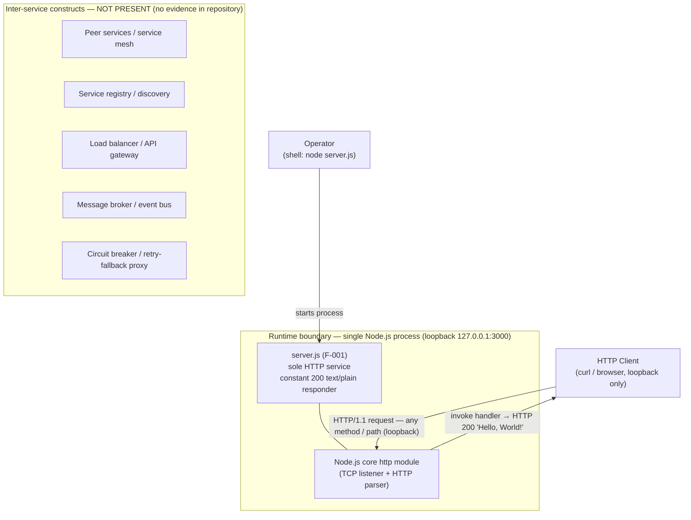

*Diagram 6.1.1-A — Service interaction topology: one runtime service (F-001) with its two clients, alongside the inter-service constructs that are deliberately absent.*

**How this section proceeds.** Although the top-level determination is "not applicable," the remaining sub-sections do not simply stop there. To make the assessment auditable, §6.1.2 (Service Components), §6.1.3 (Scalability Design), and §6.1.4 (Resilience Patterns) each walk through the specific concerns the prompt enumerates and record, with evidence, why each is not applicable to a single-process, zero-dependency, loopback-bound fixture. This mirrors the document's established practice (see §5.4) of stating plainly what exists and what does not so that readers do not assume production-grade, multi-service capabilities that are not present.


### 6.1.2 Service Components Analysis (Not Applicable)

Every concern in the prompt's **Service Components** category presupposes two or more cooperating services. The runtime here is a single service, so each concern resolves to "not applicable." The table records the specific evidence, and the notes beneath it explain the reasoning.

| Service-Components Concern | Applicability | Observed State and Evidence |
|---|---|---|
| Service boundaries & responsibilities | Not applicable — one service | `server.js` (F-001) owns all runtime behavior; no decomposition (§5.1.2, §5.2.1) |
| Inter-service communication patterns | Not applicable | Handler makes no outbound calls; only inbound loopback HTTP/1.1 request/response (§5.1.3) |
| Service discovery mechanisms | Not applicable | Host/port hard-coded in `server.js` (lines 3–4); no registry, DNS-SD, Consul, or Eureka |
| Load balancing strategy | Not applicable | Single instance; no load balancer or reverse proxy; loopback binding blocks cross-host traffic (§5.2.1) |
| Circuit breaker patterns | Not applicable | Zero dependencies (`package-lock.json`); no breaker library and no downstream dependency to protect |
| Retry & fallback mechanisms | Not applicable | No retry/backoff/fallback; no `try`/`catch` or `'error'` listeners; constant response path (§5.4.2) |

**Service boundaries and responsibilities.** There is a single runtime boundary — one Node.js process — inside which one component, `server.js` (F-001), holds every responsibility: create the HTTP server, bind and listen on `127.0.0.1:3000`, return a constant `200` `text/plain` `Hello, World!` for all methods and paths, and log the listening URL once at startup (mapped to requirements F-001-RQ-001 through F-001-RQ-004 in §5.2.1). No responsibility is delegated to a separate service. The `LoginTest.java` stub (F-004) is *not* a service: it is a non-compilable placeholder with a dangling `Web` token, has no runtime, and is not linked to the Node process by any build (§5.2.2).

**Inter-service communication patterns.** No service-to-service communication occurs. The only runtime exchange is a synchronous inbound HTTP/1.1 request/response over loopback TCP, initiated by a local client; the handler ignores the request object and performs no outbound network I/O, so there are no synchronous service calls, no asynchronous messaging, no publish/subscribe events, no gRPC, and no shared-database integration between services (§5.1.3).

**Service discovery mechanisms.** None exist and none are needed. The single endpoint's location is fixed in source — `const hostname = '127.0.0.1'` and `const port = 3000` on lines 3–4 of `server.js` — with no environment-variable override. There is no service registry, no DNS-based service discovery, and no discovery client (Consul, Eureka, etcd, or Kubernetes Services), because there is no second endpoint to locate.

**Load balancing strategy.** None is configured. The service runs as one process and is fronted by no load balancer or reverse proxy (§5.2.1). Two design facts make load balancing moot: the host and port are hard-coded, so a second instance on the same host would collide on port 3000 (`EADDRINUSE`), and the loopback binding (`127.0.0.1` rather than `0.0.0.0`) prevents distributing traffic across hosts in the first place.

**Circuit breaker patterns.** None are present. Circuit breakers protect calls to downstream dependencies; this service has no downstream dependency to protect and pulls in no breaker library (the dependency-free `package-lock.json` rules out packages such as Opossum or Cockatiel). The request path is a constant synchronous write that cannot fail in a way a breaker would guard.

**Retry and fallback mechanisms.** None exist. The code contains no retry, backoff, or fallback logic, and no `try`/`catch` or `'error'` listeners (§5.4.2). On a startup bind failure (for example, `EADDRINUSE`), the process exits rather than retrying or falling back to another port; on the request path, the handler always returns `200`, so there is no failure condition to fall back from.


### 6.1.3 Scalability Design Analysis (Not Applicable)

No scalability design is implemented. As documented in §5.2.1, the service is **one single-threaded Node.js process**; because its handler is stateless and performs no blocking I/O it is *in principle* trivially replicable, but **no scaling mechanism is configured**, and two design choices actively prevent horizontal scaling. The table summarizes each Scalability concern; the notes explain the reasoning.

| Scalability Concern | Applicability | Observed State and Evidence |
|---|---|---|
| Horizontal scaling | Not configured / blocked | No `cluster`/`worker_threads`, no load balancer; hardcoded port + loopback bind prevent multi-instance/multi-host (§5.2.1) |
| Vertical scaling | Implicit only | Bounded by the single host and event loop; no tuning or resource config (§5.2.1) |
| Auto-scaling triggers & rules | Not applicable | No orchestrator/autoscaler and no metrics to trigger on (§3.6.3, §5.4.1) |
| Resource allocation strategy | Not applicable | No CPU/memory requests or limits; default Node/OS resources; no `engines` pin (§3.6.1) |
| Performance optimization | Not applicable | No cache/pool/compression/keep-alive tuning; constant synchronous write (§5.1.3, §5.4.4) |
| Capacity planning | Not applicable | No throughput target, capacity plan, benchmark, or load test (§5.4.4, §1.2.3) |

The diagram contrasts the actual single-instance posture with the horizontal-scaling infrastructure that would be required but is not configured, and it labels the two constraints that block replication.

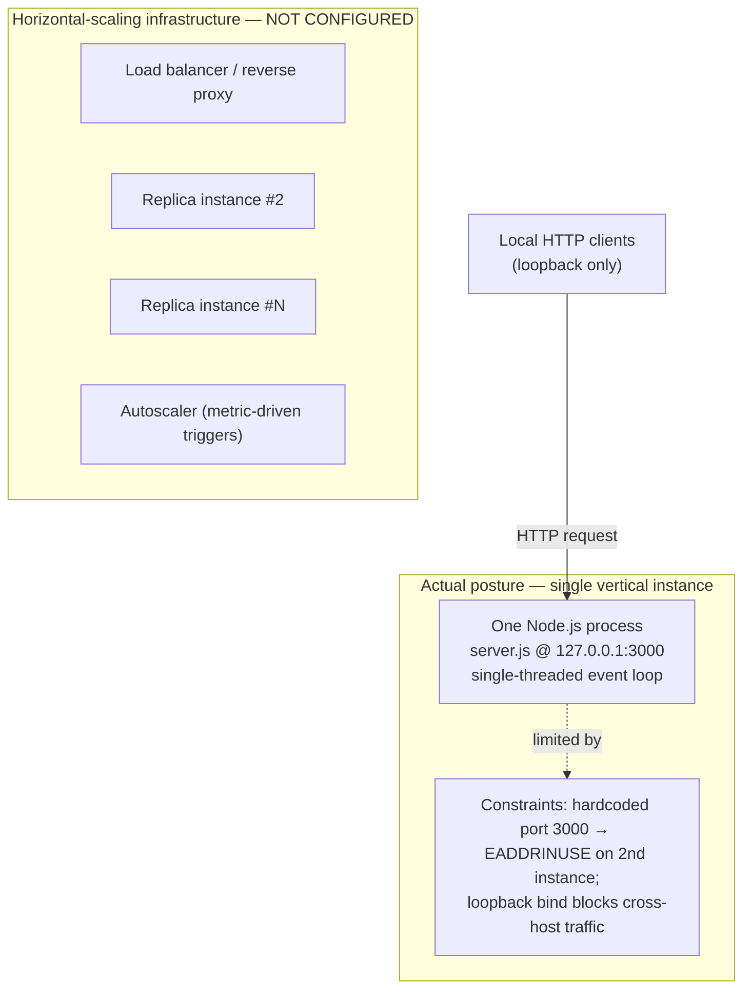

*Diagram 6.1.3-A — Scalability architecture: the actual single vertical instance and its scaling constraints, alongside the horizontal-scaling components that are not configured.*

**Horizontal and vertical scaling approach.** The runnable component is a single process on the Node.js event loop. It uses neither the Node `cluster` module nor `worker_threads`, so it does not exploit multiple CPU cores, and it is fronted by no load balancer or reverse proxy. Effective scaling is therefore vertical only — limited by the capacity of the single host and its event loop — while horizontal scaling is blocked by the hard-coded host/port (a second instance on the same host collides on port 3000 with `EADDRINUSE`) and by the loopback binding, which prevents distributing traffic across hosts (§5.2.1).

**Auto-scaling triggers and rules.** None exist. Auto-scaling requires an orchestrator and a metrics feedback loop; the repository has no container or orchestrator (§3.6.3) and no monitoring, metrics, or health endpoint to trigger on (§5.4.1). Consequently there are no scale-up/scale-down thresholds, target utilizations, minimum/maximum replica counts, or cooldown rules.

**Resource allocation strategy.** None is declared. The process runs with whatever CPU and memory the host and Node.js defaults provide; there are no container CPU/memory requests or limits (no container exists), no cgroup constraints, no V8 heap-tuning flags, and no `engines` field pinning a Node.js version (§3.6.1, §5.2.1).

**Performance optimization techniques.** None are implemented, and none are required by a constant-response endpoint. There is no in-process or distributed caching, no connection pooling, no response compression, no HTTP keep-alive or socket tuning, and no HTTP cache headers such as `Cache-Control` or `ETag` (§5.1.3). Architecturally, each request is a single small synchronous write with no I/O or computation, so per-request work is minimal and bounded — an observation about the code path rather than a committed performance target (§5.4.4).

**Capacity planning guidelines.** None exist. No throughput target, concurrency limit, capacity forecast, benchmark, or load test is defined anywhere in the repository (§5.4.4, §1.2.3). Given the loopback-only exposure and the README "Do not touch!" stability mandate, the fixture is not intended to be sized or grown, so no capacity-planning guidance is maintained.


### 6.1.4 Resilience Patterns Analysis (Not Applicable)

No engineered resilience patterns are present. Consistent with §5.4.2 and §5.4.5, the single process is a single point of failure whose only recovery path is a manual restart. The table summarizes each Resilience concern; the notes and diagram explain the reasoning and the manual recovery loop.

| Resilience Concern | Applicability | Observed State and Evidence |
|---|---|---|
| Fault tolerance mechanisms | Not applicable | No `try`/`catch` or `'error'` listeners; bind failure → uncaught exception → process exits (§5.4.2) |
| Disaster recovery procedures | Manual only | No RPO/RTO or automation; re-run `node server.js`; Git = source of truth, commit `f60b533` (§5.4.5) |
| Data redundancy approach | Not applicable | No dynamic state/DB/cache; only static Git-versioned files; nothing to replicate at runtime (§5.1.3) |
| Failover configurations | Not applicable | One process/host; no standby, supervisor, health check, or self-healing (§5.2.1, §5.4.5) |
| Service degradation policies | Not applicable | No graceful degradation, fallback, load-shedding, or rate limiting; fully up or fully down (§5.4.2) |

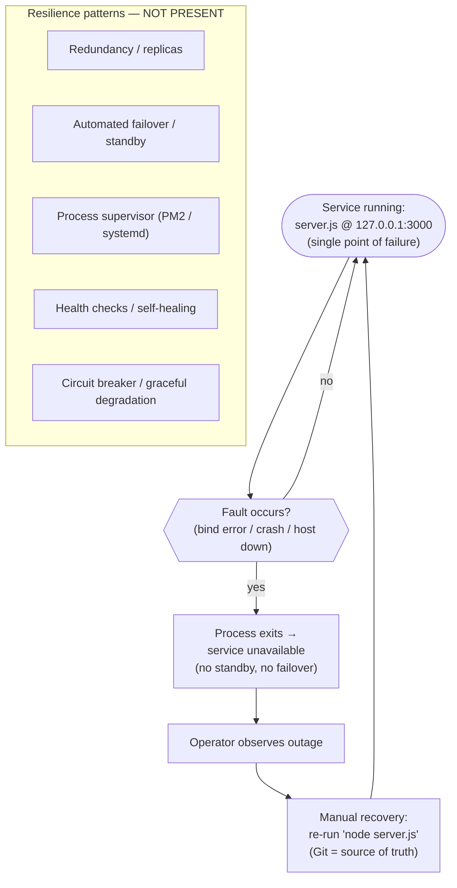

*Diagram 6.1.4-A — Resilience posture: the single-point-of-failure runtime with its manual recovery loop, alongside the resilience patterns that are not present.*

**Fault tolerance mechanisms.** None exist. `server.js` registers no `try`/`catch` blocks and no `'error'` event listeners on the server, request, response, or socket (verified across the source in §5.4.2). A startup bind failure (for example, `EADDRINUSE`) becomes an uncaught exception and the process terminates; there is no fault isolation, bulkhead, timeout, or supervising layer to contain it. The request path is a constant synchronous write that raises no application error, so no runtime fault is tolerated because none is anticipated.

**Disaster recovery procedures.** Recovery is entirely manual, with no formal RPO/RTO defined (§5.4.5). If the process exits, an operator restores service by re-running `node server.js`; because the source of truth is Git (a single commit, `f60b533` "Add files via upload"), the entire artifact set is recoverable by re-cloning the repository. There is no process supervisor (PM2/systemd), no restart policy, and no container or Kubernetes self-healing to automate this.

**Data redundancy approach.** Not applicable, because there is no dynamic runtime state to make redundant. The service uses no database, object store, or cache, and its response body is a compile-time constant reconstructed in memory at start (§5.1.3, §5.2.1). The only durable data is the static Git-versioned files; their "redundancy" is ordinary Git replication (clones and remotes), not a runtime data-replication or backup mechanism, and the large binaries are tracked without Git LFS (§5.4.5).

**Failover configurations.** None are configured. The service is one process on one host with no standby instance, no active-passive or active-active pairing, no health-check-driven failover, and no load balancer to reroute traffic (§5.2.1, §5.4.5). Any failure therefore results in downtime until the manual restart described above.

**Service degradation policies.** None exist. There is no graceful-degradation path, no fallback response, no feature flag, no load-shedding, and no rate limiting; the service is either fully available — returning the constant `200` `text/plain` `Hello, World!` — or entirely unavailable when the process is not running (§5.4.2). Because the handler performs no optional, downstream, or resource-intensive work, there is no functionality that could be selectively shed to preserve a degraded-but-serving mode.


### 6.1.5 References

**Repository artifacts examined for this section**

- `server.js` — Established the sole runtime component: a single-process HTTP server using only the Node.js built-in `http` module, hard-coded to loopback `127.0.0.1:3000` (lines 3–4), returning a constant `200` `text/plain` response, with no routing, no outbound calls, no `try`/`catch`, and no `'error'` listeners.
- `package.json` — Confirmed a zero-dependency package (`hello_world@1.0.0`, MIT) with no `dependencies` and no `engines` field, and a `test` script that intentionally fails.
- `package-lock.json` — Confirmed lockfile version 3 pinning only the root package, i.e., zero external libraries (no service-mesh, message-broker, circuit-breaker, or retry client).
- `LoginTest.java` — Confirmed a non-compilable Java stub (dangling `Web` token), not a runtime service and not linked to the Node process by any build.
- `README.md` — Established the project's purpose and the "Do not touch!" stability mandate that frames the fixture as intentionally minimal.
- `industry.csv` — Confirmed a static, non-runtime reference dataset, unreferenced by any executing code.
- Repository root (`/`, flat — no subdirectories) — Terminal inspection confirmed the absence of any orchestration or service infrastructure (no `Dockerfile`, `docker-compose`, Kubernetes/Helm, Terraform, `serverless`, `Procfile`, PM2 `ecosystem.config`, systemd `.service`, or `.env` files).

**Cross-referenced Technical Specification sections**

- `1.2 System Overview` (§1.2.3) — Confirmed that no KPIs, SLAs, or performance targets are defined.
- `3.6 Development & Deployment` (§3.6.1, §3.6.3, §3.6.4) — Confirmed no build system, no containerization, and no CI/CD; deployment is a manual single-step operation with the loopback endpoint as the only runtime integration point.
- `5.1 High-Level Architecture` (§5.1.1–§5.1.4) — Provided the "nano-monolith" architecture-style characterization, the single-runtime-component inventory, the data-flow description, the external-integration points, and the absence of any SLA.
- `5.2 Component Details` (§5.2.1) — Provided the HTTP-server scaling considerations: single-threaded process, no `cluster`/`worker_threads`/supervisor/orchestrator/load balancer, `EADDRINUSE` collision on a second instance, and vertical-only scaling.
- `5.4 Cross-Cutting Concerns` (§5.4.1, §5.4.2, §5.4.4, §5.4.5) — Provided the evidence for absent monitoring, application-level error handling (bind failure → process exit), performance targets/SLAs, and automated disaster recovery (manual restart; Git as source of truth).


## 6.2 Database Design

### 6.2.1 Applicability Assessment and Rationale

**Database Design is not applicable to this system.**

The `hao-backprop-test` repository implements no database and performs no persistent-storage interaction of any kind. As established in §3.5, the system uses **no relational or NoSQL database, no secondary/analytics store, no caching layer, and no object/blob storage service**; §1.3.2 explicitly places "Persistence and databases" out of scope, noting that "No database clients, ORM, or storage code present." The entire runnable system is the 15-line `server.js` — a single-process, zero-dependency Node.js HTTP service (the "nano-monolith" of §5.1.1) that returns a compile-time constant and never reads or writes any data. There is therefore no schema to model, no entity to relate, no index or constraint to declare, and no migration, replication, or backup pipeline to describe.

This determination is grounded in the following observations, each verified directly against the repository:

| Prerequisite for a database design | Present in `hao-backprop-test`? | Evidence |
|---|---|---|
| Database engine (relational or NoSQL) | No | No engine configured; `package.json` declares no `dependencies`; `package-lock.json` (lockfile v3) pins only the root package |
| Database driver / ORM / query builder | No | No MongoDB/PostgreSQL/MySQL/SQLite client or ORM; a keyword scan of all source files matched none |
| Schema / model / migration definitions | No | No `.sql`, migration, model, or schema files exist among the 11 tracked files |
| Data-access code (connect / query / transaction) | No | `server.js` opens no connection and issues no query; the request object is ignored (§5.1.3) |
| Connection string / credentials / datastore config | No | No `.env` or config files; host and port are hard-coded in `server.js` (lines 3–4) |
| Caching layer (Redis / Memcached / in-process) | No | No cache client; the response body is a constant computed with no I/O (§3.5.3) |

**The runtime "data path" reality.** The only data that exists at runtime is the literal string `Hello, World!\n`, embedded in `server.js` and reconstructed in memory on each start; there is no session, no write path, and no state that survives the process (§3.5.2). The single structured artifact in the repository, `industry.csv` (one column, 43 rows), and the binary assets (`100Pages.pdf`, `demo.jpg`, `sample.doc`) are **static, version-controlled files that no executing code reads** (§1.3.2, §2.4.3). The diagram below traces the actual runtime path and labels the persistent-data tier and static-file tier that a conventional database design would populate but that carry no runtime data flow here.

```mermaid
flowchart LR
    Operator["Operator<br/>(shell: node server.js)"]
    Client["HTTP Client<br/>(loopback 127.0.0.1:3000)"]

    subgraph Runtime["Runtime data path — single Node.js process"]
        Handler["server.js handler<br/>(ignores request input)"]
        Const["In-memory constant<br/>200 text/plain 'Hello, World!'"]
        Handler --> Const
    end

    subgraph Persist["Persistent data tier — NONE PRESENT (no DB / cache / object store)"]
        DB["Relational / NoSQL database"]
        Cache["Cache layer (Redis / Memcached)"]
        Obj["Object / blob storage service"]
    end

    subgraph Static["Static Git-versioned files — NOT read at runtime"]
        CSV["industry.csv (1 column, 43 rows)"]
        Bin["100Pages.pdf / demo.jpg / sample.doc"]
    end

    Operator -->|"starts process"| Handler
    Client -->|"HTTP request (any method / path)"| Handler
    Const -->|"HTTP 200 response"| Client
```

*Diagram 6.2.1-A — Runtime data path: a stateless request/response cycle over a compile-time constant, alongside the persistent-data tier and static-file tier that hold no runtime data flow. No edge crosses into the "Persistent data tier" or "Static Git-versioned files" boxes because the handler performs no read or write against either.*

**How this section proceeds.** Although the top-level determination is "not applicable," the remaining sub-sections do not simply stop there. To make the assessment auditable — and to answer each area the prompt enumerates — §6.2.2 (Schema Design), §6.2.3 (Data Management), §6.2.4 (Compliance Considerations), and §6.2.5 (Performance Optimization) each walk through their specific concerns and record, with evidence, why every concern is not applicable to a zero-dependency, stateless, loopback-bound fixture. This mirrors the document's established practice (see §3.5 and §6.1) of stating plainly what exists and what does not, so that readers do not assume persistence, indexing, replication, or caching capabilities that are not present.

### 6.2.2 Schema Design Analysis (Not Applicable)

Every concern in the prompt's **Schema Design** category presupposes a database with persisted entities. The system has none, so each concern resolves to "not applicable." The table records the specific evidence; the notes and diagrams beneath it explain the reasoning and document the only structured artifact that exists.

| Schema Design concern | Applicability | Observed state and evidence |
|---|---|---|
| Entity relationships | Not applicable | No persisted entities; nothing to relate. `server.js` defines no data model (§5.1.3) |
| Data models & structures | Not applicable | The only structure is the flat, single-column `industry.csv`; no runtime data model |
| Indexing strategy | Not applicable | No database or query engine; no index definitions exist anywhere |
| Partitioning approach | Not applicable | No tables or collections to partition, shard, or range-split |
| Replication configuration | Not applicable | No datastore to replicate; only Git distributes the static files (§5.4.5) |
| Backup architecture | Not applicable | No datastore to back up; recovery is a Git re-clone of commit `f60b533` (§5.4.5) |

**Entity relationships and data models.** There are no entities and therefore no relationships — no tables, collections, documents, or foreign keys. The runtime handler is stateless: it ignores the request and emits a constant string, so it constructs no in-memory object model that could correspond to a persisted schema (§5.1.3). The single structured dataset in the repository is `industry.csv`, a flat, single-column controlled vocabulary. It is edited by hand and committed to Git; **no executing code loads or parses it** (§2.4.3), so it is a static reference file rather than a database entity. Its structure is documented below for completeness.

| Attribute | Data shape | Notes |
|---|---|---|
| `Industry` | Free-text category label (one column) | Header row plus 43 values (e.g., `Accounting/Finance` … `Transportation/Logistics`, `Other`) |

The following ER diagram represents that sole structured artifact in ERD notation. It is included only to document the one structured data shape that exists; it is **not** a database table and has no key, index, or relationship.

```mermaid
erDiagram
    INDUSTRY_CSV_FILE {
        string Industry "header + 43 category values; no key; static; not loaded at runtime"
    }
```

*Diagram 6.2.2-A — ER representation of the only structured dataset (`industry.csv`). A single flat entity with one attribute, no primary key, no foreign key, and no relationship — a static Git-versioned file, not a runtime database entity.*

**Indexes and constraints.** The prompt requires that all indexes and constraints be documented; there are **none**, because no database, schema, or validation layer exists. The inventory below records this explicitly.

| Schema element | Present? | Detail |
|---|---|---|
| Tables / collections | None | No database engine or datastore is configured |
| Primary keys | None | No entities exist to key |
| Foreign keys / relationships | None | No relational model; no joins or references |
| Indexes (clustered / secondary / unique) | None | No query engine to serve; no index definitions anywhere |
| Constraints (NOT NULL / UNIQUE / CHECK / default) | None | No schema or validation layer; `industry.csv` enforces no constraints |

**Partitioning approach.** None exists and none is applicable. Partitioning, sharding, and range/hash distribution presuppose a table or collection large enough to divide across storage units; there is no datastore here, and the only data file (`industry.csv`, 43 rows) is a single small artifact tracked whole in Git.

**Replication configuration.** No runtime data replication is configured, because there is no datastore whose contents could be replicated. The only "replication" that exists is ordinary **Git distribution** of the version-controlled files — clones and remotes of the repository — which is a source-control mechanism, not a runtime data-replication or high-availability feature (§5.4.5). The diagram contrasts this Git-level file distribution with the primary/replica database topology that a conventional design would configure but that is absent here.

```mermaid
flowchart TB
    Author["Author / Operator<br/>(edits static files, git commit)"]

    subgraph GitRepl["Only replication present — Git distribution of static files"]
        Origin["Git remote 'origin'<br/>(single commit f60b533)"]
        CloneA["Working clone A"]
        CloneB["Working clone B"]
        Origin --> CloneA
        Origin --> CloneB
    end

    subgraph DbRepl["Runtime database replication — NOT CONFIGURED"]
        Primary["Primary DB node"]
        Replica1["Read replica #1"]
        Replica2["Read replica #2"]
    end

    Author -->|"git push"| Origin
```

*Diagram 6.2.2-B — Replication architecture: the only replication present is Git distribution of static files (clones/remotes of commit `f60b533`), shown alongside the runtime primary/replica database topology that is not configured. No edges connect the "NOT CONFIGURED" tier because no such nodes exist.*

**Backup architecture.** There is no datastore to back up, so no database backup pipeline — full/incremental snapshots, point-in-time recovery, WAL archiving, or scheduled dumps — exists. The durable artifacts are the Git-versioned files, whose recovery mechanism is re-cloning the repository (source of truth: the single commit `f60b533`, "Add files via upload"); the large binaries are tracked directly in Git without Git LFS (§3.5.4, §5.4.5). This is ordinary source-control durability, not a database backup architecture.

### 6.2.3 Data Management Analysis (Not Applicable)

The prompt's **Data Management** concerns presuppose stored data whose lifecycle must be governed. This system stores no runtime data; its only durable artifacts are static, version-controlled files. Each concern therefore resolves to "not applicable," with the single nuance that ordinary Git source control — not a database mechanism — is what versions the static files. The table records the evidence; the notes explain the reasoning.

| Data Management concern | Applicability | Observed state and evidence |
|---|---|---|
| Migration procedures | Not applicable | No schema to migrate; no migration tool or files (no Flyway/Liquibase/knex/Prisma/Alembic) |
| Versioning strategy | Git / npm only — not a DB | No schema/data versioning; static files versioned by Git (commit `f60b533`); package pinned at `1.0.0` |
| Archival policies | Not applicable | No growing or time-series dataset; nothing accumulates that could be aged out or archived |
| Data storage & retrieval | Static files only | The only "storage" is Git-committed files; retrieval is editorial, not a runtime query (§3.5.2, §2.4.3) |
| Caching policies | Not applicable | No cache client and no HTTP cache headers; the response is a constant computed with no I/O (§3.5.3) |

**Migration procedures.** None exist and none are applicable. Schema migrations require a schema; there is none, and the repository contains no migration framework or migration files of any kind (no Flyway, Liquibase, knex, Sequelize, Prisma, TypeORM, or Alembic artifacts were found in the keyword scan of §6.2.1). There is likewise no data-seeding or data-transformation step in the runtime path.

**Versioning strategy.** The only versioning present is **ordinary source control and package versioning**, neither of which is a database mechanism. The static files are versioned by Git — the repository has a single commit, `f60b533` ("Add files via upload"), so there is no schema-evolution history to track (§5.4.5). The npm package identity is pinned at `hello_world@1.0.0` in `package.json` and `package-lock.json` (lockfile v3). No data-format version, schema version, or record-level version column exists.

**Archival policies.** None exist and none are applicable. Archival tiers, retention windows, and cold-storage rollover apply to datasets that accumulate over time; this system produces no runtime data, and the static `industry.csv` (43 rows) and binary assets are fixed-size committed files with no growth path (§1.3.1). There is nothing to move to an archive.

**Data storage and retrieval mechanisms.** The persistence model is **static, version-controlled files rather than a runtime datastore** (§3.5.2). At runtime there is no read path: `server.js` retrieves nothing and returns the compile-time constant `Hello, World!\n`. The `industry.csv` vocabulary and the binary documents are "retrieved" only editorially — by a human or an external process opening the committed file — because no executing code references them (§2.4.3). There is no query API, no ORM read/write, and no file-system read in the request handler.

**Caching policies.** None exist and none are needed. There is no distributed cache client (Redis/Memcached) and no in-process/response cache, because the response is a fixed constant produced with no upstream I/O whose results could be cached (§3.5.3). The handler sets only the `Content-Type` header; it emits no `Cache-Control`, `ETag`, or `Expires` header, so no HTTP-layer caching policy is defined either (§5.2.1).

### 6.2.4 Compliance Considerations Analysis (Not Applicable)

The prompt's **Compliance Considerations** presuppose a datastore that holds data subject to retention, privacy, audit, and access-control governance. This system holds no such data: it stores nothing at runtime, collects no personal information, and defines no data-store access model. No regulatory or compliance requirement is declared anywhere in the repository (consistent with §2.2, which records compliance requirements as none). Each concern is assessed below with its closest honest analog, none of which is a database compliance control.

| Compliance concern | Applicability | Observed state and evidence |
|---|---|---|
| Data retention rules | Not applicable | No data is collected or stored; `server.js` persists nothing, so there is nothing to retain or purge |
| Backup & fault tolerance | Manual / Git only | No datastore to back up; single process is a SPOF; recovery is a manual restart / Git re-clone (§5.4.5) |
| Privacy controls | Not applicable | No PII collected or stored; `industry.csv` is a public taxonomy with no personal data (§3.5.4) |
| Audit mechanisms | None | No audit or access log; only one startup `console.log`; requests are not logged (§5.4.1) |
| Access controls | None | No authN/authZ; loopback-only bind; `LoginTest.java` is an empty, non-compilable stub (§1.3.2) |

**Data retention rules.** None exist and none are applicable. Retention windows, purge schedules, and right-to-erasure workflows govern stored records; this system stores no records. The runtime handler holds no state beyond the in-memory constant, and no dataset accumulates that would fall under a retention policy.

**Backup and fault-tolerance policies.** There is no database backup because there is no database (§6.2.2, Backup architecture). For fault tolerance, the runtime is a single Node.js process that constitutes a single point of failure with no `try`/`catch` or `'error'` listeners; a failure exits the process, and the only recovery is a manual restart (`node server.js`), with Git as the source of truth for the artifacts (§5.4.2, §5.4.5). This is operational recovery of a stateless fixture, not a data backup-and-restore or fault-tolerance guarantee for stored data.

**Privacy controls.** None are required, because no private or personal data is present. All stored data is read-only, non-sensitive, and version-controlled: `industry.csv` is a public industry taxonomy containing no PII, and the binaries (`100Pages.pdf`, `demo.jpg`, `sample.doc`) are static, non-executable sample documents (§3.5.4). There are no user accounts or profiles, no encryption-at-rest configuration (no datastore to encrypt), and no data-classification or masking logic — none is needed given the absence of sensitive data.

**Audit mechanisms.** No data-audit mechanism exists. There is no audit trail, no access log, and no change-data-capture; the only runtime output is a single `console.log` emitted once at startup, and individual requests are not logged (§5.4.1). The only change record for the stored files is the Git commit history — a single commit, `f60b533` — which is source-control provenance, not a database audit facility.

**Access controls.** There are no database access controls, because there is no database — no users, roles, grants, row-level security, or connection credentials to manage. At the application layer there is no authentication or authorization either; despite its name, `LoginTest.java` is an empty, non-compilable stub and implements no login logic (§1.3.2). The only access boundary that exists is the network binding: the server listens on the loopback interface `127.0.0.1:3000`, which limits reachability to the local host (§5.4.3) — a transport-level exposure limit, not a data-store access-control model.

### 6.2.5 Performance Optimization Analysis (Not Applicable)

Every technique in the prompt's **Performance Optimization** category tunes the behavior of a database or its access layer. With no database, no query path, and no datastore connection, each technique has nothing to act upon and resolves to "not applicable." Consistent with §5.2.1 and §6.1.3, the constant-response handler performs a single small synchronous write with no I/O, so there is no data-access hot path to optimize. The table records the evidence; the notes explain the reasoning.

| Performance Optimization concern | Applicability | Observed state and evidence |
|---|---|---|
| Query optimization patterns | Not applicable | No database and no queries; no query planner, `EXPLAIN`, or index tuning to apply |
| Caching strategy | Not applicable | No cache client and no HTTP cache headers; constant response, no I/O to cache (§3.5.3) |
| Connection pooling | Not applicable | No datastore connections exist to pool; `server.js` opens no connection (§6.1.3) |
| Read/write splitting | Not applicable | No reads or writes to any datastore; no primary/replica to route between |
| Batch processing approach | Not applicable | No batch/ETL/bulk jobs and no scheduler; a single synchronous request path (§5.1.3) |

**Query optimization patterns.** None exist and none are applicable. There are no SQL or NoSQL queries, so there is no query planner to inspect, no `EXPLAIN`/`ANALYZE` to run, and no covering indexes, denormalization, or query rewriting to perform. The request handler issues no query of any kind (§5.1.3).

**Caching strategy.** None is implemented, and none is required. As documented in §6.2.3 and §3.5.3, there is no distributed cache (Redis/Memcached), no in-process/result cache, and no HTTP cache directive (`Cache-Control`/`ETag`) — the response is a compile-time constant produced with no upstream I/O whose results could be cached.

**Connection pooling.** None exists. Connection pools (for example, a PostgreSQL `Pool`, a `mysql2` pool, or a Mongoose connection) exist to reuse expensive datastore connections; this system opens no datastore connection at all, so there is no pool to size, no idle-timeout or max-connections to tune, and no pool-exhaustion risk to manage (§6.1.3).

**Read/write splitting.** None exists and none is applicable. Splitting reads onto replicas while directing writes to a primary requires both a replicated datastore and a routing layer; there is neither. The handler performs no datastore read or write, so there is nothing to route.

**Batch processing approach.** None exists. There is no batch job, ETL pipeline, bulk insert/update, or scheduled/cron task, and no job scheduler or queue is present. The runtime handles each request as a single synchronous operation that writes the constant response and returns, with no accumulation or deferred processing of data (§5.1.3).

### 6.2.6 References

**Repository artifacts examined for this section**

- `server.js` — Confirmed the sole runtime component performs no data access: it uses only the Node.js built-in `http` module, opens no datastore connection, issues no query, reads no file, and returns a compile-time constant; it hard-codes the loopback host/port (lines 3–4) and sets only the `Content-Type` header (no cache headers).
- `package.json` — Confirmed a zero-dependency package (`hello_world@1.0.0`, MIT) with no `dependencies`/`devDependencies`, i.e., no database driver, ORM, migration tool, or cache client.
- `package-lock.json` — Confirmed lockfile version 3 pinning only the root package, i.e., zero external libraries (no persistence, caching, or connection-pool packages).
- `README.md` — Established the project's purpose as a backprop integration test fixture ("Do not touch!"), framing the repository as intentionally minimal.
- `industry.csv` — Confirmed the only structured dataset: a flat, single-column controlled vocabulary (`Industry` header plus 43 category rows) that is static, unreferenced by runtime code, and has no key, index, or constraint.
- `100Pages.pdf`, `demo.jpg`, `sample.doc` — Confirmed static binary assets tracked directly in Git (without Git LFS) and not read at runtime.
- `LoginTest.java` — Confirmed a non-compilable Java stub with no login/authentication or access-control logic (relevant to §6.2.4).
- Repository root (`/`, flat — no subdirectories) — Terminal inspection confirmed the absence of any database or persistence artifact: no `.sql`, migration, schema, model, `.db`/`.sqlite`, `knexfile`, `ormconfig`, or `.env` files, and no database/persistence keyword anywhere in the source; the Git history contains a single commit, `f60b533` ("Add files via upload").

**Cross-referenced Technical Specification sections**

- `1.3 Scope` (§1.3.1, §1.3.2) — Confirmed that "Persistence and databases" is explicitly out of scope and that the data domains contain "no dynamic, user-supplied, or persisted data."
- `2.2 Functional Requirements` — Confirmed that no compliance requirements are declared for the system.
- `2.4 Implementation Considerations` (§2.4.3) — Confirmed that `industry.csv` is not loaded or consumed by any executing code.
- `3.5 Databases & Storage` (§3.5.2, §3.5.3, §3.5.4) — Provided the authoritative determination that there is no database, cache, or object storage; that the persistence strategy is static Git-versioned files; and that all stored data is read-only and non-sensitive (no PII).
- `5.1 High-Level Architecture` (§5.1.1, §5.1.3) — Provided the "nano-monolith" characterization and the data-flow description in which the handler ignores the request and performs no data access.
- `5.2 Component Details` (§5.2.1) — Confirmed the absence of caching, connection pooling, and HTTP cache headers on the single-threaded server.
- `5.4 Cross-Cutting Concerns` (§5.4.1, §5.4.2, §5.4.3, §5.4.5) — Confirmed no request logging, no application error handling, loopback-only network exposure with no authN/authZ, and manual disaster recovery with Git as the source of truth.
- `6.1 Core Services Architecture` (§6.1.3) — Corroborated the absence of connection pooling and caching and established the sibling "not applicable" documentary pattern mirrored here.

## 6.3 Integration Architecture

### 6.3.1 Applicability Assessment and Rationale

**Integration Architecture is not applicable for this system** in the conventional sense: `hao-backprop-test` integrates with **no external systems or services at runtime**. It calls no outbound APIs, publishes to and consumes from no message brokers, depends on no third-party packages, and reads no configuration for any external endpoint.

The entire runnable system is the 15-line `server.js` — a single-process, event-driven HTTP service (the "nano-monolith" of §5.1.1) built directly on the Node.js standard-library `http` module (`require('http')` on line 1). It declares zero dependencies (`package.json` has no `dependencies` field; `package-lock.json`, lockfile version 3, pins only the root package), makes no outbound network calls, and binds to the loopback interface `127.0.0.1:3000` (lines 3–4). §3.4 records that the system "integrates with no external or third-party services of any kind," and §1.3.2 explicitly lists "External / third-party integrations, message queues" as out of scope.

**The one interface that does exist.** The system exposes exactly one inbound surface: a loopback HTTP endpoint that returns a constant `200` `text/plain` `Hello, World!` for every request, ignoring the request object entirely (§5.1.3). This is not a designed, integrable business API — it performs no routing, authentication, or content negotiation — but because a reader of an Integration Architecture section legitimately expects any exposed interface to be documented, §6.3.2 specifies that endpoint's protocol in full and records which API-design concerns are absent.

**The only cross-boundary interaction.** Beyond the loopback endpoint, the sole way another actor interacts with the repository is *artifact-level*: an external "backprop" process reads the tracked files offline (per `README.md` and §1.2.1). This is a read-only, file-system ingestion — not a runtime service integration, network protocol, or API call — and it is included below only for completeness.

The determination is grounded in the following observations, each verified directly against the repository and a terminal scan of every tracked text file:

| Prerequisite for an Integration Architecture | Present? | Evidence |
|---|---|---|
| Outbound calls to external services / APIs | No | `server.js` imports only `http`; no HTTP client, SDK, or webhook; no external URLs (§3.4.1) |
| Message broker / queue / event bus / stream | No | Zero dependencies; no Kafka/RabbitMQ/AMQP/SQS/Redis/NATS client (§1.3.2) |
| API gateway / reverse proxy | No | No nginx/Kong/Envoy/Traefik config; one process bound to loopback |
| Third-party credentials / external endpoint config | No | No `.env`, no `process.env` usage; host and port hard-coded (§3.4) |
| Web/API framework exposing an integrable API | No | No Express/Fastify/Koa; only Node core `http`; handler ignores `req` (§5.1.1) |

**Integration context.** The diagram below shows the actual integration surface — one inbound loopback HTTP path and one offline artifact-read path — alongside the external-integration constructs that a networked system would normally contain but that are absent here.

```mermaid
flowchart TB
    Client["Local HTTP client<br/>(curl / browser, loopback only)"]
    Operator["Operator<br/>(shell: node server.js)"]
    Backprop["External backprop process<br/>(offline artifact consumer)"]

    subgraph Boundary["System boundary — single Node.js process (loopback 127.0.0.1:3000)"]
        Http["Node.js core http module<br/>TCP listener + HTTP/1.1 parser"]
        Handler["server.js handler (F-001)<br/>constant 200 text/plain responder"]
        Http --- Handler
    end

    subgraph Repo["Git working tree — static artifacts (read-only)"]
        Files["server.js / package.json / industry.csv<br/>LoginTest.java / PDF / JPEG / DOC / empty .txt"]
    end

    subgraph Absent["External integrations — NOT PRESENT (no evidence in repository)"]
        NA1["Third-party / partner APIs"]
        NA2["Message broker / event bus / stream"]
        NA3["API gateway / reverse proxy"]
        NA4["Identity provider (OAuth / OIDC)"]
        NA5["Cloud services / managed data stores"]
    end

    Operator -->|"starts process"| Handler
    Client -->|"HTTP/1.1 request — any method / path (loopback)"| Http
    Http -->|"HTTP 200 'Hello, World!'"| Client
    Backprop -->|"reads files (no runtime call)"| Files
```

*Diagram 6.3.1-A — Integration context: the single inbound loopback HTTP interface and the offline artifact-ingestion path, alongside the external integrations that are deliberately absent.*

**How this section proceeds.** Although the top-level determination is "not applicable," the remaining sub-sections do not stop there. §6.3.2 (API Design) fully specifies the one inbound HTTP interface and records which API-management concerns are unimplemented. §6.3.3 (Message Processing) and §6.3.4 (External Systems and Dependencies) each walk the specific concerns the prompt enumerates and record, with evidence, why each is not applicable to a single-process, zero-dependency, loopback-bound fixture — mirroring the document's established practice (see §6.1 and §6.2) of stating plainly what exists and what does not, so that readers do not assume production-grade integration capabilities that are not present.

### 6.3.2 API Design

The system exposes exactly one inbound API surface — the loopback HTTP endpoint served by `server.js`. It is **not** a designed application API: the handler ignores the request object entirely and returns a single constant response for every method and path (§5.1.3). This sub-section specifies that endpoint's protocol precisely and records, with evidence, that the higher-order API-design concerns — authentication, authorization, rate limiting, versioning, and formal documentation — are not implemented.

**Protocol specifications.** The endpoint speaks HTTP/1.1 over TCP via the Node.js built-in `http` module and is bound to the loopback address only. Every response is identical regardless of the request line, headers, or body. The endpoint contract is fully captured below.

| Property | Specification | Source |
|---|---|---|
| Base URL | `http://127.0.0.1:3000/` | `server.js` lines 3–4, 12 |
| Transport / protocol | HTTP/1.1 over TCP (Node core `http`) | `server.js` line 1, 6 |
| Network exposure | Loopback `127.0.0.1` only (not `0.0.0.0`) | `server.js` line 3 |
| Methods accepted | All methods, undifferentiated | `req` never inspected (line 6) |
| Path / routing | All paths → same handler | No router present |
| Request parsing | None (body/query/headers ignored) | Handler ignores `req` |
| Response status | `200` (constant) | `server.js` line 7 |
| Response `Content-Type` | `text/plain` | `server.js` line 8 |
| Response body | `Hello, World!\n` (constant) | `server.js` line 9 |
| TLS / HTTPS | None (plain HTTP) | No TLS server or certs |

**Authentication methods.** None. The server performs no authentication and treats every request identically — there are no API keys, bearer/JWT tokens, Basic auth, session cookies, or mutual TLS. §3.4.2 confirms there is no identity-provider client, and the `LoginTest.java` artifact, despite its name, is an empty non-compiling stub containing no authentication logic.

**Authorization framework.** None. There are no roles, scopes, access-control lists, or policy checks (no RBAC/ABAC). The handler branches on nothing — it ignores `req` — so every caller receives identical, unrestricted access to the single response. No authorization checkpoints exist on any code path (§4.2).

**Rate limiting strategy.** None. No rate-limiting or throttling middleware or library is present (the zero-dependency `package-lock.json` rules out packages such as `express-rate-limit`), and `server.js` implements no request counting, quotas, concurrency caps, or backpressure. Incoming connections are accepted subject only to the operating system and the Node.js event loop; there is no application-level limiter.

**Versioning approach.** None. The single endpoint is unversioned: there is no version in the path (for example, `/v1`), no version request/response header, and no media-type versioning. The `1.0.0` value in `package.json` is the npm **package** identity, not an API version, and no deprecation or version-negotiation policy exists.

**Documentation standards.** None. There is no OpenAPI/Swagger specification, API reference, JSON Schema, WSDL, or Postman collection anywhere in the repository (a terminal scan for `openapi`/`swagger` returned nothing). `README.md` documents only the project's purpose — "test project for backprop integration. Do not touch!" — not the endpoint; the endpoint is effectively self-describing by virtue of its single constant response.

The following table summarizes the six API-design concerns and their implementation status.

| API-Design Concern | Implemented? | Evidence |
|---|---|---|
| Protocol specification | Yes (documented above) | HTTP/1.1 loopback, constant `200` `text/plain` (`server.js`) |
| Authentication | No | No auth code; no identity client (§3.4.2) |
| Authorization | No | No roles/scopes/policy; handler ignores `req` |
| Rate limiting | No | Zero dependencies; no limiter or throttle in `server.js` |
| Versioning | No | No version path/header/media type; `1.0.0` is package identity |
| Documentation (OpenAPI/Swagger) | No | None present; `README.md` states purpose only |

**API architecture.** The diagram below contrasts the layers that are actually present — a Node core listener feeding a single constant-response handler — with the API-management layers a production API would typically place in front of the service, all of which are absent here.

```mermaid
flowchart LR
    Caller["Local HTTP client<br/>(loopback only)"]

    subgraph Present["Actual API surface — server.js @ 127.0.0.1:3000"]
        direction TB
        Listener["Node core http listener<br/>HTTP/1.1 over TCP"]
        Handler["Single request handler<br/>ignores req → constant 200 text/plain"]
        Listener --> Handler
    end

    subgraph Missing["Typical API-management layers — NOT PRESENT"]
        direction TB
        GW["API gateway / router"]
        AuthN["Authentication (API key / OAuth / JWT)"]
        AuthZ["Authorization (RBAC / scopes)"]
        RL["Rate limiter / quota"]
        Ver["Versioning (/v1, media types)"]
        Doc["OpenAPI / Swagger contract"]
    end

    Caller -->|"request (any method / path)"| Listener
    Handler -->|"HTTP 200 'Hello, World!'"| Caller
```

*Diagram 6.3.2-A — API architecture: the actual two-element request path (Node `http` listener → constant-response handler) alongside the API-management layers that are not present.*

**Key request/response flow.** The sequence below traces the only runtime interaction the API supports. It highlights that the request object is never examined — there is no routing, authentication, parsing, or validation between receipt and the constant reply.

```mermaid
sequenceDiagram
    autonumber
    actor Client as Local HTTP client
    participant Http as Node core http (127.0.0.1:3000)
    participant Handler as server.js handler

    Client->>Http: HTTP/1.1 request (any method, any path)
    Http->>Handler: invoke callback(req, res)
    Note over Handler: req is ignored — no routing,<br/>auth, parsing, or validation
    Handler->>Handler: res.statusCode = 200
    Handler->>Handler: res.setHeader('Content-Type', 'text/plain')
    Handler-->>Http: res.end('Hello, World!\n')
    Http-->>Client: HTTP 200 text/plain 'Hello, World!'
```

*Diagram 6.3.2-B — Request/response sequence for the sole inbound endpoint: a constant reply produced without inspecting the request.*

### 6.3.3 Message Processing Analysis (Not Applicable)

No message-oriented processing exists in this system. There is no message broker, queue, event bus, stream processor, or batch pipeline. The only runtime "message" is a single synchronous HTTP request/response handled inline on the Node.js event loop; nothing is enqueued, published, streamed, or scheduled. The table records each concern the prompt enumerates; the notes beneath explain the reasoning.

| Message-Processing Concern | Applicability | Observed State and Evidence |
|---|---|---|
| Event processing patterns | Not applicable | One synchronous handler callback; no domain events, no pub/sub (§5.1.3) |
| Message queue architecture | Not applicable | Zero dependencies; no Kafka/RabbitMQ/AMQP/SQS/Redis/NATS/MQTT client (§1.3.2) |
| Stream processing design | Not applicable | No streaming engine; body emitted in one `res.end()`; no windowing/backpressure |
| Batch processing flows | Not applicable | No scheduler/cron/job runner; `industry.csv` unread at runtime (§1.3.2) |
| Error handling strategy | Not applicable (no messaging to fail) | No DLQ/ack/retry; no `try`/`catch` or `'error'` listener (§4.3.2) |

**Event processing patterns.** None at the application level. The single callback passed to `http.createServer` is invoked once per inbound request; that is the reactor/callback pattern of the transport layer, not application-level event processing. There are no `EventEmitter`-based domain events, no command/event handlers, no publish/subscribe topics, and no event-sourcing or CQRS constructs — the handler performs a single synchronous action and returns.

**Message queue architecture.** None. There is no message broker or queue of any kind, and the zero-dependency `package-lock.json` rules out client libraries such as `kafkajs`, `amqplib` (RabbitMQ), the AWS SQS/SNS SDK, `redis`/`ioredis`, `nats`, `mqtt`, or `bullmq`. Consequently there are no producers or consumers, no topics, exchanges, or partitions, and no delivery-guarantee semantics (at-most-once / at-least-once / exactly-once) to configure.

**Stream processing design.** None. No stream-processing framework (for example, Kafka Streams, Flink, or Spark) is present, and the handler uses no Node.js stream pipeline beyond writing the constant body in a single `res.end()` call. There is no windowing, aggregation, joining, or backpressure handling because there is no data stream to process.

**Batch processing flows.** None. There is no scheduler, cron job, task queue, or ETL/import pipeline. The static `industry.csv` is not loaded or processed by any runtime code (§1.3.2). The external "backprop" process may read the repository's files in bulk offline, but that occurs outside the running system and uses read-only file-system access rather than any message channel (§5.1.3).

**Error handling strategy.** Not applicable, because there is no messaging layer that could fail. There is no dead-letter queue, no acknowledgement/redelivery, no idempotency keys, and no retry/backoff policy. Consistent with §4.3.2, the request handler contains no `try`/`catch` and registers no `'error'` listeners; any transport-level error is left to the Node.js runtime's default handling, and there is no notification or recovery flow.

The diagram below depicts the actual inline, synchronous request-handling path and enumerates the message-processing infrastructure that a message-driven system would contain but that is absent here.

```mermaid
flowchart LR
    In["Inbound HTTP request<br/>(loopback)"]
    Proc["Synchronous in-process handling<br/>server.js callback on the event loop"]
    Out["Constant response emitted<br/>res.end('Hello, World!')"]

    In --> Proc
    Proc --> Out

    subgraph Absent["Message-processing infrastructure — NOT PRESENT"]
        direction TB
        Q["Message queue / broker"]
        Topic["Event bus / pub-sub topics"]
        Stream["Stream processor"]
        Batch["Batch / scheduled jobs"]
        DLQ["Dead-letter queue / retries"]
    end
```

*Diagram 6.3.3-A — Message flow: the single synchronous, in-process request-handling path, alongside the queue/stream/batch infrastructure that is not present.*

### 6.3.4 External Systems and Dependencies Analysis (Not Applicable)

The system connects to no external systems and depends on no external services or packages at runtime. This sub-section walks the prompt's External Systems concerns, then documents all external dependencies (of which there are none at runtime).

| External-Systems Concern | Applicability | Observed State and Evidence |
|---|---|---|
| Third-party integration patterns | Not applicable | No outbound client/SDK/webhook; `server.js` imports only `http` (§3.4.1) |
| Legacy system interfaces | Not applicable | No DB/JDBC/SOAP/FTP adapters; `LoginTest.java` is a non-compilable stub (§5.2) |
| API gateway configuration | Not applicable | No nginx/Kong/Envoy/Traefik; endpoint served directly on loopback |
| External service contracts | Not applicable | No OpenAPI/WSDL/protobuf/Avro; no SLAs or credentials (§5.1.4) |

**Third-party integration patterns.** None. `server.js` makes no outbound calls — it imports only the built-in `http` module and includes no `axios`, `node-fetch`, `got`, or `request` client — and there are no webhooks, polling clients, or vendor SDKs. §3.4 confirms the system integrates with "no external or third-party services of any kind" and performs no outbound network egress.

**Legacy system interfaces.** None. There are no adapters, connectors, or bridges to legacy systems: no database or JDBC connection, no SOAP/WSDL client, no FTP/SFTP transfer, no message-oriented middleware, and no file-drop exchange. The Java `LoginTest.java` stub is non-compilable and is not linked to the Node.js runtime by any build, so it constitutes neither a legacy interface nor an interoperability bridge (§5.2).

**API gateway configuration.** None. There is no API gateway, ingress controller, reverse proxy, or edge router (a terminal scan for nginx/Kong/Apigee/Envoy/Traefik configuration returned nothing). The single endpoint is served directly by the Node.js `http` listener bound to loopback, so there is no upstream layer performing routing, TLS termination, request transformation, or centralized policy enforcement.

**External service contracts.** None. Because there are no external integrations, there are no service contracts to define or honor — no OpenAPI/Swagger documents, WSDL, gRPC/`.proto` definitions, Avro or JSON schemas, published SLAs, or partner API agreements. §5.1.4 records that any service-level expectation would have to be imposed externally by a consuming process; none is declared in the repository.

**External dependency inventory.** The table below documents every external dependency the system could have, and confirms the runtime coupling of each. The only mandatory element is the Node.js platform itself; there are no third-party or networked dependencies at runtime.

| Dependency | Type | Runtime Coupling | Evidence |
|---|---|---|---|
| Node.js runtime + built-in `http` | Platform runtime | Required to execute | `server.js` line 1 `require('http')`; no npm packages |
| npm registry packages | Third-party libraries | None | `package.json` has no `dependencies`; lockfile v3 empty tree; no `node_modules` |
| External APIs / SaaS / cloud services | Runtime service integration | None | No clients/SDKs/credentials; no external URLs (§3.4) |
| Message brokers / databases / caches | Runtime infrastructure | None | None present (§3.5, §6.2, §1.3.2) |
| External backprop process | Offline artifact consumer | None (read-only, no runtime call) | Reads tracked files per `README.md` / §1.2.1 |

**Integration flow.** The sequence below captures the two ways an actor interacts with the repository — the offline, artifact-level file read performed by the backprop process, and the runtime loopback HTTP request — and explicitly records that the process makes no outbound calls to any external system.

```mermaid
sequenceDiagram
    autonumber
    actor Backprop as External backprop process
    participant Git as Git working tree (files)
    participant Proc as Node.js process (server.js)
    actor Client as Local HTTP client

    Note over Backprop,Git: Offline / artifact-level integration (no runtime call)
    Backprop->>Git: read tracked files (server.js, industry.csv, binaries)
    Git-->>Backprop: file contents (batch, read-only)

    Note over Client,Proc: Runtime integration (loopback only)
    Client->>Proc: HTTP/1.1 request (any method / path)
    Proc-->>Client: HTTP 200 text/plain 'Hello, World!'

    Note over Proc: No outbound calls to any external system
```

*Diagram 6.3.4-A — Integration flow: the offline artifact-ingestion path and the runtime loopback request path — the only two cross-boundary interactions — with no outbound integration from the process.*

### 6.3.5 References

**Repository artifacts examined for this section**

- `server.js` — Established the sole inbound integration surface: an HTTP/1.1 server using only the Node.js built-in `http` module (line 1), hard-coded to loopback `127.0.0.1:3000` (lines 3–4), returning a constant `200` `text/plain` `Hello, World!` for every request, with no routing, authentication, rate limiting, versioning, or outbound calls.
- `package.json` — Confirmed a zero-dependency package (`hello_world@1.0.0`, MIT) with no `dependencies`/`devDependencies`, i.e., no HTTP client, SDK, message-broker, or API-framework library.
- `package-lock.json` — Confirmed lockfile version 3 pinning only the root package (empty dependency tree), corroborating the absence of any integration client library.
- `README.md` — Established the project's purpose ("test project for backprop integration. Do not touch!") and frames the external backprop process as an offline artifact consumer rather than a runtime integration.
- `LoginTest.java` — Confirmed a non-compilable Java stub (dangling `Web` token) that is not an authentication mechanism, a legacy interface, or a runtime integration.
- `industry.csv` — Confirmed static reference data that is not loaded by any runtime code and is exposed by no API.
- Repository root (`/`, flat — no subdirectories) — Terminal scan confirmed the absence of API frameworks (Express/Fastify/Koa), message brokers/queues (Kafka/RabbitMQ/AMQP/SQS/Redis/NATS/MQTT), API gateway/reverse-proxy configuration (nginx/Kong/Envoy/Traefik), OpenAPI/Swagger/GraphQL/gRPC/WebSocket/webhook artifacts, authentication/rate-limiting libraries, and any `.env`/`process.env` external-endpoint configuration.

**Cross-referenced Technical Specification sections**

- `1.2 System Overview` (§1.2.1) — Provided the external backprop artifact-consumer context.
- `1.3 Scope` (§1.3.2) — Confirmed "External / third-party integrations, message queues" and configuration management are explicitly out of scope, and the loopback-only system boundary.
- `3.4 Third-Party Services` (§3.4.1, §3.4.2) — Confirmed the system integrates with no external or third-party services, performs no outbound egress, and stores no third-party credentials.
- `3.5 Databases & Storage` — Confirmed no databases, caches, or object stores exist as external infrastructure dependencies.
- `4.2 Flowchart Requirements and Validation Rules` / `4.3 Technical Implementation Flows` (§4.3.2) — Confirmed the absence of authorization checkpoints and of any `try`/`catch` or `'error'` listeners, and that recovery is manual.
- `5.1 High-Level Architecture` (§5.1.1, §5.1.3, §5.1.4) — Provided the "nano-monolith" characterization, the two-interface model (runtime HTTP loopback + artifact-level file), the HTTP/1.1 synchronous request/response pattern, the absence of data transformation, and the absence of any SLA.
- `5.2 Component Details` — Confirmed the `LoginTest.java` stub is non-compilable and unlinked to the runtime.
- `6.1 Core Services Architecture` — Established the single-service topology and the absence of inter-service communication, reused here for the integration determination.
- `6.2 Database Design` — Confirmed the absence of any persistent-storage integration.

**External (web) sources**

- None. All findings for this section are grounded in the repository's tracked files and prior Technical Specification sections; no external web sources were required.

## 6.4 Security Architecture

### 6.4.1 Applicability Assessment and Security Posture

**Detailed Security Architecture is not applicable for this system.**

The `hao-backprop-test` repository implements no authentication framework, no authorization system, and no data-protection controls, because it has nothing that those mechanisms exist to protect. As established in §6.1.1 and §5.1.1, the entire runnable system is a single-process, event-driven **"nano-monolith"** — the 15-line `server.js` built directly on the Node.js standard-library `http` module (`require('http')` on line 1). It binds to the loopback interface `127.0.0.1:3000` (lines 3–4), and its request handler **ignores the request object entirely**, returning the identical `200` `text/plain` `Hello, World!\n` response for every method, path, header, and body (§6.3.2). There are no user accounts, sessions, credentials, secrets, or persisted records anywhere in the system, and the package declares **zero dependencies** (`package.json` has no `dependencies` field; `package-lock.json`, lockfile version 3, pins only the root package), so there is no third-party security library and no supply-chain footprint to govern.

Because there is no identity to establish, no privileged resource to gate, and no sensitive data to encrypt, the subject matter of a Security Architecture — how principals authenticate, how access decisions are enforced, and how data is protected in transit and at rest — has nothing to describe here. Rather than omit the section, this document follows its established practice (see §6.1 and §6.3) of stating plainly what exists and what does not, with evidence, so that readers do not assume production-grade security capabilities that are not present. The determination is grounded in the following observations, each verified directly against the repository and a terminal scan of every tracked file.

| Prerequisite for a dedicated Security Architecture | Present in `hao-backprop-test`? | Evidence |
|---|---|---|
| Authentication / identity management | No | `server.js` registers no auth; no identity-provider client; `LoginTest.java` is a non-compiling stub with no auth logic (§3.4.2, §5.4.3) |
| Authorization / access control (RBAC/ABAC) | No | Handler ignores `req`; no roles, scopes, ACLs, or policy checks on any code path (§6.3.2, §4.3.2) |
| Sensitive or regulated data (PII, credentials, secrets) | No | Constant `Hello, World!` response; no user data, no database, no `.env`/secret files (§3.4.4, §3.5) |
| Encryption in transit (TLS / HTTPS) | No | Plain HTTP via Node core `http`; no TLS server, certificates, or `https` module usage (§6.3.2) |
| Encryption at rest / key management | No | No database, object store, cache, or KMS; nothing persisted at runtime (§3.5, §6.2) |
| Network exposure beyond the local host | No | Binds `127.0.0.1` (loopback), not `0.0.0.0`; unreachable from other hosts (§6.1.1, §1.3.2) |

**Security posture and trust boundary.** The system's only de-facto access control is the **network boundary**: binding to `127.0.0.1` restricts reachability to processes running on the same host, so no remote actor can connect at all (§5.4.3). Within that single loopback zone, every caller is treated identically and receives the same constant response. Because traffic never leaves the loopback interface, the absence of TLS does not expose data to network eavesdroppers, and because no credentials, tokens, or personal data are ever transmitted or stored, there is no confidential material at risk (§3.4.4). The diagram below shows this single-zone topology explicitly and enumerates the security zones and controls that a hardened, internet-facing service would contain but that are **absent** from this repository.

```mermaid
flowchart TB
    Operator["Operator<br/>(shell: node server.js)"]
    LocalClient["Local HTTP client<br/>(curl / browser)"]

    subgraph Host["Local host — OS process/user trust boundary"]
        subgraph Loop["Loopback zone — 127.0.0.1:3000 only (no external NIC exposure)"]
            Proc["server.js (F-001)<br/>Node.js http process<br/>plain HTTP · constant 200 · req ignored"]
        end
    end

    subgraph Absent["Security zones & controls — NOT PRESENT (no evidence in repository)"]
        DMZ["Public / DMZ subnet"]
        FW["Network firewall / security group"]
        WAF["WAF / API gateway"]
        TLSterm["TLS termination / HTTPS"]
        IdP["Identity provider (OAuth / OIDC)"]
        KMS["Secrets manager / KMS"]
    end

    Operator -->|"starts process"| Proc
    LocalClient -->|"HTTP/1.1 request (loopback)"| Proc
    Proc -->|"HTTP 200 'Hello, World!'"| LocalClient
```

*Diagram 6.4.1-A — Security zone topology: the single loopback trust zone containing the sole process (F-001), alongside the network, edge, identity, and key-management security zones/controls that are deliberately absent.*

**How this section proceeds.** Although the top-level determination is "not applicable," the remaining sub-sections do not stop there. §6.4.2 (Authentication Framework), §6.4.3 (Authorization System), and §6.4.4 (Data Protection) each walk the specific controls the prompt enumerates and record, with evidence, why each is not implemented — presenting a security-control matrix for every area and, where the prompt requires, an authentication-flow and authorization-flow diagram that depict the actual (unauthenticated, unauthorized) request path against the controls that would otherwise exist. §6.4.5 then documents the **standard, baseline security practices that apply in place of a bespoke security architecture**, together with the compliance posture, and §6.4.6 lists the evidence examined.

### 6.4.2 Authentication Framework (Not Applicable)

**No authentication framework is present.** The server performs no authentication of any kind: it registers no auth middleware, integrates no identity provider (no OAuth/OIDC, Auth0, or Okta client), and validates no credentials, API keys, tokens, or sessions. Every request is treated identically and receives the same response, regardless of who sends it or what it contains (§5.4.3, §6.3.2). Despite its name, `LoginTest.java` contains **no authentication logic** — it is a non-compiling Java stub whose `main` method body is the single dangling token `Web` (§3.4.2). The zero-dependency `package-lock.json` further rules out any authentication library (such as `passport`, `jsonwebtoken`, `bcrypt`, or `express-session`). The table records each authentication control the prompt enumerates and its implementation status.

| Authentication Control | Implemented? | Observed State and Evidence |
|---|---|---|
| Identity management | No | No user store, registration, or identity-provider client; `LoginTest.java` is a non-compiling stub (§3.4.2, §5.4.3) |
| Multi-factor authentication (MFA) | No | No first authentication factor exists, so no second factor; no OTP/TOTP/WebAuthn code or library (zero dependencies) |
| Session management | No | Stateless handler; no cookies, no session store, no `Set-Cookie`, no session middleware (§6.3.2) |
| Token handling | No | No API keys, bearer/JWT tokens, or token validation; `req` (incl. `Authorization` header) is never read (§6.3.2) |
| Password policies | No | No passwords, credential storage, or hashing (no bcrypt/scrypt/argon2); nothing to govern (zero dependencies) |

**Identity management.** There is no concept of a user or principal. The system has no user directory, no registration or account-lifecycle flow, and no federation with any external identity source; the loopback endpoint does not distinguish one caller from another. The only identity-adjacent artifact, `LoginTest.java`, declares `com.blitzyTest.LoginTest` but is non-compilable and is not linked to the Node.js runtime by any build, so it establishes no identity mechanism (§3.4.2).

**Multi-factor authentication.** None exists, and none is possible in the absence of a first factor. There is no one-time-password (OTP/TOTP), push-approval, SMS, email-magic-link, or WebAuthn/FIDO2 flow, and no library that would provide one. MFA is therefore not applicable.

**Session management.** The handler is fully stateless. It sets no `Set-Cookie` header, maintains no server-side session store, issues no session identifiers, and applies no session timeout, renewal, or fixation protections. Each request is handled in isolation as a single synchronous write and shares no state with any other request (§6.3.2, §4.3.1).

**Token handling.** No token scheme is implemented. The server issues, accepts, and validates no API keys, bearer tokens, JWTs, or refresh tokens; because the request object is never inspected, any `Authorization` header (or other credential) a client might send is silently ignored (§6.3.2). There is consequently no token signing key, expiry, rotation, revocation, or audience/issuer validation to document.

**Password policies.** No passwords exist anywhere in the system. There is no credential intake, no password storage, and no hashing or salting routine (no `bcrypt`, `scrypt`, `argon2`, or `crypto`-based derivation), so there are no complexity, rotation, lockout, or reuse rules to define. This is confirmed by a terminal scan of the source, which found no credential- or hashing-related code.

The diagram below traces the only authentication "flow" that exists at runtime — a request that reaches the constant-response handler without ever being authenticated — alongside the authentication steps a secured service would perform but that are absent here.

```mermaid
flowchart TD
    Client["Local HTTP client issues request<br/>(any method / path, no credentials)"]
    Listener["Node core http receives request<br/>on 127.0.0.1:3000"]
    Check{"Authentication required?"}
    NoAuth["No authentication layer exists —<br/>req is never inspected; no identity,<br/>MFA, session, or token validation"]
    Resp(["HTTP 200 text/plain 'Hello, World!'<br/>(unauthenticated; identical for every caller)"])

    Client --> Listener
    Listener --> Check
    Check -->|"No auth code on any path"| NoAuth
    NoAuth --> Resp

    subgraph Absent["Authentication steps a secured service would perform — NOT PRESENT"]
        Cred["1 - Credential / token submission"]
        Verify["2 - Identity-provider verification (OAuth / OIDC)"]
        MFAstep["3 - MFA challenge"]
        Issue["4 - Session / token issuance and storage"]
    end
```

*Diagram 6.4.2-A — Authentication flow: the actual unauthenticated request path (request → constant `200`, with the identity check bypassed because no auth layer exists), alongside the credential-submission, identity-verification, MFA, and session/token-issuance steps that are not present.*

### 6.4.3 Authorization System (Not Applicable)

**No authorization system is present.** With no authenticated principal to reason about (§6.4.2) and a single constant resource to serve, the system enforces no access-control decisions whatsoever. There are no roles, scopes, permissions, or access-control lists, and no role-based (RBAC) or attribute-based (ABAC) policy model. The request handler branches on nothing — it ignores `req` and returns the same `200` `Hello, World!` on every code path — so every caller receives identical, unrestricted access (§6.3.2, §4.3.2). The table records each authorization control the prompt enumerates and its implementation status.

| Authorization Control | Implemented? | Observed State and Evidence |
|---|---|---|
| Role-based access control (RBAC) | No | No roles, scopes, groups, or claims; handler branches on nothing (§6.3.2) |
| Permission management | No | No permission model, grants, or entitlement store; nothing to assign or revoke |
| Resource authorization | No | Single constant resource; no per-path or per-resource checks; all paths map to one handler (§6.3.2) |
| Policy enforcement points (PEP/PDP) | No | No authorization checkpoint on any code path; `req` is never inspected (§4.3.2) |
| Audit logging | No | Only one startup `console.log`; no access or decision log; `req` is never read (§5.4.1) |

**Role-based access control.** None exists. There are no defined roles, scopes, or groups, no role assignments, and no claims parsed from any token or session (there is no token or session — §6.4.2). Because the handler performs no conditional logic, there is no code path on which a role could be evaluated.

**Permission management.** None exists. The system defines no permission or entitlement model, maintains no grant store, and exposes no interface to assign, inspect, or revoke privileges. There is exactly one operation — return the constant response — and it is available to every caller without restriction.

**Resource authorization.** None exists. The endpoint exposes a single, constant resource; it performs no routing and applies no per-path, per-method, or per-object authorization (§6.3.2). Ownership checks, row/field-level authorization, and tenant isolation are all inapplicable because there is no protected resource and no data model to scope.

**Policy enforcement points.** There is no Policy Enforcement Point (PEP) or Policy Decision Point (PDP) anywhere in the request path. No middleware, guard, interceptor, or gateway evaluates a policy before the response is produced; the constant write is reached unconditionally (§4.3.2). Consequently there is no allow/deny outcome, no policy engine (such as OPA/Rego, Casbin, or Cedar), and no centralized policy configuration to document.

**Audit logging.** There is no security audit trail. The only logging in the entire codebase is a single startup `console.log` that prints the listening URL; there is no per-request access log, no authorization-decision log, and no tamper-evident or centralized audit store (§5.4.1). Because the request object is never read, no request attribute (source, method, path, or headers) is ever recorded.

The diagram below shows the actual authorization "flow" — a request that reaches the response without passing through any policy enforcement point — alongside the authorization constructs that a protected service would contain but that are absent here.

```mermaid
flowchart TD
    Req["Inbound request reaches server.js handler<br/>(no authenticated principal — see §6.4.2)"]
    PEP{"Policy Enforcement Point?<br/>(authorization / policy check)"}
    NonePDP["NONE — no roles, permissions, ACLs, or PDP;<br/>handler ignores req and branches on nothing"]
    Grant(["Identical, unrestricted access →<br/>HTTP 200 'Hello, World!' for every caller"])

    Req --> PEP
    PEP -->|"No PEP/PDP on any code path"| NonePDP
    NonePDP --> Grant

    subgraph Absent["Authorization constructs — NOT PRESENT (no evidence in repository)"]
        RBAC["Role-based access control (roles / scopes)"]
        Perm["Permission management / entitlements"]
        ResAuth["Resource-level authorization"]
        Audit["Audit logging of access decisions"]
    end
```

*Diagram 6.4.3-A — Authorization flow: the actual path in which every request bypasses a (non-existent) policy enforcement point and is granted identical, unrestricted access, alongside the RBAC, permission-management, resource-authorization, and audit-logging constructs that are not present.*

### 6.4.4 Data Protection (Not Applicable)

**No data-protection controls are implemented, and none are required, because the system processes no sensitive data.** The only data the running process emits is the compile-time-constant response body `Hello, World!\n`; it reads no request input, persists nothing, and holds no credentials, tokens, or personal information (§6.3.2, §3.4.4). Communication is plain HTTP over the loopback interface, with no TLS (§6.3.2). The table records each data-protection control the prompt enumerates and its implementation status.

| Data-Protection Control | Implemented? | Observed State and Evidence |
|---|---|---|
| Encryption standards (at rest / in transit) | No | Plain HTTP (no TLS/`https`); no `crypto` usage; no data at rest to encrypt (§6.3.2, §3.5) |
| Key management | No | No keys, certificates, keystores, or KMS; no `.pem`/`.key`/`.crt` files in the repository |
| Data masking rules | No | Constant non-sensitive response; no PII/secret fields to mask, redact, or tokenize |
| Secure communication | No | HTTP/1.1 over loopback only; no HTTPS/mTLS; unencrypted but never leaves `127.0.0.1` (§5.4.3) |
| Compliance controls | No | No regulated data and no retention/consent/masking controls (full posture in §6.4.5) |

**Encryption standards.** No encryption is used anywhere. Data **in transit** is unencrypted: the endpoint speaks plain HTTP/1.1 via the Node.js built-in `http` module and never invokes the `https` or `tls`/`crypto` modules, so there is no negotiated cipher suite, protocol version, or certificate to specify (§6.3.2). Data **at rest** is not encrypted because there is no runtime data at rest — the system uses no database, cache, or object store (§3.5, §6.2). The only durable artifacts are the static, Git-tracked source and fixture files, which contain no confidential content.

**Key management.** There is nothing to manage. The repository contains no cryptographic keys, TLS certificates, keystores, or key-derivation material, and no secrets manager or KMS integration; a terminal scan found no `.pem`, `.key`, `.crt`, or `.env` files (§3.4.4). Accordingly there is no key generation, storage, rotation, escrow, or revocation process to document.

**Data masking rules.** None exist and none are needed. The response payload is a fixed, non-sensitive string, and the request body/headers are never read or logged (§6.3.2, §5.4.1), so there is no personal or confidential field to mask, redact, tokenize, or truncate in logs, responses, or storage. The `industry.csv` dataset is a public controlled vocabulary that is not loaded by any runtime code (§3.5).

**Secure communication.** Transport is not secured cryptographically: there is no HTTPS listener, no mutual TLS, and no HSTS or secure-cookie configuration (§6.3.2). The compensating control is topological rather than cryptographic — the server binds to `127.0.0.1` (loopback) only, so traffic never traverses a network and cannot be intercepted by a remote party; the absence of TLS is acceptable precisely because the data never leaves the local host (§5.4.3, §6.4.5).

**Compliance controls.** No data-protection compliance controls are implemented — there is no data classification, retention/deletion policy, consent capture, data-subject-request handling, or lawful-basis tracking — because no regulated or personal data is collected, processed, or stored. The broader regulatory-compliance posture (GDPR, PCI DSS, HIPAA, SOC 2, and OWASP baseline) is documented in §6.4.5.

The following table classifies the only data the system touches, confirming that each element is non-sensitive and therefore requires no protection control.

| Data element handled | Sensitivity | Protection applied |
|---|---|---|
| Response body `Hello, World!\n` | Public / non-sensitive (compile-time constant) | None required; value never varies (§6.3.2) |
| `industry.csv` (43-category taxonomy) | Public reference data; unread at runtime | None; static Git file, no runtime exposure (§3.5) |
| Binary fixtures (PDF / JPEG / DOC) | Non-sensitive test artifacts; unread at runtime | None; static Git files, no runtime exposure |
| Credentials / tokens / PII | Not applicable — none exist | Not applicable — nothing collected, stored, or transmitted (§3.4.4) |

### 6.4.5 Standard Security Practices and Compliance Posture

Because a detailed security architecture is not applicable (§6.4.1), the system relies on a set of **standard, baseline security practices** that follow directly from its minimal design rather than from any dedicated security machinery. These practices are described below with the evidence for each, followed by the system's compliance posture.

**Baseline security practices in effect.** The following practices are observable properties of the current codebase, not aspirational controls:

- **Network isolation by loopback binding.** `server.js` binds `127.0.0.1:3000` (not `0.0.0.0`), so the process is reachable only from the local host; no remote actor can establish a connection, which serves as the system's sole de-facto access control (§5.4.3, §6.1.1).
- **Minimal attack surface / no input processing.** The handler ignores the request object and performs no parsing, no file-system access, no `eval`, and no shell execution, returning a compile-time-constant response. With no untrusted input reaching any sink, the classic injection classes (SQL/command injection, path traversal, SSRF) have no vector (§6.3.2).
- **Zero-dependency supply chain.** `package.json` declares no dependencies and `package-lock.json` (lockfile v3) pins only the root package, so there are no third-party packages to introduce vulnerabilities and effectively nothing for a `npm audit` to flag (§3.4.4).
- **No secrets in source control.** A terminal scan found no `.env`, key, or certificate files, and no credentials are transmitted or stored; there is therefore no secret to leak or rotate (§3.4.4).
- **Stateless request handling.** Each request is served in isolation with no shared session or persisted state, eliminating session-fixation and cross-request data-leakage concerns (§4.3.1, §6.3.2).
- **Version-controlled integrity.** All artifacts live in Git as the source of truth (a single commit, `f60b533` "Add files via upload"), providing change history and reproducibility (§5.4.5).

The matrix below summarizes this baseline posture.

| Baseline Security Practice | Status | Evidence / Effect |
|---|---|---|
| Network isolation (loopback-only bind) | In effect | `server.js` binds `127.0.0.1:3000`; unreachable off-host (§5.4.3) |
| Minimal attack surface (no input processing) | In effect | Handler ignores `req`; no parsing, FS access, `eval`, or shell exec → no injection vector (§6.3.2) |
| Zero-dependency supply chain | In effect | `package-lock.json` pins only the root package; empty audit surface (§3.4.4) |
| No secrets in source control | In effect | No `.env`/keys/certs; nothing collected, stored, or transmitted (§3.4.4) |
| Stateless request handling | In effect | No sessions or state shared across requests (§4.3.1, §6.3.2) |
| Least privilege at runtime | Operator-dependent | Single Node process; needs no elevation (port 3000 > 1024, no FS writes) |
| Version-controlled integrity | In effect | Git source of truth; single commit `f60b533` (§5.4.5) |

**Compliance posture.** No regulatory or organizational compliance framework is imposed on or implemented by this repository. §1.3.2 explicitly places authentication/authorization, configuration/secrets management, and observability out of scope, and the `README.md` "Do not touch!" mandate frames the project as an intentionally minimal integration fixture. Because the system collects, processes, and stores no personal, financial, or health data, the data-centric regimes are inapplicable by their own scope tests; the organizational and application-security frameworks are simply not implemented for a local fixture. The matrix documents each common framework and the basis for its status.

| Compliance Framework | Applicability / Status | Basis and Evidence |
|---|---|---|
| GDPR / data-privacy (PII) | Not applicable | No personal data collected, processed, or stored (§3.4.4, §6.4.4) |
| PCI DSS (payment data) | Not applicable | No cardholder data, payment flows, or commerce features anywhere in the repo |
| HIPAA (protected health info) | Not applicable | No health-domain data or workflows |
| SOC 2 / ISO 27001 (org controls) | Not implemented | No audit logging, monitoring, or org-level controls (§5.4.1); out of scope for a local fixture (§1.3.2) |
| OWASP Top 10 (web app risks) | Largely inapplicable by design | No input handling/auth/DB → no injection or broken-access surface; plain-HTTP risk (A02) mitigated by loopback-only exposure (§6.4.4) |

**Practices required only upon productionization (not implemented).** The controls above suffice *only* because the service is a loopback-bound, dataless fixture. If the system were ever promoted to a networked or internet-facing deployment — a change outside the current scope and contrary to the `README.md` stability mandate — the standard practices that would then become mandatory include TLS/HTTPS with managed certificates, an authentication and authorization layer, request input validation, centralized secrets management, dependency and image scanning, security response headers, rate limiting, and audit logging. None of these are present today, and this note is recorded for completeness rather than to describe an implemented capability (consistent with §5.4.3 and §6.3.2).

### 6.4.6 References

**Repository artifacts examined for this section**

- `server.js` — Established the sole runtime component and its complete security posture: a Node.js `http` server bound to loopback `127.0.0.1:3000` (lines 3–4), serving a constant `200` `text/plain` `Hello, World!` for every request with the request object ignored — i.e., no authentication, authorization, TLS, session/token handling, input validation, or logging beyond the startup message.
- `package.json` — Confirmed a zero-dependency package (`hello_world@1.0.0`, MIT) with no `dependencies`, i.e., no authentication, cryptography, session, or rate-limiting library.
- `package-lock.json` — Confirmed lockfile version 3 pinning only the root package (empty dependency tree), corroborating the absence of any third-party security library and the minimal supply-chain surface.
- `LoginTest.java` — Confirmed a non-compilable Java stub (dangling `Web` token) that contains no authentication or login logic despite its filename and is unlinked to the Node.js runtime.
- `README.md` — Established the project's purpose ("test project for backprop integration. Do not touch!"), which frames it as an intentionally minimal fixture and underpins the non-applicability determination.
- `industry.csv` — Confirmed static, public reference data (43-category taxonomy) that is not loaded by any runtime code and holds no sensitive content.
- Repository root (`/`, flat — no subdirectories) — Terminal scan confirmed the absence of any security-relevant files: no `.env`, `.pem`, `.key`, `.crt`, secrets, `*.yml`/`*.yaml`, config, or `Dockerfile`; and a keyword scan of all source found no auth/token/session/password/crypto/TLS/HTTPS/encrypt/secret code.

**Cross-referenced Technical Specification sections**

- `1.2 System Overview` (§1.2.3) — Confirmed no KPIs, SLAs, or performance targets are defined.
- `1.3 Scope` (§1.3.2) — Confirmed authentication/authorization, configuration/secrets management, and observability are explicitly out of scope, and the loopback-only system boundary.
- `3.4 Third-Party Services` (§3.4.2, §3.4.4) — Confirmed no identity-provider client, no third-party credentials/tokens/secrets stored or transmitted, no outbound egress, and the minimal external-exposure profile.
- `3.5 Databases & Storage` — Confirmed no database, cache, or object store exists (no data at rest to protect).
- `4.3 Technical Implementation Flows` (§4.3.1, §4.3.2) — Confirmed the absence of authorization checkpoints, the stateless request path, and the absence of `try`/`catch` or `'error'` listeners.
- `5.1 High-Level Architecture` (§5.1.1) — Provided the single-process "nano-monolith" characterization and the two-interface (loopback HTTP + offline artifact) model.
- `5.4 Cross-Cutting Concerns` (§5.4.1, §5.4.3, §5.4.5) — Provided the authoritative auth/authz determination (no framework; loopback as the only access control; no TLS), the single-`console.log` logging fact (no audit/access log), and the manual-recovery / Git-as-source-of-truth posture.
- `6.1 Core Services Architecture` (§6.1.1) — Established the single-service, zero-dependency, loopback-bound topology reused for the security determination and the "applicability assessment" documentation pattern.
- `6.2 Database Design` — Confirmed the absence of any persistent store, corroborating the "no data at rest / no encryption at rest" finding.
- `6.3 Integration Architecture` (§6.3.2) — Confirmed the endpoint contract: plain HTTP (no TLS/HTTPS), no authentication methods, no authorization framework, and no rate limiting.

**External (web) sources**

- None. All findings for this section are grounded in the repository's tracked files and prior Technical Specification sections; no external web sources were required.

## 6.5 Monitoring and Observability

### 6.5.1 Applicability Assessment and Observability Posture

**Detailed Monitoring Architecture is not applicable for this system.**

The `hao-backprop-test` repository implements no metrics collection, no log aggregation, no distributed tracing, no alerting, and no dashboards, and it exposes no health-check endpoint — because there is nothing in its runtime to instrument beyond a single constant-response process. As established in §5.1.1, §6.1.1, and §5.4.1, the entire runnable system is a single-process, event-driven **"nano-monolith"**: the 15-line `server.js` built directly on the Node.js standard-library `http` module (`require('http')` on line 1). It binds to the loopback interface `127.0.0.1:3000` (lines 3–4), and its request handler ignores the request object entirely, returning the identical `200` `text/plain` `Hello, World!\n` response for every method, path, and header. The package declares **zero dependencies** (`package.json` has no `dependencies` field; `package-lock.json`, lockfile version 3, pins only the root package), so no telemetry SDK, metrics client, log shipper, or tracing library is present.

The only observability signal the system emits is a **single startup log line** — `console.log('Server running at http://127.0.0.1:3000/')` on line 13 of `server.js` (requirement F-001-RQ-004) — supplemented by whatever an operator can infer from the process's liveness (does it still answer an HTTP request?) and its operating-system exit status. This is adequate for a local integration fixture but provides none of the metrics, traces, alerts, or dashboards that a monitoring architecture exists to describe. Consistent with §1.3.2, observability/monitoring is explicitly out of scope for the repository as it stands, and a terminal keyword scan of every tracked file found no reference to Prometheus, Grafana, OpenTelemetry, Jaeger, Zipkin, Datadog, Sentry, CloudWatch, the ELK/Loki stacks, StatsD, or PagerDuty, and no `/metrics` or health route on any code path.

Rather than omit the section, this document follows its established practice (see §6.1 and §6.4) of stating plainly what exists and what does not, with evidence, so that readers do not assume production-grade monitoring capabilities that are not present. The determination is grounded in the following observations, each verified directly against the repository.

| Prerequisite for a Monitoring and Observability Architecture | Present? | Evidence |
|---|---|---|
| Instrumented metrics (counters/gauges/histograms) or `/metrics` endpoint | No | `server.js` emits no metrics; no client library (zero dependencies, §3.4) |
| Log aggregation / structured logging | No | One startup `console.log`; no logging framework or shipper (§5.4.1) |
| Distributed tracing (spans, correlation IDs) | No | No OpenTelemetry/Jaeger/Zipkin; single process, no downstream calls (§5.4.1) |
| Alerting / on-call paging | No | No alert rules, Alertmanager, or PagerDuty; no metrics to alert on (§6.1.3) |
| Dashboards / visualization | No | No Grafana/Kibana; the only "view" is the terminal's standard output |
| Health-check endpoint / liveness-readiness probe | No | No dedicated route; every path returns a constant `200`; `req` ignored (§5.4.1) |
| SLA / SLO targets to monitor | No | No KPIs, SLAs, or performance targets defined anywhere (§1.2.3, §5.4.4) |

**Observability plane that exists.** The diagram below is the system's actual monitoring architecture — a single process emitting one startup line to standard output, read manually by an operator, plus two implicit signals (does the endpoint still answer, and is the process still running). It is shown alongside the metrics-collection, log-aggregation, tracing, dashboard, and alerting tiers that a monitored service would contain but that are absent from this repository.

```mermaid
flowchart TB
    Operator["Operator<br/>(terminal / shell)"]
    Client["Local HTTP client<br/>(curl / browser, loopback)"]

    subgraph Runtime["Runtime — single Node.js process @ 127.0.0.1:3000"]
        Proc["server.js (F-001)<br/>Node core http · constant HTTP 200"]
        Out["stdout — one startup line<br/>Server running at http://127.0.0.1:3000/"]
        Proc -->|"console.log once at startup"| Out
    end

    subgraph Signals["Observability signals that DO exist"]
        Sig1["Startup log line (stdout)"]
        Sig2["Implicit liveness — HTTP 200 to a manual probe"]
        Sig3["OS process state / exit code"]
    end

    subgraph Absent["Monitoring stack — NOT PRESENT (no evidence in repository)"]
        Coll["Metrics collector / exporter"]
        TSDB["Time-series database"]
        Logs["Log aggregator (ELK / Loki / CloudWatch)"]
        Trace["Tracing backend (Jaeger / Zipkin / OTel)"]
        Board["Dashboards (Grafana / Kibana)"]
        Pager["Alertmanager / on-call paging"]
    end

    Operator -->|"starts process; reads stdout"| Proc
    Client -->|"HTTP request (any path)"| Proc
    Proc -->|"HTTP 200 Hello, World!"| Client
    Out --> Sig1
    Proc -.->|"answers / stops answering"| Sig2
    Proc -.->|"running / exited"| Sig3
```

*Diagram 6.5.1-A — Monitoring architecture: the single process and the three signals that actually exist (startup stdout line, implicit HTTP-200 liveness, OS process state), alongside the metrics, logging, tracing, dashboard, and alerting tiers that are deliberately absent.*

**How this section proceeds.** Although the top-level determination is "not applicable," the remaining sub-sections do not simply stop there. §6.5.2 (Monitoring Infrastructure), §6.5.3 (Observability Patterns), and §6.5.4 (Incident Response) each walk the specific concerns the prompt enumerates and record, with evidence, why each is not implemented — presenting a matrix for every area and the dashboard-layout and alert-flow diagrams the prompt requires. §6.5.5 then documents the **standard, baseline monitoring practices that apply in place of a dedicated observability stack**, and §6.5.6 lists the evidence examined.

### 6.5.2 Monitoring Infrastructure (Not Applicable)

Every concern in the prompt's **Monitoring Infrastructure** category presupposes instrumentation, a telemetry pipeline, and a backing store — none of which exist for a zero-dependency, single-process fixture. The table records each concern and its implementation status; the notes and dashboard-layout diagram beneath it explain the reasoning.

| Monitoring Infrastructure Concern | Implemented? | Observed State and Evidence |
|---|---|---|
| Metrics collection | No | No counters/gauges/histograms and no `/metrics` endpoint; no client library (zero dependencies); handler performs no measurement (§5.4.1) |
| Log aggregation | No | One startup `console.log` to stdout; no framework, no structured/JSON logs, no shipper, no central store (§5.4.1) |
| Distributed tracing | No | No OpenTelemetry/Jaeger/Zipkin SDK; no spans, trace context, or correlation IDs; single process with no outbound calls (§5.4.1, §6.1.2) |
| Alert management | No | No alert rules/thresholds, Alertmanager, or paging channels; no metric or log source to evaluate (§6.1.3) |
| Dashboard design | No | No Grafana/Kibana or visualization config; the only operator "view" is terminal stdout |

**Metrics collection.** No metrics are produced or collected. `server.js` maintains no counters (request/error counts), gauges (in-flight requests, memory), or histograms (latency), and exposes no `/metrics` scrape endpoint. Because the package declares zero dependencies, no metrics client (such as `prom-client`, a StatsD client, or the OpenTelemetry Metrics SDK) is available, and the request handler performs no timing or measurement — it is a constant synchronous write. There is therefore no metric cardinality, scrape interval, retention window, or time-series database to describe.

**Log aggregation.** Logging consists of exactly one statement — the startup `console.log` printing the listening URL (F-001-RQ-004) — written to the process's standard output. There is no logging framework (Winston, Pino, or Bunyan), no log levels, no structured/JSON output, and no per-request access log (the request object is never read, so nothing about inbound traffic is recorded). Consequently there is no log shipper (Fluentd, Fluent Bit, Filebeat, or Vector), no central log store (Elasticsearch, Loki, CloudWatch Logs, or Splunk), no index or retention policy, and no cross-line correlation. Logs are ephemeral: they exist only in the terminal — or wherever the operator redirects stdout — for the life of the process.

**Distributed tracing.** No distributed tracing is implemented. There is no OpenTelemetry, Jaeger, or Zipkin SDK, no span creation, no context propagation (no `traceparent` handling), and no correlation identifiers. Distributed tracing exists to follow a request across service boundaries; this system is a single process that makes no outbound network calls (§6.1.2), so there is no multi-hop path to trace even in principle.

**Alert management.** No alerting exists. There are no alert rules or thresholds, no Alertmanager or equivalent, no notification channels (email, Slack, PagerDuty, or Opsgenie), and no deduplication, grouping, silencing, or inhibition logic. Alert evaluation requires a metric or log signal to compare against a threshold; because neither metrics nor aggregated logs exist, there is nothing for an alert manager to consume. The manual detection-and-recovery flow that operates in place of automated alerting is documented in §6.5.4.

**Dashboard design.** No dashboards are defined. There is no Grafana, Kibana, or other visualization tooling, no dashboard-as-code (no JSON model or provisioning configuration), and no data source for a dashboard to query (see metrics and logs above). The only operator "view" of the running system is the terminal into which the single startup line is printed, plus the ad-hoc output of a manual HTTP probe. The diagram below contrasts that actual view with the panel layout a monitoring dashboard would otherwise provide.

```mermaid
flowchart TB
    subgraph Actual["Actual operator view — terminal (stdout)"]
        P0["One line, printed once at startup:<br/>Server running at http://127.0.0.1:3000/<br/>(no refresh · no metrics · no time series)"]
    end

    subgraph Absent["Dashboard layout a monitored service would provide — NOT PRESENT"]
        subgraph Row1["Row 1 — Service health"]
            A1["Availability / uptime %"]
            A2["Liveness and readiness status"]
        end
        subgraph Row2["Row 2 — Performance"]
            B1["Request rate (req/s)"]
            B2["Latency p50 / p95 / p99"]
            B3["Error rate (5xx %)"]
        end
        subgraph Row3["Row 3 — Resources and logs"]
            C1["CPU / memory / event-loop lag"]
            C2["Live log and trace stream"]
        end
    end
```

*Diagram 6.5.2-A — Dashboard layout: the actual single-line terminal view versus the health, performance, and resource/log panels a monitoring dashboard would contain, none of which have a data source in this repository.*

### 6.5.3 Observability Patterns (Not Applicable)

The prompt's **Observability Patterns** presuppose measurable signals — health probes, performance and business metrics, SLA targets, and capacity data — that a constant-response fixture does not generate. The table records each pattern and its status; the notes, the metric-definition table, and the SLA-requirements table beneath it document the reasoning.

| Observability Pattern | Implemented? | Observed State and Evidence |
|---|---|---|
| Health checks | No | No `/health`, `/ready`, or `/live` route; handler ignores `req`, returns constant `200` for all paths; liveness only inferable by manual probe (§5.4.1) |
| Performance metrics | No | No latency/throughput/error instrumentation; single synchronous write, no measurement (§5.4.4) |
| Business metrics | No | No domain events or KPIs; endpoint returns a fixed string; `industry.csv` unread at runtime (§1.3.1) |
| SLA monitoring | No | No SLA/SLO/error budget defined; nothing to measure against (§1.2.3, §5.4.4) |
| Capacity tracking | No | No resource metrics, capacity plan, benchmark, load test, or autoscaler (§6.1.3) |

**Health checks.** There is no dedicated health-check endpoint. The server registers no `/health`, `/healthz`, `/ready`, or `/live` route; because the handler ignores the request object and returns the same `200` for every path, an operator obtains only a coarse, implicit liveness signal by issuing any HTTP request and observing whether a `200` comes back (§5.4.1). That probe cannot distinguish a healthy process from a degraded one, because the response is a compile-time constant that reflects no internal state — there is no dependency check and no readiness gating. There is no container or Kubernetes liveness/readiness probe (no container exists — §3.6.3) and no supervisor performing periodic checks (§6.1.4).

**Performance metrics.** No performance metrics are captured. The handler performs a single synchronous `res.end()` with no I/O or computation, and it neither times nor counts requests, so latency, throughput, and error rate are all unmeasured (§5.4.4). Architecturally, per-request work is minimal and bounded — an observation about the code path, not a measured or committed figure. The table below defines the standard performance and availability metrics a monitored service tracks, and records the status of each here.

| Metric | Definition | Status in this system |
|---|---|---|
| Availability (uptime) | Fraction of time the endpoint answers requests | Not measured; inferable only by manual probe (§5.4.1) |
| Latency (p50/p95/p99) | Time to serve one HTTP request | Not measured; a single synchronous write per request (§5.4.4) |
| Throughput | Requests served per unit time | Not measured; no request counter exists (§5.4.1) |
| Error rate | Fraction of non-2xx responses | Not measured; handler always returns `200`, so no error path exists (§5.4.2) |
| Resource utilization | Process CPU / memory / event-loop lag | Not measured; no metrics collection or limits (§6.1.3) |
| Business / domain metric | A domain-specific KPI (e.g., conversions) | None defined; no business workflow exists (§1.2.3) |

**Business metrics.** No business or domain metrics exist. The endpoint returns a fixed `Hello, World!` string and implements no business workflow, transaction, or user action to count — there are no conversions, sign-ups, orders, or feature-usage events. The `industry.csv` controlled vocabulary is static and is not loaded by any runtime code (§1.3.1), so even the single domain dataset present produces no runtime metric. This is consistent with the system's purpose as an integration fixture rather than a business application (§1.2.3).

**SLA monitoring.** No SLA or SLO is defined, and therefore none is monitored. As documented in §1.2.3 and §5.4.4, the repository specifies no uptime commitment, latency budget, throughput target, error-rate objective, or error budget, and there are no benchmarks or load tests. The README "Do not touch!" mandate frames the fixture as intentionally static rather than as a service governed by an operational agreement (§5.4.5). The table records each SLA dimension and confirms it is undefined.

| SLA / SLO Dimension | Defined? | Basis / Evidence |
|---|---|---|
| Availability target (uptime %) | No | No uptime commitment anywhere in the repository (§1.2.3, §5.4.4) |
| Latency objective (e.g., p95 < N ms) | No | No latency budget defined; per-request work uninstrumented (§5.4.4) |
| Throughput / capacity target | No | No throughput target or concurrency limit (§6.1.3, §5.4.4) |
| Error-budget / error-rate objective | No | No error-rate objective; no monitoring to measure one (§5.4.4) |
| Support / response time & maintenance window | No | No operational agreement; README "Do not touch!" mandate (§5.4.5) |

**Capacity tracking.** No capacity tracking is performed. The process exposes no resource metrics (CPU, memory, event-loop lag), declares no resource requests or limits (no container or orchestrator — §3.6.3), and maintains no capacity plan, forecast, benchmark, or load test (§6.1.3). Auto-scaling is impossible without both a metrics feedback loop and an orchestrator, and neither exists; horizontal scaling is additionally blocked by the hard-coded port (a second instance collides on `3000` with `EADDRINUSE`) and the loopback bind (§6.1.3). Capacity is therefore whatever the single host and Node.js event loop provide — untracked and unmanaged.

### 6.5.4 Incident Response (Manual)

Incident response for this fixture is **entirely manual**. Because no metrics, logs, or alerts exist (§6.5.2), there is no automated detection, routing, or escalation; the sole recovery mechanism is an operator noticing an outage and re-running the process, consistent with the manual-recovery posture in §5.4.5 and §6.1.4. The table records each incident-response concern and its status; the alert-flow diagram, alert-threshold matrix, and runbook beneath it document the manual process that operates in place of an automated one.

| Incident-Response Concern | Implemented? | Observed State and Evidence |
|---|---|---|
| Alert routing | No | No alerts to route; no Alertmanager/PagerDuty/on-call rotation; detection is manual (§6.5.2) |
| Escalation procedures | No | No severity tiers, on-call schedule, or escalation policy; a single operator (§5.4.5) |
| Runbooks | Manual only | One recovery step — re-run `node server.js`; described in §5.4.5 and §6.1.4; no runbook file in the repo |
| Post-mortem processes | No | No incident record, template, or blameless post-mortem; no issue tracker in the repo |
| Improvement tracking | Git history only | Single commit `f60b533`; no backlog, TODO, or issue tracker (§1.3.2) |

**Alert routing and escalation procedures.** Neither exists. There is no alert source to route (no metric threshold, no log pattern, no health-probe failure event), no notification integration (PagerDuty, Opsgenie, Slack, email), and no on-call rotation, severity classification, or escalation policy. The "responder" is whichever operator started the process and happens to notice that it has stopped answering; there is no second tier to escalate to (§5.4.5). The diagram below shows the actual manual detection-and-recovery loop alongside the automated alert pipeline that a monitored service would run but that is absent here.

```mermaid
flowchart TD
    Start(["Service running: server.js @ 127.0.0.1:3000"])
    Fault{{"Fault occurs?<br/>(process exit / bind failure / host down)"}}
    NoAuto["No automated detection —<br/>no metrics, alerts, or health probe"]
    Notice["Operator notices manually:<br/>missing stdout line or failed HTTP probe"]
    Triage["Manual triage:<br/>inspect terminal output / OS process state"]
    Restart["Runbook: re-run 'node server.js'<br/>(free port 3000 first if EADDRINUSE)"]
    Verify{{"HTTP 200 returns?"}}
    Restored(["Service restored"])

    Start --> Fault
    Fault -->|"no"| Start
    Fault -->|"yes"| NoAuto
    NoAuto --> Notice
    Notice --> Triage
    Triage --> Restart
    Restart --> Verify
    Verify -->|"yes"| Restored
    Verify -->|"no"| Triage

    subgraph Absent["Automated alert pipeline — NOT PRESENT"]
        T1["Metric / log threshold breach"]
        T2["Alertmanager: dedupe / group / route"]
        T3["On-call notification (PagerDuty / Slack)"]
        T4["Escalation to next tier"]
    end
```

*Diagram 6.5.4-A — Alert flow: the actual manual detection-and-recovery loop (fault → operator notices → triage → restart → verify), alongside the threshold-breach, alert-routing, notification, and escalation stages that are not present.*

**Alert threshold matrix.** No numeric, automated thresholds (CPU %, latency ms, error %) are defined, because no metrics are collected to compare against them. What exists instead is a small set of **manual observation signals** an operator can check by eye. The matrix records each signal, the condition that indicates a problem, and the manual response.

| Observation Signal (manual) | Condition Indicating a Problem | Manual Response |
|---|---|---|
| OS process presence | Node process has exited / is not running | Re-run `node server.js` (§6.1.4) |
| Startup log line | Line never printed after launch | Check for bind failure (`EADDRINUSE` on port 3000); free the port, re-run (§5.4.2) |
| HTTP liveness probe | Manual request returns nothing / connection refused | Restart the process; confirm a `200` returns (§5.4.1) |
| Response body | Manual probe does not return `Hello, World!` | Not expected (constant response); verify source integrity via Git (§5.4.5) |

**Runbook (manual recovery).** The single operational procedure is to restart the process. It is not stored as a runbook file in the repository; it follows from the code and from §5.4.5/§6.1.4:

1. **Detect** — observe that the startup line is absent, or that an HTTP request to `http://127.0.0.1:3000/` fails to return `200`.
2. **Diagnose** — check whether the Node process is running and whether the terminal shows a bind error; `EADDRINUSE` means port 3000 is already occupied (§5.4.2).
3. **Remediate** — if the port is occupied, stop the conflicting process, then re-run `node server.js`; otherwise simply re-run it. (Changing the hard-coded port on line 4 of `server.js` would work technically but runs against the README "Do not touch!" mandate.)
4. **Verify** — issue an HTTP request and confirm a `200` `Hello, World!` response and that the startup line has been reprinted.

Recovery is manual by design: there is no process supervisor (PM2/systemd), restart policy, or self-healing (§6.1.4), and Git (commit `f60b533`) is the source of truth for restoring the artifact set if files are lost (§5.4.5).

**Post-mortem processes.** None are formalized. There is no incident-record template, no blameless post-mortem procedure, and no issue tracker or incident log in the repository, so any diagnosis lives only in the operator's terminal session and is not persisted.

**Improvement tracking.** The only durable record of change is Git history, which consists of a single commit (`f60b533` "Add files via upload"). There is no backlog, issue tracker, TODO file, or roadmap (§1.3.2), so improvements are neither tracked nor planned within the repository; the incomplete `LoginTest.java` stub and the declared-but-absent `index.js` are the only latent signals of unfinished work, and neither is accompanied by a documented plan (§1.3.2).

### 6.5.5 Baseline Operational Monitoring Practices

Because a detailed monitoring architecture is not applicable (§6.5.1), the system relies on a small set of **baseline operational practices** that follow directly from its minimal design rather than from any dedicated observability machinery. These are the basic monitoring practices that are followed in place of an instrumented stack; each is an observable property of the current repository, not an aspirational control.

- **Startup confirmation via standard output.** The single `console.log` on line 13 of `server.js` prints `Server running at http://127.0.0.1:3000/` once at launch (F-001-RQ-004), confirming to the operator that the process bound successfully and is listening.
- **Manual liveness probe.** An operator verifies availability by issuing an HTTP request to `http://127.0.0.1:3000/` (for example with `curl`) and confirming a `200` `text/plain` `Hello, World!` response; because the response is a compile-time constant, a correct reply confirms the process is up but conveys no deeper health state (§5.4.1).
- **Operating-system process and exit-code observation.** With no application-level error handling, a startup bind failure (`EADDRINUSE`) becomes an uncaught exception and the process exits, which the operator observes directly through the terminal and the process exit status (§5.4.2).
- **Dependency-vulnerability posture.** The zero-dependency package (`package-lock.json`, lockfile version 3, pins only the root package) leaves an effectively empty `npm audit` surface — there are no third-party packages that could raise a monitored advisory (§6.4.5).
- **Version-controlled integrity.** Git is the source of truth; the entire artifact set is recoverable from a single commit (`f60b533` "Add files via upload"), which provides change history and reproducibility for the fixture (§5.4.5).
- **Manual restart recovery.** If the process stops, service is restored by re-running `node server.js`; there is no supervisor, restart policy, or self-healing to automate this (§6.1.4).

The matrix summarizes this baseline posture.

| Baseline Monitoring Practice | Status | Evidence / Effect |
|---|---|---|
| Startup confirmation (stdout) | In effect | `server.js` line 13 logs the listening URL once (F-001-RQ-004) |
| Manual liveness probe | Available | HTTP request to `127.0.0.1:3000` expects a `200` `Hello, World!` (§5.4.1) |
| OS process / exit-code observation | Available | Bind failure → uncaught exception → process exit, visible in terminal (§5.4.2) |
| Dependency-vulnerability posture (`npm audit`) | Trivially clean | Zero dependencies; empty audit surface (§6.4.5) |
| Version-controlled integrity | In effect | Git source of truth; single commit `f60b533` (§5.4.5) |
| Manual restart recovery | In effect | Re-run `node server.js`; no supervisor/self-healing (§6.1.4) |

**Practices required only upon productionization (not implemented).** The baseline above suffices *only* because the service is a loopback-bound, stateless, dependency-free fixture that the README instructs must not be changed. If the system were ever promoted to a networked or long-lived deployment — a change outside the current scope (§1.3.2) — the monitoring practices that would then become necessary include a `/metrics` (or equivalent) endpoint with an instrumentation client, structured/leveled logging through a framework and log shipper to a central store, dedicated liveness/readiness probes, threshold-based alerting with on-call routing, visualization dashboards, and distributed tracing if additional services are introduced. None of these are present today; this note is recorded for completeness rather than to describe an implemented capability, mirroring the equivalent security note in §6.4.5.

### 6.5.6 References

**Repository artifacts examined for this section**

- `server.js` — Established the sole runtime component and its complete observability posture: a Node.js `http` server bound to loopback `127.0.0.1:3000` that ignores the request object and returns a constant `200`, with the *only* telemetry being a single startup `console.log` on line 13 (F-001-RQ-004) — i.e., no `/metrics` endpoint, no health route, no logging framework, no tracing, and no application-level error handling.
- `package.json` — Confirmed a zero-dependency package (`hello_world@1.0.0`, MIT) whose only script is a `test` that intentionally exits 1; no monitoring, metrics, logging, or tracing dependency or script is declared.
- `package-lock.json` — Confirmed lockfile version 3 pinning only the root package (empty dependency tree), corroborating the absence of any telemetry/metrics/logging/tracing library and the effectively empty `npm audit` surface.
- `README.md` — Established the project's purpose ("test project for backprop integration. Do not touch!"), which frames it as an intentionally minimal fixture and underpins the non-applicability determination.
- `LoginTest.java` — Confirmed a non-compilable Java stub (dangling `Web` token) that is not a monitored runtime component and is unlinked to the Node.js process.
- `industry.csv` — Confirmed static, public reference data (43-category taxonomy) that is not loaded by any runtime code and therefore produces no business or domain metric.
- Repository root (`/`, flat — no subdirectories) — Terminal inspection confirmed the absence of any monitoring/observability artifacts: no Prometheus/Grafana/OpenTelemetry/Jaeger/Zipkin/Datadog/Sentry/CloudWatch/ELK/Loki/StatsD/PagerDuty configuration, no `Dockerfile`/`docker-compose`/Kubernetes manifest, no `.github/` or CI/CD pipeline, and no `.env`; a keyword scan of all source returned no monitoring, metrics, logging-framework, tracing, health-check, or alerting matches.

**Cross-referenced Technical Specification sections**

- `1.2 System Overview` (§1.2.3) — Confirmed no KPIs, SLAs, or performance targets are defined.
- `1.3 Scope` (§1.3.1, §1.3.2) — Confirmed observability/monitoring is explicitly out of scope, that `industry.csv` is unread at runtime, and the loopback-only system boundary.
- `3.4 Third-Party Services` — Confirmed no third-party or monitoring services are integrated.
- `3.6 Development & Deployment` (§3.6.3, §3.6.4) — Confirmed no containerization/orchestrator and no CI/CD; deployment is a manual `node server.js`, and the reference environment observed pins no Node.js version.
- `5.1 High-Level Architecture` (§5.1.1) — Provided the single-process "nano-monolith" characterization reused for the observability determination.
- `5.4 Cross-Cutting Concerns` (§5.4.1, §5.4.2, §5.4.4, §5.4.5) — Provided the authoritative facts: no monitoring stack and a single-`console.log` logging model with no tracing; no application-level error handling (bind failure → process exit); no performance targets/SLAs; and manual disaster recovery with Git as the source of truth (commit `f60b533`).
- `6.1 Core Services Architecture` (§6.1.2, §6.1.3, §6.1.4) — Confirmed no outbound calls to trace, no auto-scaling/capacity planning and no metrics feedback loop, and the single-point-of-failure resilience posture with a manual recovery loop.
- `6.4 Security Architecture` (§6.4.5) — Provided the zero-dependency/empty-`npm audit` supply-chain fact and the "applicability assessment plus baseline-practices" documentation pattern this section follows.

**External (web) sources**

- None. All findings for this section are grounded in the repository's tracked files and prior Technical Specification sections; no external web sources were required.

## 6.6 Testing Strategy

### 6.6.1 Applicability Assessment and Testing Posture

**Detailed Testing Strategy is not applicable for this system.**

The `hao-backprop-test` repository is a minimal, zero-dependency integration fixture, not an application that warrants a multi-layer test strategy. As established in §5.1.1, §6.1.1, and §3.6, the entire runnable system is a single-process, event-driven **"nano-monolith"**: a 15-line `server.js` built directly on the Node.js standard-library `http` module (`require('http')` on line 1). It binds to the loopback interface `127.0.0.1:3000` (lines 3–4), and its request handler ignores the request object entirely, returning the identical `200` `text/plain` `Hello, World!\n` response for every method, path, and header (lines 6–10). Because the output is a compile-time constant that depends on no input, no state, and no external system, there is essentially one deterministic behavior to verify and no branching logic, data transformation, integration, or user interface to exercise.

The repository contains **no testing infrastructure of any kind**, verified directly against every tracked file. The package declares zero dependencies (`package.json` has no `dependencies` or `devDependencies` field; `package-lock.json`, lockfile version 3, pins only the root package), so no test runner, assertion library, mocking library, or coverage tool is installed. The only test-related affordance is the npm `test` script — `echo "Error: no test specified" && exit 1` — which is the default npm placeholder that **always fails** (§3.2.3, §3.6.2). There are no `*.test.*`/`*.spec.*` files, no `__tests__`/`test`/`tests` directory, and no CI/CD pipeline; consistent with §1.3.2, "Automated testing and CI/CD" is explicitly out of scope, and a terminal keyword scan of every tracked file found no reference to Jest, Mocha, Jasmine, Vitest, AVA, tape, JUnit, TestNG, pytest, nyc/istanbul/c8, Supertest, Chai, Sinon, nock, Cypress, Playwright, Selenium, Puppeteer, or `@testing-library`. The two `test.*` files in the repository are decoys with respect to testing: `test.py.txt` and `test.txt.txt` are 0-byte empty files, and `LoginTest.java` — despite its name — is a non-compilable stub whose `main()` body is a single dangling `Web` token, with no JUnit import and no `@Test` method (§3.1.2).

Rather than omit the section, this document follows its established practice (see §6.1, §6.4, and §6.5) of stating plainly what exists and what does not, with evidence, and then documenting the **basic testing approach that would apply** so that readers do not assume a test suite, coverage gate, or CI pipeline that is not present. The determination is grounded in the following prerequisites, each verified directly against the repository.

| Prerequisite for a Comprehensive Testing Strategy | Present? | Evidence |
|---|---|---|
| Test framework / runner (Jest, Mocha, JUnit, pytest) | No | No `dependencies`/`devDependencies` in `package.json`; keyword scan found no framework (§3.6.2) |
| Test suite (test files or spec files) | No | No `*.test.*`/`*.spec.*` and no `__tests__`/`test`/`tests` directory; `test.py.txt`/`test.txt.txt` are 0-byte |
| Assertion / mocking libraries | No | Zero dependencies (`package-lock.json` v3 pins only the root); no Chai/Sinon/nock present |
| Code-coverage tooling | No | No nyc/istanbul/c8 and no coverage configuration file anywhere |
| CI/CD to execute tests automatically | No | No `.github/` or pipeline file; the `test` script fails by design (§1.3.2, §3.6.4) |
| Application logic worth a dedicated suite | Minimal | One 15-line constant-response handler; deterministic; ignores all input (§5.1.1) |
| Second-language build to test | No | `LoginTest.java` is a non-compilable stub; no JDK/Maven/Gradle toolchain (§3.1.2) |
| Defined quality targets (coverage %, SLA) | No | No KPIs, SLAs, or performance targets defined anywhere (§1.2.3, §5.4.4) |

**Test environment that exists.** There is a single environment — the developer's local workstation running the Node.js process on loopback — and no separate test, staging, CI, or production tier. The diagram below shows that actual environment alongside the CI runners, environment tiers, test database, external-service mocks, and browser grid that a fully tested system would provision but that are absent here.

```mermaid
flowchart TB
    Dev["Developer workstation<br/>(single local machine)"]

    subgraph Local["Local test environment — the only environment that exists"]
        Runtime["Node.js runtime<br/>(reference v22.23.1; repo pins no version)"]
        SUT["System under test: server.js (F-001)<br/>Node core http · 127.0.0.1:3000 · constant HTTP 200"]
        Runner["Test runner (recommended)<br/>node --test + node:assert (zero dependencies)"]
        HttpClient["HTTP client / curl<br/>black-box probe over loopback"]
        Runtime --> SUT
        Runner -->|"start / probe / assert"| SUT
        HttpClient -->|"HTTP request (any path)"| SUT
        SUT -->|"200 text/plain Hello, World!"| HttpClient
    end

    subgraph Absent["Test infrastructure a larger system would need — NOT PRESENT"]
        CI["CI runners (GitHub Actions / GitLab CI)"]
        Envs["Separate test / staging / prod tiers"]
        TestDB["Test database / seeded fixtures store"]
        Mocks["External-service mocks and stubs"]
        Grid["Cross-browser grid (Selenium / Playwright)"]
        Containers["Containerized / ephemeral test envs"]
    end

    Dev --> Runtime
```

*Diagram 6.6.1-A — Test environment architecture: the single local workstation environment (Node.js runtime, the `server.js` system under test on loopback, an optional zero-dependency runner, and a black-box HTTP client) versus the CI runners, environment tiers, test database, external-service mocks, and cross-browser grid that are absent from this repository.*

**How this section proceeds.** Although the top-level determination is "not applicable," the remaining sub-sections do not simply stop there. §6.6.2 (Testing Approach) walks unit, integration, and end-to-end testing — recording with evidence what is not implemented and detailing, in §6.6.2.1, the **basic unit-testing approach that will be used** if the fixture is ever exercised, including the test-execution-flow and test-data-flow diagrams the prompt requires. §6.6.3 (Test Automation) addresses CI/CD, triggers, parallelism, reporting, and flaky-test handling; §6.6.4 (Quality Metrics) addresses coverage targets, success-rate and performance thresholds, quality gates, security testing, and resource requirements. §6.6.5 lists the evidence examined. Throughout, a clear distinction is maintained between the **observed current state** (no tests; a placeholder `test` script that fails) and the **recommended baseline** (a minimal, dependency-free approach consistent with the technology choices in §3).

### 6.6.2 Testing Approach

The conventional testing pyramid layers unit, integration, and end-to-end tests. For this fixture, only the thinnest slice of that pyramid has any subject to exercise: a single branchless request handler returning a constant response. No layer is currently implemented (the `test` script is the failing placeholder described in §6.6.1). The matrix below records, per layer, its applicability to this system, the dependency-free tooling recommended if the fixture is ever verified, and the rationale.

| Test Level | Applicability Here | Recommended Tooling | Rationale |
|---|---|---|---|
| Unit | Minimal — one pure behavior | `node:test` + `node:assert` (built-in) | One constant-response handler; no branches, no state (§5.1.1) |
| Integration | Minimal — one loopback endpoint | `node:test` + core `http` | Single inbound HTTP interface; no DB or external services (§6.1, §6.3) |
| End-to-End | Not applicable | None | No UI, no multi-step workflow, no browser (§1.3.2) |

The three sub-sections below detail each layer. In every case the current state is "no tests present"; where a basic approach is described, it is a recommended, dependency-free baseline consistent with the technology choices in §3, not an existing capability.

#### 6.6.2.1 Unit Testing

**Current state.** There are no unit tests. The only test hook is the npm `test` script, `echo "Error: no test specified" && exit 1`, which prints an error and exits non-zero every time it runs (§3.2.3, §3.6.2). No unit-test file, runner, assertion library, or coverage tool exists (§6.6.1).

**Testing frameworks and tools.** The recommended baseline is the **Node.js built-in test runner (`node:test`) with the built-in assertion module (`node:assert`)**, invoked via `node --test`. This choice preserves the repository's defining zero-dependency posture (§3.2, §3.3): it adds no packages to `package.json` and no entries to `package-lock.json`. The built-in runner has been available since Node.js 18 and stable since Node.js 20, so it is present on the reference runtime observed for this specification (Node.js v22.23.1, §3.6.1); a dependency-free test asserting the server's `200` / `text/plain` / `Hello, World!\n` behavior was confirmed to run and pass on that runtime. If a third-party framework were ever preferred, Jest or Mocha would be conventional for Node.js, but either would introduce dev-dependencies that run against the current zero-dependency design and the README "Do not touch!" mandate.

**Test organization structure.** A single test file (for example `server.test.js` beside the source, or `test/server.test.js`) is sufficient given one unit of behavior; `node --test` auto-discovers files matching its test-file patterns. No suite hierarchy, tagging, or sharding is warranted.

**Mocking strategy.** Effectively **no mocking is required**: the handler has no collaborators — no database, no outbound HTTP, no message broker, no filesystem reads (§6.2, §6.3) — so there are no dependencies to stub, fake, or spy on. The one practical wrinkle is testability: `server.js` exports nothing and calls `server.listen()` at module load (lines 12–14) on the hard-coded port `3000`, so `require('./server.js')` would start the real server and expose no handle. A clean unit test therefore requires either (a) black-box exercise of a started instance (the integration style in §6.6.2.2), or (b) a small refactor to export the request handler / accept an injectable port — which conflicts with the "Do not touch!" mandate and is out of scope (§1.3.2).

**Code coverage requirements.** No coverage threshold is defined anywhere in the repository (§1.2.3). Because the handler is a single straight-line block with no conditionals, one test that drives a request through it executes every reachable line, so meaningful statement/branch coverage of the runtime code is trivially complete. Coverage can be measured without extra tooling using Node's built-in `node --test --experimental-test-coverage` flag (confirmed present on the reference runtime); no nyc/istanbul/c8 dependency is needed. Recommended targets are documented in §6.6.4.

**Test naming conventions.** No convention exists because no tests exist. The recommended style is a behavior-describing test title, e.g., `"any request returns 200 text/plain \"Hello, World!\""`, so the intent is legible in the runner's TAP output.

**Test data management.** There is essentially **no test data to manage**: the response is a compile-time constant and the request is ignored, so no fixtures, factories, seed data, or database snapshots are required. The only structured datum in the repository, `industry.csv` (43 categories), is not read by any runtime code (§1.3.1); it would become an inert test fixture only if code were later added to load it.

An illustrative baseline test pattern (dependency-free) is:

```javascript
const test = require('node:test');
const assert = require('node:assert');
test('any request returns 200 text/plain "Hello, World!"', async () => {
  // arrange: start server on an ephemeral loopback port; act: HTTP GET /
  assert.strictEqual(res.statusCode, 200);            // F-001-RQ-002
  assert.strictEqual(body, 'Hello, World!\n');
});
```

The diagram contrasts the current failing `test` script with the recommended `node --test` execution flow.

```mermaid
flowchart TB
    subgraph Current["Current state — npm test"]
        C1["npm test"] --> C2["echo 'Error: no test specified'"]
        C2 --> C3(["exit 1 — ALWAYS FAILS"])
    end

    subgraph Recommended["Recommended baseline — node --test (zero dependency)"]
        R1["node --test"] --> R2["node:test discovers *.test.js"]
        R2 --> R3["Arrange: start server.js on ephemeral loopback port"]
        R3 --> R4["Act: HTTP GET / via node:http"]
        R4 --> R5{"200 + text/plain + body == 'Hello, World!'?"}
        R5 -->|"yes"| R6(["TAP: pass · exit 0"])
        R5 -->|"no"| R7(["TAP: fail · non-zero exit"])
        R6 --> R8["Teardown: server.close()"]
        R7 --> R8
    end
```

*Diagram 6.6.2.1-A — Test execution flow: the current `npm test` path (placeholder → `exit 1`, always failing) versus the recommended dependency-free `node --test` flow (discover → arrange → act → assert → TAP report → teardown).*

#### 6.6.2.2 Integration Testing

**Service integration test approach.** The system is a single process with no inter-service communication (§6.1.2), so "integration" collapses to verifying the one inbound HTTP interface end-to-end within that process: start the server, issue a real HTTP request over loopback, and assert the constant response. There are no service boundaries, contracts, or message flows to integrate.

**API testing strategy.** The sole API is the constant endpoint. Because the handler ignores method, path, headers, and body (F-001-RQ-002), the strategy is to confirm **response invariance** across a representative set of requests — every one must yield `200`, `Content-Type: text/plain`, and body `Hello, World!\n`.

| Representative Request | Expected Response | Verifies |
|---|---|---|
| `GET /` | `200`, `text/plain`, `Hello, World!\n` | Baseline happy path (F-001-RQ-002) |
| `POST /anything` (with body) | `200`, `text/plain`, `Hello, World!\n` | Method/path/body ignored — invariance |
| `GET /health` (arbitrary path) | `200`, `text/plain`, `Hello, World!\n` | No routing; no dedicated health route (§6.5.3) |

The remaining integration concerns are recorded below with their applicability and evidence.

| Integration Concern | Applicable? | Approach / Evidence |
|---|---|---|
| Database integration testing | No | No database, ORM, or persistence exists (§3.5, §6.2) |
| External-service mocking | No | No outbound calls or third-party SDKs to stub (nock/WireMock unneeded) (§3.4, §6.3) |
| Test environment management | Minimal | Single local process; start on ephemeral port to avoid `EADDRINUSE` (§6.1.3); `server.close()` teardown |

**Test environment management.** A single local environment suffices (§6.6.1). The one operational caution is the hard-coded bind to `127.0.0.1:3000`: an integration test should start the server on an ephemeral port (`listen(0)`) so it does not collide with an already-running instance (`EADDRINUSE`, §6.1.3), and must call `server.close()` on teardown to release the socket. No containers, seeded databases, or provisioning scripts are involved.

The test-data-flow diagram shows how a fixed request input traverses the system under test and reaches the assertion, and confirms that the repository's only static dataset is off the runtime path.

```mermaid
flowchart LR
    Fixture["Test input — any request<br/>method / path / headers / body arbitrary"]

    subgraph SUT["System under test — server.js"]
        Handler["http request handler<br/>ignores req entirely"]
        Const["compile-time constant<br/>'Hello, World!\n'"]
        Handler --> Const
    end

    Assert["Assertion<br/>200 · text/plain · body == 'Hello, World!'"]
    Static["industry.csv — static, 43 rows<br/>inert fixture, NOT read at runtime (§1.3.1)"]

    Fixture -->|"HTTP over loopback"| Handler
    Const -->|"HTTP 200 response"| Assert
    Static -.->|"never loaded by server.js"| Handler
```

*Diagram 6.6.2.2-B — Test data flow: an arbitrary request input flows over loopback into the handler, which ignores it and emits a compile-time constant that the assertion checks; `industry.csv` is shown as an inert fixture that no runtime code reads.*

#### 6.6.2.3 End-to-End Testing

**E2E test scenarios.** The only end-to-end scenario that exists is the single operator workflow defined in §1.3.1: run `node server.js`, issue any HTTP request to `http://127.0.0.1:3000/`, and receive `Hello, World!`. A black-box smoke test of that one path constitutes the entire E2E surface; there is no multi-step user journey, no session, and no cross-component transaction to script.

| E2E Concern | Applicable? | Approach / Evidence |
|---|---|---|
| E2E scenario coverage | Minimal | One smoke path: start process → HTTP request → constant `200` body (§1.3.1) |
| UI automation approach | No | No user interface; response is `text/plain`; no HTML/SPA (§1.3.2) |
| Test data setup / teardown | Minimal | Start process (setup); stop and release port 3000 (teardown); no DB seed/migration |
| Performance testing requirements | None defined | No latency/throughput targets, load, soak, or benchmark (§1.2.3, §5.4.4) |
| Cross-browser testing strategy | No | No browser-rendered UI; any HTTP client consumes the text identically (§1.3.2) |

**UI automation approach.** Not applicable — there is no front-end. The endpoint emits plain text, so there is no DOM, no rendering, and nothing for Selenium, Cypress, or Playwright to drive.

**Test data setup/teardown.** Minimal and process-scoped: setup starts the Node process; teardown stops it and frees port `3000` so the next run does not fail with `EADDRINUSE` (§5.4.2, §6.1.3). There is no database to seed or roll back, no migration to apply, and no fixture to load.

**Performance testing requirements.** None are defined (§1.2.3, §5.4.4). The repository specifies no latency budget, throughput target, concurrency limit, or error-rate objective, and contains no load, soak, stress, or benchmark test. Architecturally the handler is a single synchronous write with no I/O — an observation about the code path, not a measured or committed figure. Threshold guidance, should the fixture ever be promoted, is recorded in §6.6.4.

**Cross-browser testing strategy.** Not applicable. Because the response is `text/plain` with no markup, styling, or client-side script, there is no browser-specific rendering behavior to validate; a browser and a command-line client receive byte-identical output. No browser matrix (Chrome/Firefox/Safari/Edge) is warranted.

### 6.6.3 Test Automation

There is **no test automation** in the repository. As established in §3.6.4 and §1.3.2, no `.github/` directory, workflow file, or any other CI/CD pipeline definition exists, and the npm `test` script fails by design, so nothing runs tests automatically on any trigger. The matrix records each automation concern, whether it is implemented, and the observed state or dependency-free baseline that would apply.

| Test Automation Concern | Implemented? | Observed State and Evidence / Baseline |
|---|---|---|
| CI/CD integration | No | No `.github/` or pipeline file; deployment is a manual `node server.js` (§3.6.4) |
| Automated test triggers | No | No push/PR/scheduled hooks; history is a single commit `f60b533` (§3.6.4) |
| Parallel test execution | No / N/A | One recommended test; nothing to parallelize; hard-coded port complicates concurrency (§6.1.3) |
| Test reporting | Minimal | `node:test` emits TAP to stdout; no JUnit/HTML report or artifact upload (§6.6.2.1) |
| Failed-test handling | Fails by design | `npm test` exits `1` unconditionally; any pipeline wired to it stays red (§2.5.1) |
| Flaky-test management | Not needed | Deterministic constant response; no timing/order/network nondeterminism (§5.1.1) |

**CI/CD integration.** None exists. There is no continuous-integration service configured, no build-test-deploy gate, and — per the security note in §3.6.4 — no pipeline secrets, deploy keys, or registry-publish credentials to manage, because the package is not published anywhere. A key consequence, noted in §2.5.1, is that even a naïvely wired pipeline calling `npm test` would fail, because the placeholder script exits non-zero. The dependency-free baseline, if automation were ever desired, is a single CI job that runs `node --test` — but that requires first replacing the failing placeholder `test` script with an invocation of the built-in runner (§6.6.2.1).

**Automated test triggers.** None are configured. There are no Git hooks, no on-push or on-pull-request workflows, and no scheduled (cron) runs. The recommended baseline for a CI-enabled version would trigger `node --test` on push and on pull request against the default branch; nothing of the kind is present today.

**Parallel test execution.** Not applicable at present: with a single recommended behavior to verify, there is nothing to distribute across workers. Node's built-in runner can execute multiple test files concurrently (and exposes a concurrency control), but a concurrency-specific caution applies here — because `server.js` binds the hard-coded port `3000`, any tests that start the server in parallel must each listen on an ephemeral port (`listen(0)`) to avoid `EADDRINUSE` collisions (§6.1.3). Sequential execution of one file needs no such handling.

**Test reporting requirements.** No reporting pipeline exists. The built-in runner writes **TAP (Test Anything Protocol)** to standard output (observed as `TAP version 13` on the reference runtime), which is human-readable and CI-parseable but is not persisted as an artifact. There is no JUnit-XML export, no HTML dashboard, and no coverage report upload. If a pipeline were added, a reporter suitable for CI display can be selected via the runner's `--test-reporter` option and coverage summarized with `--experimental-test-coverage`; both remain dependency-free.

**Failed test handling.** In the current repository the "handling" is trivial and permanent: `npm test` always fails because its command is `echo "Error: no test specified" && exit 1`. In a properly wired setup, a non-zero exit from `node --test` denotes failure and would (in CI) block the merge or deploy; locally it surfaces in the TAP output with the failing assertion. Because there is no retry-on-failure logic, no notification channel, and no quarantine mechanism, a failing run is simply visible in the terminal and, today, is the guaranteed outcome.

**Flaky-test management.** No flaky-test management is needed, because the system offers **no source of nondeterminism**. The response is a compile-time constant, the handler holds no shared or mutable state, and it performs no network, disk, clock, or random-number operations (§5.1.1), so a correctly written test is deterministic and order-independent. The only realistic flakiness a naïve test could introduce is a port collision from the hard-coded `3000` across repeated or concurrent runs, which is eliminated by binding an ephemeral port and calling `server.close()` on teardown (§6.1.3, §6.6.2.2). Conventional flaky-test tactics — automatic retries, test quarantining, and flakiness dashboards — are therefore unwarranted here.

### 6.6.4 Quality Metrics

The repository defines **no quality metrics, thresholds, or gates** — there are no KPIs, SLAs, coverage floors, or performance targets anywhere (§1.2.3, §5.4.4), and no automation to enforce them (§6.6.3). The table records each metric or gate the prompt enumerates, whether it is defined in the repository, and the dependency-free baseline recommended for this fixture; the prose that follows explains each, including the security-testing and resource requirements called for by the section notes.

| Metric / Gate | Defined in Repo? | Recommended Baseline | Evidence |
|---|---|---|---|
| Code coverage target | No | 100% of the single handler (trivially reachable) | Branchless handler (§5.1.1); no target (§1.2.3) |
| Test success rate | No (effectively 0% today) | 100% pass (1 of 1 test) | Placeholder `test` exits 1 (§3.2.3) |
| Performance test threshold | No | None required for a loopback fixture | No latency/throughput target (§5.4.4) |
| Quality gate (block on fail) | No | `node --test` exit 0; clean `npm ci` | No CI; naïve pipeline fails (§2.5.1, §3.6.4) |
| Documentation requirement | Minimal | README + this spec; self-documenting test titles | `README.md`; §6.6.2.1 |

**Code coverage targets.** No coverage target is defined (§1.2.3). The recommended baseline is **100% statement and branch coverage of the runtime code**, which is achievable with a single test because the handler is one straight-line block with no conditionals (§5.1.1); it can be measured dependency-free with `node --test --experimental-test-coverage` (§6.6.2.1). This figure should be read with the caveat that near-total coverage of a trivial constant-response handler demonstrates only that the constant is returned — coverage percentage is a weak quality signal for a fixture this small.

**Test success rate requirements.** No success-rate requirement is defined. In the current repository the effective pass rate is **0%**, because the sole `test` command is the placeholder that always exits `1` (§3.2.3). The recommended baseline is a strict **100% pass rate** (the single recommended test must pass); given the system's determinism (§5.1.1) there is no justification for tolerating intermittent failures.

**Performance test thresholds.** None are defined (§1.2.3, §5.4.4) and none are required for a loopback-bound fixture. There is no latency budget (e.g., p95 target), no throughput or concurrency target, and no error-rate objective, and the repository contains no load, soak, stress, or benchmark test. Thresholds would be established only if the service were ever promoted to a networked deployment — a change outside the current scope (§1.3.2).

**Quality gates.** No quality gate is enforced, because there is no CI/CD to enforce one (§3.6.4); paradoxically the only automated "gate" that exists is inverted — the placeholder `test` script guarantees a red result (§2.5.1). The recommended baseline gates, applicable only once the placeholder is replaced and a pipeline exists, are: (1) `node --test` exits `0` (all tests pass); (2) an optional coverage floor via `--experimental-test-coverage`; and (3) `npm ci` installs cleanly — trivially satisfied because the dependency tree is empty (§3.3).

**Documentation requirements.** The repository's documentation consists of `README.md` (two lines identifying the fixture and the "Do not touch!" mandate) plus this Technical Specification; no separate test plan or QA document exists, and none is warranted for a fixture. The recommended lightweight practice is that test titles document the behavior under verification (§6.6.2.1) and that a short "how to run the tests" note be added to `README.md` if and when a real test replaces the placeholder.

**Security testing requirements.** The security-testing surface is minimal and is dominated by the zero-dependency posture. Because the package pins no third-party packages (§3.3), the supply-chain scan (`npm audit`) has an effectively empty surface and reports nothing to remediate (§6.4.5); there are no secrets, keys, or `.env` files to scan for (§6.4), no authentication or authorization logic to exercise (§6.4), and no TLS to validate (the server speaks plain HTTP on loopback). Because the handler ignores all input and reaches no database or HTML sink, injection and XSS classes have no target (§6.2, §6.4). The table records each security-test type and its applicability.

| Security Test Type | Applicable? | Basis / Evidence |
|---|---|---|
| Dependency / supply-chain scan (`npm audit`) | Yes — trivially clean | Zero dependencies; empty audit surface (§6.4.5) |
| Secret scanning | Not needed | No secrets, keys, tokens, or `.env` present (§6.4) |
| Authentication / authorization tests | No | No auth logic exists; loopback bind is the only control (§6.4) |
| Input validation / injection (SQLi, XSS) | No | Handler ignores input; no DB or HTML sink (§6.2, §6.4) |
| TLS / transport-security test | No | Plain HTTP on loopback; no TLS to validate (§6.4) |
| DAST / penetration test | Only upon productionization | Loopback-only minimal surface; out of scope (§1.3.2) |

**Resource requirements for test execution.** The recommended baseline test suite is extremely lightweight: it runs on a single developer workstation using only the Node.js runtime, needs no database, container, browser grid, or CI runner, and completes in well under a second (the confirmatory sample test executed in tens of milliseconds on the reference runtime). Environment setup is near-instant because `npm ci` installs only the root package (zero dependencies).

| Resource | Requirement | Evidence |
|---|---|---|
| Runtime | Node.js (reference v22.23.1; repo pins no version) | §3.6.1 |
| Compute | One process; negligible CPU / memory | §6.6.1 |
| Network | One ephemeral loopback TCP port | §6.1.3 |
| External services | None (no DB, container, browser, or CI) | §6.6.1 |

### 6.6.5 References

**Repository artifacts examined for this section**

- `server.js` — Established the sole runtime component and the entirety of the testable surface: a constant `200` / `text/plain` / `Hello, World!\n` handler that ignores the request object, with no branches or state. Also established the key testability constraint — the module exports nothing and calls `server.listen()` at load on the hard-coded port `3000` (lines 12–14), so it self-starts and cannot be imported for isolated unit testing without refactoring.
- `package.json` — Confirmed the only test affordance is the default placeholder script `test: echo "Error: no test specified" && exit 1`, which always fails, and that there are no `dependencies`/`devDependencies` (hence no test framework, runner, assertion library, mocking library, or coverage tool).
- `package-lock.json` — Confirmed lockfile version 3 with an empty dependency tree (only the root package), corroborating the absence of any testing/coverage/mocking library and the effectively empty `npm audit` surface used in the security-testing posture.
- `README.md` — Established the fixture's purpose and the "Do not touch!" mandate, which frames why introducing a test framework or refactoring for testability is out of scope.
- `LoginTest.java` — Confirmed a `test`-named file that is *not* a test: a non-compilable stub whose `main()` body is a lone `Web` token, with no JUnit import and no `@Test` method, and no JDK/Maven/Gradle toolchain to build or run it.
- `industry.csv` — Confirmed a static 43-row taxonomy that is not read by any runtime code; it would be an inert test fixture only if code were added to load it.
- `test.py.txt`, `test.txt.txt` — Confirmed 0-byte empty files; despite their names they contain no tests.
- Repository root (`/`, flat — no subdirectories) — Terminal inspection confirmed the testing negatives: no `*.test.*`/`*.spec.*` files, no `__tests__`/`test`/`tests` directory, no test-framework or coverage keyword in any tracked file, no `.github/`/CI pipeline/YAML/Jenkinsfile, no runner or coverage configuration file, and no `node_modules`.

**Cross-referenced Technical Specification sections**

- `1.2 System Overview` (§1.2.3) — Confirmed no KPIs, SLAs, or performance targets exist to test against.
- `1.3 Scope` (§1.3.1, §1.3.2) — Confirmed the single loopback workflow, that "Automated testing and CI/CD" is explicitly out of scope, that `industry.csv` is unread at runtime, and the absence of auth, database, external integrations, and any UI.
- `2.5 Requirements Traceability and Constraints` (§2.5.1, §2.5.2) — Confirmed that the `test` script fails by design (so even a naïvely wired pipeline fails) and that the declared `index.js` entry point is absent.
- `3.1 Programming Languages` (§3.1.2) — Confirmed the Java stub is non-compilable and that no JDK/build toolchain is configured.
- `3.2 Frameworks & Libraries` (§3.2.3) — Confirmed zero frameworks and the placeholder `test` script.
- `3.3 Open Source Dependencies` — Confirmed the empty dependency tree (basis for the trivially clean `npm audit`).
- `3.6 Development & Deployment` (§3.6.1, §3.6.2, §3.6.4) — Confirmed the reference runtime (Node.js v22.23.1, npm 11.1.0, unpinned), the absence of a build system and CI/CD, and manual deployment.
- `5.1 High-Level Architecture` (§5.1.1) — Provided the single-process "nano-monolith" characterization and the deterministic constant-response behavior (no source of flakiness).
- `5.4 Cross-Cutting Concerns` (§5.4.2, §5.4.4) — Provided the no-error-handling fact (bind failure → process exit) and the absence of performance targets/SLAs.
- `6.1 Core Services Architecture` (§6.1.2, §6.1.3) — Confirmed no inter-service communication and the hard-coded-port / loopback constraints (`EADDRINUSE`) that shape test concurrency and teardown.
- `6.2 Database Design` — Confirmed no database or persistence (hence no database integration testing).
- `6.3 Integration Architecture` — Confirmed no external or outbound integrations (hence nothing to mock or stub).
- `6.4 Security Architecture` (§6.4, §6.4.5) — Provided the no-auth/no-secrets/plain-HTTP facts and the zero-dependency → empty-`npm audit` posture underpinning the security-testing requirements.
- `6.5 Monitoring and Observability` (§6.5.3) — Confirmed the absence of a health-check route and provided the "applicability assessment + baseline practices" documentation pattern this section mirrors.

**External (web) sources**

- [web] Node.js official API documentation (`nodejs.org/api/test.html`) — Confirmed the built-in `node:test` runner's reporters (`spec` default, `tap`, `dot`, `junit`, `lcov`), the `--experimental-test-coverage`, `--test-reporter`, and `--test-concurrency` options, and the execution model in which each test file runs and a `0` exit code denotes a pass.
- [web] Node.js test-runner references (W3Schools; Sonar; DEV Community) — Confirmed that the built-in test runner was introduced experimentally in Node.js v18 and became a stable API in Node.js v20, so it is available on the reference runtime (v22.23.1) with no added dependencies.

**Local runtime verification**

- Reference-runtime feasibility check (`node --test` on Node.js v22.23.1, which the repository does not pin) — Confirmed that a zero-dependency test using `node:test` + `node:assert` executes and passes against a replica of the server's constant-response behavior (asserting `200`, `text/plain`, and body `Hello, World!\n`), and that `--experimental-test-coverage` is available. This is a feasibility check for the recommended baseline, not evidence of a test present in the repository.

# 7. User Interface Design

## 7.1 User Interface Applicability Assessment

The `hao-backprop-test` repository does **not** define, contain, or require a user interface of any kind — no web frontend, server-rendered HTML/templates, single-page application, mobile app, desktop GUI, or interactive command-line/terminal UI. This determination is grounded in a direct, repository-wide inspection of all eleven tracked files (which form a single flat directory with no sub-folders) and is corroborated by every related section of this specification. Accordingly, the mandated determination for this section is:

```text
No user interface required
```

### 7.1.1 What the System Actually Is

The only runnable component is `server.js` — a single-file, zero-dependency Node.js HTTP server characterized elsewhere in this document as a "nano-monolith" (§5.1.1). It binds the loopback interface `127.0.0.1:3000` and returns an identical `HTTP 200` response with `Content-Type: text/plain` and the body `Hello, World!\n` for **every** request, ignoring the method, path, headers, and body entirely. The client-facing runtime output is therefore a plain-text HTTP payload, which is machine/console output — not a graphical, navigable, or interactive interface. There is no HTML document, no stylesheet, no layout, no client-side application, and no interactive control surface. The only operator-facing runtime signal is a single startup log line (`Server running at http://127.0.0.1:3000/`), which is ordinary process logging invoked from the shell rather than a command-line UI.

The remaining artifacts are static, non-UI content: a package manifest and lockfile (`package.json`, `package-lock.json`), a single-column reference dataset (`industry.csv`), an incomplete Java stub (`LoginTest.java`), two 0-byte text placeholders (`test.py.txt`, `test.txt.txt`), and three binary sample documents (`100Pages.pdf`, `demo.jpg`, `sample.doc`). None of these is a user interface, and none is served or rendered to a user by the runtime.

### 7.1.2 Absence of User-Interface Artifacts (Evidence)

A repository-wide scan for user-interface artifacts returned nothing in every category examined:

| UI Artifact Category | Present? | Evidence |
|---|---|---|
| Web frontend sources (HTML/CSS/client bundles) | No | No `*.html`, `*.htm`, `*.css`, `*.scss/.sass/.less`, `*.jsx/.tsx`, `*.vue`, or `*.svelte` files exist among the eleven tracked files |
| Frontend framework (React, Vue, Angular, Svelte) | No | `package.json` declares zero dependencies; §3.2 records "No front-end sources or build config in the repository" |
| Server-side templating / view engine (EJS, Pug, Handlebars) | No | No template files; `server.js` calls no `res.render` and configures no view engine |
| Static asset serving | No | `server.js` never calls `sendFile` or a static-file middleware; `demo.jpg`, `100Pages.pdf`, and `sample.doc` are unreferenced by runtime code |
| Desktop GUI toolkit (Swing, JavaFX, AWT, Qt, Electron) | No | `LoginTest.java` imports nothing and does not compile; no GUI/Electron dependency exists anywhere |
| Interactive CLI / TUI (Ink, blessed, Inquirer, ncurses) | No | No CLI-UI library is declared; the only console output is one startup `console.log` line |
| Rendered HTTP markup response | No | `server.js` sets `Content-Type: text/plain` (not `text/html`) and returns the literal string `Hello, World!\n` |

### 7.1.3 Clarification of Superficially UI-Suggestive Artifacts

Two artifacts carry names or tokens that might superficially suggest a user interface but, on inspection, contain no UI whatsoever:

- **`LoginTest.java`** declares `package com.blitzyTest; public class LoginTest` with a `main` method whose body contains only the dangling token `Web`. Despite the words "Login" and "Web," it imports no GUI toolkit, defines no login form or screen, and is not valid compilable Java — it is an incomplete placeholder stub (§2.1.4 confirms it "contains no login or authentication logic").
- **`demo.jpg`** is a standalone binary JPEG fixture within the multi-format corpus (F-005). It is a file tracked in Git, not an application screen or an asset served/rendered by any runtime interface (§1.2.2, §5.1.2).

### 7.1.4 Screens Inventory

This section's prompt requires locating and referencing any actual UI screens present in the repository. A full scan located **zero** screens, pages, views, dialogs, or templates: there are no `*.html`, template, or component files, and `server.js` renders no markup. There are therefore **no UI screens to enumerate or reference**.

### 7.1.5 Coverage of the Prompted User-Interface Topics

Because no user interface exists, every topic enumerated by this section's prompt is Not Applicable, as summarized below:

| UI Topic (per section prompt) | Applicability | Basis in the repository |
|---|---|---|
| Core UI technologies involved | Not Applicable | No UI runtime, framework, or toolkit is present (see §7.1.2) |
| UI use cases | Not Applicable | The single runtime workflow is a non-graphical HTTP request → constant text response (§1.3.1) |
| UI / backend interaction boundaries | Not Applicable | The only runtime boundary is a loopback HTTP endpoint returning `text/plain`; no UI layer invokes it (§5.1.4) |
| UI schemas | Not Applicable | No forms, view models, component props, or client-side data schemas are defined |
| Screens required | None | Zero screens/pages/views exist in the repository (see §7.1.4) |
| User interactions | Not Applicable | No buttons, forms, navigation, or input handling; `server.js` ignores the request object entirely |
| Visual design considerations | Not Applicable | No layout, styling, theming, typography, color, iconography, or responsive-design artifacts exist |

### 7.1.6 Relationship to the Rest of the Specification

The system's only runtime interaction boundary — a loopback HTTP endpoint — is documented as an API / integration surface in §5.1.4 and §6.3.2, not as a user interface. Interactive rendering, screens, navigation, and visual design are explicitly out of scope for the fixture (§1.3.2), and the deliberate omission of any web/application or front-end framework is recorded in §3.2.2. This assessment is consistent with the repository's stated purpose as a backprop integration test fixture governed by the `README.md` "Do not touch!" mandate (§1.2.1).

## 7.2 References

The following repository artifacts and specification sections were examined to establish that no user interface exists in this system.

**Repository files inspected (evidence):**

- `server.js` - Confirmed the sole runtime output is a plain-text (`Content-Type: text/plain`) HTTP body `Hello, World!\n`; no HTML/markup, no `res.render`, no view engine, and no static-asset serving.
- `package.json` - Declares zero dependencies and no build/front-end tooling; confirms no frontend framework is installed.
- `package-lock.json` - Empty dependency tree (lockfileVersion 3), corroborating the absence of any UI/frontend libraries.
- `LoginTest.java` - Non-compilable Java stub (`com.blitzyTest.LoginTest`); despite the "Login"/`Web` tokens it contains no GUI toolkit import, login form, or screen.
- `industry.csv` - Static single-column reference dataset (43 categories); not bound to any UI form, control, or view.
- `demo.jpg`, `100Pages.pdf`, `sample.doc` - Standalone binary corpus fixtures; unreferenced by runtime code and not served or rendered by any interface.
- `test.py.txt`, `test.txt.txt` - 0-byte placeholder files; no UI content.
- `README.md` - Identifies the repository as a backprop integration test fixture ("Do not touch!"); no UI or product documentation.

**Folders examined:**

- `/` (repository root) - Flat directory of eleven tracked files with no sub-folders; contains no `frontend/`, `ui/`, `web/`, `client/`, `public/`, `static/`, `views/`, `templates/`, or `components/` directories.

**Repository-wide scans performed:**

- Extension scan for UI/markup/style/template files (`*.html`, `*.css`, `*.scss`, `*.jsx`, `*.tsx`, `*.vue`, `*.svelte`, `*.ejs`, `*.pug`, `*.hbs`, `*.mustache`, `*.xaml`, `*.fxml`, `*.qml`, and related) - returned zero matches.
- Source/manifest keyword scan for frontend frameworks, template engines, CLI/TUI, and desktop GUI toolkits (React, Vue, Angular, Svelte, Express, EJS, Pug, Handlebars, Electron, Swing, JavaFX, Qt, blessed, Ink, Inquirer, and related) - returned zero matches; the only `Content-Type` in code is `text/plain`.

**Cross-referenced specification sections:**

- §1.2 System Overview - Establishes the three non-UI capabilities (text/plain HTTP endpoint, `industry.csv` vocabulary, multi-format corpus).
- §1.3 Scope - Confirms the single runtime workflow (run `node server.js`, issue any HTTP request, receive `Hello, World!`) and places routing/dynamic content out of scope.
- §2.1 Feature Catalog - Corroborates F-001 (text/plain response), F-004 (`LoginTest.java` holds no login logic), and F-005 (binaries unreferenced by runtime code).
- §3.2 Frameworks & Libraries - Explicitly records "Front-end framework (React, Vue, Angular) | No | No front-end sources or build config in the repository."
- §5.1 High-Level Architecture - Documents the "nano-monolith" with exactly two interfaces (loopback HTTP endpoint and artifact-level file ingestion), neither of which is a user interface.
- §6.3 Integration Architecture - Documents the loopback HTTP endpoint as an API/integration surface rather than a UI.

No external (web) sources were required for this determination.

# 8. Infrastructure

## 8.1 Infrastructure Applicability Assessment and Rationale

**Detailed Infrastructure Architecture is not applicable for this system.**

The `hao-backprop-test` repository is a standalone, single-process, zero-dependency Node.js fixture whose only runnable artifact is a 15-line HTTP "Hello, World!" server in `server.js`. It declares no deployment infrastructure of any kind: the repository tracks no container definitions, no Infrastructure-as-Code (IaC), no orchestration manifests, no cloud-service configuration, no CI/CD pipeline, and no infrastructure-monitoring configuration. Under the decision gate defined for this section, the system therefore qualifies as a standalone application that does not require deployment infrastructure. Consequently, this section documents only the **minimal build and distribution requirements** (Section 8.2) and provides an evidence-based, non-applicability assessment of each conventional infrastructure domain (Sections 8.3–8.5).

This determination is consistent with the rest of the specification: `3.6 Development & Deployment` records "no build system, no containerization, and no CI/CD pipeline"; `1.3 Scope` places containerization/deployment/orchestration, CI/CD, configuration management, and observability explicitly out of scope; `5.1 High-Level Architecture` characterizes the runtime as a single-process "nano-monolith" bound to the loopback interface; and `6.5 Monitoring and Observability` concludes that "Detailed Monitoring Architecture is not applicable for this system."

### 8.1.1 System Classification and Determination

The system is classified as a **local development/test fixture**, not a deployable production service, on the strength of the following directly observed evidence:

- **Single runnable artifact.** `server.js` (15 lines) is the only executable program. It imports Node's built-in `http` module, binds `hostname = '127.0.0.1'` and `port = 3000`, and returns a constant `HTTP 200` `text/plain` body (`Hello, World!\n`) for every request, logging one startup line. It contains no `process.env` reads, no clustering (`cluster`/`worker_threads`), and no process-manager hooks.
- **Zero external dependencies.** `package.json` declares no `dependencies` or `devDependencies`, and `package-lock.json` (lockfileVersion 3) resolves to only the root package with an empty dependency tree. There is no runtime supply chain to provision or scale.
- **Loopback-only network boundary.** The listener is bound to `127.0.0.1`, not `0.0.0.0`; the service is reachable only from the same host and is not exposed to any network, load balancer, or ingress. This is a deliberate exposure-minimizing property described in `5.1 High-Level Architecture`.
- **Explicit fixture intent.** `README.md` states in full: "# hao-backprop-test / test project for backprop integration. Do not touch!" — identifying the repository as an integration test target rather than a business system.
- **No version pinning.** `package.json` contains no `engines` field; the repository does not pin a Node.js or npm version.
- **Source-control state.** The repository is hosted on GitHub with a single commit (`f60b533`, "Add files via upload") and contains no `.github/` directory, so no automation is wired despite the hosted origin.

### 8.1.2 Infrastructure Prerequisite Evaluation

The table below evaluates each prerequisite that would normally trigger a detailed infrastructure architecture. Every deployment-oriented prerequisite is absent; the sole present prerequisite is a minimal, locally runnable process.

| Infrastructure Prerequisite | Present in Repository? | Observed Evidence |
|---|---|---|
| Runnable server-side service | Yes (minimal) | `server.js` binds `127.0.0.1:3000`; sole runnable artifact |
| Container definition (Dockerfile/Compose) | No | No `Dockerfile`, `*.dockerfile`, `docker-compose`/`compose.y*ml` tracked |
| Infrastructure-as-Code (Terraform/CFN/Pulumi) | No | No `*.tf`, `*.tfvars`, `*.hcl`, `cloudformation`, `*.template` files |
| Orchestration manifests (Kubernetes/Helm) | No | No `*.yaml`/`*.yml`, `Chart.yaml`, or `kustomization` files |
| Cloud-service configuration/SDK | No | No provider SDKs or config; `package-lock.json` has zero dependencies |
| CI/CD pipeline definition | No | No `.github/`, `Jenkinsfile`, `.gitlab-ci`, `azure-pipelines`, `.travis` |
| Process manager / service unit | No | No `*.service` (systemd) or `ecosystem.config` (PM2); no clustering in `server.js` |
| Externalized configuration / secrets | No | Host/port hard-coded; no `.env`; no `process.env` usage |
| Infrastructure monitoring / alerting | No | Only one startup `console.log` (see `6.5 Monitoring and Observability`) |
| Persistent / stateful backing service | No | No database, cache, or object store (see `6.2 Database Design`) |

### 8.1.3 Current-State Infrastructure Architecture

The diagram below captures the complete, as-built infrastructure footprint: a single host running the Node.js interpreter and `server.js` on the loopback interface, sourced from a Git working copy. All conventional deployment infrastructure is explicitly grouped as absent.

```mermaid
flowchart TB
    subgraph HOST["Developer Workstation - Single Host (local / on-premises)"]
        GIT["Git working copy<br/>11 tracked files @ commit f60b533"]
        RT["Node.js LTS runtime<br/>(interpreter only)"]
        SRV["server.js process<br/>listener 127.0.0.1:3000"]
        CLI["Local HTTP client<br/>curl / browser"]
        GIT -->|"npm ci (zero deps)"| RT
        RT -->|"node server.js"| SRV
        CLI -->|"any request to HTTP 200 text/plain"| SRV
    end

    subgraph ABSENT["Deployment Infrastructure - NOT PRESENT"]
        CLOUD["Cloud accounts / VPC / subnets"]
        CONT["Container images / registry"]
        ORCH["Orchestrator / cluster"]
        PIPE["CI/CD pipeline / runners"]
        EDGE["Load balancer / reverse proxy / DNS"]
        MON["Infrastructure monitoring / alerting"]
    end
```

*Diagram 8.1-A — Current-state infrastructure architecture. The entire runtime footprint resides on one host over the loopback interface; every element in the "NOT PRESENT" group is unconfigured in the repository.*

**How this section proceeds.** Because deployment infrastructure is not applicable, the remainder of Section 8 is organized as follows: Section 8.2 documents the minimal build and distribution requirements (runtime, dependency management, distribution model, resource sizing, and cost). Section 8.3 assesses the local deployment environment, network topology, and (absent) environment-promotion flow. Section 8.4 records the excluded infrastructure domains — Cloud Services, Containerization, and Orchestration — each marked Not Applicable with supporting evidence. Section 8.5 addresses the absent CI/CD pipeline and infrastructure monitoring and documents the baseline operational practices that apply instead. Section 8.6 lists all references.

## 8.2 Minimal Build and Distribution Requirements

Because no deployment infrastructure is applicable, the operational requirements reduce to a small set of build, runtime, and distribution facts. This sub-section documents them exhaustively, including runtime version guidance, dependency management, the secondary (non-built) artifacts, the distribution model, and resource-sizing and cost estimates.

### 8.2.1 Runtime Requirements and Version Guidance

The only runtime requirement is a JavaScript interpreter. `server.js` uses the built-in `http` module and CommonJS `require`, with no native add-ons and no OS-specific constructs, so it executes on any maintained Node.js runtime without a build step.

| Component | Requirement | Evidence |
|---|---|---|
| JavaScript runtime | Node.js (any maintained LTS line) | `server.js` uses `require('http')` (CommonJS) |
| Package manager | npm (for reproducible install/verification) | `package-lock.json`, lockfileVersion 3 |
| Version pin | None declared | No `engines` field in `package.json` |
| Operating system | OS-agnostic | Pure JavaScript; no native add-ons or OS calls |

The repository pins no runtime version, so the guidance below is a **recommendation** for anyone running the fixture, distinguished from the repository's actual (unpinned) state. It reflects the Node.js release schedule as of mid-2026, under which official guidance is that production applications should use an Active LTS or Maintenance LTS release.

| Node.js Line | Status (mid-2026) | Guidance |
|---|---|---|
| 24.x "Krypton" | Active LTS (EOL 2028-04-30) | Recommended maintained target |
| 22.x | Maintenance LTS (EOL 2027-04-30) | Verified reference environment (v22.23.1, npm 11.1.0) |
| 26.x | Current, non-LTS (LTS from Oct 2026) | Development/testing only until promotion |
| 20.x and earlier | End-of-Life (20.x reached EOL 2026-04-30) | Not recommended |

### 8.2.2 Build and Execution Workflow

There is **no build stage**. JavaScript is interpreted directly, so no transpilation, bundling, or compilation occurs. The complete lifecycle is clone → (optional) install → run, as depicted below and consistent with the deployment flow in `3.6 Development & Deployment`.

```mermaid
flowchart LR
    DEV["Developer<br/>(no CI/CD)"] --> CLONE["git clone<br/>fetch 11 tracked files"]
    CLONE --> INSTALL["npm ci<br/>installs only root package<br/>zero dependencies"]
    INSTALL --> BUILD["Build step: NONE<br/>interpreted JS<br/>no transpile / bundle"]
    BUILD --> RUN["node server.js<br/>(de-facto entry point)"]
    RUN --> EP["HTTP 200 text/plain<br/>Hello, World! on 127.0.0.1:3000"]
    RUN -.->|"'node .' fails: main=index.js absent"| ERR["Startup error"]
    INSTALL -.->|"'npm test' exits 1 by design"| TEST["No test executed"]
```

*Diagram 8.2-A — Build and execution (deployment) workflow. The canonical entry point is `node server.js`; `node .` fails because `package.json` declares `main` as the non-existent `index.js`, and `npm test` deliberately exits with code 1.*

### 8.2.3 Dependency Management

Dependency management is trivial by construction. `package.json` declares neither `dependencies` nor `devDependencies`, and `package-lock.json` (lockfileVersion 3) resolves only the root package `hello_world@1.0.0` with an empty dependency graph. Consequently:

- `npm ci` produces a deterministic install that fetches **zero** third-party packages; `node_modules` is not committed.
- There is no runtime supply chain to patch or provision, and the `npm audit` surface is effectively empty (see `6.4 Security Architecture`).
- The single external tooling dependency is the Node.js runtime itself (plus the npm CLI and Git for retrieval); there are no third-party runtime services (see `3.4 Third-Party Services`).

### 8.2.4 Secondary Artifacts (Java Component and Static Corpus)

The repository contains additional tracked files that are **not built and not part of the runtime** and therefore impose no build or deployment tooling:

- `LoginTest.java` — a non-compilable Java stub (`package com.blitzyTest`; a `main` method whose body is the dangling token `Web`). No JDK, Maven, or Gradle toolchain is present, so it is neither compiled nor executed. It is distributed as source only.
- Static corpus — `industry.csv` (single-column, 43 categories), `test.py.txt` and `test.txt.txt` (0-byte placeholders), and the binary fixtures `100Pages.pdf` (≈9.4 MB), `demo.jpg` (≈2.1 MB), and `sample.doc` (≈98 KB). These are unreferenced by any runtime code and are distributed as Git blobs. The binaries are tracked without Git LFS, so they dominate the working-copy size.

### 8.2.5 Distribution Model

Distribution is **source-only via Git clone**; there is no packaged or published artifact.

- The package is **not published to any registry.** Although `package.json` names the package `hello_world`, there is no publish configuration and no evidence of registry publication (see `3.6 Development & Deployment`).
- Retrieval is by cloning the GitHub-hosted repository, which has a single commit (`f60b533`, "Add files via upload") and no tags or release artifacts.
- No versioned bundles, container images, or deployment descriptors are produced.

### 8.2.6 Resource Sizing Guidelines and Cost Estimate

The process is single-threaded, stateless, and returns a constant 14-byte body, so its resource envelope is minimal. The figures below are conservative sizing **guidance** grounded in the observed characteristics; the repository itself specifies no resource requirements.

| Resource | Recommended Baseline | Rationale (from Evidence) |
|---|---|---|
| Compute | 1 vCPU | Single-threaded event loop; constant response; no computation |
| Memory | ≤ 256 MB | Stateless; holds only a constant string; no caches or buffers |
| Storage | ≥ 15 MB | Working copy dominated by non-LFS binaries (≈11.6 MB total) |
| Network | Loopback only | Listener bound to `127.0.0.1`; 14-byte body; no egress |

Because the system runs locally with no cloud, container, pipeline, or third-party service footprint, the recurring infrastructure cost is effectively zero. The estimate below enumerates each conventional cost category and its basis.

| Cost Category | Estimated Recurring Cost | Basis |
|---|---|---|
| Cloud compute / hosting | $0 | Runs on the developer workstation; no cloud resources (§8.4.1) |
| Container registry / images | $0 | No images produced or stored (§8.4.2) |
| Orchestration / cluster | $0 | No orchestrator (§8.4.3) |
| CI/CD pipeline minutes | $0 | No pipeline configured (§8.5.1) |
| Source hosting | $0 (within existing plan) | Single repo; ~11.6 MB binaries; no LFS billing |
| Third-party services | $0 | Zero dependencies; no external services (§3.4) |
| Monitoring / observability | $0 | No monitoring stack (§6.5) |

The only real cost is the developer workstation already required to edit and run the fixture; there is no dedicated infrastructure spend.

## 8.3 Deployment Environment Assessment

No hosting environment is provisioned or described by the repository. The "deployment environment" is simply the developer's local host executing `node server.js`. This sub-section assesses that target environment, the (absent) environment-management practices, the network topology, and the (absent) environment-promotion flow.

### 8.3.1 Target Environment Assessment

The target is a single local host. There is no cloud, hybrid, or multi-cloud footprint, no geographic distribution, and no declared compliance regime.

| Dimension | Assessment | Evidence |
|---|---|---|
| Environment type | Local / on-premises single host | Started via `node server.js`; no hosting configuration |
| Geographic distribution | None (single host, loopback) | Listener bound to `127.0.0.1`; no multi-region/CDN |
| Resource requirements | Minimal (≤ 1 vCPU, ≤ 256 MB) | Stateless constant-response process (§8.2.6) |
| Compliance / regulatory | None declared | No regulated data, authentication, or persistence (`6.4 Security Architecture`) |

The industry taxonomy in `industry.csv` is a single English-language, US-style 43-category list and imposes no localization or geographic requirement, since no runtime code consumes it.

### 8.3.2 Environment Management

Environment management is entirely manual; there is no automation, externalized configuration, or environment tiering.

| Practice | State | Evidence |
|---|---|---|
| Infrastructure as Code | Not present | No Terraform/CloudFormation/Pulumi/Ansible files |
| Configuration management | Hard-coded, not externalized | Host/port literals in `server.js`; no `.env` or `process.env` |
| Environment promotion (dev/stg/prod) | Not implemented (single local env) | No environments/manifests; single commit `f60b533` |
| Backup & disaster recovery | Manual; Git is source of truth | Re-clone + `node server.js`; no RPO/RTO (`5.1 High-Level Architecture`) |

**Configuration.** The hostname (`127.0.0.1`) and port (`3000`) are literal constants in `server.js`; there is no environment-variable override, `.env` file, or configuration loader. Configuration management is explicitly out of scope per `1.3 Scope`.

**Backup and disaster recovery.** Git is the sole durable store and system of record; recovery consists of re-cloning the repository and re-running the process. There is no automated backup, snapshot, replication, RPO, or RTO. Because `server.js` binds a fixed port with no error handling, a second concurrent instance fails with `EADDRINUSE`, and recovery is a manual restart — there is no process supervisor, PM2, or systemd unit to self-heal (see `6.5 Monitoring and Observability`).

### 8.3.3 Network Architecture

The network topology is a single loopback listener. Because the socket is bound to `127.0.0.1` rather than `0.0.0.0`, the service is reachable only from processes on the same host; there is no load balancer, reverse proxy, DNS entry, firewall rule set, or TLS termination.

```mermaid
flowchart TB
    subgraph HOST["Single Host - OS Network Stack"]
        LOOP["Loopback interface<br/>127.0.0.1"]
        PORT["TCP port 3000<br/>(server.js listener)"]
        PROC["Node.js process"]
        LOOP --> PORT
        PORT --> PROC
    end
    LOCAL["Local client / process<br/>(same host)"] -->|"127.0.0.1:3000"| LOOP
    REMOTE["Remote / cross-host client"] -.->|"BLOCKED - not bound to 0.0.0.0"| LOOP
```

*Diagram 8.3-A — Network architecture. Only same-host clients can reach the listener; cross-host access is impossible because the service is not bound to an externally routable interface.*

### 8.3.4 Environment Promotion Flow

There is **no environment-promotion pipeline**. A single local environment exists, and changes flow directly from a Git commit to a local run. The conventional dev → staging → production progression is not implemented.

```mermaid
flowchart LR
    GIT["Git commit f60b533"]

    subgraph ACTUAL["Actual Environment Model"]
        LOCAL["Single local environment<br/>developer workstation<br/>node server.js"]
    end

    subgraph CONVENTIONAL["Conventional Promotion - NOT IMPLEMENTED"]
        DEV["Dev"] --> STG["Staging"]
        STG --> PROD["Production"]
    end

    GIT --> LOCAL
```

*Diagram 8.3-B — Environment promotion flow. The system has exactly one (local) environment; the dev/staging/production tiers shown in the "NOT IMPLEMENTED" group do not exist in the repository.*

## 8.4 Excluded Infrastructure Domains

The section prompt calls for Cloud Services, Containerization, and Orchestration to be documented only if used, and otherwise to state clearly why they are skipped. None of the three is present in the repository. Each is recorded below as Not Applicable with the supporting evidence.

### 8.4.1 Cloud Services (Not Applicable)

The system uses **no cloud services**. There is no cloud provider account, SDK, or configuration; `package-lock.json` resolves zero dependencies, confirming the absence of any cloud SDK, and `server.js` performs no outbound network calls (loopback bind, no egress). No third-party services are integrated (see `3.4 Third-Party Services`). Provider selection, core-service versions, high-availability design, cost optimization, and cloud security/compliance are therefore inapplicable.

| Cloud Concern | Applicable? | Evidence |
|---|---|---|
| Provider selection & justification | No | No cloud account or configuration; runs locally |
| Core services + versions | No | No SDKs; `package-lock.json` has zero dependencies |
| High-availability design | No | Single process; loopback bind; no LB/replicas |
| Cost optimization | No | $0 cloud spend (§8.2.6) |
| Security & compliance | No | No cloud IAM/keys; loopback only (`6.4 Security Architecture`) |

### 8.4.2 Containerization (Not Applicable)

The system is **not containerized**. The repository tracks no `Dockerfile`, `*.dockerfile`, `docker-compose`/`compose.y*ml`, or `.dockerignore`, and produces no OCI image. Containerization is explicitly out of scope per `1.3 Scope`. Container-platform selection, base-image strategy, image versioning, build optimization, and image security scanning are therefore inapplicable.

| Containerization Concern | Applicable? | Evidence |
|---|---|---|
| Container platform selection | No | No `Dockerfile`/Compose files tracked |
| Base image strategy | No | No image definition present |
| Image versioning approach | No | No images built or tagged |
| Build optimization | No | No build stage — interpreted JS (§8.2.2) |
| Image security scanning | No | No images to scan; empty audit surface (`6.4 Security Architecture`) |

### 8.4.3 Orchestration (Not Applicable)

The system requires **no orchestration**. There are no Kubernetes manifests (`*.yaml`/`*.yml`, `Chart.yaml`, `kustomization`) and no ECS/Nomad/Swarm definitions. A single, single-threaded process runs on one host; there is nothing to schedule, replicate, or scale, and there is no auto-scaling or self-healing (see `6.5 Monitoring and Observability`). Cluster architecture, service-deployment strategy, auto-scaling, and resource-allocation policies are therefore inapplicable.

| Orchestration Concern | Applicable? | Evidence |
|---|---|---|
| Platform selection | No | No Kubernetes/Helm/ECS/Nomad/Swarm manifests |
| Cluster architecture | No | Single process on one host |
| Service deployment strategy | No | Manual `node server.js`; no rollout controller |
| Auto-scaling configuration | No | No metrics/HPA; single-threaded event loop |
| Resource allocation policies | No | No requests/limits/quotas defined |

## 8.5 CI/CD Pipeline and Infrastructure Monitoring

No CI/CD pipeline and no infrastructure-monitoring stack exist in the repository. The build and deployment pipelines are therefore documented as Not Applicable, and the baseline operational practices that apply instead are recorded explicitly. This is consistent with `3.6 Development & Deployment` ("no CI/CD pipeline") and `6.5 Monitoring and Observability` ("Detailed Monitoring Architecture is not applicable for this system").

### 8.5.1 Build Pipeline (Not Applicable)

There is **no build pipeline**. Although the repository is hosted on GitHub, it contains no `.github/` directory and no `Jenkinsfile`, `.gitlab-ci`, `azure-pipelines`, `.travis`, or Circle CI configuration, so no automation is triggered on commit or pull request.

| Build Pipeline Element | State | Evidence |
|---|---|---|
| Source control triggers | None | GitHub-hosted, but no `.github/` or other CI config |
| Build environment requirements | None | No build stage — interpreted JS (§8.2.2) |
| Dependency management | `npm ci`, zero dependencies | `package-lock.json` empty tree (§8.2.3) |
| Artifact generation & storage | None | No artifacts produced or stored |
| Quality gates | None | `npm test` exits 1 by design; no linters/coverage |

### 8.5.2 Deployment Pipeline (Not Applicable)

There is **no deployment pipeline** and no advanced release strategy. Deployment is the manual single step `node server.js`; there is no blue-green, canary, or rolling mechanism because there is only one local environment (§8.3.4).

| Deployment Pipeline Element | State | Evidence |
|---|---|---|
| Deployment strategy | Manual single-step | `node server.js`; no blue-green/canary/rolling |
| Environment promotion workflow | None | Single local environment (§8.3.4) |
| Rollback procedures | Manual (`git checkout`) | Git is source of truth; single commit `f60b533` |
| Post-deployment validation | Manual liveness check | `curl 127.0.0.1:3000` → HTTP 200 (§8.5.4) |
| Release management | None | No tags/releases; package not published (§8.2.5) |

### 8.5.3 Infrastructure Monitoring (Not Applicable)

No infrastructure monitoring is configured. The only observability signals are a single startup `console.log`, the implicit HTTP-200 liveness of a running listener, and OS-level process/exit-code state — all detailed in `6.5 Monitoring and Observability`.

| Monitoring Dimension | State | Evidence |
|---|---|---|
| Resource monitoring | Not present | No agent/exporter; OS tools only, used manually |
| Performance metrics collection | Not present | No `/metrics`, no APM; no KPIs/SLAs (`6.5 Monitoring and Observability`) |
| Cost monitoring & optimization | Not applicable | $0 infrastructure spend (§8.2.6) |
| Security monitoring | Not present | No IDS/audit log; loopback only (`6.4 Security Architecture`) |
| Compliance auditing | Not present | No regulated data or controls (`6.4 Security Architecture`) |

### 8.5.4 Baseline Operational Practices

In the absence of pipelines and monitoring, the following manual, zero-cost practices constitute the complete operational and maintenance procedure for the fixture. They match the baseline practices established in `6.5 Monitoring and Observability`.

| Baseline Practice | Mechanism | Evidence |
|---|---|---|
| Startup confirmation | Single stdout log line | `console.log("Server running at ...")` in `server.js` |
| Liveness check | Manual HTTP probe | `curl 127.0.0.1:3000` → HTTP 200 `text/plain` |
| Process observation | OS process list + exit code | No supervisor/PM2/systemd; manual inspection |
| Supply-chain check | `npm audit` (empty surface) | Zero dependencies (`6.4 Security Architecture`) |
| Recovery / maintenance | Manual restart / re-clone | Git commit `f60b533` baseline (§8.3.2) |

**Maintenance guidance.** To keep the fixture runnable and patched, run it on a maintained Node.js LTS line (§8.2.1) and treat the Git repository as the authoritative restore point; there is no additional infrastructure to patch, scale, or monitor. A second concurrent instance will fail with `EADDRINUSE` on port 3000, and recovery is a manual restart.

## 8.6 References

The following repository artifacts, specification sections, and external sources were examined as evidence for Section 8.

**Repository files**

- `server.js` - Sole runnable artifact; establishes the loopback `127.0.0.1:3000` listener, constant `HTTP 200` `text/plain` response, hard-coded host/port, single startup `console.log`, and absence of `process.env`/clustering/process-manager hooks.
- `package.json` - Confirms no `engines` field (no version pin), no `dependencies`/`devDependencies`, `main` of `index.js` (absent file), and a `test` script that intentionally exits 1.
- `package-lock.json` - lockfileVersion 3 with an empty dependency tree, confirming zero third-party packages.
- `README.md` - States the project's fixture purpose ("test project for backprop integration. Do not touch!").
- `LoginTest.java` - Non-compilable Java stub (`package com.blitzyTest`); confirms no build toolchain and that the artifact is distributed as source only.
- `industry.csv` - Static single-column, 43-category taxonomy; unreferenced by runtime code.
- `test.py.txt`, `test.txt.txt` - 0-byte placeholder files in the distributed corpus.
- `100Pages.pdf`, `demo.jpg`, `sample.doc` - Binary fixtures tracked in Git without LFS; establish working-copy/storage sizing (≈11.6 MB combined).

**Repository folders**

- Repository root (`/`) - Flat structure with no subdirectories; confirms the absence of `.github/`, `src/`, IaC directories, and any container/orchestration/CI folders.

**Cross-referenced specification sections**

- `1.3 Scope` - Established that containerization/deployment/orchestration, CI/CD, configuration management, and observability are explicitly out of scope, and the loopback-only system boundary.
- `3.4 Third-Party Services` - Confirmed no external/third-party runtime services.
- `3.6 Development & Deployment` - Confirmed no build system, no containerization, no CI/CD; manual `git clone → npm ci → node server.js` deployment; reference environment Node.js v22.23.1 / npm 11.1.0.
- `5.1 High-Level Architecture` - Provided the single-process "nano-monolith" characterization, the loopback network boundary, and the manual-recovery / Git-as-source-of-truth posture.
- `6.2 Database Design` - Confirmed no persistent or stateful backing service.
- `6.4 Security Architecture` - Confirmed the empty `npm audit` surface, loopback exposure minimization, and absence of cloud IAM/keys and compliance controls.
- `6.5 Monitoring and Observability` - Established the "not applicable" monitoring determination and the baseline operational practices (startup log, manual liveness probe, process/exit-code observation, manual restart recovery).

**External sources**

- [web] Node.js release schedule and previous-releases pages (nodejs.org) - Confirmed that, as of mid-2026, Node.js 24 "Krypton" is Active LTS (EOL 2028-04-30), Node.js 22 is Maintenance LTS (EOL 2027-04-30), Node.js 26 is the Current line (LTS from October 2026), and that production applications should use an Active LTS or Maintenance LTS release.
- [web] endoflife.date/nodejs and the Node.js Release Working Group (github.com/nodejs/Release) - Corroborated the LTS status and End-of-Life dates, including Node.js 20 reaching EOL on 2026-04-30.

# 9. Appendices

## 9.1 Additional Technical Information

This appendix consolidates precise, verifiable technical reference material that supports Sections 1–8 but is not fully enumerated there. Every value below was verified directly against the eleven tracked files of the `hao-backprop-test` repository at its single commit `f60b533` ("Add files via upload"), and is consistent with the file inventory established in §1.2.2 and §5.1.2. No new behavior is introduced here — this material is reference detail only.

### 9.1.1 Complete Industry Controlled-Vocabulary Enumeration (`industry.csv`)

Sections §1.2.2, §1.3.1, §2.4.3, §3.1.3, §3.5.2, and §5.1.2 all reference the `industry.csv` dataset as a controlled vocabulary of "43 categories," but none enumerates the values. The full list is provided here for completeness. The file is a single-column, UTF-8/ASCII CSV of 749 bytes and 44 lines: one `Industry` header row followed by exactly 43 non-empty data rows, presented below in file order (the final value is `Other`). As established in §2.4.3 and §3.5.2, no runtime code loads this file — it is standalone reference data.

| # | Category | # | Category |
|---|---|---|---|
| 1 | Accounting/Finance | 23 | Internet |
| 2 | Advertising/Public Relations | 24 | Job Search Aids |
| 3 | Aerospace/Aviation | 25 | Law Enforcement/Security |
| 4 | Arts/Entertainment/Publishing | 26 | Legal |
| 5 | Automotive | 27 | Management/Executive |
| 6 | Banking/Mortgage | 28 | Manufacturing/Operations |
| 7 | Business Development | 29 | Marketing |
| 8 | Business Opportunity | 30 | Non-Profit/Volunteer |
| 9 | Clerical/Administrative | 31 | Pharmaceutical/Biotech |
| 10 | Construction/Facilities | 32 | Professional Services |
| 11 | Consumer Goods | 33 | QA/Quality Control |
| 12 | Customer Service | 34 | Real Estate |
| 13 | Education/Training | 35 | Restaurant/Food Service |
| 14 | Energy/Utilities | 36 | Retail |
| 15 | Engineering | 37 | Sales |
| 16 | Government/Military | 38 | Science/Research |
| 17 | Green | 39 | Skilled Labor |
| 18 | Healthcare | 40 | Technology |
| 19 | Hospitality/Travel | 41 | Telecommunications |
| 20 | Human Resources | 42 | Transportation/Logistics |
| 21 | Installation/Maintenance | 43 | Other |
| 22 | Insurance |  |  |

The values are an English-language, US-style industry taxonomy (§1.3.1). Several entries encode compound categories with a `/` separator (for example, `Accounting/Finance` and `Transportation/Logistics`); the `/` is part of the literal value, not a field delimiter, because the file is single-column. `Green` (#17) is a standalone category value. No quoting, escaping, or secondary columns are present, so the file parses to exactly 43 string values under the `Industry` key.

### 9.1.2 Artifact Format, Size, and Encoding Reference

Because the repository's stated purpose is to serve as a stable, multi-format corpus that an external "backprop" process ingests (§1.1, §5.1.4), the exact format and byte-level signature of each artifact is itself useful integration reference data. Sections 1–8 characterize these artifacts qualitatively and give approximate binary sizes (§5.1.2); the table below records the precise, verified figures and the format signature an ingesting tool will encounter for each of the eleven tracked files. Sizes were confirmed with a byte count and the leading magic bytes with a hex dump.

| Artifact | Format & signature | Size | Feature |
|---|---|---|---|
| `server.js` | JavaScript (CommonJS, ES6+), UTF-8 text | 342 B (14 lines) | F-001 |
| `package.json` | JSON — npm manifest, UTF-8 text | 251 B (10 lines) | F-002 |
| `package-lock.json` | JSON — npm lockfile (`lockfileVersion 3`), UTF-8 text | 247 B (13 lines) | F-002 |
| `industry.csv` | CSV — single column, UTF-8 (1 header + 43 rows) | 749 B (44 lines) | F-003 |
| `README.md` | Markdown, UTF-8 text | 73 B (2 lines) | Documentation (cross-cutting) |
| `LoginTest.java` | Java source (`package com.blitzyTest`), UTF-8 text | 128 B (12 lines) | F-004 |
| `test.py.txt` | Empty placeholder (0-byte file) | 0 B | F-005 |
| `test.txt.txt` | Empty placeholder (0-byte file) | 0 B | F-005 |
| `100Pages.pdf` | PDF v1.7 — signature `25 50 44 46 2D 31 2E 37` (`%PDF-1.7`) | 9,456,545 B (≈ 9.46 MB) | F-005 |
| `demo.jpg` | JPEG with EXIF — signature `FF D8 FF E1` … `Exif` | 2,123,398 B (≈ 2.12 MB) | F-005 |
| `sample.doc` | Legacy MS Word 97–2003 (OLE2 Compound File) — signature `D0 CF 11 E0 A1 B1 1A E1` | 98,304 B (96 KiB) | F-005 |

The approximate binary sizes match those in §5.1.2 (`100Pages.pdf` ≈ 9.4 MB, `demo.jpg` ≈ 2.1 MB, `sample.doc` ≈ 98 KB). The total tracked corpus is ≈ 11.68 MB, of which the two large binaries (`100Pages.pdf` and `demo.jpg`) account for ≈ 11.58 MB — the reason a clone is dominated by these files, which are tracked directly in Git without Git LFS (§2.4.5, §3.5.4). Consistent with §2.1, `README.md` is cross-cutting documentation rather than a discrete feature. The two `.txt` files contribute zero bytes, confirming the §5.1.2 characterization that they are 0-byte placeholders (they contain no content and thus no imports, symbols, or data).

### 9.1.3 Consolidated Command and Runtime Quick-Reference

The operational commands for this fixture are described across §2.4, §3.3, §3.6, §5.4, and §8.2. They are consolidated here for convenience. Because the repository pins no runtime versions (there is no `engines` field — §3.1.1), the toolchain listed is the **observed reference environment used to validate this specification, not a repository-mandated constraint** (§3.6.1).

| Command | Purpose | Expected result |
|---|---|---|
| `git clone <repo>` | Obtain all 11 tracked files at commit `f60b533` | Local working copy created |
| `npm ci` | Install dependencies | Installs only the root package; no third-party `node_modules` tree (zero declared dependencies) (§3.3.2) |
| `node server.js` | Start the server via the de-facto entry point | Logs `Server running at http://127.0.0.1:3000/` and listens on loopback (§3.6.4) |
| `node .` | Start via the declared `main` | **Fails** — declared `main` (`index.js`) does not exist (§2.5.2, §5.1.2) |
| `curl http://127.0.0.1:3000/` | Issue any request (any method/path) | `HTTP 200`, `Content-Type: text/plain`, body `Hello, World!\n` (§1.2.3) |
| `npm test` | Run the declared test script | Prints `Error: no test specified` and exits `1` by design (§3.2.3) |

The observed toolchain and version signals (none enforced by the repository) are summarized below:

| Component | Observed value / signal |
|---|---|
| Node.js runtime | v22.23.1 (observed reference environment; unpinned) (§3.6.1) |
| npm CLI | 11.1.0 (observed reference environment; unpinned) (§3.6.1) |
| Lockfile format | `lockfileVersion 3` (produced by npm v7+/v9) (§3.3.3) |
| Java/JDK toolchain | None configured; `LoginTest.java` is non-compilable (§3.1.2) |

The long-term-support context for the Node.js runtime line (Node.js 24.x "Krypton" LTS through the end of April 2028) is documented and cited in §3.1.1 and is not repeated here. Because the server binds to `127.0.0.1` (not `0.0.0.0`), the endpoint from `node server.js` is reachable only from the local host (§5.1.1, §6.4.1).

## 9.2 Glossary

The following terms are used throughout this Technical Specification with the specific meanings given below. Repository-specific terms are grounded in the artifact or section that establishes them; general computing terms are defined as they apply to this system.

| Term | Definition (as used in this document) |
|---|---|
| Arrow function | The ES6+ concise function syntax `(req, res) => { … }` used for the request handler in `server.js` (§3.1.1). |
| Backprop integration | The stated purpose of the repository per `README.md` ("test project for backprop integration"): an external, automated "backprop" process that ingests and exercises the repository's artifacts. Integration occurs at the artifact/file level, not through any runtime API (§1.2.1, §5.1.4). |
| CommonJS | The Node.js module system used by `server.js`, which loads the core `http` module via a `require()` call rather than ECMAScript `import` syntax (§3.1.1). |
| Controlled vocabulary | A fixed, curated set of permitted values — here, the 43 industry categories in `industry.csv` (§2.4.3, §3.1.3). Used interchangeably with "taxonomy" for this dataset. |
| Deterministic response | Behavior in which every request yields identical output. `server.js` returns the same `200` `text/plain` `Hello, World!` regardless of method, path, headers, or body (§5.1.1). |
| "Do not touch!" mandate | The stability directive in `README.md` that the fixture remain unchanged so integration results stay comparable over time; also called the stability mandate (§1.1, §5.1.1). |
| Entry point | The file a runtime executes first. The de-facto entry point is `server.js` (run via `node server.js`); the `main` field in `package.json` declares `index.js`, which does not exist, so `node .` fails (§2.5.2, §5.1.2). |
| ES6+ (ECMAScript 2015 and later) | The JavaScript language level of `server.js`, evidenced by `const` bindings, an arrow-function handler, and a template-literal log line (§3.1.1). |
| Event-driven / event loop | The Node.js single-threaded, non-blocking execution model in which the request handler runs as a callback dispatched by the event loop (§5.1.1). |
| Feature identifier (F-XXX) | The document convention for uniquely labeling each discrete feature (F-001 through F-005); requirements under a feature use the pattern `F-XXX-RQ-YYY` (§2.1, §2.2). |
| Fixture (test fixture) | A stable, deterministic artifact set prepared so a test or integration process can run against a known baseline; the entire repository is characterized as an integration test fixture (§1.2.1, §8.1.1). |
| Git LFS (Large File Storage) | A Git extension for storing large binaries outside the main history. It is **not** configured here, so the large binaries are tracked directly in Git and dominate clone size (§2.4.5, §3.5.4). |
| Git working tree | The checked-out set of tracked files that an external process reads; the repository's only durable "storage" is these Git-versioned files (§3.5.2, §5.1.1). |
| Lockfile | `package-lock.json`, which pins the exact resolved dependency tree for reproducible installs; here it declares `lockfileVersion 3` and pins only the root package (empty dependency tree) (§3.3.3). |
| Loopback interface | The local-only network interface `127.0.0.1`. `server.js` binds here (not `0.0.0.0`), so the endpoint is reachable only from the same host (§5.1.1, §6.4.1). |
| Multi-format corpus | Feature F-005: the collection of representative content types (Java source, empty text, PDF, JPEG, legacy DOC) provided for an ingestion process to traverse (§2.1, §5.1.2). |
| Nano-monolith | The document's term for the runnable system: a single-process, single-module, event-driven HTTP service of ~14 lines with no tiers, framework, or router (§5.1.1, §6.4.1). |
| OLE2 Compound File | The binary container format of `sample.doc` (signature `D0 CF 11 E0`), used by legacy Microsoft Word 97–2003 documents (§9.1.2). |
| Polyglot (unintegrated) | The property that the repository contains multiple languages (JavaScript, Java) plus data/markup formats that share no build and are not linked; only the JavaScript path is runnable (§3.1, §5.1.1). |
| Reactor / callback pattern | The concurrency pattern the Node.js `http` module implements: a single event loop dispatches I/O events to registered callbacks (§5.1.1). |
| Standard library / core module | Functionality bundled with the runtime rather than installed as a package. `server.js` uses only the Node.js core `http` module, so it declares no third-party dependencies (§3.2.1). |
| Stateless | Holding no state across requests. Each request to `server.js` is handled in isolation, with no session, persistence, or shared memory (§5.4.3, §6.4.2). |
| Supply chain (attack surface) | The set of third-party packages a project depends on and the risk they introduce. With zero declared dependencies, this repository's supply-chain attack surface is effectively nil (§3.3.5). |
| Template literal | The ES6+ backtick string syntax used in `server.js` to build the startup log line, `` `Server running at http://${hostname}:${port}/` `` (§3.1.1). |

## 9.3 Acronyms

This section expands every acronym and initialism used across the Technical Specification. The acronyms are grouped by role. Table 9.3-A lists acronyms for technologies and formats that are **actually present in or used by** the repository. Tables 9.3-B and 9.3-C list acronyms that appear predominantly in **comparative or "not-applicable/absent" discussions** — that is, capabilities a production system might contain that this fixture deliberately does not implement (documented throughout §6.4 for security and §5.4/§8 for operations and infrastructure).

**Table 9.3-A — Technologies and formats present in the repository**

| Acronym | Expanded form | Context in this document |
|---|---|---|
| API | Application Programming Interface | The Node.js core `http` API used by `server.js`; no external runtime API is exposed (§3.2.1, §5.1.4) |
| CLI | Command-Line Interface | The npm CLI and the `node`/`git` command invocations (§3.6.1) |
| CSV | Comma-Separated Values | Format of `industry.csv` (§3.1.3) |
| DOC | (Microsoft Word) Document | Legacy binary document format of `sample.doc` (§1.2.2, §9.1.2) |
| ES6 | ECMAScript 2015 (6th edition) | JavaScript language level of `server.js` (§3.1.1) |
| HTTP | HyperText Transfer Protocol | Application protocol served by `server.js` on `127.0.0.1:3000` (§5.1.1) |
| I/O | Input/Output | The non-blocking I/O model of the Node.js event loop (§5.1.1) |
| JDK | Java Development Kit | Toolchain that would be required to compile `LoginTest.java`; not configured (§3.1.2) |
| JPEG | Joint Photographic Experts Group | Image format of `demo.jpg` (§1.2.2, §9.1.2) |
| JSON | JavaScript Object Notation | Format of `package.json` and `package-lock.json` (§3.1.3) |
| LTS | Long-Term Support | Node.js release-line designation referenced for the runtime (§3.1.1) |
| MIT | Massachusetts Institute of Technology (license) | Declared license of the `hello_world` package (§3.3.4) |
| npm | Node Package Manager | The Node.js package manager and registry ecosystem (§3.3.1) |
| OLE2 | Object Linking and Embedding (Compound File) | Container format of `sample.doc` (§9.1.2) |
| PDF | Portable Document Format | Format of `100Pages.pdf` (v1.7) (§9.1.2) |
| TCP | Transmission Control Protocol | Transport beneath HTTP/1.1 on the loopback interface (§5.1.3) |
| URL | Uniform Resource Locator | The listening address logged at startup, `http://127.0.0.1:3000/` (§5.4.1) |

**Table 9.3-B — Security, identity, and compliance acronyms (comparative / absent capabilities)**

| Acronym | Expanded form | Context in this document |
|---|---|---|
| ABAC | Attribute-Based Access Control | No authorization model implemented (§6.4.3) |
| ACL | Access Control List | None present (§6.4.3) |
| DMZ | Demilitarized Zone (network) | Edge zone absent; loopback-only topology (§6.4.1) |
| FIDO2 | Fast IDentity Online 2 | No WebAuthn/FIDO2 flow (§6.4.2) |
| GDPR | General Data Protection Regulation | Not applicable — no personal data (§6.4.5) |
| HIPAA | Health Insurance Portability and Accountability Act | Not applicable — no health data (§6.4.5) |
| HSTS | HTTP Strict Transport Security | Not configured — no HTTPS (§6.4.4) |
| HTTPS | HyperText Transfer Protocol Secure | No HTTPS listener; plain HTTP only (§6.4.4) |
| ISO 27001 | International Organization for Standardization 27001 | Not implemented (§6.4.5) |
| JWT | JSON Web Token | No token issuance or validation (§6.4.2) |
| KMS | Key Management Service | No keys or secrets to manage (§6.4.4) |
| MFA | Multi-Factor Authentication | Not implemented (§6.4.2) |
| mTLS | mutual Transport Layer Security | Not implemented (§6.4.4) |
| NIC | Network Interface Card | No external NIC exposure — loopback-only bind (§6.4.1) |
| OAuth | Open Authorization | No identity-provider integration (§5.4.3, §6.4.2) |
| OIDC | OpenID Connect | No identity-provider integration (§6.4.2) |
| OPA | Open Policy Agent | No policy engine present (§6.4.3) |
| OTP | One-Time Password | Not implemented (§6.4.2) |
| OWASP | Open Worldwide Application Security Project | Largely inapplicable by design (§6.4.5) |
| PCI DSS | Payment Card Industry Data Security Standard | Not applicable — no payment data (§6.4.5) |
| PDP | Policy Decision Point | None on any code path (§6.4.3) |
| PEP | Policy Enforcement Point | None on any code path (§6.4.3) |
| PII | Personally Identifiable Information | None collected, stored, or transmitted (§3.5, §6.4.4) |
| RBAC | Role-Based Access Control | No roles or authorization model (§6.4.3) |
| SOC 2 | System and Organization Controls 2 | Not implemented (§6.4.5) |
| SQL | Structured Query Language | No database or query; injection has no vector (§6.4.5) |
| SSRF | Server-Side Request Forgery | No vector — no request input is processed (§6.4.5) |
| TLS | Transport Layer Security | Not used — plain HTTP over loopback (§6.4.4) |
| TOTP | Time-based One-Time Password | Not implemented (§6.4.2) |
| WAF | Web Application Firewall | Absent (§6.4.1) |

**Table 9.3-C — Operations, observability, and infrastructure acronyms (comparative / absent capabilities)**

| Acronym | Expanded form | Context in this document |
|---|---|---|
| APM | Application Performance Monitoring | No APM agent integrated (§5.4.1) |
| CFN | AWS CloudFormation | No Infrastructure-as-Code present (§8.1.2) |
| CI/CD | Continuous Integration / Continuous Delivery (or Deployment) | No pipeline configured (§3.6.4, §8.1.2) |
| DNS | Domain Name System | Not used — loopback-only endpoint (§8.1.3) |
| IaC | Infrastructure as Code | None present (§8.1.2) |
| KPI | Key Performance Indicator | None defined (§1.2.3) |
| ORM | Object-Relational Mapping | None — no database (§3.5.1) |
| PM2 | Process Manager 2 (Node.js process manager) | No process manager or supervisor (§5.4.5) |
| RPO | Recovery Point Objective | Not defined (§5.4.5) |
| RTO | Recovery Time Objective | Not defined (§5.4.5) |
| S3 | (Amazon) Simple Storage Service | No object/blob storage (§3.5.4) |
| SDK | Software Development Kit | No cloud or provider SDK present (§3.5.4, §8.1.2) |
| SLA | Service-Level Agreement | None defined (§5.1.4, §5.4.4) |
| VPC | Virtual Private Cloud | None — no cloud networking (§8.1.3) |

## 9.4 References

This appendix is grounded in the repository's tracked files (verified first-hand at commit `f60b533`) and in prior Technical Specification sections used to keep terminology and coverage consistent.

**Repository artifacts examined for this section**

- `README.md` — Established the project identity (`hao-backprop-test`) and the "test project for backprop integration. Do not touch!" purpose/stability mandate that underpin the glossary entries; verified 73 B / 2 lines.
- `server.js` — Established the runtime response contract, the CommonJS/ES6+ language signals, the loopback bind, and the operational commands in §9.1.3; verified 342 B / 14 lines.
- `package.json` — Established package identity, MIT license, the `main`/`index.js` mismatch, and the intentionally failing `test` script used in the command reference; verified 251 B / 10 lines.
- `package-lock.json` — Established `lockfileVersion 3` and the zero-dependency install behavior; verified 247 B / 13 lines.
- `LoginTest.java` — Established the `com.blitzyTest` non-compilable Java stub (F-004) and the absent JDK toolchain; verified 128 B / 12 lines.
- `industry.csv` — Source of the complete 43-value controlled-vocabulary enumeration in §9.1.1; verified 749 B / 44 lines (one `Industry` header + 43 non-empty data rows).
- `test.py.txt`, `test.txt.txt` — Confirmed as 0-byte placeholder files (F-005); verified empty by byte count.
- `100Pages.pdf` — Confirmed PDF v1.7 binary; verified leading signature `%PDF-1.7` and size 9,456,545 B (≈ 9.46 MB).
- `demo.jpg` — Confirmed JPEG-with-EXIF binary; verified signature `FF D8 FF E1 … Exif` and size 2,123,398 B (≈ 2.12 MB).
- `sample.doc` — Confirmed legacy Microsoft Word 97–2003 (OLE2 Compound File); verified signature `D0 CF 11 E0 A1 B1 1A E1` and size 98,304 B (96 KiB).
- Repository root (`/`, flat — no subdirectories) — Confirmed the eleven-file inventory and single-commit history (`f60b533`, "Add files via upload") via `git ls-files` and `git log`.

**Cross-referenced Technical Specification sections**

- `1.1 Executive Summary`, `1.2 System Overview`, `1.3 Scope` — Project overview, capability inventory, file inventory, and in/out-of-scope boundaries used for glossary and additional-information framing.
- `2.1 Feature Catalog`, `2.4 Implementation Considerations`, `2.5 Requirements Traceability and Constraints` — Feature identifiers (F-001–F-005) and the `F-XXX-RQ-YYY` requirement convention; binary/Git-LFS considerations; the entry-point mismatch (§2.5.2).
- `3.1 Programming Languages`, `3.2 Frameworks & Libraries`, `3.3 Open Source Dependencies`, `3.5 Databases & Storage`, `3.6 Development & Deployment` — Language/format signals, zero-dependency posture, lockfile format, storage absence, and the development toolchain / command set.
- `5.1 High-Level Architecture`, `5.4 Cross-Cutting Concerns` — The "nano-monolith" characterization, data-flow/protocol terms, approximate binary sizes, and the operations acronyms in Table 9.3-C.
- `6.4 Security Architecture` — Source of the security, identity, and compliance acronyms in Table 9.3-B.
- `8.1 Infrastructure Applicability Assessment and Rationale`, `8.2 Minimal Build and Distribution Requirements` — Infrastructure acronyms in Table 9.3-C and the distribution/command context.

**External (web) sources**

- None. All findings for this section are grounded in the repository's tracked files and prior Technical Specification sections. The external runtime-version references (e.g., the Node.js LTS schedule) are documented and cited in §3.1 and §3.3 and are not reproduced here.

