# Technical Specification

# 1. Introduction

## 1.1 Executive Summary

#### Project Overview

The `hao-backprop-test` repository is a minimal, single-commit workspace rather than a production application. Its entire tracked content was introduced in one Git commit (`f60b533`, message "Add files via upload") and consists of eleven files with no subfolders. The most functional artifact is a Node.js "Hello, World!" HTTP server (`server.js`) that binds to the loopback interface `127.0.0.1` on port `3000` and returns a fixed `HTTP 200` plain-text response for every request. Surrounding this server is a heterogeneous collection of unrelated assets: npm package metadata (`package.json`, `package-lock.json`), an incomplete Java stub (`LoginTest.java`), a small categorical dataset (`industry.csv`), three sample binary documents (`100Pages.pdf`, `demo.jpg`, `sample.doc`), and two zero-byte placeholder files (`test.py.txt`, `test.txt.txt`).

The table below summarizes every tracked artifact and the role each was observed to play.

| Artifact | Type / Format | Observed Role |
| --- | --- | --- |
| `server.js` | Node.js CommonJS script | The only runnable application logic: a loopback HTTP "Hello, World!" server |
| `package.json` / `package-lock.json` | npm manifest / lockfile v3 | Declares package `hello_world` v1.0.0 (MIT); zero runtime and dev dependencies |
| `LoginTest.java` | Java source | Incomplete, non-compiling stub (a `main` method containing a stray `Web` token) |
| `industry.csv` | CSV dataset | Single-column `Industry` taxonomy of 43 sector labels |
| `100Pages.pdf` | PDF 1.7 document | Sample binary document asset (~9.1 MB) |
| `demo.jpg` | JPEG image (EXIF) | Sample binary image asset (~2.1 MB) |
| `sample.doc` | MS Word / OLE2 compound file | Sample binary document asset (~96 KB) |
| `test.py.txt` / `test.txt.txt` | Empty text files | Zero-byte placeholders with no content |
| `README.md` | Markdown | States the project purpose and a "Do not touch!" warning |

#### Core Business Problem Being Solved

This repository does not solve an end-user or commercial business problem. According to `README.md`, the project is explicitly a "test project for backprop integration" and carries a "Do not touch!" warning. The evidence therefore indicates that its reason for existing is to serve as a small, mixed-content sandbox/fixture used to exercise and validate an external integration or tooling pipeline, not to deliver a business capability. The presence of multiple environment- and QA-oriented Git branches (for example, Linux and Windows container environment branches and QA/automation branches) is consistent with this fixture role, in which the repository is checked out and processed across environments.

#### Key Stakeholders and Users

Explicit stakeholder information in the repository is limited. The only named party is the package author, `hxu`, recorded in `package.json`. The `README.md` addresses a maintainer/operator audience implicitly through its "Do not touch!" instruction. Because the runnable server (`server.js`) binds only to the loopback interface, its practical user is a local developer or an automated process running on the same host; no external, multi-tenant, or authenticated user base is defined anywhere in the codebase.

#### Expected Business Impact and Value Proposition

No production business impact, revenue objective, or value metric is documented anywhere in the repository. Interpreted strictly as a test fixture, the repository's value lies in providing a compact, self-contained, and deterministic set of assets — a trivially runnable web server plus representative text, tabular, and binary files — that an integration or QA process can rely on to behave predictably. Any statement of commercial value beyond this fixture role would not be supported by the observed evidence.


## 1.2 System Overview

### 1.2.1 Project Context

#### Business Context and Market Positioning

The repository has no market-facing product and no commercial positioning discoverable in its contents. `README.md` positions it as an internal "test project for backprop integration." Reinforcing the non-commercial intent, the npm manifest names the package `hello_world` with the description "Hello world in Node.js" — the canonical starter/tutorial naming used to demonstrate a language or runtime rather than to ship a feature. The repository is therefore best understood as an internal engineering fixture, not a system competing in any market.

#### Current System Limitations

There is no evidence that this repository replaces or upgrades a prior system. However, several concrete limitations and internal inconsistencies are directly observable in the current artifacts and materially constrain what the project can do:

| Limitation | Source | Effect |
| --- | --- | --- |
| `main` points to `index.js`, which does not exist | `package.json` | The declared entry point is missing; the only runnable script is `server.js` |
| `test` script runs `echo "Error: no test specified" && exit 1` | `package.json` | Any `npm test` invocation fails by design; no automated tests exist |
| `main` method contains a stray `Web` token | `LoginTest.java` | The Java source does not compile and performs no login logic |
| Hostname `127.0.0.1` and port `3000` are hardcoded | `server.js` | The server is loopback-only and not externally reachable or configurable |
| Two `.txt` files are 0 bytes | `test.py.txt`, `test.txt.txt` | Placeholders carry no content or behavior |

#### Integration with Existing Enterprise Landscape

The runtime code performs no enterprise integration. `server.js` imports only Node.js's built-in `http` module and references no databases, message brokers, external APIs, authentication providers, or cloud services. `package-lock.json` confirms an empty dependency tree, so no third-party SDKs are linked. The only integration-related signals are contextual, summarized below.

| Signal | Source | Interpretation |
| --- | --- | --- |
| "test project for backprop integration" | `README.md` | The declared reason the repository exists is to feed an external integration/tooling process |
| Environment and QA branches (Linux/Windows container, QA, automation) | Git branch list | The repository is checked out and processed across multiple environments as a fixture |
| Loopback-only HTTP binding | `server.js` | No inbound or outbound enterprise network connectivity is configured |
| Zero declared dependencies | `package-lock.json` | No enterprise or third-party libraries are integrated |

### 1.2.2 High-Level Description

#### Primary System Capabilities

The observable capabilities of the repository are deliberately narrow:

- Serve a fixed HTTP response: for any request to `http://127.0.0.1:3000/`, `server.js` returns status `200` with header `Content-Type: text/plain` and body `Hello, World!\n`.
- Emit a startup signal: upon successful `listen`, the server logs `Server running at http://127.0.0.1:3000/` to standard output.
- Provide static reference assets: a 43-row industry taxonomy (`industry.csv`) and three representative binary documents (`100Pages.pdf`, `demo.jpg`, `sample.doc`) available on disk.

No other executable capability exists; the CSV, binary documents, Java stub, and placeholder files are not read or processed by any code in the repository.

#### Major System Components

The tracked files group into five functional roles. No component depends on another at runtime.

| Component Group | Member Files | Responsibility |
| --- | --- | --- |
| Runtime application | `server.js` | Loopback HTTP server returning a static text response |
| Package & build metadata | `package.json`, `package-lock.json` | Declares package identity/license; pins the (empty) dependency tree |
| Static data & document assets | `industry.csv`, `100Pages.pdf`, `demo.jpg`, `sample.doc` | Inert reference and sample data; not consumed by any code |
| Inert & placeholder artifacts | `LoginTest.java`, `test.py.txt`, `test.txt.txt` | Non-compiling Java stub and empty placeholders; no runtime role |
| Documentation | `README.md` | States project purpose and the "Do not touch!" handling warning |

#### Core Technical Approach

The runnable component follows the simplest possible Node.js pattern. `server.js` is a CommonJS module that calls `http.createServer` with a single inline handler and then invokes `listen` against hardcoded host and port constants. The handler is synchronous, ignores request content, and applies no routing, middleware, framework, or template engine:

```js
res.statusCode = 200;
res.setHeader('Content-Type', 'text/plain');
res.end('Hello, World!\n');
```

Because the module exports nothing, requiring or executing it starts the server as a side effect. The end-to-end request flow is uniform for every client and path:

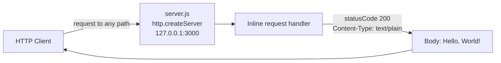
```mermaid
flowchart LR
    Client[HTTP Client] -->|request to any path| Server[server.js<br/>http.createServer<br/>127.0.0.1:3000]
    Server --> Handler[Inline request handler]
    Handler -->|statusCode 200<br/>Content-Type: text/plain| Response[Body: Hello, World!]
    Response --> Client
```

### 1.2.3 Success Criteria

The repository does not define any formal success criteria, service-level agreements (SLAs), or key performance indicators (KPIs). No performance targets, uptime goals, throughput figures, or measurable business objectives appear in any file. Reporting them would require inventing data not present in the codebase.

What can be stated is limited to the observable functional signals of the runnable component and the explicit non-criteria encoded in the project:

| Observable Signal | Source | Nature |
| --- | --- | --- |
| Startup log `Server running at http://127.0.0.1:3000/` | `server.js` | Functional readiness indicator |
| Every request returns `HTTP 200` with body `Hello, World!\n` | `server.js` | Functional response-correctness signal |
| `npm test` prints "Error: no test specified" and exits `1` | `package.json` | Explicit non-criterion — no automated test defines success |
| `LoginTest.java` does not compile | `LoginTest.java` | Cannot serve as a validated success criterion |

In summary, the only meaningful measure of correct behavior available is qualitative: the server starts and returns the expected static response. Any KPI beyond that is undefined in this repository.


## 1.3 Scope

This scope is derived entirely from what the repository actually contains. Because there is no requirements document, roadmap, or specification in the codebase, "in-scope" reflects functionality that is implemented and observable, while "out-of-scope" reflects functionality that is absent, non-functional, or explicitly disabled.

### 1.3.1 In-Scope Elements

#### Core Features and Functionalities

The must-have, implemented capabilities are limited to the runnable server and the static assets that ship with it:

| In-Scope Capability | Source | Notes |
| --- | --- | --- |
| Static HTTP response on `127.0.0.1:3000` | `server.js` | Returns `HTTP 200`, `Content-Type: text/plain`, body `Hello, World!\n` for every request |
| Startup logging to standard output | `server.js` | Logs `Server running at http://127.0.0.1:3000/` after `listen` succeeds |
| Static reference and sample assets on disk | `industry.csv`, `100Pages.pdf`, `demo.jpg`, `sample.doc` | Present as files within the repository; not read or transformed by any code |

The primary (and only) user workflow supported by the runnable component is:

1. Start the process on a host that has a Node.js runtime (for example, `node server.js`).
2. Issue an HTTP request to `http://127.0.0.1:3000/` from the same host.
3. Receive `HTTP 200` with the body `Hello, World!\n`.

Essential integrations and key technical requirements are minimal and entirely local:

| Requirement | Detail | Source |
| --- | --- | --- |
| Node.js runtime (CommonJS + built-in `http`) | No third-party packages are required or installed | `server.js`, `package-lock.json` |
| Loopback interface and TCP port 3000 available | Host and port are hardcoded constants | `server.js` |

#### Implementation Boundaries

| Boundary Dimension | In-Scope Definition |
| --- | --- |
| System boundary | A single Node.js process on one host serving loopback HTTP only; no persistence, authentication, or external network exposure |
| User groups covered | A local developer or an on-host automated/integration process |
| Geographic / market coverage | None — the server is not deployed to any network, region, or market; it is reachable only via `127.0.0.1` |
| Data domains included | The industry taxonomy (`industry.csv`, 43 sector labels) and the sample document set (`100Pages.pdf`, `demo.jpg`, `sample.doc`), present strictly as static files |

### 1.3.2 Out-of-Scope Elements

#### Excluded and Unimplemented Capabilities

The following are not implemented in the repository and are therefore out of scope for the system as it exists. Each exclusion is grounded in the absence or non-functional state of the corresponding code.

| Area | Excluded / Unsupported (not implemented) | Basis |
| --- | --- | --- |
| Authentication & login | No identity, session, or login handling | `LoginTest.java` is a non-compiling stub; `server.js` has no auth |
| Routing & dynamic content | No routes, query/body parsing, or templating — one catch-all handler | `server.js` |
| Transport security | No HTTPS/TLS | `server.js` uses the plain `http` module |
| Persistence & data processing | No database; the CSV and binary documents are never read or transformed | `server.js`, `package-lock.json` |
| Runtime configuration | No environment variables or flags; host and port are hardcoded | `server.js` |
| Automated testing & CI/CD | No passing tests and no build/deploy pipeline | `package.json` `test` script exits `1` |
| Third-party & enterprise integration | No external APIs, databases, message queues, cloud services, or UI | `package-lock.json` (zero dependencies) |
| Cross-language interoperability | The Java and Python-named placeholder are not wired to the Node.js app | `LoginTest.java`, `test.py.txt` |

#### Future Phase Considerations

No future phases, milestones, or planned enhancements are documented anywhere in the repository. The incomplete `LoginTest.java` and the empty `test.py.txt` / `test.txt.txt` files are not accompanied by any issue, specification, or roadmap, so they cannot be presented as committed future work — they are simply non-functional artifacts at present.

#### Integration Points Not Covered

No integration is provided with databases, external or third-party APIs, message brokers, authentication providers, cloud platforms, front-end/UI layers, or any non-loopback network. Processing of the bundled data assets (`industry.csv`, `100Pages.pdf`, `demo.jpg`, `sample.doc`) by application code is likewise not covered.

#### Unsupported Use Cases

Production or public deployment, remote (non-loopback) access, authenticated or multi-tenant access, concurrent high-volume traffic handling, and any parsing, querying, or transformation of the bundled CSV and binary documents are all unsupported, as none of these are present in the observed code.


## 1.4 References

The following repository artifacts and metadata were inspected as the evidence base for this Introduction. No external web sources were used.

**Files**

- `README.md` - Established the project identity (`hao-backprop-test`), its declared purpose ("test project for backprop integration"), and the "Do not touch!" warning.
- `server.js` - Established the sole runnable component: a CommonJS Node.js HTTP server bound to `127.0.0.1:3000` that returns `HTTP 200` / `text/plain` / `Hello, World!\n` for every request and logs a startup URL.
- `package.json` - Established package identity (`hello_world` v1.0.0, MIT, author `hxu`), the `main` entry pointing to a non-existent `index.js`, the always-failing `test` script, and the absence of declared dependencies.
- `package-lock.json` - Confirmed `lockfileVersion` 3 and an empty resolved dependency tree (only the root package).
- `LoginTest.java` - Established the incomplete, non-compiling Java stub (package `com.blitzyTest`, a `main` method with a stray `Web` token) with no login implementation.
- `industry.csv` - Established the single-column `Industry` taxonomy of 43 sector labels.
- `100Pages.pdf` - Confirmed (via `%PDF-1.7` magic bytes) a ~9.1 MB sample PDF document asset.
- `demo.jpg` - Confirmed (via JPEG/EXIF magic bytes) a ~2.1 MB sample image asset.
- `sample.doc` - Confirmed (via OLE2 compound-file magic bytes) a ~96 KB legacy Microsoft Word document asset.
- `test.py.txt` - Confirmed a 0-byte placeholder file with no content.
- `test.txt.txt` - Confirmed a 0-byte placeholder file with no content.

**Folders**

- `./` (repository root) - Contained all eleven tracked files and no subfolders, establishing the flat top-level structure.

**Repository Metadata**

- [repo] Git history and branches - Established the single commit `f60b533` ("Add files via upload") that introduced all 11 tracked files, the current branch `QA-16-july-branch`, and the environment/QA branch set (Linux and Windows container branches, QA and automation branches) indicating fixture usage across container environments.


# 2. Product Requirements

## 2.1 Feature Catalog

This catalog decomposes the `hao-backprop-test` repository into discrete, independently testable features. Every feature below is derived **strictly from implemented, observable behavior** in the tracked source; no aspirational or inferred capabilities are included. Because the repository contains no requirements document, roadmap, or specification, each feature's `Status` reflects the *as-built* reality of the single tracked commit rather than a planned trajectory. This section aligns with the boundaries established in the Introduction (see **1.2 System Overview** and **1.3 Scope**).

**Scope, Assumptions, and Constraints**

The following assumptions and constraints govern the entire feature catalog and its requirements:

| Assumption / Constraint | Basis |
| --- | --- |
| The repository is an internal **test fixture** ("test project for backprop integration. Do not touch!"), not a commercial product; "Business Value" is framed in that fixture context | `README.md` |
| All features originate from a **single commit** (`f60b533`, "Add files via upload"); the requirement baseline version for every requirement is **1.0** | Git history |
| **No SLAs, KPIs, or performance targets** exist anywhere in the repository; all "Performance Criteria" are recorded as *none defined* rather than invented | `server.js`, `package.json` (per **1.2.3 Success Criteria**) |
| The runtime feature is **loopback-only** (`127.0.0.1:3000`) with no external exposure, configuration, persistence, authentication, or transport security | `server.js` |
| **Zero third-party dependencies** are declared or installed | `package-lock.json` |

**Feature Summary**

The repository exposes four grounded features. Priority reflects centrality to the fixture's runnable purpose; all four are implemented in the tracked commit and therefore carry `Completed` status (defects, where present, are documented explicitly in later sub-sections).

| Feature ID | Feature Name | Priority | Status |
| --- | --- | --- | --- |
| F-001 | Static HTTP Response Service | Critical | Completed |
| F-002 | HTTP Server Bootstrap & Startup Logging | High | Completed |
| F-003 | npm Package Definition & Dependency Baseline | Medium | Completed |
| F-004 | Static Reference & Sample Data Assets | Low | Completed |

Feature categories are summarized below:

| Feature ID | Feature Category |
| --- | --- |
| F-001 | Core Runtime / Web Service |
| F-002 | Runtime Lifecycle / Observability |
| F-003 | Packaging / Build Metadata |
| F-004 | Static Data / Reference Assets |

**Artifacts Excluded from the Catalog**

The following tracked artifacts are **deliberately not catalogued as features** because they implement no working, testable capability. They are documented as constraints/assumptions and are consistent with the out-of-scope treatment in **1.3.2 Out-of-Scope Elements**.

| Excluded Artifact | Reason for Exclusion |
| --- | --- |
| `LoginTest.java` | Non-compiling stub — the `main` method contains a stray `Web` token and no login logic; provides no testable behavior |
| `test.py.txt` | Zero-byte placeholder; no content or behavior |
| `test.txt.txt` | Zero-byte placeholder; no content or behavior |
| `README.md` | Documentation only (project purpose + "Do not touch!"); cited as evidence, not a runtime capability |

### 2.1.1 F-001 — Static HTTP Response Service

The core runtime capability of the repository: a single inline request handler that returns a fixed plain-text response to every inbound HTTP request.

**Feature Metadata**

| Attribute | Value |
| --- | --- |
| Unique ID | F-001 |
| Feature Name | Static HTTP Response Service |
| Feature Category | Core Runtime / Web Service |
| Priority Level | Critical |
| Status | Completed |

**Description**

| Dimension | Detail |
| --- | --- |
| Overview | The inline handler registered via `http.createServer` in `server.js` returns `HTTP 200` with header `Content-Type: text/plain` and body `Hello, World!\n` for **every** request, irrespective of path, method, headers, or body. There is no routing, query/body parsing, templating, or conditional logic. |
| Business Value | Provides a deterministic, dependency-free HTTP endpoint that an external integration/QA process can invoke to confirm the fixture behaves predictably across environments. |
| User Benefits | A local developer or on-host automated process receives an immediate, constant, correct response with zero setup beyond a Node.js runtime. |
| Technical Context | A CommonJS module using **only** Node's built-in `http` module; the handler is synchronous and ignores request content. |

A short illustrative snippet of the complete handler behavior in `server.js`:

```js
res.statusCode = 200;
res.setHeader('Content-Type', 'text/plain');
res.end('Hello, World!\n');
```

**Dependencies**

| Dependency Type | Detail |
| --- | --- |
| Prerequisite Features | F-002 (HTTP Server Bootstrap) — the handler cannot receive requests unless the server has been created and is listening |
| System Dependencies | Node.js runtime; built-in `http` module |
| External Dependencies | None (zero third-party packages per `package-lock.json`) |
| Integration Requirements | Availability of the loopback interface `127.0.0.1` and a client able to issue HTTP over TCP port `3000` |

### 2.1.2 F-002 — HTTP Server Bootstrap & Startup Logging

The runtime lifecycle feature that instantiates the server, binds it to a fixed loopback address/port, and emits a single readiness signal.

**Feature Metadata**

| Attribute | Value |
| --- | --- |
| Unique ID | F-002 |
| Feature Name | HTTP Server Bootstrap & Startup Logging |
| Feature Category | Runtime Lifecycle / Observability |
| Priority Level | High |
| Status | Completed |

**Description**

| Dimension | Detail |
| --- | --- |
| Overview | `server.js` creates the server via `http.createServer` and calls `server.listen(port, hostname, callback)` against the hardcoded constants `hostname = '127.0.0.1'` and `port = 3000`. On successful bind, the callback logs `Server running at http://127.0.0.1:3000/` to standard output. |
| Business Value | Establishes the host process and a single, deterministic readiness signal so an operator or automation harness can confirm the fixture is up before exercising it. |
| User Benefits | Deterministic startup with an explicit readiness log and no configuration required. |
| Technical Context | Host and port are hardcoded (no environment variables or flags). The module exports nothing, so requiring or executing it starts the server as a side effect. Observability is limited to one `console.log` line to stdout. |

**Dependencies**

| Dependency Type | Detail |
| --- | --- |
| Prerequisite Features | None — this is the root runtime feature that hosts F-001 |
| System Dependencies | Node.js runtime; built-in `http` module; access to standard output for the startup log |
| External Dependencies | None |
| Integration Requirements | TCP port `3000` must be free on the loopback interface at startup |

### 2.1.3 F-003 — npm Package Definition & Dependency Baseline

The packaging feature that makes the workspace a recognizable npm package with a pinned, empty dependency graph.

**Feature Metadata**

| Attribute | Value |
| --- | --- |
| Unique ID | F-003 |
| Feature Name | npm Package Definition & Dependency Baseline |
| Feature Category | Packaging / Build Metadata |
| Priority Level | Medium |
| Status | Completed (with documented defects) |

**Description**

| Dimension | Detail |
| --- | --- |
| Overview | `package.json` declares the package identity (`hello_world` v`1.0.0`, MIT, author `hxu`), the `main` entry, and a single `test` script; `package-lock.json` (`lockfileVersion` 3) pins an **empty** dependency tree containing only the root package. |
| Business Value | Makes the workspace an installable, machine-readable npm package with a deterministic (empty) dependency graph, so integration tooling can process it reproducibly across environments. |
| User Benefits | `npm install` resolves instantly to zero dependencies; package identity and license are discoverable by tooling. |
| Technical Context | Two defects are encoded as-built and carried forward faithfully: `main` points to a non-existent `index.js` (the actual runnable entry is `server.js`), and the `test` script is a placeholder (`echo "Error: no test specified" && exit 1`) that always exits non-zero. |

**Dependencies**

| Dependency Type | Detail |
| --- | --- |
| Prerequisite Features | None |
| System Dependencies | An npm / Node.js toolchain capable of reading the manifest and lockfile |
| External Dependencies | None (the resolved dependency tree is empty) |
| Integration Requirements | None beyond an npm-compatible manifest reader |

### 2.1.4 F-004 — Static Reference & Sample Data Assets

The set of inert, checked-in data and document assets available on disk for external consumers to exercise, none of which is read by any code in the repository.

**Feature Metadata**

| Attribute | Value |
| --- | --- |
| Unique ID | F-004 |
| Feature Name | Static Reference & Sample Data Assets |
| Feature Category | Static Data / Reference Assets |
| Priority Level | Low |
| Status | Completed |

**Description**

| Dimension | Detail |
| --- | --- |
| Overview | Four static files ship with the repository: `industry.csv` (a single `Industry` column with **43** sector labels) plus three sample binary documents — `100Pages.pdf` (PDF 1.7, ~9.1 MB), `demo.jpg` (JPEG/EXIF, ~2.1 MB), and `sample.doc` (OLE2 legacy Word, ~96 KB). |
| Business Value | Provides representative tabular and binary payloads spanning multiple formats and sizes for an external integration/QA pipeline to exercise file-handling behavior deterministically. |
| User Benefits | Ready-made, version-controlled fixtures covering CSV, PDF, JPEG, and legacy Word (.doc) formats, available without any generation step. |
| Technical Context | Strictly inert on-disk assets — no parser, loader, endpoint, or script references them; they are served neither by the HTTP server nor any other code. |

**Dependencies**

| Dependency Type | Detail |
| --- | --- |
| Prerequisite Features | None |
| System Dependencies | A filesystem to store and retrieve the files (no runtime code dependency) |
| External Dependencies | None |
| Integration Requirements | None wired in code; any consumption is performed by an external process reading the files directly from disk |


## 2.2 Functional Requirements Table

This sub-section enumerates the testable functional requirements for each catalogued feature. Requirements use the identifier scheme **`F-XXX-RQ-YYY`**. Every requirement traces to observed behavior in the tracked source and carries a baseline version of **1.0** (commit `f60b533`). The scales used are:

- **Priority** — Must-Have, Should-Have, or Could-Have.
- **Complexity** — High, Medium, or Low. Because the implementation is trivial (a 14-line server and static declarative files), complexity is **Low** across all requirements.
- **Performance Criteria** — the repository defines no SLAs, latency, or throughput targets, so these are recorded as *none defined* (consistent with **1.2.3 Success Criteria**); reporting numeric targets would require inventing data absent from the codebase.

### 2.2.1 F-001 — Static HTTP Response Service Requirements

**Requirement Details**

| Requirement ID | Description | Priority | Complexity |
| --- | --- | --- | --- |
| F-001-RQ-001 | Respond with HTTP status `200` to every inbound request, regardless of method or path | Must-Have | Low |
| F-001-RQ-002 | Set the response header `Content-Type: text/plain` | Must-Have | Low |
| F-001-RQ-003 | Return the response body exactly as `Hello, World!\n` | Must-Have | Low |

**Acceptance Criteria**

| Requirement ID | Acceptance Criteria |
| --- | --- |
| F-001-RQ-001 | A request issued with any method to any path on `http://127.0.0.1:3000/` returns status line `HTTP/1.1 200 OK` |
| F-001-RQ-002 | The response carries the header `Content-Type: text/plain` |
| F-001-RQ-003 | The response body equals the string `Hello, World!\n` with no additional bytes |

**Technical Specifications**

| Specification | Detail |
| --- | --- |
| Input Parameters | None consumed — request method, path, query string, headers, and body are all ignored by the handler |
| Output / Response | `HTTP 200`; header `Content-Type: text/plain`; body `Hello, World!\n` |
| Performance Criteria | None defined in the repository |
| Data Requirements | None — the handler is stateless; no data is read, written, or persisted |

**Validation Rules**

| Rule Type | Detail |
| --- | --- |
| Business Rules | Uniform response for all callers; no differentiation by path, method, or identity |
| Data Validation | None — no input is parsed or validated |
| Security Requirements | None implemented — plain HTTP (no TLS), no authentication/authorization; exposure is limited only by the loopback binding provided by F-002 |
| Compliance Requirements | None defined; the MIT license (`package.json`) applies to the code |

### 2.2.2 F-002 — HTTP Server Bootstrap & Startup Logging Requirements

**Requirement Details**

| Requirement ID | Description | Priority | Complexity |
| --- | --- | --- | --- |
| F-002-RQ-001 | Bind the HTTP server to host `127.0.0.1` and TCP port `3000` | Must-Have | Low |
| F-002-RQ-002 | On successful `listen`, log `Server running at http://127.0.0.1:3000/` to standard output | Should-Have | Low |

**Acceptance Criteria**

| Requirement ID | Acceptance Criteria |
| --- | --- |
| F-002-RQ-001 | After starting the process (e.g., `node server.js`), TCP port `3000` on `127.0.0.1` accepts connections and is not reachable via a non-loopback interface |
| F-002-RQ-002 | Process standard output contains the line `Server running at http://127.0.0.1:3000/` once the server is ready |

**Technical Specifications**

| Specification | Detail |
| --- | --- |
| Input Parameters | Hardcoded constants `hostname = '127.0.0.1'` and `port = 3000`; no CLI arguments or environment variables are read |
| Output / Response | A listening TCP socket on `127.0.0.1:3000` and a single stdout log line |
| Performance Criteria | None defined (no startup-time or bind-latency target) |
| Data Requirements | None — no state or persistence |

**Validation Rules**

| Rule Type | Detail |
| --- | --- |
| Business Rules | A single fixed bind address and port; loopback-only by design |
| Data Validation | None |
| Security Requirements | Loopback binding restricts reachability to the local host; no TLS and no authentication are configured (observed posture) |
| Compliance Requirements | None defined; MIT license applies |

### 2.2.3 F-003 — npm Package Definition & Dependency Baseline Requirements

**Requirement Details**

| Requirement ID | Description | Priority | Complexity |
| --- | --- | --- | --- |
| F-003-RQ-001 | Declare package identity `hello_world` v`1.0.0` under the MIT license | Must-Have | Low |
| F-003-RQ-002 | Maintain a resolvable, zero-dependency lockfile (`lockfileVersion` 3) | Must-Have | Low |
| F-003-RQ-003 | Provide the `test` npm script (as-built placeholder behavior) | Could-Have | Low |

**Acceptance Criteria**

| Requirement ID | Acceptance Criteria |
| --- | --- |
| F-003-RQ-001 | `package.json` parses as valid JSON and reports `name = hello_world`, `version = 1.0.0`, `license = MIT` |
| F-003-RQ-002 | `npm install` adds zero third-party packages; `package-lock.json` reports `lockfileVersion` 3 and only the root package |
| F-003-RQ-003 | `npm test` prints `Error: no test specified` and exits with a non-zero status (documented as-built placeholder) |

**Technical Specifications**

| Specification | Detail |
| --- | --- |
| Input Parameters | Not applicable — static declarative manifest files (`package.json`, `package-lock.json`) |
| Output / Response | Machine-readable package metadata and a deterministic (empty) dependency install graph |
| Performance Criteria | None defined |
| Data Requirements | Both manifest files must remain well-formed JSON |

**Validation Rules**

| Rule Type | Detail |
| --- | --- |
| Business Rules | The package name (`hello_world`) intentionally differs from the repository name (`hao-backprop-test`); documented defect — `main` references a non-existent `index.js` while the runnable entry is `server.js` |
| Data Validation | JSON well-formedness of `package.json` and `package-lock.json` |
| Security Requirements | The empty dependency tree eliminates third-party supply-chain surface (observed consequence, not a stated requirement) |
| Compliance Requirements | MIT license declared; no other compliance obligations defined |

### 2.2.4 F-004 — Static Reference & Sample Data Assets Requirements

**Requirement Details**

| Requirement ID | Description | Priority | Complexity |
| --- | --- | --- | --- |
| F-004-RQ-001 | Provide `industry.csv` containing a single `Industry` column of 43 sector labels | Must-Have | Low |
| F-004-RQ-002 | Provide the sample binary documents `100Pages.pdf`, `demo.jpg`, and `sample.doc` in their respective formats | Should-Have | Low |

**Acceptance Criteria**

| Requirement ID | Acceptance Criteria |
| --- | --- |
| F-004-RQ-001 | `industry.csv` has the header `Industry` followed by exactly 43 non-empty label rows, ordered `Accounting/Finance` through `Other` |
| F-004-RQ-002 | `100Pages.pdf` begins with `%PDF-1.7`; `demo.jpg` begins with JPEG/EXIF magic bytes (`FF D8 FF E1`); `sample.doc` begins with OLE2 magic bytes (`D0 CF 11 E0`); approximate sizes are 9.1 MB, 2.1 MB, and 96 KB respectively |

**Technical Specifications**

| Specification | Detail |
| --- | --- |
| Input Parameters | Not applicable — static files with no programmatic interface |
| Output / Response | Byte-for-byte file contents retrievable directly from disk |
| Performance Criteria | None defined |
| Data Requirements | `industry.csv` = 1 header row + 43 label rows; each binary asset retains its valid format signature |

**Validation Rules**

| Rule Type | Detail |
| --- | --- |
| Business Rules | Assets are reference/sample data only and are not consumed by any application code |
| Data Validation | None performed by repository code; validation (if any) is left to external consumers |
| Security Requirements | None — static, non-executable content |
| Compliance Requirements | None defined for the asset contents |


## 2.3 Feature Relationships

The features in this repository are **largely independent**; the only genuine runtime coupling is between F-001 and F-002, which are co-located in `server.js`. F-003 relates to the runtime only nominally (and is defective in that linkage), while F-004 is entirely standalone. Only relationships evident in the source are documented below — none are inferred. This is consistent with **1.2.2 High-Level Description**, which notes that no component depends on another at runtime beyond the single server.

**Feature Dependency Map**

The diagram below shows the observed relationships. F-002 hosts F-001 within the same process; the Node built-in `http` module is the shared library; F-003's packaging linkage to the runtime is nominal/broken (its `main` points to a missing `index.js`); and F-004 is disconnected from all code.

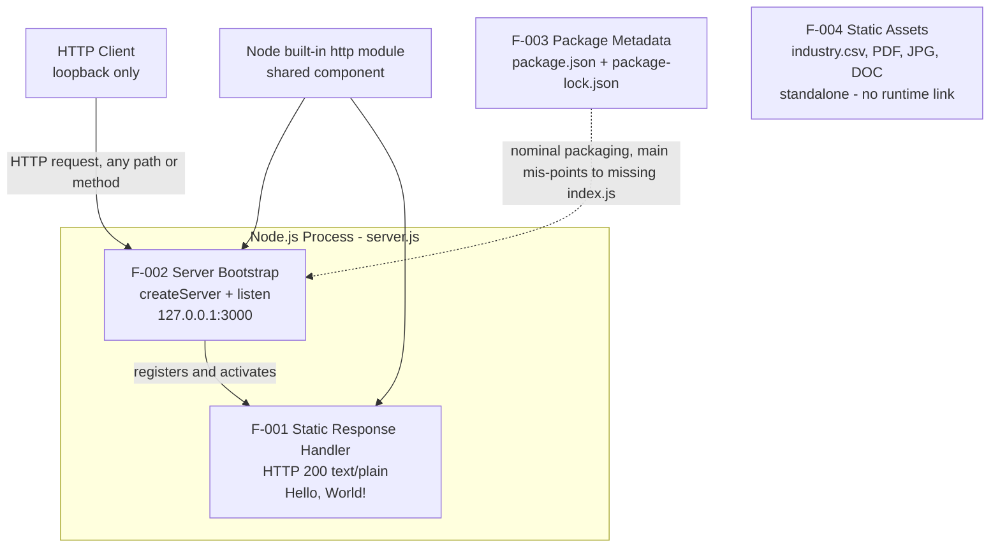
```mermaid
flowchart TD
    Client["HTTP Client<br/>loopback only"]

    subgraph Process["Node.js Process - server.js"]
        F002["F-002 Server Bootstrap<br/>createServer + listen<br/>127.0.0.1:3000"]
        F001["F-001 Static Response Handler<br/>HTTP 200 text/plain<br/>Hello, World!"]
        F002 -->|registers and activates| F001
    end

    HTTP["Node built-in http module<br/>shared component"]
    F003["F-003 Package Metadata<br/>package.json + package-lock.json"]
    F004["F-004 Static Assets<br/>industry.csv, PDF, JPG, DOC<br/>standalone - no runtime link"]

    HTTP --> F002
    HTTP --> F001
    Client -->|HTTP request, any path or method| F002
    F003 -.->|nominal packaging, main mis-points to missing index.js| F002
```

**Dependency Summary**

| Feature | Depends On | Nature of Relationship |
| --- | --- | --- |
| F-001 Static HTTP Response Service | F-002 | Composition — the handler is the callback registered in `http.createServer` and only serves requests once `listen()` is active |
| F-002 HTTP Server Bootstrap | None | Root runtime feature; hosts F-001 within the same process |
| F-003 npm Package Definition | None | Independent; nominally packages the runtime, but `main` mis-points to a missing `index.js` (broken linkage) |
| F-004 Static Reference & Sample Data Assets | None | Fully standalone; not referenced by any code |

**Integration Points**

There is a single integration surface in the entire system; there are no outbound integrations (no database, external/third-party API, message broker, or cloud service — the dependency tree is empty per `package-lock.json`).

| Integration Point | Direction | Detail |
| --- | --- | --- |
| Loopback HTTP interface `127.0.0.1:3000` | Inbound only | The sole integration surface — exposed by F-002 and served by F-001; reachable exclusively from the local host |

The end-to-end request/response flow for this integration point is documented as a process flowchart in **1.2.2 High-Level Description** (the uniform request-handling flow) and is not duplicated here.

**Shared Components**

| Shared Component | Shared By | Detail |
| --- | --- | --- |
| Node.js built-in `http` module | F-001, F-002 | The only shared library; provides `createServer`, the request/response API, and `listen` |
| `server.js` module and its `http.Server` instance | F-001, F-002 | Both features are implemented in the same file and operate on the same server object |
| Node.js / npm runtime and toolchain | F-001, F-002, F-003 | Common execution and packaging platform |

**Common Services**

No shared application services exist — there is no database, configuration service, authentication service, cache, or logging framework. The only cross-cutting facility is **standard output via `console.log`**, used by F-002 to emit its single startup line. F-003 (declarative metadata) and F-004 (inert assets) participate in no runtime service, shared or otherwise.


## 2.4 Implementation Considerations

The considerations below are grounded in the observed implementation. Where the repository defines no target (notably for performance), that is stated explicitly rather than estimated. Factual observations about runtime behavior (for example, single-threaded execution) are noted as characteristics, not as documented requirements.

### 2.4.1 F-001 — Static HTTP Response Service

| Consideration | Detail |
| --- | --- |
| Technical Constraints | The response is hardcoded (status, header, body); there is no routing, request parsing, or conditional logic. Output cannot change without editing `server.js`. Behavior is bound to Node's built-in `http` API. |
| Performance Requirements | None defined in the repository. Observationally, the handler performs constant-time work with no I/O, but no latency or throughput target is documented. |
| Scalability Considerations | Runs in a single Node.js process on the default single-threaded event loop; no clustering, worker threads, or load balancing is configured. Loopback binding restricts reach to one host. |
| Security Implications | Served over plain HTTP (no TLS) with no authentication. Attack surface is minimal because the handler reads no input and returns a fixed non-sensitive string; exposure is further bounded by the loopback binding provided by F-002. |
| Maintenance Requirements | Trivial to modify (three statements), but no automated test guards the behavior (the `npm test` script fails by design), so any change is unverified by automation and requires a manual restart. |

### 2.4.2 F-002 — HTTP Server Bootstrap & Startup Logging

| Consideration | Detail |
| --- | --- |
| Technical Constraints | Host (`127.0.0.1`) and port (`3000`) are hardcoded constants; there is no environment-variable or flag-based configuration. The module has no exports, so it starts as a side effect of being required or executed. No signal handling or graceful-shutdown logic is present. |
| Performance Requirements | None defined (no startup-time or bind-latency target). |
| Scalability Considerations | Binds a single port on the loopback interface only; there is no multi-instance, alternate-port, or `0.0.0.0` configuration. Any change requires editing the source. No process manager or orchestration is configured. |
| Security Implications | The loopback binding is the primary control limiting network exposure. No TLS and no rate limiting are present. The `listen` callback contains no error handling, so a port conflict (`EADDRINUSE`) on `3000` would surface as an unhandled error. |
| Maintenance Requirements | Changing the bind address or port requires editing constants and restarting. The single stdout log line is the only operational signal; there is no health-check endpoint. |

### 2.4.3 F-003 — npm Package Definition & Dependency Baseline

| Consideration | Detail |
| --- | --- |
| Technical Constraints | Static JSON manifests. The `main` field points to a non-existent `index.js`, and there is no `start` script, so `node .` / `npm start` will not launch the server; the runnable entry (`server.js`) must be invoked directly. |
| Performance Requirements | Not applicable (declarative metadata). |
| Scalability Considerations | The empty dependency tree keeps installation deterministic and fast; there is nothing to scale. |
| Security Implications | Zero third-party dependencies means no external supply-chain vulnerability surface. The MIT license is permissive. |
| Maintenance Requirements | To make the package runnable through npm, `main` should reference `server.js` (or an `index.js` should be added) and a `start` script provided; the placeholder `test` script should be replaced with real tests. These are the principal outstanding maintenance items. |

### 2.4.4 F-004 — Static Reference & Sample Data Assets

| Consideration | Detail |
| --- | --- |
| Technical Constraints | Large binaries (`100Pages.pdf` ~9.1 MB, `demo.jpg` ~2.1 MB) dominate the working-tree size (~11.4 MB) and are stored directly in Git (not Git LFS). All four assets are inert — no code path reads them. |
| Performance Requirements | Not applicable (no runtime processing). |
| Scalability Considerations | Adding more or larger binaries increases repository size and clone time; because the assets are never served, there is no streaming or pagination concern. |
| Security Implications | Static, non-executable content. The binaries are sample files that no repository code parses, so there is no in-repo file-parsing vulnerability exposure. |
| Maintenance Requirements | If the assets require frequent revision, Git LFS would be advisable to control repository growth; otherwise maintenance is minimal, changing only when files are re-uploaded. |


## 2.5 Traceability Matrix

This matrix provides bidirectional traceability between functional requirements and the source evidence that implements them, together with a repeatable verification method for each. All requirements share baseline version **1.0** (commit `f60b533`). Coverage totals **10 requirements** across **4 features**; every requirement traces to a concrete artifact, and none is orphaned.

**Requirement-to-Source Traceability**

| Requirement ID | Feature | Source Evidence | Verification Method |
| --- | --- | --- | --- |
| F-001-RQ-001 | F-001 | `server.js` — `res.statusCode = 200` | Issue an HTTP request to any path/method and confirm status `200` |
| F-001-RQ-002 | F-001 | `server.js` — `res.setHeader('Content-Type', 'text/plain')` | Inspect the response headers |
| F-001-RQ-003 | F-001 | `server.js` — `res.end('Hello, World!\n')` | Compare the response body byte-for-byte |
| F-002-RQ-001 | F-002 | `server.js` — `server.listen(port, hostname)` with `127.0.0.1` / `3000` | Connect to `127.0.0.1:3000` and confirm loopback-only reachability |
| F-002-RQ-002 | F-002 | `server.js` — `console.log('Server running at ...')` | Inspect process standard output after startup |
| F-003-RQ-001 | F-003 | `package.json` — `name` / `version` / `license` | Parse the manifest and assert the values |
| F-003-RQ-002 | F-003 | `package-lock.json` — `lockfileVersion` 3, root-only tree | Run `npm install` and inspect the lockfile |
| F-003-RQ-003 | F-003 | `package.json` — `scripts.test` | Run `npm test` and confirm the message and non-zero exit code |
| F-004-RQ-001 | F-004 | `industry.csv` — header + 43 labels | Count rows and inspect the header |
| F-004-RQ-002 | F-004 | `100Pages.pdf`, `demo.jpg`, `sample.doc` | Inspect magic bytes and approximate file sizes |

**Feature-to-Specification Linkage**

This table links each feature to its primary source evidence and the related specification sections for cross-navigation.

| Feature | Primary Source Evidence | Related Specification Sections |
| --- | --- | --- |
| F-001 Static HTTP Response Service | `server.js` | 1.2.2, 1.3.1, 2.1.1, 2.2.1, 2.4.1 |
| F-002 HTTP Server Bootstrap & Startup Logging | `server.js` | 1.2.2, 1.3.1, 2.1.2, 2.2.2, 2.4.2 |
| F-003 npm Package Definition & Dependency Baseline | `package.json`, `package-lock.json` | 1.2.1, 1.3.2, 2.1.3, 2.2.3, 2.4.3 |
| F-004 Static Reference & Sample Data Assets | `industry.csv`, `100Pages.pdf`, `demo.jpg`, `sample.doc` | 1.2.2, 1.3.1, 2.1.4, 2.2.4, 2.4.4 |

**Version Tracking**

Because the entire tracked content was introduced in a single commit (`f60b533`, "Add files via upload"), there is no requirement revision history to track beyond the baseline. All feature and requirement IDs in this section are therefore versioned as **1.0**; any future change to `server.js`, the manifests, or the assets would constitute the first revision to the corresponding requirements.


## 2.6 References

The following repository artifacts, folders, metadata, and cross-referenced specification sections were inspected as the evidence base for this Product Requirements section. No external web sources were used.

**Files**

- `server.js` - Established F-001 and F-002: the loopback HTTP server bound to `127.0.0.1:3000`, the static `200` / `text/plain` / `Hello, World!\n` handler, and the single startup log line.
- `package.json` - Established F-003 identity (`hello_world` v`1.0.0`, MIT, author `hxu`), the `main` entry pointing to a non-existent `index.js`, and the always-failing `test` script.
- `package-lock.json` - Confirmed `lockfileVersion` 3 and the empty (zero-dependency) resolved tree supporting F-003.
- `industry.csv` - Established F-004's tabular asset: a single `Industry` column of 43 sector labels.
- `100Pages.pdf` - Established F-004 binary asset; verified `%PDF-1.7` signature and ~9.1 MB size.
- `demo.jpg` - Established F-004 binary asset; verified JPEG/EXIF signature (`FF D8 FF E1`) and ~2.1 MB size.
- `sample.doc` - Established F-004 binary asset; verified OLE2 signature (`D0 CF 11 E0`) and ~96 KB size.
- `LoginTest.java` - Basis for excluding a login/authentication feature (non-compiling stub with a stray `Web` token).
- `test.py.txt` - Basis for excluding a placeholder as a feature (0-byte file).
- `test.txt.txt` - Basis for excluding a placeholder as a feature (0-byte file).
- `README.md` - Established the fixture purpose ("test project for backprop integration. Do not touch!") framing the features' business/fixture context.

**Folders**

- `./` (repository root) - Confirmed the flat structure of 11 tracked files with no subfolders, bounding the feature inventory.

**Repository Metadata**

- [repo] Git history and branches - Established the single commit `f60b533` ("Add files via upload") as the baseline (version 1.0) for all requirements, the current branch `QA-16-july-branch`, and the environment/QA branch set indicating fixture usage across container environments.

**Cross-Referenced Specification Sections**

- 1.1 Executive Summary - Aligned the 11-file inventory, fixture purpose, and stakeholder framing.
- 1.2 System Overview - Aligned system capabilities, component roles, the request-flow process flowchart, and the explicit absence of SLAs/KPIs (1.2.3).
- 1.3 Scope - Aligned in-scope capabilities and out-of-scope exclusions used to select and exclude features.
- 1.4 References - Confirmed the file-level evidence base and format signatures for the binary assets.


# 3. Technology Stack

## 3.1 Programming Languages

This section documents the technology stack strictly as it exists in the `hao-backprop-test` repository — a minimal, single-commit fixture of 11 flat, git-tracked files with no subfolders. The stack is deliberately narrow: the only runnable component is a Node.js "Hello, World!" HTTP server, and the surrounding artifacts are metadata, an incomplete Java stub, static data, and empty placeholders. Where a conventional technology category (framework, database, cloud service, CI/CD, etc.) is not present, this is stated explicitly and grounded in the absence of the corresponding code or configuration, consistent with the findings already recorded in sections 1.2, 1.3, and 2.4. The provided "default technology stack" (AWS, Docker, Flask, MongoDB, React, etc.) is **not** present in the repository and is therefore not documented as part of this system.

The repository's tracked source spans two programming languages, only one of which is executable, alongside several non-executable data and configuration formats.

| Language / Format | Component / File | Role | Executable |
| --- | --- | --- | --- |
| JavaScript (Node.js, CommonJS) | `server.js` | Only runnable application logic — loopback HTTP server | Yes |
| Java | `LoginTest.java` | Incomplete, non-compiling stub | No |
| JSON | `package.json`, `package-lock.json` | npm package manifest and lockfile | N/A (declarative) |
| Markdown | `README.md` | Project documentation | N/A |
| CSV | `industry.csv` | Static reference dataset | N/A |
| Plain text | `test.py.txt`, `test.txt.txt` | Zero-byte placeholders | N/A |

### 3.1.1 JavaScript on Node.js (Primary Runtime Language)

JavaScript executed on the Node.js runtime is the only functional language in the repository. `server.js` is written as a CommonJS module — it imports Node's built-in HTTP capability with `const http = require('http')` and starts a server as a side effect of execution (the module exports nothing).

| Attribute | Observed Value | Source |
| --- | --- | --- |
| Language / module system | JavaScript, CommonJS (`require`) | `server.js` line 1 |
| Runtime | Node.js | `server.js` (Node built-in `http`); `package.json` description "Hello world in Node.js" |
| Runtime version constraint | **Not pinned** — no `engines` field, no `.nvmrc`, no `.node-version` | `package.json`, repository root |
| Language-level tooling | None — no TypeScript, transpiler, or bundler | absence of `tsconfig.json`, build config |
| External language dependencies | None — relies only on the built-in `http` module | `package-lock.json` (zero dependencies) |

**Selection criteria and rationale (as evidenced):** The package is named `hello_world` with the description "Hello world in Node.js," the canonical starter/tutorial naming used to demonstrate a runtime. For a trivially runnable HTTP fixture, plain JavaScript on Node.js with the standard library is sufficient and requires no compilation step or dependency installation, which keeps the fixture deterministic and self-contained.

**Constraints and dependencies:** Because no Node.js version is pinned, the code relies on the long-stable built-in `http` API, which is available across actively maintained Node.js releases. The server's only integration point is the Node.js runtime itself, bound to the loopback interface `127.0.0.1` on TCP port `3000`; both values are hardcoded constants with no environment-variable or flag-based override.

### 3.1.2 Java (Non-Compiling Stub)

A single Java source file, `LoginTest.java`, is present but is not a functional component of the system. It declares `package com.blitzyTest;` and a `public class LoginTest` containing only a `public static void main(String[] args)` method whose body consists of a stray, undeclared token (`Web`) with no valid statement.

| Attribute | Observed Value | Source |
| --- | --- | --- |
| Language | Java | `LoginTest.java` |
| Compilation status | Does **not** compile (invalid method body) | `LoginTest.java` |
| Language / JDK version | **Not declared** anywhere | no `pom.xml`, `build.gradle`, or source/target config |
| Build tooling | None | repository root (no Maven/Gradle project) |
| Integration with runtime | None — not invoked by `server.js` or any script | `server.js`, `package.json` |

**Rationale and constraints:** No selection justification can be attributed to Java in this repository because the file performs no work, declares no dependencies, and is not wired into the runnable Node.js application. It is best characterized as an inert artifact rather than a supported language platform, consistent with its treatment in section 1.3.2 (Out-of-Scope) and section 2.4 (excluded from the feature catalog).

### 3.1.3 Data and Configuration Formats

Several tracked files are not programming languages but define the repository's data and configuration surface. They are listed here to complete the source inventory and to prevent misclassification (notably, the Python-named placeholder contains no Python code).

- **JSON** — `package.json` and `package-lock.json` express the npm package identity and the (empty) dependency tree declaratively.
- **CSV** — `industry.csv` is a single-column dataset (header `Industry` plus 43 controlled-vocabulary sector labels); it is never read by any code.
- **Markdown** — `README.md` documents the project purpose and a "Do not touch!" warning.
- **Plain text** — `test.py.txt` and `test.txt.txt` are zero-byte placeholders. Despite its `.py` infix, `test.py.txt` is an empty `.txt` file and is **not** Python source; there is no Python runtime, interpreter, or Python code anywhere in the repository.

## 3.2 Frameworks & Libraries

The repository uses **no application frameworks and no third-party libraries**. The only framework-level technology in the runnable component is the Node.js standard library — specifically the built-in `http` module — which `server.js` uses directly to create and run the HTTP server. `package.json` declares no `dependencies` or `devDependencies`, and `package-lock.json` (lockfileVersion 3) resolves zero packages, so there is no framework or library layer to version beyond the runtime itself.

**Core framework-level technology in use:**

| Technology | Version | Type | Source | Purpose |
| --- | --- | --- | --- | --- |
| Node.js built-in `http` module | Runtime-bundled (Node.js version not pinned) | Standard-library API | `server.js` line 1, line 6, line 12 | `http.createServer` request handling and `server.listen` binding |

The server is built entirely on three standard-library calls — `http.createServer(...)`, response methods (`res.statusCode`, `res.setHeader`, `res.end`), and `server.listen(...)` — with no routing, middleware, templating, or ORM layer.

**Common framework categories checked and confirmed absent** (each grounded in the zero-dependency manifest and the absence of configuration files):

| Category | Status | Basis |
| --- | --- | --- |
| Web/server framework (e.g., Express, Koa, Fastify, Hapi, NestJS) | Not present | `package-lock.json` zero dependencies; `server.js` uses raw `http` |
| Frontend/UI framework (e.g., React, Vue, Angular) | Not present | no frontend source, no `src/`, no bundler config |
| CSS framework (e.g., TailwindCSS) | Not present | no stylesheet or CSS tooling in repository |
| Testing framework (e.g., Jest, Mocha, JUnit) | Not present | `package.json` `test` script runs `echo "Error: no test specified" && exit 1` |
| Build/transpile tooling (e.g., webpack, Babel, TypeScript) | Not present | no `tsconfig.json`, `.babelrc`, or bundler config |
| AI/ML framework (e.g., Langchain) | Not present | no such dependency or import anywhere |

**Compatibility requirements:** The single dependency surface is the Node.js runtime's built-in `http` API, which is stable across actively maintained Node.js releases; `server.js` uses the CommonJS module system. Because no frameworks or libraries are installed, there are no inter-library version-compatibility constraints to manage.

**Justification:** For a "Hello, World!" fixture whose sole capability is returning a fixed HTTP response, the built-in `http` module is entirely sufficient; introducing a web framework or supporting libraries would add unnecessary complexity and dependency-management overhead. **Security implication:** the complete absence of frameworks and third-party libraries means there is no external supply-chain vulnerability surface for the application code — a point corroborated in section 2.4.3.

## 3.3 Open Source Dependencies

The repository has an **empty open-source dependency tree**. It is managed with the npm package manager, but neither runtime nor development dependencies are declared or resolved.

- `package.json` declares no `dependencies` and no `devDependencies` blocks at all.
- `package-lock.json` uses `"lockfileVersion": 3` with `"requires": true` and lists only the root package (`hello_world` 1.0.0, MIT) under the `packages` object — there are **zero** resolved third-party packages.

**Dependency inventory:**

| Manifest | Declared Dependencies | Resolved Packages | Package Registry | Lockfile Format |
| --- | --- | --- | --- | --- |
| `package.json` | None | — | npm (default `registry.npmjs.org`) | — |
| `package-lock.json` | — | None (root package only) | npm | `lockfileVersion: 3` |

**Package manager and registry:** The presence of a `package-lock.json` establishes npm as the package manager and the public npm registry (`registry.npmjs.org`) as the default source, but because no dependencies are declared, no packages are actually fetched, and `npm install` / `npm ci` would produce an empty `node_modules` tree. The `lockfileVersion: 3` format is produced by npm v7 and later (it omits the backwards-compatibility affordances of version 2) and is the default written from npm v9 onward; this indicates the lockfile was generated by a modern npm release.

**Runtime dependency:** The only code-level dependency is the Node.js built-in `http` module (documented in section 3.2). As a standard-library module bundled with the runtime, it is not an installed open-source package and does not appear in the lockfile.

**Licensing:** The root package declares the permissive **MIT** license in both `package.json` and `package-lock.json`. No third-party license obligations exist because no third-party code is included.

**Security implication:** An empty dependency tree means there is no transitive open-source supply-chain to audit, patch, or scan for the application; installation is deterministic and there are no known-vulnerability advisories to track for this codebase (consistent with section 2.4.3).

## 3.4 Third-Party Services

The system integrates with **no third-party services**. `server.js` imports only the Node.js built-in `http` module, makes no outbound network calls, and references no external APIs, SDKs, credentials, or service endpoints. There is no `.env` file, no configuration for service URLs or API keys, and the zero-dependency lockfile confirms that no client SDKs are linked.

| Service Category | Status | Basis / Evidence |
| --- | --- | --- |
| External APIs & integrations | Not present | `server.js` imports only built-in `http`; no HTTP client, no outbound requests; `package-lock.json` zero dependencies |
| Authentication services (e.g., Auth0, OAuth/OIDC) | Not present | no auth code or provider config; `LoginTest.java` is a non-compiling stub with no login logic |
| Monitoring / observability / APM | Not present | no telemetry or logging library; the only runtime signal is a single `console.log` startup line to stdout in `server.js` |
| Cloud services (e.g., AWS, GCP, Azure) | Not present | no cloud SDK, no service credentials, no infrastructure config in the repository |
| Message brokers / queues | Not present | no broker client or configuration |

**Version-control hosting:** The repository's Git `origin` remote is hosted on **GitHub** (used purely for source hosting and version control, as reflected by the multiple environment/QA branches described in sections 1.1 and 1.2). GitHub is a development/hosting service rather than a runtime integration — the application code neither calls GitHub nor depends on it at runtime.

**Integration requirements:** Because there are no third-party services, no service credentials, network egress rules, rate limits, or integration contracts need to be provisioned or managed for this system. The application's only runtime "integration" is the local loopback HTTP interface it exposes on `127.0.0.1:3000` (documented in sections 3.1.1 and 3.6.4).

## 3.5 Databases & Storage

The system uses **no database and no caching layer**. The runnable server is entirely stateless: `server.js` returns a constant response and never reads or writes any data store. The only persistence mechanism present is the local filesystem — a set of static files committed directly to the Git repository.

| Storage Concern | Technology | Status | Evidence |
| --- | --- | --- | --- |
| Primary database | None | Not present | `server.js` has no data access; `package-lock.json` has no DB driver (no `mongodb`, `pg`, `mysql`, `sqlite`) |
| Secondary database | None | Not present | same as above |
| Caching layer | None | Not present | no cache client (no `redis`/`memcached`); handler recomputes a constant response |
| ORM / data-access layer | None | Not present | no ORM dependency or model definitions |
| File / object storage | Local filesystem (Git-tracked files) | Present (static, inert) | `industry.csv`, `100Pages.pdf`, `demo.jpg`, `sample.doc` |
| Cloud object storage (e.g., S3) | None | Not present | no cloud SDK or bucket configuration |

**Data persistence strategy:** The repository's data domain is limited to static assets stored in version control and never processed at runtime:

- `industry.csv` — a single-column reference taxonomy of 43 industry/sector labels.
- `100Pages.pdf` (~9.1 MB, PDF 1.7), `demo.jpg` (~2.1 MB, JPEG/EXIF), and `sample.doc` (~96 KB, legacy OLE2 Word) — representative binary sample documents.

As noted in section 2.4.4, these large binaries are stored **directly in Git rather than Git LFS**, so they dominate the working-tree size; none of them is read, parsed, served, or transformed by any code path. The server holds no in-memory or on-disk application state between requests.

**Security implication:** With no database, connection strings, or credentials, there is no data-store attack surface, no injection risk, and no data-at-rest to secure for this system. The bundled files are static, non-executable content that no repository code parses, so there is no in-repo file-parsing exposure (consistent with sections 2.4.1 and 2.4.4).

## 3.6 Development & Deployment

The development and deployment posture is minimal and entirely manual. The runnable component is an interpreted Node.js script executed directly; there is no build step, no containerization, no infrastructure-as-code, and no CI/CD pipeline. Version control (Git/GitHub) and the Node.js runtime plus npm are the only tools involved. The end-to-end toolchain — from source hosting to a running server — is summarized below.

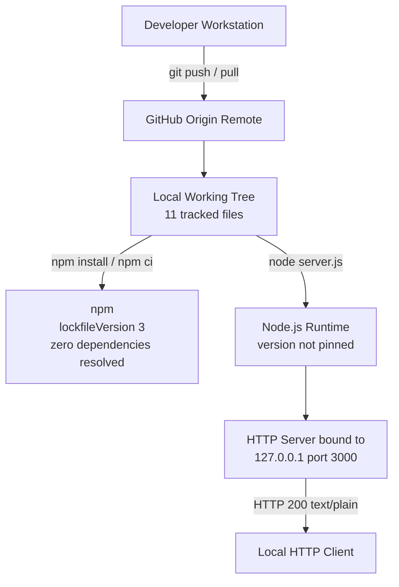
```mermaid
flowchart TD
    Dev[Developer Workstation] -->|git push / pull| GH[GitHub Origin Remote]
    GH --> WT[Local Working Tree<br/>11 tracked files]
    WT -->|npm install / npm ci| NPM[npm<br/>lockfileVersion 3<br/>zero dependencies resolved]
    WT -->|node server.js| RT[Node.js Runtime<br/>version not pinned]
    RT --> SRV[HTTP Server bound to<br/>127.0.0.1 port 3000]
    SRV -->|HTTP 200 text/plain| CL[Local HTTP Client]
```

### 3.6.1 Development Tooling & Version Control

| Tool | Version | Role | Source |
| --- | --- | --- | --- |
| Node.js runtime | Not pinned (no `engines`/`.nvmrc`) | Executes `server.js` | `server.js`, `package.json` |
| npm | Inferred npm v7+ (from `lockfileVersion: 3`) | Package manager / manifest tooling | `package.json`, `package-lock.json` |
| Git | Repository-managed | Version control | `.git`, single commit `f60b533` "Add files via upload" |
| GitHub | Hosted remote | Source hosting / branch environments | Git `origin` remote |

The repository is exercised across multiple branches — including `main`, a QA branch, and Linux and Windows container-environment branches — which is consistent with its role as a fixture checked out and processed across environments (as described in sections 1.1 and 1.2). No editor/IDE configuration, linter, or formatter is present: there is no `.eslintrc`, `.prettierrc`, `.editorconfig`, or even a `.gitignore` in the repository.

### 3.6.2 Build System

There is **no build system**. The JavaScript runtime component is interpreted and runs directly with `node server.js`; there is no compilation, bundling, or transpilation step, and no `Makefile`, bundler, or task runner is configured.

- **npm scripts:** the only script defined is `test`, which runs `echo "Error: no test specified" && exit 1` and therefore fails by design. There is no `build` or `start` script.
- **Entry-point defect:** `package.json` sets `"main": "index.js"`, but no `index.js` exists; combined with the missing `start` script, this means `npm start` and `node .` will not launch the server. The application must be started by invoking the actual entry file directly (`node server.js`), as noted in section 2.4.3.
- **Java:** compiling `LoginTest.java` would require a JDK and a build tool, but none is configured — and the file does not compile regardless (section 3.1.2).

### 3.6.3 Containerization & Infrastructure as Code

There is **no containerization and no infrastructure-as-code**. The following are all absent from the repository:

| Concern | Status | Basis |
| --- | --- | --- |
| Docker | Not present | no `Dockerfile`, `docker-compose.yml`, or `.dockerignore` |
| Orchestration (Kubernetes) | Not present | no manifests/Helm charts |
| Infrastructure as Code (Terraform, CloudFormation) | Not present | no `.tf`/template files |
| Process manager | Not present | no PM2/systemd/service configuration |

### 3.6.4 CI/CD & Deployment Model

There is **no CI/CD pipeline**. The repository contains no `.github/workflows` directory and no configuration for any CI system (GitHub Actions, GitLab CI, CircleCI, Jenkins, Travis, etc.). Because the `test` script exits with code `1` by design, any pipeline that ran `npm test` against this repository would fail.

**Deployment model (manual):** Deployment consists of running `node server.js` on a host that provides a Node.js runtime. The resulting server binds only to the loopback interface `127.0.0.1:3000`, so it is reachable exclusively from the same host and is not exposed to any external network, region, or orchestrator. As documented in section 2.4.2, there is no environment-based configuration, no graceful-shutdown/signal handling, no health-check endpoint, and no error handling around `listen` (a port conflict on `3000` would surface as an unhandled error). The single stdout line `Server running at http://127.0.0.1:3000/` is the only operational readiness signal.

## 3.7 References

**Repository files examined**

- `server.js` - Established JavaScript/Node.js as the primary language; CommonJS `require('http')`, loopback binding `127.0.0.1:3000`, static HTTP 200 response; sole use of the built-in `http` standard-library module; no external dependencies, no persistence, no outbound calls.
- `package.json` - Established npm package identity (`hello_world` 1.0.0), MIT license, `main: index.js` (missing) defect, `test` script that fails by design, and the absence of any declared dependencies or `engines` field.
- `package-lock.json` - Established `lockfileVersion: 3`, the empty dependency tree (root package only), and the MIT license.
- `LoginTest.java` - Established the presence of a non-compiling Java stub with no build tooling and no declared JDK version.
- `industry.csv` - Established the static CSV reference dataset (43 sector labels), an inert data asset.
- `README.md` - Established the project name (`hao-backprop-test`) and its purpose as a "test project for backprop integration."
- `100Pages.pdf`, `demo.jpg`, `sample.doc` - Established the static binary storage assets (stored directly in Git, not Git LFS) used in section 3.5.
- `test.py.txt`, `test.txt.txt` - Established the zero-byte placeholder files; confirmed no Python code exists.
- `/` (repository root folder) - Established the flat repository structure (no subfolders) with exactly 11 git-tracked files; confirmed the absence of build/CI/container/IaC/framework/database configuration files.
- `.git/` (Git metadata) - Established version control on GitHub, the single commit `f60b533` ("Add files via upload"), and the multiple environment/QA branches referenced in section 3.6.1.

**Cross-referenced Technical Specification sections**

- `1.1 Executive Summary` - Corroborated the 11-file single-commit fixture inventory and binary asset sizes/formats.
- `1.2 System Overview` - Corroborated the built-in-`http` runtime approach, empty dependency tree, and absence of enterprise/third-party integration.
- `1.3 Scope` - Corroborated the out-of-scope status of authentication, persistence, TLS, CI/CD, and third-party integration.
- `2.4 Implementation Considerations` - Corroborated the zero-dependency supply-chain posture (2.4.3), loopback/startup constraints (2.4.2), and Git-stored (non-LFS) static assets (2.4.4).

**Web sources**

- [web] npm CLI documentation, *package-lock.json* (`docs.npmjs.com`) - Confirmed that `lockfileVersion: 3` is the lockfile format used by npm v7 and later (without backwards-compatibility affordances) and the default from npm v9 onward.

# 4. Process Flowchart

## 4.1 System Workflows

The `hao-backprop-test` repository is a minimal Node.js test fixture whose sole executable artifact is `server.js`. Consequently the system exposes exactly **one** live runtime workflow — a synchronous HTTP request/response cycle — hosted inside a single Node.js process bound to the loopback interface `127.0.0.1:3000`. This section documents that workflow end to end and states, with evidence, where categories that a general process-flow analysis would expect (multi-system integration, event/message processing, batch pipelines, persistence transactions) are deliberately absent from the codebase.

All feature identifiers used below (F-001 – F-004) are defined in **2.1 Feature Catalog**; the runtime coupling between them is established in **2.3 Feature Relationships**. Because the repository defines no service-level agreement, latency budget, or throughput target anywhere (confirmed in **1.2.3 Success Criteria** and **2.4 Implementation Considerations**), every workflow below is annotated with *timing/SLA: none defined* rather than an invented figure.

| Workflow | Scope | Trigger | Persistence / External Calls |
| --- | --- | --- | --- |
| Server bootstrap & readiness | Process startup | `node server.js` invocation | None |
| HTTP request → static response | Per inbound request | Any HTTP request to `127.0.0.1:3000` | None (constant in-memory string) |
| Integration (inbound) | Single loopback surface | Local HTTP client connection | None outbound |

### 4.1.1 Core Business Processes

This repository is an internal test fixture rather than a commercial product (`README.md`: "test project for backprop integration. Do not touch!"), so "business process" here denotes the runnable request-serving behavior. There is a single end-to-end process: a **local HTTP client** issues a request to the loopback endpoint, the Node.js `http` core dispatches it to the inline handler, and the handler returns a fixed plain-text response. The complete handler is three statements in `server.js` (`res.statusCode = 200; res.setHeader('Content-Type','text/plain'); res.end('Hello, World!\n')`), and empirical testing confirmed that **every** method and path (`GET /`, `POST /anything?x=1`, `PUT /`, `DELETE /some/deep/path`) returns an identical `HTTP 200`, `Content-Type: text/plain`, `Content-Length: 14` response with body `Hello, World!\n`.

**End-to-end user journey (request/response cycle):**

| Step | Actor / System | Action | Evidence |
| --- | --- | --- | --- |
| 1 | Operator / host | Launch process `node server.js` (the declared `main`/`start` are non-functional, so `server.js` is invoked directly) | `server.js`, `package.json`, **2.4.3** |
| 2 | Node.js process (F-002) | `http.createServer(handler)` then `server.listen(3000,'127.0.0.1', cb)`; on bind, log readiness to stdout | `server.js` |
| 3 | Local HTTP client | Open TCP connection to `127.0.0.1:3000` and send an HTTP request (any method/path) | verified empirically |
| 4 | Node.js `http` core | Parse the request and emit a `request` event invoking the inline handler | Node built-in `http` |
| 5 | Inline handler (F-001) | Set status `200`, set `Content-Type: text/plain`, end response with `Hello, World!\n` | `server.js` |
| 6 | Local HTTP client | Receive the `HTTP 200` text/plain response and close/keep-alive the connection | verified empirically |

**High-level system workflow** — the diagram below uses swim lanes (subgraphs) to separate the three participants: the operator/host, the Node.js process, and the local HTTP client. It shows the start point (process launch), the single bind decision, the steady-state request loop, the user touchpoints, and the crash path taken when the bind fails (detailed in **4.4.2**).

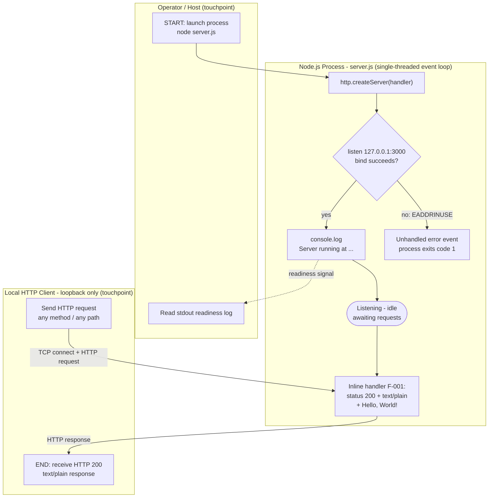
```mermaid
flowchart TB
    subgraph OPER["Operator / Host (touchpoint)"]
        StartProc["START: launch process<br/>node server.js"]
        ObserveLog["Read stdout readiness log"]
    end
    subgraph PROC["Node.js Process - server.js (single-threaded event loop)"]
        Create["http.createServer(handler)"]
        Bind{"listen 127.0.0.1:3000<br/>bind succeeds?"}
        LogLine["console.log<br/>Server running at ..."]
        Ready(["Listening - idle<br/>awaiting requests"])
        Handler["Inline handler F-001:<br/>status 200 + text/plain<br/>+ Hello, World!"]
        Crash["Unhandled error event<br/>process exits code 1"]
    end
    subgraph CLIENT["Local HTTP Client - loopback only (touchpoint)"]
        SendReq["Send HTTP request<br/>any method / any path"]
        RecvResp["END: receive HTTP 200<br/>text/plain response"]
    end

    StartProc --> Create --> Bind
    Bind -->|yes| LogLine --> Ready
    Bind -->|no: EADDRINUSE| Crash
    LogLine -.->|readiness signal| ObserveLog
    Ready --> Handler
    SendReq -->|TCP connect + HTTP request| Handler
    Handler -->|HTTP response| RecvResp
```

**System interactions.** The process interacts with exactly three parties: (1) the **operator/host**, which starts the process and reads the single stdout readiness line; (2) the **Node.js `http` core**, the only library involved (per **2.3 Shared Components** and **3.2 Frameworks & Libraries**), which owns TCP acceptance, HTTP parsing, and event dispatch; and (3) the **local HTTP client**. There are no other collaborating components at runtime.

**Decision points.** The application layer contributes **no** conditional logic — the handler is unconditional and ignores request content entirely. The only genuine decisions in the live system belong to lower layers, catalogued here for completeness:

| Decision | Layer | Outcomes | Application involvement |
| --- | --- | --- | --- |
| Does `listen()` bind to `127.0.0.1:3000`? | Node core (bootstrap) | success → readiness log; failure → unhandled `error` (crash) | None (no `error` listener registered) |
| Is the inbound byte stream a well-formed HTTP request? | Node `http` parser | valid → `request` event fires; malformed → core rejects at protocol level | None |
| Which route / method / status applies? | Application (F-001) | **always** `200` + fixed body — no branching | Constant; no routing table |

**User touchpoints.** Two touchpoints exist: the **loopback HTTP endpoint** `http://127.0.0.1:3000/` (reachable only from the same host), and the **startup log line** `Server running at http://127.0.0.1:3000/` written once to stdout as the sole readiness/observability signal (no health-check endpoint exists, per **2.4.2**).

**Error handling paths.** The bootstrap decision has one failure edge (bind failure → process crash) and the request path has no application-level error branch because the handler performs no I/O and no parsing. These paths are diagrammed and analyzed in **4.4.2 Error Handling & Recovery**.

**Timing / SLA.** None defined in the repository. Observationally the handler performs constant-time work with no I/O (**2.4.1**); no latency, throughput, or startup-time target is documented anywhere.

### 4.1.2 Integration Workflows

The system has a **single integration surface** and **no outbound integrations**. Per **2.3 Integration Points**, the only surface is the inbound loopback HTTP interface `127.0.0.1:3000`, exposed by F-002 and served by F-001; the dependency tree is empty (`package-lock.json`), so there is no database driver, external/third-party API client, message broker, queue, or cloud SDK anywhere in the code (corroborated by **3.4 Third-Party Services** and **3.5 Databases & Storage**).

**Data flow between systems.** The only data returned is a compile-time constant string literal (`'Hello, World!\n'`) embedded in `server.js`; it originates in source code and flows outward to the client. No inbound request data flows anywhere — the request object is never read. The static assets (`industry.csv`, `100Pages.pdf`, `demo.jpg`, `sample.doc`) are inert on disk and participate in no data flow because no code path reads them (**2.1.4 / 3.5**).

| Data element | Source | Destination | Transformation |
| --- | --- | --- | --- |
| `Hello, World!\n` (14 bytes) | Literal in `server.js` | HTTP response body → client | None (constant) |
| Request line / headers / body | Client | Discarded | None (never parsed by app code) |
| Startup URL string | `server.js` template literal | stdout (operator) | None |

**API interactions.** The system exposes one implicit "endpoint": a catch-all handler that responds identically to any method and path. There is no versioned API, no path routing, no content negotiation, and no request validation. The integration sequence below shows one full round trip and explicitly annotates the absence of any downstream call:

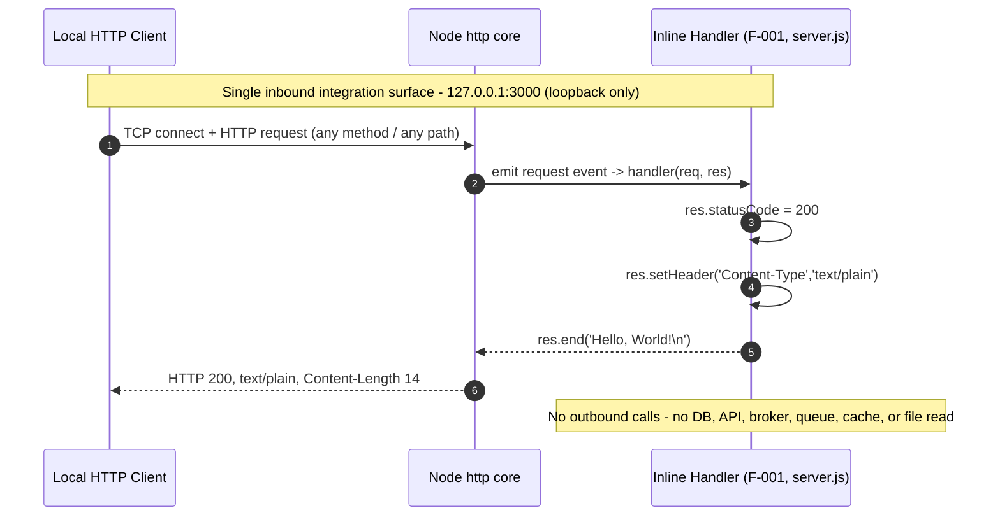
```mermaid
sequenceDiagram
    autonumber
    participant C as Local HTTP Client
    participant N as Node http core
    participant H as Inline Handler (F-001, server.js)
    Note over C,H: Single inbound integration surface - 127.0.0.1:3000 (loopback only)
    C->>N: TCP connect + HTTP request (any method / any path)
    N->>H: emit request event -> handler(req, res)
    H->>H: res.statusCode = 200
    H->>H: res.setHeader('Content-Type','text/plain')
    H-->>N: res.end('Hello, World!\n')
    N-->>C: HTTP 200, text/plain, Content-Length 14
    Note over H: No outbound calls - no DB, API, broker, queue, cache, or file read
```

**Event processing flows.** The system is event-driven only in the sense intrinsic to Node.js: the built-in `http` server emits a `request` event per inbound request (dispatched to the handler), a `listening` event (consumed by the `listen` callback that logs readiness), and an `error` event on bind failure (**unhandled** — see **4.4.2**). There is **no application-level event processing** — no publish/subscribe, no message consumers, no domain events, and no event store — because no such library or code exists in the repository.

**Batch processing sequences.** None. There are no scheduled jobs, cron entries, queue workers, ETL scripts, or bulk-processing routines in the repository. The `industry.csv` taxonomy and the sample binary documents are never batch-processed; they remain static, version-controlled files (**2.4.4 / 3.5**). The `npm test` script is a placeholder that always exits non-zero (`package.json`), so there is not even a batch test pipeline.

**Contextual integration note.** The only integration signal is contextual, not code-level: `README.md` states the repository exists as a "test project for backprop integration," and the multiple environment/QA Git branches indicate it is checked out and processed as a fixture by an **external** tooling process. That external process is outside the repository's own code and therefore outside any workflow this section can document from evidence.


## 4.2 Detailed Process Flows for Core Features

This section provides step-level flowcharts for the two runnable core features — F-002 (HTTP Server Bootstrap & Startup Logging) and F-001 (Static HTTP Response Service). F-003 (package metadata) and F-004 (static assets) are declarative/inert and execute no control flow, so they have no process flow to diagram (see **2.1.3 / 2.1.4**). Every step below is traceable to a specific statement in `server.js`.

### 4.2.1 F-002 — Server Bootstrap & Startup Flow

The bootstrap flow runs once per process launch. It requires the built-in `http` module, reads the two hardcoded constants, creates the server with the F-001 handler registered, and attempts to bind. There is exactly one decision that matters — whether the port binds — and its failure edge is unrecoverable because no `error` listener is registered (**2.4.2**, verified empirically in **4.4.2**).

| Step | Statement in `server.js` | Outcome |
| --- | --- | --- |
| Require module | `const http = require('http')` | Built-in `http` loaded (no third-party import) |
| Read constants | `hostname = '127.0.0.1'`, `port = 3000` | Fixed loopback target (no env/flag override) |
| Create server | `http.createServer((req,res) => {...})` | Handler F-001 registered; no server yet listening |
| Bind + callback | `server.listen(port, hostname, cb)` | Binds the port, then invokes `cb` on success |
| Readiness log | `console.log('Server running at http://127.0.0.1:3000/')` | Single stdout readiness signal |

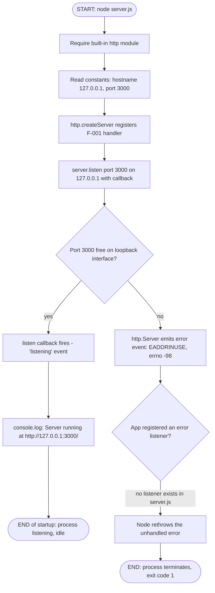
```mermaid
flowchart TD
    Start(["START: node server.js"]) --> Req["Require built-in http module"]
    Req --> Const["Read constants: hostname 127.0.0.1, port 3000"]
    Const --> CreateSrv["http.createServer registers F-001 handler"]
    CreateSrv --> Listen["server.listen port 3000 on 127.0.0.1 with callback"]
    Listen --> BindOK{"Port 3000 free on loopback interface?"}
    BindOK -->|yes| Cb["listen callback fires - 'listening' event"]
    Cb --> Log["console.log: Server running at http://127.0.0.1:3000/"]
    Log --> Idle(["END of startup: process listening, idle"])
    BindOK -->|no| Emit["http.Server emits error event: EADDRINUSE, errno -98"]
    Emit --> HasListener{"App registered an error listener?"}
    HasListener -->|"no listener exists in server.js"| Throw["Node rethrows the unhandled error"]
    Throw --> Exit(["END: process terminates, exit code 1"])
```

**System boundary.** Everything in this flow occurs inside the single Node.js process; the only external dependency is the OS TCP stack granting the loopback bind. **User touchpoint:** the stdout readiness line. **Timing / SLA:** none defined; there is no startup-time or bind-latency target in the repository (**2.4.2**).

### 4.2.2 F-001 — Static HTTP Response Handling Flow

Once the server is listening, each inbound request drives the flow below. The defining characteristic is the **absence of application-level branching**: the handler never inspects the request method, path, query, headers, or body, so the same three statements execute for every request (empirically confirmed across `GET`, `POST`, `PUT`, and `DELETE` to multiple paths). The decision diamond is included to document — per the flowchart requirements — that the conditional logic (routing, validation, authorization) a typical service would contain is *not present in code*.

| Step | Actor / Layer | Detail |
| --- | --- | --- |
| Accept connection | Node `http` core | TCP accept on `127.0.0.1:3000` |
| Parse request | Node `http` core | Parses request line/headers/body; emits `request` event |
| Invoke handler | Application (F-001) | Inline callback receives `(req, res)`; `req` is never read |
| Build response | Application (F-001) | `statusCode = 200`; `Content-Type: text/plain`; body `Hello, World!\n` |
| Transmit | Node `http` core | Writes `HTTP 200` with `Content-Length: 14`; keep-alive by default |

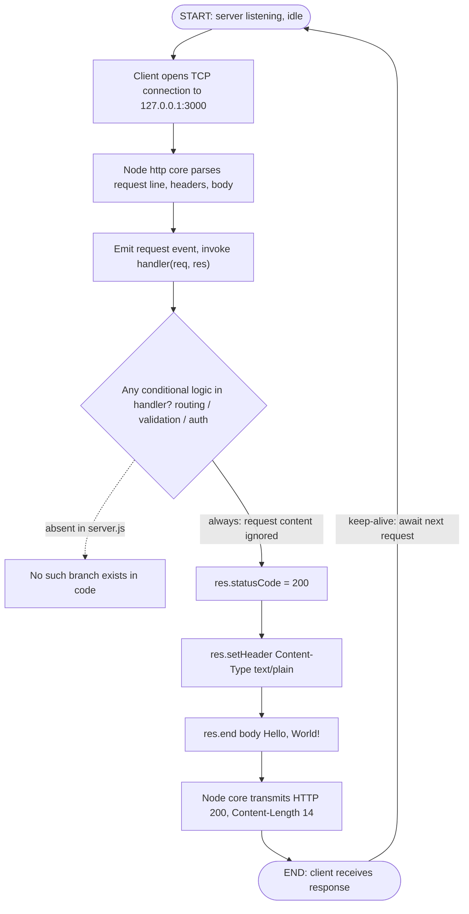
```mermaid
flowchart TD
    Start(["START: server listening, idle"]) --> Conn["Client opens TCP connection to 127.0.0.1:3000"]
    Conn --> Parse["Node http core parses request line, headers, body"]
    Parse --> Dispatch["Emit request event, invoke handler(req, res)"]
    Dispatch --> Branch{"Any conditional logic in handler? routing / validation / auth"}
    Branch -.->|"absent in server.js"| NoBranch["No such branch exists in code"]
    Branch -->|"always: request content ignored"| S1["res.statusCode = 200"]
    S1 --> S2["res.setHeader Content-Type text/plain"]
    S2 --> S3["res.end body Hello, World!"]
    S3 --> Send["Node core transmits HTTP 200, Content-Length 14"]
    Send --> Done(["END: client receives response"])
    Done -->|"keep-alive: await next request"| Start
```

**System boundary.** The application layer owns only the three response statements; connection handling, HTTP parsing, and transmission belong to the Node `http` core (**2.3 Shared Components**). **User touchpoint:** the loopback endpoint `http://127.0.0.1:3000/`. **Error states:** the handler performs no I/O and no parsing, so it raises no application error; the only failure modes are lower-layer/OS transport conditions handled by Node core defaults (analyzed in **4.4.2**). **Timing / SLA:** none defined; observationally the work is constant-time with no I/O (**2.4.1**), but no latency or throughput target exists in the repository.


## 4.3 Flowchart Requirements & Validation Rules

This section maps each workflow to the standard flowchart elements (start/end points, process steps, decision diamonds, system boundaries, user touchpoints, error states, recovery paths, timing) and then documents the validation, authorization, and compliance checkpoints. Consistent with the evidence-based approach used throughout this specification, checkpoints that a production service would typically implement but that are **not present in this fixture's code** are recorded as *not present* with their supporting evidence, never invented.

### 4.3.1 Per-Workflow Flowchart Requirements

The matrix below itemizes the required flowchart elements for the two runnable workflows diagrammed in **4.1** and **4.2**.

| Flowchart Element | Server Bootstrap Flow (F-002) | Request → Response Flow (F-001) |
| --- | --- | --- |
| Start point | `node server.js` process launch | Listening server receives a client connection |
| End point(s) | Listening/idle (success) **or** process exit code 1 (bind failure) | Client receives `HTTP 200` response |
| Process steps | require `http` → read constants → `createServer` → `listen` → readiness log | accept → parse (core) → invoke handler → set status/header/body → transmit |
| Decision diamonds | Port `3000` free on loopback? (single decision) | None at application layer (handler is unconditional) |
| System boundaries | Single Node process + OS TCP stack (loopback bind) | Application (3 statements) vs. Node `http` core (accept/parse/transmit) |
| User touchpoints | stdout readiness line | Loopback endpoint `http://127.0.0.1:3000/` |
| Error states | Unhandled `error` event (`EADDRINUSE`) | None raised by app code (handler does no I/O/parsing) |
| Recovery paths | **None** — process crashes; recovery is manual restart | **None required** — no failing app step; core defaults apply |
| Timing / SLA | None defined (no startup/bind-latency target) | None defined (no latency/throughput target) |

### 4.3.2 Validation Rules, Authorization & Compliance Checkpoints

**Business rules at each step.** The request workflow enforces **no business rules**. The handler returns the same constant response for every request regardless of method, path, headers, or body, so there is no step at which a domain rule is evaluated (`server.js`; verified empirically across multiple methods/paths in **4.1.1**). The only "rule" encoded anywhere in the runnable code is the invariant *"always respond `200` with `Hello, World!\n`."*

**Data validation requirements.** There is **no input validation and no output validation**. The inbound request object is never read, so no schema, type, length, or content check is applied to any request field. The response body is a fixed string literal, so there is no output to validate. This is corroborated by **2.4.1** (the handler "reads no input and returns a fixed non-sensitive string").

**Authorization checkpoints.** There are **no authentication or authorization checkpoints** in the workflow — no credentials, tokens, sessions, API keys, or access-control checks exist in the code (`server.js`; **2.4.1 / 2.4.2**). The stub `LoginTest.java` does not compile and implements no login logic, so it contributes no authorization capability (**2.1**, "Artifacts Excluded"). The **only** access control that exists in practice is a network-level side effect: because F-002 binds to `127.0.0.1`, the endpoint is reachable exclusively from the local host — described in **2.4.2** as "the primary control limiting network exposure." This is a binding characteristic, not an authorization check inside the request flow.

**Regulatory compliance checks.** There are **no regulatory compliance checks** and no processing that would trigger them. The server collects no user data, persists nothing, logs no request content, and returns non-sensitive constant text; there is no database, connection string, or credential anywhere (**3.5 Databases & Storage**). Transport is plain HTTP with no TLS (**2.4.1**). Consequently there is no PII handling, audit logging, consent capture, or data-retention flow to govern — the compliance surface of the runnable code is effectively empty.

The validation/authorization/compliance posture is summarized below.

| Checkpoint | Present in runnable code? | Evidence |
| --- | --- | --- |
| Business rule evaluation | No — constant response, no domain logic | `server.js`; **4.1.1** |
| Input (request) validation | No — request never parsed or checked | `server.js`; **2.4.1** |
| Output (response) validation | No — fixed literal body | `server.js` |
| Authentication | No — no credentials/tokens/sessions | `server.js`; **2.4.1 / 2.4.2** |
| Authorization / access control | No — only loopback binding limits reach | `server.js`; **2.4.2** |
| Rate limiting / throttling | No | **2.4.2** |
| Transport security (TLS) | No — plain HTTP | **2.4.1** |
| Regulatory compliance / audit | No — no data collected, stored, or logged | `server.js`; **3.5** |


## 4.4 State Management and Error Handling

This section documents the technical-implementation aspects of the workflows: how state transitions occur across the process lifecycle, where data is persisted or cached, what transaction boundaries exist, and how errors are detected, notified, and recovered from. The application code holds no application state and implements no explicit error handling, so the behavior documented here is the process lifecycle plus the **default** Node.js runtime behavior, verified empirically.

### 4.4.1 State Management

**State transitions.** The only state machine in the system is the **process/server lifecycle**; there is no per-user, per-session, or domain state. The process moves from launch to a listening/idle state, transiently serves each request, and terminates either by an unrecoverable bind error or by an OS signal. Request handling is fully stateless — each request is independent and shares no mutable state with any other (`server.js`; **3.5 Databases & Storage**).

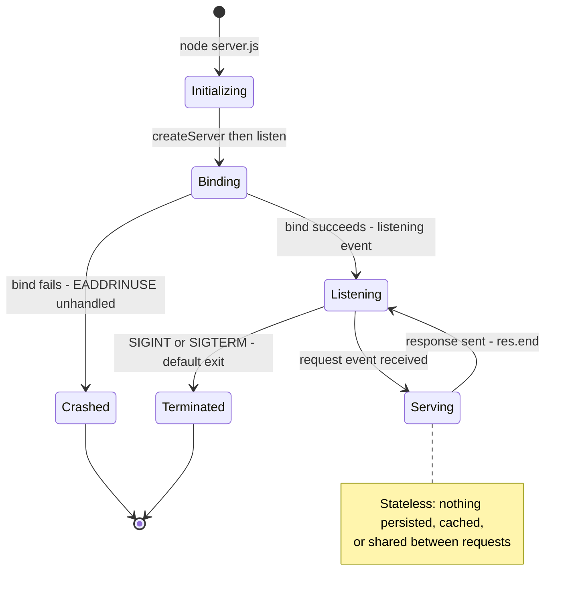
```mermaid
stateDiagram-v2
    [*] --> Initializing: node server.js
    Initializing --> Binding: createServer then listen
    Binding --> Listening: bind succeeds - listening event
    Binding --> Crashed: bind fails - EADDRINUSE unhandled
    Listening --> Serving: request event received
    Serving --> Listening: response sent - res.end
    Listening --> Terminated: SIGINT or SIGTERM - default exit
    Crashed --> [*]
    Terminated --> [*]
    note right of Serving
        Stateless: nothing persisted, cached,
        or shared between requests
    end note
```

**Data persistence points.** **None.** The server never reads or writes any data store; it returns a constant response and holds no in-memory or on-disk application state between requests (**3.5**). The static files in the repository (`industry.csv` and the sample binaries) are version-controlled artifacts on disk, not runtime persistence — no code path reads, writes, or mutates them (**2.4.4 / 3.5**).

**Caching requirements.** **None.** There is no cache client (no Redis/Memcached) and no in-process cache; the handler recomputes (re-emits) the same constant response on every request rather than caching it (**3.5**). No HTTP cache-control headers are set by the application — only Node core's default `Content-Type` handling and connection headers appear (verified empirically: the app sets only `Content-Type`, while `Date`, `Connection: keep-alive`, and `Keep-Alive` are added by Node core).

**Transaction boundaries.** **None.** With no database, no external calls, and no multi-step mutation, there is no transactional unit of work to demarcate. Each request is an isolated, side-effect-free computation that produces a fixed response and commits nothing.

| State-management concern | Status | Evidence |
| --- | --- | --- |
| Application/session state | None (stateless per request) | `server.js`; **3.5** |
| Data persistence points | None (no store read/written at runtime) | **3.5** |
| Caching layer | None (constant response recomputed) | **3.5** |
| Transaction boundaries | None (no multi-step mutation) | `server.js` |
| Process lifecycle state | Managed implicitly by Node runtime | `server.js` (state diagram above) |

### 4.4.2 Error Handling & Recovery

The application code registers **no** error handling — there is no `try/catch`, no `'error'` event listener on the server, no request-level error branch, and no graceful-shutdown/signal handling (**2.4.2**). The behavior below is therefore the Node.js runtime default, confirmed empirically by launching a second instance to force a port conflict.

**Error-handling flowchart.** The diagram separates the startup error domain (the only place a real error arises), the request-time domain (no app error is raised), and the manual recovery loop.

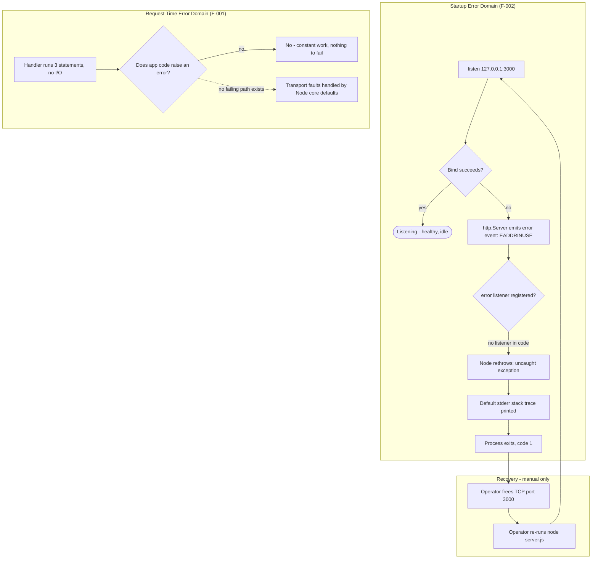
```mermaid
flowchart TD
    subgraph STARTUP["Startup Error Domain (F-002)"]
        BindTry["listen 127.0.0.1:3000"]
        BindQ{"Bind succeeds?"}
        OK(["Listening - healthy, idle"])
        ErrEvt["http.Server emits error event: EADDRINUSE"]
        ListenerQ{"error listener registered?"}
        Rethrow["Node rethrows: uncaught exception"]
        StackTrace["Default stderr stack trace printed"]
        ProcExit["Process exits, code 1"]
    end
    subgraph RUNTIME["Request-Time Error Domain (F-001)"]
        HandlerRun["Handler runs 3 statements, no I/O"]
        AppErrQ{"Does app code raise an error?"}
        NoErr["No - constant work, nothing to fail"]
        CoreDefault["Transport faults handled by Node core defaults"]
    end
    subgraph RECOVERY["Recovery - manual only"]
        FreePort["Operator frees TCP port 3000"]
        Restart["Operator re-runs node server.js"]
    end

    BindTry --> BindQ
    BindQ -->|yes| OK
    BindQ -->|no| ErrEvt
    ErrEvt --> ListenerQ
    ListenerQ -->|"no listener in code"| Rethrow
    Rethrow --> StackTrace --> ProcExit
    ProcExit --> FreePort
    FreePort --> Restart --> BindTry
    HandlerRun --> AppErrQ
    AppErrQ -->|no| NoErr
    AppErrQ -.->|"no failing path exists"| CoreDefault
```

**Retry mechanisms.** **None.** A bind failure is not retried, and there is no alternate-port fallback, backoff, or reconnection logic — the process terminates immediately (empirically: exit code 1).

**Fallback processes.** **None.** There is no secondary handler, degraded-mode response, or alternate binding; a failure is terminal for that process instance.

**Error notification flows.** The **only** notification is Node's default uncaught-exception output written to **stderr** — a stack trace ending with the error object. There is no alerting, monitoring, metrics, or log aggregation. The empirically captured notification is:

```text
Error: listen EADDRINUSE: address already in use 127.0.0.1:3000
  code: 'EADDRINUSE', errno: -98, syscall: 'listen'
```

On the success path, the corresponding "positive" notification is the single stdout readiness line (`Server running at http://127.0.0.1:3000/`). No health-check endpoint exists to poll for liveness (**2.4.2**).

**Recovery procedures.** Recovery is **manual**. There is no process manager, orchestrator, clustering, or auto-restart configured (**2.4.2**), so after a crash an operator must free port `3000` (or stop the conflicting process) and re-run `node server.js`. During a normal request the first server keeps serving even while a conflicting second instance crashes (verified empirically), and after `SIGTERM` the port stops accepting connections with no graceful-shutdown sequence — the process simply exits.

| Error-handling concern | Status | Evidence |
| --- | --- | --- |
| Retry / backoff | None | `server.js`; empirical (exit code 1) |
| Fallback / degraded mode | None | `server.js` |
| Alternate-port / reconnection | None | `server.js` |
| Graceful shutdown / signal handling | None | **2.4.2** |
| Error notification | Default stderr stack trace only | empirical |
| Auto-recovery / process manager | None | **2.4.2** |
| Recovery procedure | Manual: free port + restart | empirical + **2.4.2** |


## 4.5 References

**Repository files examined for this section**

- `server.js` — established the entire runnable workflow: the `http.createServer` inline handler (F-001), the `server.listen('127.0.0.1', 3000)` bootstrap and readiness log (F-002), and the absence of routing, validation, auth, error listeners, and state.
- `package.json` — established the non-functional `main`/`start`/`test` entries (server must be launched directly) and the zero-dependency declaration.
- `package-lock.json` — confirmed the empty dependency tree (no DB driver, API client, broker, cache, or cloud SDK).
- `README.md` — established the fixture purpose ("test project for backprop integration") and the contextual (external) integration signal.
- `LoginTest.java` — confirmed it is a non-compiling stub contributing no authorization/login capability.
- `industry.csv` — confirmed a 43-row static taxonomy that is inert (never read by code); no data-flow participation.
- `100Pages.pdf`, `demo.jpg`, `sample.doc` — confirmed inert on-disk sample assets not read by any code path (no batch/data-flow participation).
- `test.py.txt`, `test.txt.txt` — confirmed 0-byte placeholders with no runtime role.

**Empirical verification performed against the checked-out repository**

- Ran `server.js` on Node.js v22.23.1 to confirm: the exact stdout readiness line; the uniform `HTTP 200`/`text/plain`/`Content-Length: 14`/`Hello, World!\n` response across `GET`/`POST`/`PUT`/`DELETE` and multiple paths; the Node-core-added `Date`/`Connection`/`Keep-Alive` headers; and the unhandled-`error` `EADDRINUSE` crash (exit code 1) with no retry/fallback/recovery.

**Cross-referenced Technical Specification sections**

- `1.2 System Overview` (1.2.2 High-Level Description, 1.2.3 Success Criteria) — corroborated the single request-handling flow and the absence of any defined SLA/KPI/success criteria.
- `2.1 Feature Catalog` (2.1.3, 2.1.4) — provided the F-001…F-004 identifiers and the excluded non-functional artifacts referenced throughout.
- `2.3 Feature Relationships` — corroborated the single inbound loopback integration surface, the F-002-hosts-F-001 coupling, and the absence of outbound integrations/event processing.
- `2.4 Implementation Considerations` (2.4.1, 2.4.2, 2.4.3, 2.4.4) — corroborated the loopback-only binding as the sole network control, the unhandled `EADDRINUSE` behavior, the lack of signal handling/graceful shutdown, and the inert-asset treatment.
- `3.2 Frameworks & Libraries` — corroborated that the built-in Node `http` module is the only library involved.
- `3.4 Third-Party Services` — corroborated the absence of external services/APIs.
- `3.5 Databases & Storage` — corroborated the fully stateless design: no database, cache, ORM, transactions, or runtime persistence.

*No external/web sources were required for this section; all claims are grounded in repository evidence and empirical verification.*


# 5. System Architecture

## 5.1 High-Level Architecture

The `hao-backprop-test` repository is a minimal Node.js test fixture whose only executable artifact is `server.js`. This section documents the architecture of that runtime, grounded strictly in the tracked source and in behavior verified by running the server. Because the repository is deliberately small — 11 Git-tracked files, no subfolders, and a single 14-line runtime module — the architecture is correspondingly compact. This section is therefore explicit about which architectural concerns are present, which are intentionally absent, and the evidence for each. Feature identifiers (F-001–F-004) are consistent with **2.1 Feature Catalog**, and the underlying technology facts are consistent with **3.2 Frameworks & Libraries** and **3.5 Databases & Storage**.

### 5.1.1 System Overview

**Architecture style and rationale.** The system is a **single-process, single-threaded, event-driven monolith**. The entire runtime lives in one CommonJS module, `server.js`, which uses only Node.js's built-in `http` module to create an HTTP server and bind it to a hardcoded loopback address (`127.0.0.1:3000`). There is no application framework, no service decomposition, no middleware pipeline, and no build step — the script is interpreted and run directly with `node server.js`. This is the canonical "minimal reference server" pattern. The rationale is documented by the project's own purpose: `README.md` declares it a "test project for backprop integration. Do not touch!", so the design is intentionally the simplest arrangement sufficient to expose a deterministic HTTP endpoint that an external integration/QA process can exercise. Adopting a web framework, layered services, or persistence would add complexity with no benefit to that fixture goal (consistent with **3.2 Frameworks & Libraries**).

**Key architectural principles and patterns (as observed).**

- **Standard-library-only / zero third-party dependency.** `server.js` imports only Node's built-in `http`; `package.json` declares no dependencies and `package-lock.json` (lockfileVersion 3) resolves none, so there is no framework or library layer.
- **Stateless request handling.** Each request is fully independent; no session, in-memory, or on-disk application state is read, written, or shared between requests (**4.4.1 State Management**).
- **Unconditional (catch-all) handler.** A single inline handler responds identically to every request; there is no routing table, method dispatch, or content negotiation.
- **Side-effect module.** The module exports nothing; requiring or executing it starts the server as a side effect of `server.listen(...)`.
- **Hardcoded configuration.** Host and port are compile-time constants; there are no environment variables, flags, or config files (**2.4.2**).
- **Loopback confinement.** Binding to `127.0.0.1` (not `0.0.0.0`) restricts reach to the same host, which is the system's primary exposure control.

**System boundaries and major interfaces.** The trust and process boundary is a single host and a single Node.js process. The system exposes exactly one inbound interface and two outbound console streams; it opens no outbound network connections and integrates with no external systems.

| Interface | Direction | Protocol / Binding |
| --- | --- | --- |
| HTTP endpoint | Inbound | HTTP/1.1 over TCP, `127.0.0.1:3000` (loopback only) |
| Standard output (`stdout`) | Outbound (console) | One readiness line: `Server running at http://127.0.0.1:3000/` |
| Standard error (`stderr`) | Outbound (console) | Uncaught-error stack trace on bind failure (default Node behavior) |

The diagram below fixes the system boundary, the single inbound interface, the console outputs, and the categories of external systems that are deliberately not integrated.

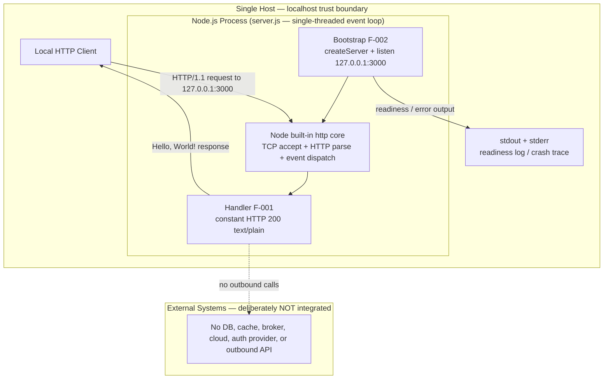
```mermaid
flowchart TB
    subgraph HOST["Single Host — localhost trust boundary"]
        Client["Local HTTP Client"]
        subgraph PROC["Node.js Process (server.js — single-threaded event loop)"]
            Boot["Bootstrap F-002<br/>createServer + listen 127.0.0.1:3000"]
            HttpCore["Node built-in http core<br/>TCP accept + HTTP parse + event dispatch"]
            Handler["Handler F-001<br/>constant HTTP 200 text/plain"]
            Boot --> HttpCore --> Handler
        end
        Logs["stdout + stderr<br/>readiness log / crash trace"]
        Client -->|"HTTP/1.1 request to 127.0.0.1:3000"| HttpCore
        Handler -->|"Hello, World! response"| Client
        Boot -->|"readiness / error output"| Logs
    end
    subgraph EXT["External Systems — deliberately NOT integrated"]
        NoExt["No DB, cache, broker, cloud, auth provider, or outbound API"]
    end
    Handler -. "no outbound calls" .-> NoExt
```

### 5.1.2 Core Components

The tracked files group into a small set of components, of which only two (F-001 and F-002, both inside `server.js`) execute at runtime; the Node `http` core is the sole runtime dependency, while F-003 and F-004 are build-time/static artifacts. No component depends on another at runtime except that the handler (F-001) is hosted by the bootstrap (F-002) within the same process (**2.3 Feature Relationships**). The requested component attributes are split across two tables to respect the four-column limit.

| Component | Primary Responsibility | Key Dependencies | Integration Points |
| --- | --- | --- | --- |
| HTTP Server Bootstrap (F-002, `server.js`) | Create the server and bind `127.0.0.1:3000`; emit the readiness log line | Node built-in `http`; `stdout` | Inbound loopback TCP port 3000; hosts the handler (F-001) |
| Static Response Handler (F-001, `server.js` inline) | Return constant `HTTP 200`, `Content-Type: text/plain`, body `Hello, World!\n` to every request | F-002 (must be listening); Node `http` response API | Invoked by the `http` core `request` event |
| Node.js `http` Core (runtime dependency) | Accept TCP connections, parse HTTP, dispatch `request`/`listening`/`error` events | Node.js runtime | Sits between the client socket and the handler |
| Package & Dependency Baseline (F-003, `package.json` / `package-lock.json`) | Declare package identity/license; pin the empty dependency tree | npm / Node toolchain | Consumed by `npm install` / tooling at build time |
| Static Reference & Sample Assets (F-004) | Provide inert CSV/PDF/JPEG/DOC fixtures on disk | Filesystem (no code path) | None in code; readable only by an external process |

| Component | Critical Considerations |
| --- | --- |
| HTTP Server Bootstrap (F-002) | Host/port are hardcoded and loopback-only; the `listen` callback registers no `error` listener, so an `EADDRINUSE` conflict crashes the process (exit code 1); no graceful-shutdown/signal handling (**2.4.2**, **4.4.2**) |
| Static Response Handler (F-001) | Ignores all request input (method/path/headers/body); output can change only by editing source; no automated test guards behavior (**2.4.1**) |
| Node.js `http` Core | Runtime version is not pinned (no `engines`/`.nvmrc`); supplies default `Date`, `Connection: keep-alive`, and `Keep-Alive` headers not set by app code |
| Package & Dependency Baseline (F-003) | `main` points to a non-existent `index.js`; `test` script fails by design; no `start` script, so `npm start`/`node .` will not launch the server (**2.4.3**, **3.6.2**) |
| Static Reference & Sample Assets (F-004) | ~11.4 MB of binaries are stored directly in Git (not Git LFS); never served, parsed, or transformed (**2.4.4**, **3.5**) |

### 5.1.3 Data Flow Description

**Primary data flow.** The system carries a single, unidirectional payload of application data: the constant string literal `Hello, World!\n` (14 bytes) is embedded in `server.js` source, and on every request it flows outward as the HTTP response body to the requesting client. In parallel, the readiness string `Server running at http://127.0.0.1:3000/` is written once to `stdout` when the server binds. Inbound request data (request line, headers, body, query string) is received and parsed by the Node `http` core but is **never read by application code** — it is effectively discarded, as verified empirically (identical responses for `GET /`, `POST /some/other/path`, and `/foo/bar?q=1`).

**Integration patterns and protocols.** The only interaction pattern is a synchronous **HTTP/1.1 request–response** exchange over a TCP loopback socket. Internally, the process is event-driven in the manner intrinsic to Node.js: the `http` server emits a `request` event (dispatched to the handler), a `listening` event (consumed by the `listen` callback that logs readiness), and an `error` event on bind failure. There is no publish/subscribe, message queue, streaming, or batch pattern (**4.1.2**).

**Data transformation points.** **None.** The response body is a compile-time constant, so there is no serialization/deserialization, templating, encoding conversion, validation, or enrichment. The handler sets a status code and a single header and ends the response with the literal string; Node core is solely responsible for framing the bytes on the wire.

**Key data stores and caches.** **None at runtime.** There is no database, no in-process or external cache (no Redis/Memcached), and no ORM; the handler recomputes (re-emits) the same constant response on every request rather than caching it (**3.5 Databases & Storage**, **4.4.1**). The only persistent artifacts are the Git-tracked static files (`industry.csv`, `100Pages.pdf`, `demo.jpg`, `sample.doc`), which are inert on disk and never read by any code path.

| Data Element | Source | Destination | Transformation |
| --- | --- | --- | --- |
| `Hello, World!\n` (14 bytes) | Literal in `server.js` | HTTP response body → client | None (constant) |
| Request line / headers / body | Local HTTP client | Received by `http` core, then discarded | None (never read by app code) |
| Startup readiness URL string | `server.js` template literal | `stdout` (operator) | None |

### 5.1.4 External Integration Points

The system has a **single inbound integration surface and no outbound integrations**. It contacts no databases, third-party APIs, message brokers, authentication providers, monitoring services, or cloud platforms — corroborated by the empty dependency tree (`package-lock.json`) and confirmed in **3.4 Third-Party Services**, **3.5 Databases & Storage**, and **4.1.2 Integration Workflows**. The requested attributes are consolidated into four columns (data-exchange pattern and protocol/format are merged), and service-level requirements are recorded as *none defined* because no SLA, latency, or throughput target appears anywhere in the repository (**1.2.3**, **4.1**).

| System / Surface | Integration Type | Protocol & Data-Exchange Pattern | SLA Requirements |
| --- | --- | --- | --- |
| Local HTTP client (same host) | Inbound, synchronous | HTTP/1.1 over TCP `127.0.0.1:3000`; request→response; `text/plain` constant body | None defined |
| Databases / caches / message brokers | Not integrated | N/A (no driver or client in the dependency tree) | N/A |
| Third-party APIs / cloud / auth / monitoring | Not integrated | N/A (no SDK, credentials, or outbound calls) | N/A |

**Contextual note.** The only integration signal beyond code is contextual: `README.md` states the repository exists as a "test project for backprop integration," and the multiple environment/QA Git branches indicate it is checked out and exercised as a fixture by an **external** tooling process. That process operates outside the repository's own code and is therefore outside the runtime integration boundary documented here (**4.1.2**).

## 5.2 Component Details

This section details each major component identified in **5.1.2**. Only two components execute at runtime — the bootstrap (F-002) and the handler (F-001), both contained in `server.js` and both depending on the Node `http` core. The package baseline (F-003) and the static assets (F-004) are build-time/inert artifacts. The three non-functional artifacts (`LoginTest.java`, a non-compiling Java stub, and the two 0-byte `.txt` placeholders) are excluded here because they implement no component behavior (**2.1**).

### 5.2.1 Component Interaction Overview

At runtime the operator launches the process, the bootstrap registers the handler and binds the loopback port, and thereafter the Node `http` core mediates every client exchange by dispatching a `request` event to the handler. The package baseline and static assets are shown as non-runtime artifacts to make explicit that they are not loaded by the process.

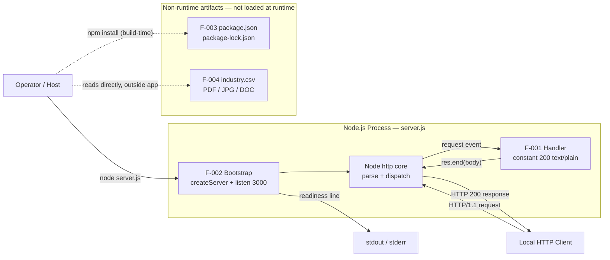
```mermaid
flowchart LR
    Operator["Operator / Host"]
    Client["Local HTTP Client"]
    Console["stdout / stderr"]
    subgraph Process["Node.js Process — server.js"]
        F002["F-002 Bootstrap<br/>createServer + listen 3000"]
        Core["Node http core<br/>parse + dispatch"]
        F001["F-001 Handler<br/>constant 200 text/plain"]
        F002 --> Core
        Core -->|"request event"| F001
        F001 -->|"res.end(body)"| Core
    end
    subgraph NonRuntime["Non-runtime artifacts — not loaded at runtime"]
        F003["F-003 package.json<br/>package-lock.json"]
        F004["F-004 industry.csv<br/>PDF / JPG / DOC"]
    end
    Operator -->|"node server.js"| F002
    F002 -->|"readiness line"| Console
    Client -->|"HTTP/1.1 request"| Core
    Core -->|"HTTP 200 response"| Client
    Operator -.->|"npm install (build-time)"| F003
    Operator -.->|"reads directly, outside app"| F004
```

### 5.2.2 Runtime Application: HTTP Server (`server.js`)

The sole runtime application combines two features that live in one 14-line module: the server bootstrap (F-002) and the static response handler (F-001).

- **Purpose and responsibilities.** F-002 instantiates the server with `http.createServer(handler)`, binds it to the hardcoded constants `hostname = '127.0.0.1'` and `port = 3000` via `server.listen(...)`, and writes a single readiness line to `stdout` on success. F-001 is the inline handler that, for **every** inbound request regardless of method, path, headers, or body, sets status `200`, sets `Content-Type: text/plain`, and ends the response with `Hello, World!\n`. Empirical testing confirmed the response is identical across methods and paths.
- **Technologies and frameworks.** JavaScript in the CommonJS module system, executed by the Node.js runtime (version not pinned — no `engines`/`.nvmrc`, per **3.6.1**). The only technology beyond the language is Node's built-in `http` module; there is **no** web framework, router, middleware, or template engine (**3.2**). The implementation is three standard-library call groups: `http.createServer(...)`, the response methods (`res.statusCode`, `res.setHeader`, `res.end`), and `server.listen(...)`.
- **Key interfaces and APIs.** One inbound interface — HTTP/1.1 on `127.0.0.1:3000` — behaving as a single implicit catch-all endpoint (no versioned API, no route table, no content negotiation). Programmatic surface: the `http.Server` object and the `(req, res)` handler signature. Observability surface: the `stdout` readiness line and the `stderr` stack trace on crash. The module exports nothing, so it cannot be imported as a library — requiring it starts the server as a side effect (**2.4.2**).
- **Data persistence requirements.** None. The component is stateless: it reads and writes no data store, holds no in-memory state between requests, and recomputes the same constant response every time (**3.5**, **4.4.1**).
- **Scaling considerations.** Runs as a single Node.js process on the default single-threaded event loop; there is no clustering (`cluster`), no `worker_threads`, no load balancer, and no process manager configured (**2.4.1**, **3.6.3**). The loopback binding restricts reach to one host, and the handler performs constant-time work with no I/O. Any horizontal or vertical scaling would require source changes (e.g., adding the `cluster` module or fronting multiple instances with a reverse proxy) — none of which is present.

#### 5.2.2.1 Process State Transitions

The only state machine in the system is the process/server lifecycle; there is no per-request or domain state. The process initializes, binds, serves requests transiently, and terminates either by an unrecoverable bind error or an OS signal (verified empirically; consistent with **4.4.1**).

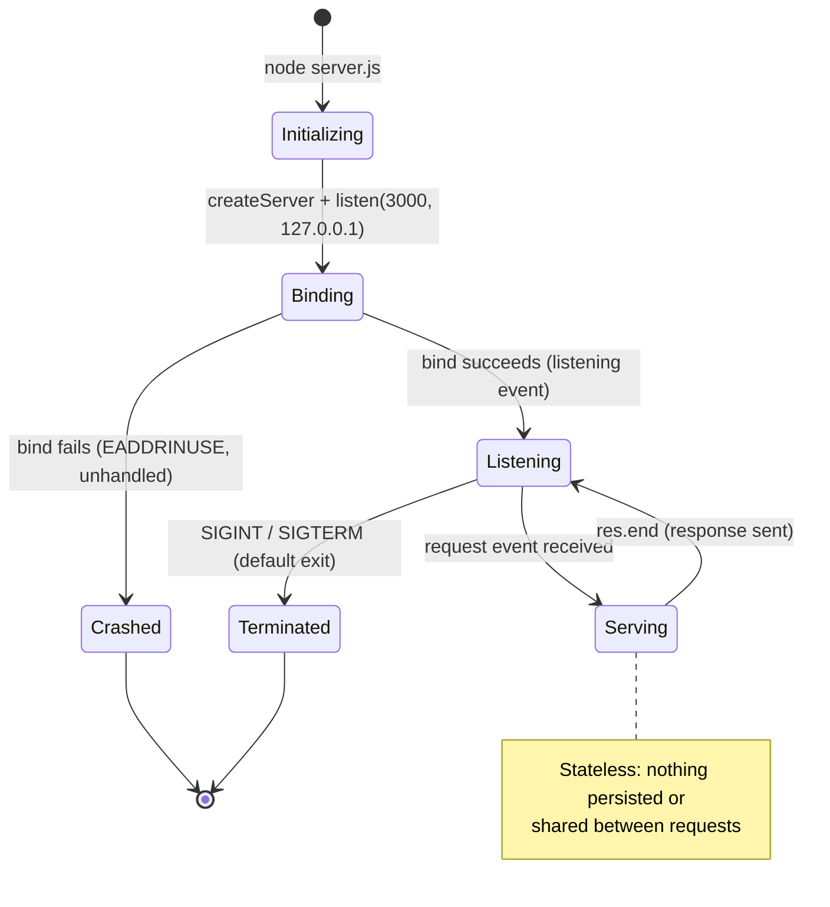
```mermaid
stateDiagram-v2
    [*] --> Initializing: node server.js
    Initializing --> Binding: createServer + listen(3000, 127.0.0.1)
    Binding --> Listening: bind succeeds (listening event)
    Binding --> Crashed: bind fails (EADDRINUSE, unhandled)
    Listening --> Serving: request event received
    Serving --> Listening: res.end (response sent)
    Listening --> Terminated: SIGINT / SIGTERM (default exit)
    Crashed --> [*]
    Terminated --> [*]
    note right of Serving
        Stateless: nothing persisted or
        shared between requests
    end note
```

#### 5.2.2.2 Key Flow Sequences

The bootstrap sequence shows the two outcomes of the bind decision — the readiness log on success and the unhandled-error crash on `EADDRINUSE` (detailed in **4.4.2**).

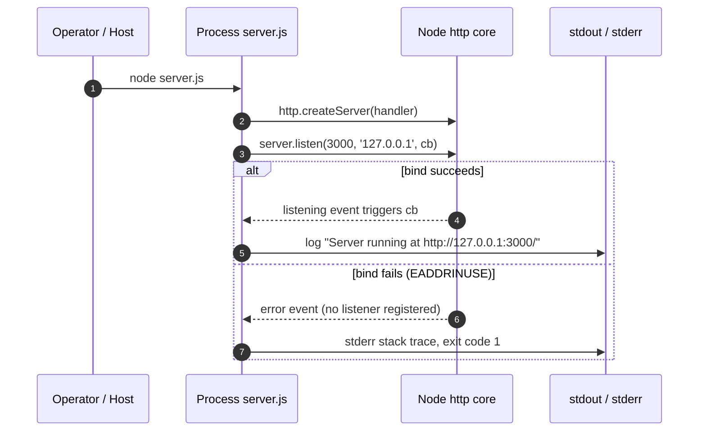
```mermaid
sequenceDiagram
    autonumber
    participant Op as Operator / Host
    participant P as Process server.js
    participant Core as Node http core
    participant Out as stdout / stderr
    Op->>P: node server.js
    P->>Core: http.createServer(handler)
    P->>Core: server.listen(3000, '127.0.0.1', cb)
    alt bind succeeds
        Core-->>P: listening event triggers cb
        P->>Out: log "Server running at http://127.0.0.1:3000/"
    else bind fails (EADDRINUSE)
        Core-->>P: error event (no listener registered)
        P->>Out: stderr stack trace, exit code 1
    end
```

The request sequence shows one full round trip and annotates the absence of any downstream call.

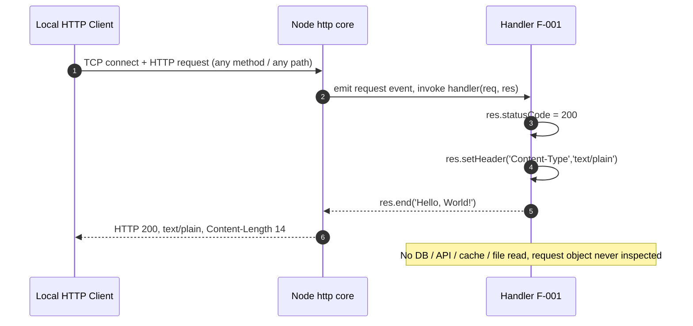
```mermaid
sequenceDiagram
    autonumber
    participant C as Local HTTP Client
    participant Core as Node http core
    participant H as Handler F-001
    C->>Core: TCP connect + HTTP request (any method / any path)
    Core->>H: emit request event, invoke handler(req, res)
    H->>H: res.statusCode = 200
    H->>H: res.setHeader('Content-Type','text/plain')
    H-->>Core: res.end('Hello, World!')
    Core-->>C: HTTP 200, text/plain, Content-Length 14
    Note over H: No DB / API / cache / file read, request object never inspected
```

### 5.2.3 Package & Dependency Baseline (F-003)

- **Purpose and responsibilities.** Declare the package identity (`hello_world` v`1.0.0`, MIT, author `hxu`) and pin a deterministic, empty dependency graph so integration tooling can process the workspace reproducibly across environments.
- **Technologies and frameworks.** Two declarative JSON manifests — `package.json` and `package-lock.json` (`lockfileVersion` 3, implying npm v7+) — read by the npm/Node toolchain (**3.6.1**). No runtime code.
- **Key interfaces and APIs.** The npm manifest contract (`name`, `version`, `main`, `scripts`, `author`, `license`) and the single `test` npm script, which runs `echo "Error: no test specified" && exit 1` and therefore always fails. There is no programmatic runtime interface.
- **Data persistence requirements.** None beyond version control; the manifests are static files with no runtime read/write.
- **Scaling considerations.** The empty dependency tree makes `npm install` resolve instantly with nothing to scale. Two as-built defects constrain runnability: `main` references a non-existent `index.js`, and there is no `start` script, so `npm start`/`node .` will not launch the server — the runnable entry (`server.js`) must be invoked directly (**2.4.3**, **3.6.2**).

### 5.2.4 Static Reference & Sample Data Assets (F-004)

- **Purpose and responsibilities.** Provide representative, inert, version-controlled fixtures — a tabular taxonomy plus multi-format binary documents — for an external integration/QA process to exercise file-handling behavior deterministically.
- **Technologies and formats.** `industry.csv` (single `Industry` column, 43 sector labels), `100Pages.pdf` (PDF 1.7, ~9.1 MB), `demo.jpg` (JPEG/EXIF, ~2.1 MB), and `sample.doc` (OLE2 legacy Word, ~96 KB). File formats verified by magic bytes.
- **Key interfaces and APIs.** None in code — no parser, loader, endpoint, or script references these files; they are served neither by the HTTP server nor any other code. Any consumption is performed by an external process reading them directly from disk (**4.1.2**).
- **Data persistence requirements.** Static files committed directly to Git (not Git LFS); there is no runtime read/write path (**3.5**).
- **Scaling considerations.** Because the assets are never served, there is no streaming or pagination concern; however, the large binaries dominate the ~11.4 MB working tree and increase clone time, and Git LFS would be advisable if they were revised frequently (**2.4.4**).

## 5.3 Technical Decisions

The repository contains no formal architecture-decision documents, roadmap, or design notes. The decisions below are therefore **reconstructed from the as-built code**, with each rationale inferred from the implementation itself and the project's stated purpose in `README.md` ("test project for backprop integration. Do not touch!"). Every decision is tied to observable evidence; where a driver is an inference rather than a documented statement, it is framed as such.

### 5.3.1 Architecture Style Decisions & Tradeoffs

The overarching decision is to keep the runtime as small as possible — a single interpreted file with no framework, no build, and no external moving parts — because the fixture's only job is to expose a deterministic HTTP endpoint. The principal style decisions and their tradeoffs are summarized below.

| Decision | Chosen Approach | Rejected Alternative | Tradeoff / Consequence |
| --- | --- | --- | --- |
| Application structure | Single-file CommonJS monolith (`server.js`) | Layered/modular services or microservices | Minimal footprint and instant comprehension vs. no separation of concerns and no extensibility |
| HTTP layer | Raw Node `http` core | Express / Koa / Fastify framework | Zero dependencies and no supply-chain surface vs. routing/middleware must be hand-rolled if ever needed |
| Concurrency model | Default single-threaded event loop | `cluster` / `worker_threads` | Simplicity vs. no multi-core utilization or process-level resilience |
| Process start | Side-effect module (no exports) | Exported factory with explicit `start()` | Trivial `node server.js` vs. not importable or unit-testable |
| Configuration | Hardcoded host/port constants | Environment variables / config file | Determinism and no config surface vs. source edit required to change binding |

### 5.3.2 Communication Pattern Choices

The system uses exactly one communication pattern: **synchronous HTTP/1.1 request–response over a TCP loopback socket**. Internally the process is event-driven only in the manner intrinsic to Node.js — the `http` server emits `request`, `listening`, and `error` events — but there is no application-level messaging. The inferred rationale is that a test fixture only needs a synchronously invokable endpoint that returns a predictable result; a request/response call is the simplest contract that satisfies that. Consequently there is **no** asynchronous messaging, publish/subscribe, message broker, queue, streaming, WebSocket, or RPC/gRPC layer anywhere in the code (**4.1.2**). The tradeoff is that the system cannot push data to clients or stream large payloads, neither of which the fixture requires.

### 5.3.3 Data Storage & Caching Rationale

**Data storage.** The system deliberately uses **no database, no ORM, and no external storage service**. The inferred rationale is direct: the response is a compile-time constant, so there is no data domain to model, persist, or query. Introducing a store would add credentials, connection management, and an attack surface with zero functional benefit. The only persisted artifacts are Git-tracked static files (F-004), which are inert and never read at runtime (**3.5**).

**Caching.** No caching layer (in-process or external such as Redis/Memcached) is present, and the application sets no HTTP `Cache-Control` headers (only `Content-Type` is set by app code; `Date`, `Connection: keep-alive`, and `Keep-Alive` are added by Node core). The justification is that the handler performs constant-time work with no I/O — there is nothing expensive to memoize — so recomputing (re-emitting) the constant response on each request is cheaper than maintaining a cache (**4.4.1**).

| Concern | Decision | Rationale | Consequence |
| --- | --- | --- | --- |
| Primary database | None | No data domain; response is a constant | No persistence; no data-at-rest to secure |
| Caching layer | None | Constant-time handler, no expensive computation or I/O | Recompute per request; negligible cost |
| Session / state store | None | Requests are independent and stateless | No session affinity or sticky-routing needs |
| File / object storage | Local Git-tracked files (inert) | Fixtures shipped inside version control | Repository bloat; assets never served |

### 5.3.4 Security Mechanism Selection

The security posture is minimal by design and rests on a single primary control — **loopback binding**. The inferred rationale is that the endpoint returns a fixed, non-sensitive string, reads no request input, and is intended to be reached only by an on-host process, so heavier controls would add configuration and dependencies without reducing meaningful risk. The zero-dependency baseline also means there is no third-party supply-chain surface in the application code (**2.4.1**, **3.2**, **3.5**).

| Mechanism | Decision | Rationale | Residual Risk / Note |
| --- | --- | --- | --- |
| Transport security (TLS) | Not implemented (plain HTTP) | Loopback-only, non-sensitive constant payload | Traffic is unencrypted; unsuitable for non-loopback exposure |
| Authentication | None | Fixture exposes no protected resource | Any process on the host can call the endpoint |
| Authorization | None | No resource or role model exists | Not applicable to a single public constant response |
| Input validation | None (request never read) | Handler ignores method, path, headers, and body | No injection surface because no input is parsed |
| Network exposure control | Loopback binding `127.0.0.1` | Confines reach to the same host | Sole access control; switching to `0.0.0.0` would remove it |

### 5.3.5 Decision Tree

The tree below reconstructs how the minimal design follows from the fixture requirement: at each branch the more complex capability is omitted because the requirement does not demand it, yielding the as-built server.

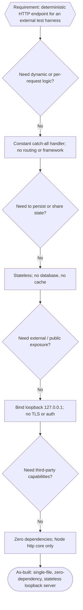
```mermaid
flowchart TD
    Start{{"Requirement: deterministic HTTP endpoint for an external test harness"}}
    Q1{"Need dynamic or per-request logic?"}
    Q2{"Need to persist or share state?"}
    Q3{"Need external / public exposure?"}
    Q4{"Need third-party capabilities?"}
    D1["Constant catch-all handler; no routing or framework"]
    D2["Stateless; no database, no cache"]
    D3["Bind loopback 127.0.0.1; no TLS or auth"]
    D4["Zero dependencies; Node http core only"]
    Outcome(["As-built: single-file, zero-dependency, stateless loopback server"])

    Start --> Q1
    Q1 -->|No| D1
    D1 --> Q2
    Q2 -->|No| D2
    D2 --> Q3
    Q3 -->|No| D3
    D3 --> Q4
    Q4 -->|No| D4
    D4 --> Outcome
```

### 5.3.6 Architecture Decision Records

The following ADRs formalize the reconstructed decisions. All are recorded with status **Accepted (as-built)** because they describe the state of the single tracked commit; consequences are stated from observed behavior.

**ADR-001 — Use Node's built-in `http` module instead of a web framework.**
- *Context:* The fixture must expose one deterministic endpoint and run with zero setup across multiple container/QA environments.
- *Decision:* Implement the server with Node core `http` only and declare no dependencies (`package.json`, `package-lock.json`).
- *Consequences:* No supply-chain vulnerability surface and instant, deterministic install; but no routing, middleware, or content negotiation — any richer API would require hand-rolling or introducing a framework later.

**ADR-002 — Bind to the loopback interface `127.0.0.1` only.**
- *Context:* The endpoint is exercised by an on-host process; there is no requirement for remote access.
- *Decision:* Hardcode `hostname = '127.0.0.1'` and `port = 3000` in `server.js`.
- *Consequences:* Loopback confinement is the system's primary security control; but the server is unreachable off-host and cannot be reconfigured without editing source (**2.4.2**).

**ADR-003 — Remain stateless with no database or cache.**
- *Context:* The response is a fixed constant, so there is no data domain to persist or accelerate.
- *Decision:* Implement no persistence, cache, or ORM; recompute the constant response per request.
- *Consequences:* No data-store attack surface, credentials, or injection risk, and trivial reasoning about behavior; but the system cannot serve dynamic or persistent data (**3.5**, **4.4.1**).

**ADR-004 — Serve over plain HTTP with no authentication or TLS.**
- *Context:* The payload is a non-sensitive constant and the endpoint is loopback-only.
- *Decision:* Use plain HTTP; implement no authentication, authorization, or input validation.
- *Consequences:* Minimal attack surface because no input is parsed and no secret is served; but the endpoint is unsuitable for non-loopback or public deployment without first adding TLS, authentication, and rate limiting.

**ADR-005 — Start as a side-effect module with hardcoded configuration.**
- *Context:* The simplest possible launch is a single `node server.js` invocation.
- *Decision:* Export nothing (start on execution), and use constants rather than environment/flag configuration.
- *Consequences:* Trivial to launch; but the module is not importable or unit-testable, reconfiguration requires a source edit and restart, and — combined with `main` pointing at a missing `index.js` and the absent `start` script — `npm start`/`node .` will not launch the server (**2.4.3**, **3.6.2**).

## 5.4 Cross-Cutting Concerns

The application code holds no application state and implements no explicit cross-cutting infrastructure, so most concerns below are minimal or intentionally absent. Each statement is grounded in the source and, where behavior was verified by running the server, is noted as empirical. This is consistent with **2.4 Implementation Considerations** and **4.4 State Management and Error Handling**.

### 5.4.1 Monitoring & Observability

The single observability signal is the one-line readiness log written to `stdout` when the server binds (`Server running at http://127.0.0.1:3000/`). There is **no** health-check endpoint (the catch-all handler returns `200` for every path, so it cannot distinguish a probe from any other request), no metrics endpoint or exporter (no Prometheus/StatsD client), no application performance monitoring (APM) or tracing agent, and no log aggregation or alerting. Liveness can only be inferred by connecting to port 3000 or reading the startup line (**2.4.2**, **4.1**).

| Capability | Status | Signal / Evidence |
| --- | --- | --- |
| Readiness signal | Present (minimal) | `stdout` line emitted on successful bind |
| Health-check endpoint | None | No route; handler returns `200` regardless of path |
| Metrics / exporter | None | No metrics client or endpoint in code or dependencies |
| Tracing / APM | None | No agent or instrumentation dependency |
| Alerting / log aggregation | None | Output is only `stdout`/`stderr` |

### 5.4.2 Logging & Tracing

**Logging.** Logging consists of exactly one `console.log` call to `stdout` (the readiness line). On an unrecoverable startup error, Node writes an uncaught-exception stack trace to `stderr`. There is no structured/JSON logging, no log levels, no per-request access log, no application-added timestamps, and no log file or rotation. The application sets no logging framework — output relies entirely on Node's default console streams.

**Tracing.** There is **no** distributed tracing, span creation, or trace-context propagation, and none is needed: the system is a single process with no downstream calls, so there is no call graph to correlate. No correlation/request IDs are generated or accepted.

### 5.4.3 Error Handling Patterns

The application registers **no** error handling — there is no `try/catch`, no `'error'` event listener on the server, no request-level error branch, and no graceful-shutdown/signal handling. Two error domains exist, and only the startup domain can actually raise an error:

- **Startup domain (F-002).** A bind failure (verified by launching a second instance to force `EADDRINUSE`) causes `http.Server` to emit an `'error'` event; because no listener is registered, Node rethrows it as an uncaught exception, prints a stack trace to `stderr`, and the process exits with code `1`. There is no retry, backoff, or alternate-port fallback.
- **Request domain (F-001).** The handler executes three statements with no I/O and no request parsing, so there is no application code path that can fail; transport-level faults are handled by Node core defaults.

Recovery is manual: an operator frees TCP port 3000 (or stops the conflicting process) and re-runs `node server.js` (**4.4.2**). The flow below separates the two domains and the manual recovery loop.

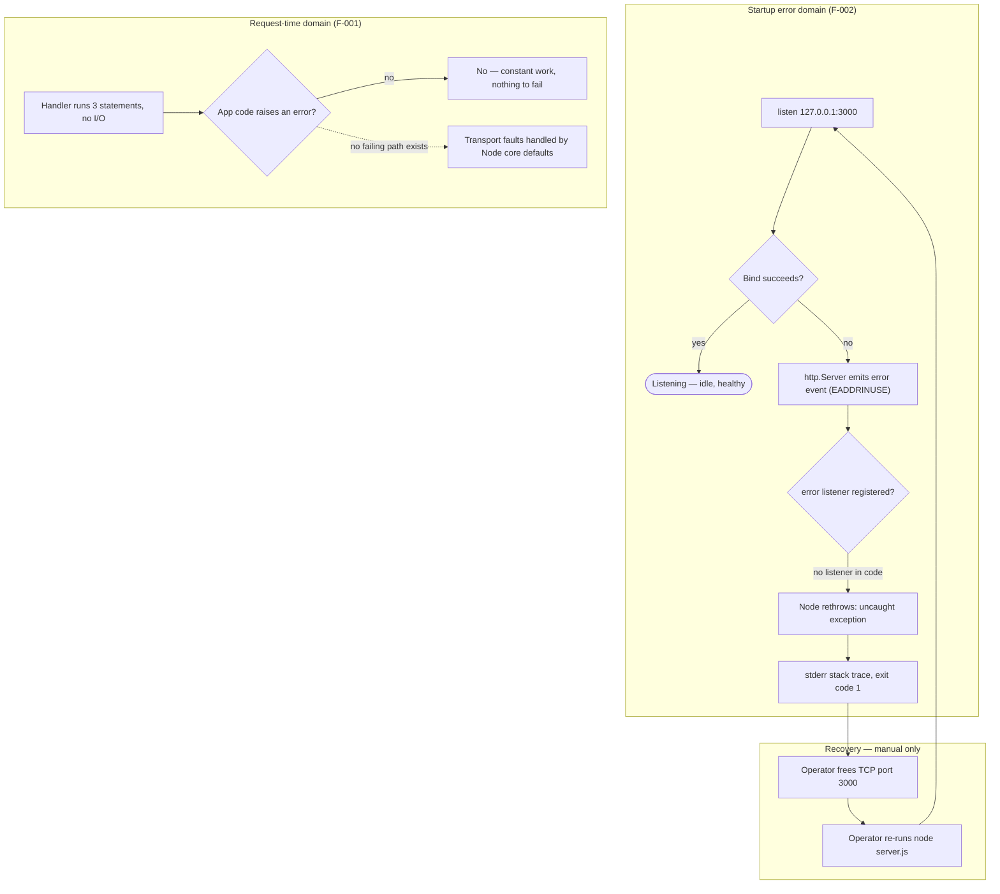
```mermaid
flowchart TD
    subgraph STARTUP["Startup error domain (F-002)"]
        Bind["listen 127.0.0.1:3000"]
        BindQ{"Bind succeeds?"}
        Healthy(["Listening — idle, healthy"])
        ErrEvt["http.Server emits error event (EADDRINUSE)"]
        ListenerQ{"error listener registered?"}
        Rethrow["Node rethrows: uncaught exception"]
        Trace["stderr stack trace, exit code 1"]
    end
    subgraph REQUEST["Request-time domain (F-001)"]
        Handle["Handler runs 3 statements, no I/O"]
        AppErrQ{"App code raises an error?"}
        NoErr["No — constant work, nothing to fail"]
        CoreDef["Transport faults handled by Node core defaults"]
    end
    subgraph RECOVERY["Recovery — manual only"]
        Free["Operator frees TCP port 3000"]
        Restart["Operator re-runs node server.js"]
    end
    Bind --> BindQ
    BindQ -->|yes| Healthy
    BindQ -->|no| ErrEvt
    ErrEvt --> ListenerQ
    ListenerQ -->|no listener in code| Rethrow
    Rethrow --> Trace
    Trace --> Free
    Free --> Restart
    Restart --> Bind
    Handle --> AppErrQ
    AppErrQ -->|no| NoErr
    AppErrQ -.->|no failing path exists| CoreDef
```

### 5.4.4 Authentication & Authorization

There is **no** authentication and **no** authorization framework of any kind — no identity provider, no tokens/sessions/API keys, no role or permission model, and no input validation. The endpoint is served over plain HTTP and responds identically to every caller; the **loopback binding (`127.0.0.1`) is the only access boundary**, limiting reach to processes on the same host (**5.3.4**, **2.4.1**). Although the repository contains a file named `LoginTest.java`, it is a non-compiling stub with no login logic and no runtime role, and it is explicitly excluded from the system's feature set (**2.1**); it does not provide any authentication capability.

### 5.4.5 Performance Requirements & SLAs

The repository defines **no** performance requirements, SLAs, SLOs, or KPIs — no latency, throughput, uptime, or startup-time target appears in any file (**1.2.3**, **2.4.1**, **4.1**). Reporting specific figures would require inventing data not present in the codebase. Only qualitative, observed characteristics can be stated.

| Metric | Documented Target | Observed Characteristic |
| --- | --- | --- |
| Response latency | None defined | Handler is constant-time with no I/O |
| Throughput | None defined | Single-threaded event loop; no benchmark or load test in repo |
| Availability / uptime | None defined | Single process; recovery is manual (no auto-restart) |
| Startup time | None defined | Binds and logs readiness within roughly a second when the port is free (empirical) |

### 5.4.6 Disaster Recovery

Disaster recovery is **manual and minimal**. There is no process manager (PM2/systemd), no orchestrator or clustering, no auto-restart, and no health-check-driven recovery (**3.6.3**, **2.4.2**). After a crash or a `SIGTERM` (which simply exits with no graceful-shutdown sequence — the port stops accepting connections, verified empirically), recovery consists of freeing TCP port 3000 and re-running `node server.js`. No recovery-time or recovery-point objective (RTO/RPO) is defined.

Because the server is stateless and returns a compile-time constant, there is **no runtime data to lose**, so the data-recovery dimension is effectively not applicable. The source itself is recoverable from Git (a single commit, `f60b533`, on the GitHub origin), so full restoration is: check out the source and run the entry file directly.

| DR Concern | Status | Procedure / Evidence |
| --- | --- | --- |
| Process supervision / auto-restart | None | No process manager or orchestrator (**3.6.3**) |
| Graceful shutdown | None | `SIGTERM` exits immediately; no signal handler (empirical) |
| Runtime data backup | Not applicable | Stateless; no data store to back up (**3.5**) |
| Source/config recovery | Version control | Git origin, commit `f60b533`; re-run `node server.js` |

## 5.5 References

The following repository artifacts, prior Technical Specification sections, and verification activities were used as evidence for this section.

**Repository files and folders examined:**

- `server.js` - Established the sole runtime component: the CommonJS HTTP server, its use of only the built-in `http` module, the hardcoded `127.0.0.1:3000` loopback binding, the unconditional handler returning `HTTP 200`/`text/plain`/`Hello, World!\n`, and the `stdout` readiness log.
- `package.json` - Established package identity (`hello_world` v1.0.0, MIT, author `hxu`), the zero-dependency baseline, the always-failing `test` script, and the `main` → non-existent `index.js` defect.
- `package-lock.json` - Confirmed `lockfileVersion` 3 with an empty resolved dependency tree (no frameworks/libraries).
- `README.md` - Established the repository name (`hao-backprop-test`) and the fixture purpose ("test project for backprop integration. Do not touch!") used as the rationale driver.
- `LoginTest.java` - Confirmed the non-compiling Java stub with no login logic and no runtime/authentication role.
- `industry.csv` - Established the single-column, 43-label taxonomy comprising part of the static reference assets (F-004).
- `100Pages.pdf`, `demo.jpg`, `sample.doc` - Confirmed the inert binary sample assets (PDF/JPEG/OLE2 Word) that are never read by code (F-004).
- `test.py.txt`, `test.txt.txt` - Confirmed the 0-byte placeholder artifacts excluded from the component/feature model.
- Repository root (no subfolders; 11 Git-tracked files) - Established the minimal, single-directory structure and that `server.js` is the only executable artifact.

**Cross-referenced Technical Specification sections:**

- 1.2 System Overview - Aligned the high-level system description, limitations, and the absence of success criteria/SLAs.
- 2.1 Feature Catalog - Source of the feature identifiers F-001–F-004 and the excluded-artifact list.
- 2.3 Feature Relationships - Confirmed the single runtime coupling (F-002 hosts F-001) and the single loopback integration surface.
- 2.4 Implementation Considerations - Grounded the technical constraints, scaling, and security notes per feature (hardcoded config, no error listener, single-threaded event loop).
- 3.2 Frameworks & Libraries - Confirmed no application framework and only the built-in `http` module.
- 3.4 Third-Party Services - Confirmed the absence of external/third-party service integrations.
- 3.5 Databases & Storage - Confirmed no database, cache, or ORM, and the stateless runtime.
- 3.6 Development & Deployment - Confirmed the manual deployment model and absence of build/CI/container/process-manager tooling.
- 4.1 System Workflows - Aligned the single request/response workflow and the absence of integration/event/batch workflows.
- 4.4 State Management and Error Handling - Aligned the process-lifecycle state model and the default Node.js error behavior (EADDRINUSE crash, manual recovery).

**Verification activity:**

- Running `node server.js` on the checked-out repository - Empirically confirmed the startup readiness line, the identical `HTTP 200`/`text/plain`/`Content-Length 14` response across multiple HTTP methods and paths, the Node-core default response headers, and the unhandled `EADDRINUSE` crash (exit code 1) on a second bind.
- No external web sources were required or used for this section.

# 6. SYSTEM COMPONENTS DESIGN

## 6.1 Core Services Architecture

### 6.1.1 Applicability Assessment and Architectural Classification

**Core Services Architecture is not applicable for this system.** The `hao-backprop-test` repository resolves to a single deployable unit: one CommonJS module (`server.js`) executed as one Node.js process. There are no microservices, no distributed components, and no distinct services that communicate with one another, so the service-oriented concerns this section would normally document — service decomposition, inter-service communication, service discovery, load balancing, circuit breakers, and cross-service resilience — have no subject matter in this codebase.

This classification is consistent with **5.1 High-Level Architecture**, which documents the system as a single-process, single-threaded, event-driven monolith, and with **5.4 Cross-Cutting Concerns**, which records the absence of clustering, orchestration, and process supervision. The remaining subsections (**6.1.2**–**6.1.4**) do not invent architecture; instead they walk through each concern the Core Services Architecture template enumerates and explain — with evidence from the tracked source, the dependency manifests (`package.json`, `package-lock.json`), and behavior verified by running the server on Node.js v22 — why each does not apply to a single-process monolith.

#### 6.1.1.1 Applicability Determination

A system requires a Core Services Architecture when it is decomposed into multiple independently deployable services that discover and communicate with one another. None of the defining criteria are present in this repository. The following table maps each criterion to the observed evidence.

| Microservices / Distributed Criterion | Present? | Evidence |
| --- | --- | --- |
| Multiple independently deployable services | No | Repository tracks a single JavaScript module (`server.js`); the working tree has no subfolders and one `.js` file |
| Inter-service communication (RPC / messaging / pub-sub) | No | `server.js` imports only Node's built-in `http`; `package-lock.json` resolves zero dependencies (no gRPC/AMQP/Kafka/Redis client) |
| Service discovery / registry | No | One hardcoded endpoint `127.0.0.1:3000`; no Consul/Eureka/DNS-SD client (**2.4.2**) |
| Orchestration / containerization | No | No Dockerfile, Compose file, Kubernetes manifest, or Procfile in the repository (**3.6**) |
| Independent scaling / execution units | No | One process on the default single-threaded event loop; no `cluster`, `worker_threads`, or `child_process` usage (**2.4.1**) |
| Distributed / redundant state | No | Stateless handler returns a compile-time constant; no data store to distribute (**3.5**) |

Because every criterion resolves to "No," the system is classified as a **single-process monolith**, and Core Services Architecture is **not applicable**.

#### 6.1.1.2 Actual System Topology and Service Interaction

The complete runtime topology is one client-facing process. The only interaction is a synchronous HTTP/1.1 request–response exchange between a local client and the single Node.js process over the loopback interface; there are no service-to-service edges to depict because there is exactly one service boundary — the process itself (**5.1.1**, **5.1.3**). The bootstrap component (F-002) creates the server and binds the port, and the inline handler (F-001) returns a constant response to every request regardless of method, path, or body (**2.1 Feature Catalog**).

The diagram below is the system's "service interaction" view: a single process, its one inbound interface, and the explicit absence of any downstream service.

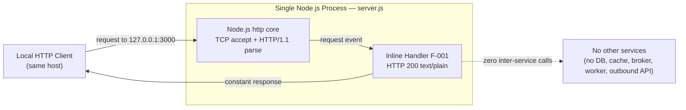
```mermaid
flowchart LR
    Client["Local HTTP Client<br/>(same host)"]
    subgraph PROC["Single Node.js Process — server.js"]
        Core["Node.js http core<br/>TCP accept + HTTP/1.1 parse"]
        Handler["Inline Handler F-001<br/>HTTP 200 text/plain"]
        Core -->|"request event"| Handler
    end
    NoSvc["No other services<br/>(no DB, cache, broker, worker, outbound API)"]
    Client -->|"request to 127.0.0.1:3000"| Core
    Handler -->|"constant response"| Client
    Handler -.->|"zero inter-service calls"| NoSvc
```

**Figure 6.1.1-1 — Service Interaction (single-process topology).** The single subgraph is the entire system; the dashed edge records that the handler makes zero outbound or inter-service calls.

### 6.1.2 Service Components

Because the system is a single process built from one module, there are no distinct service components to bound, coordinate, or route between. The only boundary that exists is the single-host localhost trust boundary, within which the bootstrap component (F-002) hosts the request handler (F-001) in-process (**5.1.1**, **5.1.2**). Each of the six service-component concerns enumerated by this section is therefore addressed as *not applicable*, with the supporting evidence recorded below.

| Service-Component Concern | Status | Evidence / Rationale |
| --- | --- | --- |
| Service boundaries & responsibilities | Single unit only | One module `server.js` runs as one process; the only boundary is the localhost trust boundary; F-002 (bootstrap) hosts F-001 (handler) in-process, with no independently deployable services (**5.1.1**, **5.1.2**) |
| Inter-service communication patterns | None | Exactly one synchronous inbound HTTP/1.1 request–response over TCP loopback; no outbound calls, no RPC, no message queue, no pub/sub (**5.1.3**, **5.1.4**) |
| Service discovery mechanisms | None | A single hardcoded endpoint `127.0.0.1:3000`; no service registry (Consul/Eureka) or DNS-based discovery client in the dependency tree (**2.4.2**) |
| Load balancing strategy | None | Single process on a single-threaded event loop bound to one port; no clustering, worker threads, or reverse proxy to distribute load across (**2.4.1**, **2.4.2**) |
| Circuit breaker patterns | None | No downstream dependency exists to protect against, and no resilience/circuit-breaker library is present (empty `package-lock.json`) |
| Retry & fallback mechanisms | None | The handler performs constant work with no I/O; there is no `try/catch`, no server `'error'` listener, and no retry, backoff, or fallback path (**5.4.3**) |

**Communication surface.** The system's entire communication footprint is the single inbound interface catalogued in **5.1.4 External Integration Points**: HTTP/1.1 over TCP at `127.0.0.1:3000`, request→response, returning a `text/plain` constant body. The handler ignores all request input and opens no outbound connections, so there is no second party with which any inter-service pattern (discovery, load balancing, circuit breaking, retry, or fallback) could be exercised.

### 6.1.3 Scalability Design

No scalability design is implemented. The system runs as a single Node.js process on the default single-threaded event loop and binds only the loopback interface, so it is neither designed to scale out (more instances) nor to scale up (more cores). This subsection documents the as-built reality and the concrete constraints that would first have to be removed before any scaling could occur, consistent with **2.4.1**, **2.4.2**, and **5.4.5 Performance Requirements & SLAs**.

The diagram contrasts the single-instance deployment that exists today with the infrastructure that is absent and would be prerequisite to horizontal or vertical scaling.

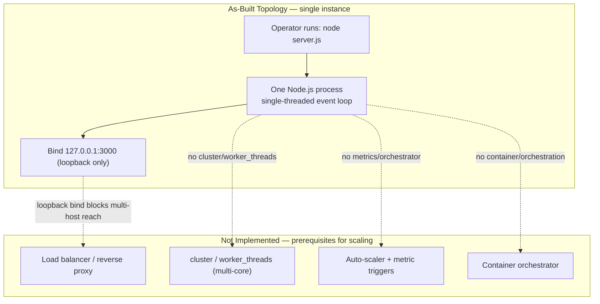
```mermaid
flowchart TB
    subgraph CURRENT["As-Built Topology — single instance"]
        Op["Operator runs: node server.js"]
        Inst["One Node.js process<br/>single-threaded event loop"]
        Port["Bind 127.0.0.1:3000 (loopback only)"]
        Op --> Inst
        Inst --> Port
    end
    subgraph ABSENT["Not Implemented — prerequisites for scaling"]
        LB["Load balancer / reverse proxy"]
        Cluster["cluster / worker_threads (multi-core)"]
        Auto["Auto-scaler + metric triggers"]
        Orch["Container orchestrator"]
    end
    Port -. "loopback bind blocks multi-host reach" .-> LB
    Inst -. "no cluster/worker_threads" .-> Cluster
    Inst -. "no metrics/orchestrator" .-> Auto
    Inst -. "no container/orchestration" .-> Orch
```

**Figure 6.1.3-1 — Scalability Architecture (current single-instance state versus absent prerequisites).** The dashed edges label the specific reason each scaling mechanism is not reachable from the current design.

| Scalability Dimension | As-Built State | Evidence |
| --- | --- | --- |
| Horizontal scaling approach | Not implemented | Bound to `127.0.0.1` (not `0.0.0.0`); a second instance on port 3000 crashes with `EADDRINUSE` (verified empirically); no load balancer to front replicas (**2.4.2**) |
| Vertical scaling approach | Not exploited | Single-threaded event loop uses one CPU core regardless of host size; no `worker_threads`/`cluster` to use additional cores (**2.4.1**) |
| Auto-scaling triggers & rules | None | No orchestrator, metrics pipeline, or scaling policy exists in the repository (**5.4.1**) |
| Resource allocation strategy | None declared | No container CPU/memory limits, no `engines` field pinning a runtime, and no configuration file to size the process (**3.6**) |
| Performance optimization techniques | Minimal / none | Constant-time handler with no I/O; no application-level caching (the constant response is recomputed each call) and no compression/keep-alive tuning beyond Node defaults (**5.1.3**, **5.4.5**) |
| Capacity planning guidelines | None | No SLA, throughput, latency, or uptime target is defined anywhere, and no benchmark or load test exists to inform capacity (**1.2.3**, **5.4.5**) |

**Practical note.** Because the process performs constant work with no I/O and no persistence, its runtime footprint is minimal; the binding constraint on reach is architectural (loopback-only, single process) rather than resource exhaustion. Any future scaling would begin by making the bind address/port configurable and introducing a process manager or `cluster`-based worker model — neither of which is present today (**2.4.2**, **2.4.3**).

### 6.1.4 Resilience Patterns

No resilience patterns are implemented. The single process is a single point of failure: it registers no error handling, has no redundancy or failover, and depends on manual intervention for recovery. These characteristics were verified by running the server on Node.js v22 — forcing a port conflict causes the process to terminate rather than degrade or recover, consistent with **5.4.3 Error Handling Patterns** and **5.4.6 Disaster Recovery**.

The diagram traces the two runtime states (serving versus unreachable), the faults that take the process down, and the manual-only recovery loop that returns it to service.

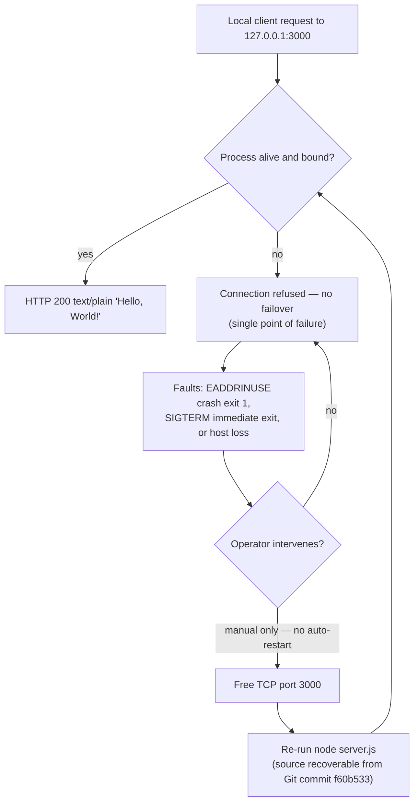
```mermaid
flowchart TD
    Req["Local client request to 127.0.0.1:3000"]
    UpQ{"Process alive and bound?"}
    Serve["HTTP 200 text/plain 'Hello, World!'"]
    Down["Connection refused — no failover<br/>(single point of failure)"]
    Cause["Faults: EADDRINUSE crash exit 1,<br/>SIGTERM immediate exit, or host loss"]
    ManQ{"Operator intervenes?"}
    Free["Free TCP port 3000"]
    Restart["Re-run node server.js<br/>(source recoverable from Git commit f60b533)"]
    Req --> UpQ
    UpQ -->|yes| Serve
    UpQ -->|no| Down
    Down --> Cause
    Cause --> ManQ
    ManQ -->|"manual only — no auto-restart"| Free
    ManQ -->|no| Down
    Free --> Restart
    Restart --> UpQ
```

**Figure 6.1.4-1 — Resilience Pattern Implementation (single point of failure with manual recovery loop).** There is no automated branch out of the "Connection refused" state; recovery depends entirely on an operator.

| Resilience Concern | As-Built State | Evidence |
| --- | --- | --- |
| Fault tolerance mechanisms | None | No `try/catch` and no server `'error'` listener; an `EADDRINUSE` bind conflict surfaces as an unhandled `'error'` event and the process exits with code 1 (verified empirically) (**5.4.3**) |
| Disaster recovery procedures | Manual only | Recovery is: free TCP port 3000, then re-run `node server.js`; no PM2/systemd, orchestrator, or auto-restart; source is recoverable from Git commit `f60b533` (**5.4.6**) |
| Data redundancy approach | Not applicable | Stateless design returns a compile-time constant; there is no runtime data store to replicate or back up (**3.5**, **5.4.6**) |
| Failover configurations | None | One process constitutes a single point of failure; `SIGTERM` exits immediately with no graceful shutdown, after which the port refuses connections (verified empirically) |
| Service degradation policies | None | No partial or degraded operating modes exist — the service is either fully up (HTTP 200) or down (connection refused); there is no health-check endpoint to signal degradation (**5.4.1**) |

**Recovery objectives.** No recovery-time objective (RTO) or recovery-point objective (RPO) is defined in the repository. Because the server holds no runtime state, the data-recovery dimension is effectively moot (RPO is not meaningful); full restoration consists solely of checking out the single-commit source and re-running the entry file (**5.4.6**).

### 6.1.5 References

**Repository files and folders examined for this section**

- `server.js` — Established the sole executable: a single-process, single-threaded Node.js HTTP server using only the built-in `http` module, bound to `127.0.0.1:3000`, with one catch-all handler and no error handling, exports, clustering, or outbound calls.
- `package.json` — Confirmed the package declares no runtime or dev dependencies, no `engines` field, and no `start` script (only a `test` script that fails by design).
- `package-lock.json` — Confirmed an empty resolved dependency tree (lockfileVersion 3), corroborating the absence of any service-discovery, messaging, load-balancing, or circuit-breaker library.
- `README.md` — Established the repository's identity and fixture purpose (`hao-backprop-test`, "test project for backprop integration").
- Repository root (working tree) — Confirmed there are no subfolders and no deployment/orchestration artifacts (no Dockerfile, Compose file, Kubernetes manifest, Procfile, or CI configuration).

**Empirical verification**

- Executing `node server.js` (Node.js v22.23.1) — Confirmed the constant `HTTP 200 text/plain` response for `GET /` and `POST /x/y`; a second instance crashes with an unhandled `'error'` event (`EADDRINUSE`, exit code 1) while the running instance keeps serving; after all instances are stopped, port 3000 refuses connections with no auto-restart. Grounds the fault-tolerance, failover, and degradation findings.

**Cross-referenced Technical Specification sections**

- `1.2 System Overview` — Confirmed no KPIs, SLAs, or success criteria are defined (basis for the capacity-planning finding in 6.1.3).
- `2.1 Feature Catalog` — Source of the feature identifiers F-001 (Static HTTP Response Service) and F-002 (HTTP Server Bootstrap) used throughout this section.
- `2.4 Implementation Considerations` — Basis for the single-threaded/no-clustering, hardcoded loopback bind, no-process-manager, and no-`start`-script statements (2.4.1–2.4.3).
- `3.5 Databases & Storage` — Basis for the stateless / no-data-store finding underpinning the data-redundancy assessment.
- `3.6 Development & Deployment` — Basis for the absence of containerization, orchestration, and CI/CD.
- `5.1 High-Level Architecture` — Basis for the single-process monolith classification, system boundaries, data flow, and external integration points (5.1.1–5.1.4).
- `5.4 Cross-Cutting Concerns` — Basis for the error-handling, monitoring/health-check, performance/SLA, and disaster-recovery findings (5.4.1, 5.4.3, 5.4.5, 5.4.6).

No external web sources were required; all findings are grounded in the repository and in previously documented, cross-referenced sections.

## 6.2 Database Design

### 6.2.1 Applicability Assessment and Storage Classification

**Database Design is not applicable to this system.** The `hao-backprop-test` repository has no database, no persistent data store, no object/relational mapping (ORM/ODM) layer, no data-access code, and no caching tier. Its single runnable component — `server.js` — is a stateless Node.js HTTP server that returns a compile-time constant string and never reads from or writes to any data store.

This determination is consistent with **3.5 Databases & Storage**, which records that the system uses "no database and no caching layer," and with **6.1 Core Services Architecture**, which classifies the system as a single-process, stateless monolith and marks the data-redundancy dimension "not applicable" because there is no runtime data store to replicate or back up.

Because there is no database, the concerns this section would normally document — schema modeling, indexing, partitioning, replication, migrations, retention, query optimization, and connection pooling — have no subject matter in this codebase. Rather than invent a schema, the subsections below walk through each Database Design concern the template enumerates and record, with evidence from the tracked source and the dependency manifests (`package.json`, `package-lock.json`), why each does not apply. All evidence was gathered directly from the repository (branch `QA-16-july-branch`, single Git commit `f60b533`) and corroborated on Node.js v22. The runtime handler that constitutes the system's entire request-time behavior contains no data source:

```js
res.statusCode = 200;                          // constant status
res.setHeader('Content-Type', 'text/plain');   // constant content type
res.end('Hello, World!\n');                     // constant 14-byte body, no data lookup
```

#### 6.2.1.1 Applicability Determination

A system requires a Database Design when it persists, queries, or caches data in a managed store. None of the defining criteria are present in this repository. The following table maps each criterion to the observed evidence.

| Database / Persistence Criterion | Present? | Evidence |
| --- | --- | --- |
| Relational / SQL database (PostgreSQL, MySQL, SQLite) | No | `server.js` opens no connection; `package-lock.json` resolves zero packages (no `pg`/`mysql`/`sqlite3` driver) |
| NoSQL / document store (MongoDB, DynamoDB, Firestore) | No | No client dependency and no connection code; empty dependency tree |
| In-memory / cache store (Redis, Memcached) | No | No cache client; the handler recomputes a constant on every request |
| ORM / ODM / query builder (Prisma, Sequelize, TypeORM, Mongoose, Knex) | No | No such dependency and no model/entity definitions anywhere in the tree |
| Migration / schema tooling | No | No `migrations/` directory, no `*.sql`, no `schema.*`, no Flyway/Liquibase/Prisma artifacts |
| Embedded / file database (SQLite, LevelDB, lowdb, NeDB) | No | No `*.db`/`*.sqlite` files and no embedded-db dependency |
| Application filesystem persistence (`fs` read/write) | No | `server.js` imports only built-in `http`; grep for `fs`/`readFile`/`writeFile`/streams returns nothing |
| Cloud object / blob storage (S3, GCS, Azure Blob) | No | No cloud SDK, no bucket configuration, no credentials |
| Connection strings / DB credentials / env config | No | No `.env`, no configuration file, and no environment-variable reads in code |

Because every criterion resolves to "No," the system is classified as **stateless with no managed data store**, and Database Design is **not applicable**. The only persistence mechanism physically present is the local filesystem — a set of static files committed directly to Git — which is version-controlled source content, not an application data store, since no code opens it at runtime (consistent with **3.5**).

#### 6.2.1.2 Data Domain and Runtime Data Flow

The complete data domain of the repository consists of two categories, neither of which is a database:

1. **A compile-time constant** — the literal response body `Hello, World!\n` (14 bytes), the constant status code `200`, and the constant header `Content-Type: text/plain`, all embedded inline in `server.js`. These are produced in-process on every request and are never persisted.
2. **Inert, version-controlled static files** — reference and sample assets tracked in Git that no code path opens, parses, queries, or serves.

| Static Artifact | Type / Size | Runtime Access |
| --- | --- | --- |
| `industry.csv` | Single-column CSV, ~749 B, 43 labels | None — never read by any code |
| `100Pages.pdf` | PDF 1.7, ~9.0 MB | None — never read by any code |
| `demo.jpg` | JPEG/EXIF, ~2.1 MB | None — never read by any code |
| `sample.doc` | Legacy OLE2 Word, ~96 KB | None — never read by any code |

The diagram below is the system's complete data-flow view: an inbound HTTP request produces an in-process constant response, while the static files remain inert in version control with no read/write path, and there is no database, cache, or persistent store anywhere in the flow.

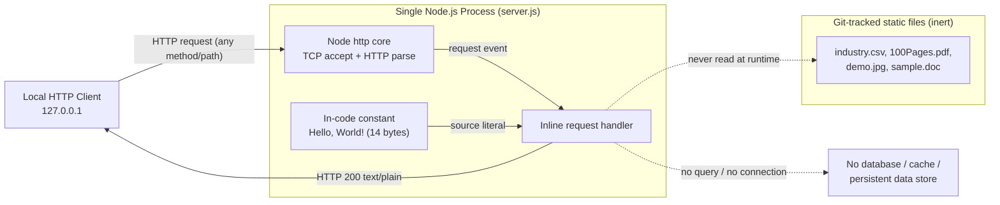
```mermaid
flowchart LR
    Client["Local HTTP Client<br/>127.0.0.1"]
    subgraph PROC["Single Node.js Process (server.js)"]
        Core["Node http core<br/>TCP accept + HTTP parse"]
        Handler["Inline request handler"]
        Const["In-code constant<br/>Hello, World! (14 bytes)"]
        Core -->|"request event"| Handler
        Const -->|"source literal"| Handler
    end
    NoStore["No database / cache /<br/>persistent data store"]
    subgraph STATIC["Git-tracked static files (inert)"]
        Files["industry.csv, 100Pages.pdf,<br/>demo.jpg, sample.doc"]
    end
    Client -->|"HTTP request (any method/path)"| Core
    Handler -->|"HTTP 200 text/plain"| Client
    Handler -.->|"no query / no connection"| NoStore
    Handler -.->|"never read at runtime"| Files
```

**Figure 6.2.1-1 — Runtime Data Flow (stateless request/response with no persistent store).** Solid edges are the live request/response path; dashed edges record the absence of any data-store or static-file access. The handler discards all request input (method, path, headers, body) and emits a constant payload, so no data enters or leaves a persistence layer.

### 6.2.2 Schema Design

No database schema exists in this system because there is no database. There are zero tables, collections, entities, columns, keys, indexes, or constraints defined anywhere in the tracked source; `server.js` declares no data model and the dependency tree contains no schema tooling. This subsection documents each schema-design concern the template enumerates, together with the evidence that it does not apply.

| Schema Design Concern | Status | Evidence / Rationale |
| --- | --- | --- |
| Entity relationships | None | No entities/tables/collections are defined; `server.js` declares no data model and no relationships |
| Data models & structures | None (one in-code constant) | The only data structure is the constant response payload embedded in source; no persisted record type exists |
| Indexing strategy | Not applicable | No tables or collections exist to index |
| Partitioning approach | Not applicable | No dataset exists to partition, shard, or range-split |
| Replication configuration | Not applicable | No data store exists to replicate; a single stateless process holds no state |
| Backup architecture | Version control only | No data store to back up; source is recoverable from Git commit `f60b533` |

#### 6.2.2.1 Entity-Relationship Model

The persistent entity-relationship model is empty: **zero entities and zero relationships**. For completeness, the diagram below documents the only record-shaped data structure in the entire system — the constant HTTP response assembled in `server.js`. This is explicitly **not** a database table: it is a compile-time constant produced in memory on each request and never stored, keyed, or related to any other structure.

```mermaid
erDiagram
    STATIC_HTTP_RESPONSE {
        int statusCode "constant 200"
        string contentType "constant text/plain"
        string body "constant 14 bytes"
    }
```

**Figure 6.2.2-1 — Data-Structure Footprint (in-code constant, not a persisted entity).** The single box represents the response values hardcoded in `server.js`; it has no primary key, no foreign keys, no persistence, and no relationships, because the system defines no database entities.

#### 6.2.2.2 Indexes and Constraints

Because no schema objects exist, there are no indexes and no constraints to document. The table records each category and its count for completeness.

| Index / Constraint Category | Count | Evidence |
| --- | --- | --- |
| Primary-key indexes | 0 | No tables or collections defined |
| Unique indexes | 0 | No tables or collections defined |
| Secondary / composite indexes | 0 | No tables or collections defined |
| Foreign-key constraints | 0 | No relational store; no references between records |
| Check / not-null / default constraints | 0 | No columns or fields are declared anywhere |

#### 6.2.2.3 Replication and Backup Architecture

There is no replication configuration and no data-backup architecture, because there is no data store. The runtime process is stateless and holds nothing to replicate between requests. The only recoverability mechanism is source version control: the entire repository — including `server.js` — is recoverable from Git (single commit `f60b533`), and there is no runtime-generated data whose loss would require a recovery-point objective (consistent with **6.1 Core Services Architecture**, which records the data-redundancy dimension as not applicable). The diagram contrasts the as-built topology (no data tier) with the components that would be prerequisites for database replication but are absent.

```mermaid
flowchart TB
    subgraph CURRENT["As-Built - No Data Tier"]
        Proc["Single Node.js process<br/>stateless, constant response"]
        NoData["No database, no cache<br/>nothing to replicate"]
        Proc --> NoData
    end
    subgraph ABSENT["Not Implemented - Replication Prerequisites"]
        Primary["Primary database"]
        Replica["Read replica(s)"]
        Stream["Replication log / stream"]
        Primary -->|"would stream changes"| Stream
        Stream -->|"would apply changes"| Replica
    end
    NoData -.->|"no primary DB to originate replication"| Primary
    Proc -.->|"no replica set / cluster configured"| Replica
```

**Figure 6.2.2-2 — Replication Architecture (no data tier versus absent prerequisites).** The left subgraph is the as-built reality — a single stateless process with nothing to replicate; the right subgraph lists the primary/replica/stream components a replicated design would require and that do not exist here. Dashed edges label why each is unreachable from the current design.

### 6.2.3 Data Management

No data-management machinery exists, because there is no runtime data and no data store to manage. The server generates no persistent records, runs no migrations, and maintains no cache. The table documents each data-management concern the template enumerates and the evidence that it does not apply.

| Data Management Concern | Status | Evidence / Rationale |
| --- | --- | --- |
| Migration procedures | None | No `migrations/` directory, no `*.sql`, and no migration tool (Knex/Sequelize/Prisma/Flyway/Liquibase) in the dependency tree; there is no schema to migrate |
| Versioning strategy | Source versioning via Git only | No schema or data to version; artifact versioning is limited to `package.json` version `1.0.0` and the single-commit Git history (`f60b533`) |
| Archival policies | None | No runtime data is produced, so nothing is generated to archive; static assets are retained indefinitely in version control |
| Data storage & retrieval | None at runtime | `server.js` neither stores nor retrieves data — the response is a constant literal; static files are read-only Git blobs that no code opens |
| Caching policies | None | No cache tier (no Redis/Memcached), no in-process cache, and no application cache headers emitted; the constant is recomputed per request |

The only "versioning" and "retrieval" that occur are at the source-control layer: Git tracks the files, and Node loads `server.js` from disk at process start. Neither involves an application data store, a query, or a cache. Application HTTP responses set only `statusCode` and `Content-Type`; the code emits no `Cache-Control`, `ETag`, or `Expires` header, so there is no application-defined caching policy to document. This is consistent with **3.5 Databases & Storage**, which records the absence of any caching layer or ORM/data-access layer.

### 6.2.4 Compliance Considerations

Because the system collects, stores, and processes no data, the data-compliance surface is effectively empty. There is no data at rest, no personal data, no credentials, and no data store to govern. The table documents each compliance concern the template enumerates and the evidence that it does not apply.

| Compliance Concern | Status | Evidence / Rationale |
| --- | --- | --- |
| Data retention rules | Not applicable | No runtime data is captured or stored; nothing is retained, expired, or purged |
| Backup & fault-tolerance policies | Version control only | No data store to back up; the single process is a single point of failure with manual recovery (per **6.1**); source recoverable from Git commit `f60b533` |
| Privacy controls (PII/PHI) | Not applicable | The handler ignores all request input and logs no request data; it collects/stores no personal data; `industry.csv` holds only generic sector labels, not PII |
| Audit mechanisms | None (minimal logging) | No audit log and no access log; the sole log line is the one-time startup message to stdout; there is no per-request logging |
| Access controls | Loopback boundary only | No authentication, authorization, or DB users/roles/grants (there is no DB); the only access limitation is the `127.0.0.1` loopback bind, and every local caller receives the same constant response |

Consistent with **3.5 Databases & Storage**, the absence of a database means there are no connection strings or credentials, no data-store attack surface, no injection risk, and no data-at-rest to encrypt or govern. The static files bundled in the repository are non-executable content that no code path parses, so they introduce no data-processing or privacy obligations at runtime. Any compliance posture — retention schedules, subject-access handling, audit trails, or role-based access — would need to be designed from scratch if and when a data store were introduced; none exists today.

### 6.2.5 Performance Optimization

No database-oriented performance optimization exists, because there is no database and no query workload. The single handler performs constant-time work with no I/O, so there is no data-access hot path to optimize. The table documents each optimization technique the template enumerates and the evidence that it does not apply.

| Optimization Technique | Status | Evidence / Rationale |
| --- | --- | --- |
| Query optimization patterns | Not applicable | No SQL/NoSQL queries are issued; the handler executes constant-time work with no data lookup |
| Caching strategy | None | No cache tier and no in-process cache; the constant response is recomputed on each call (per **6.1**) |
| Connection pooling | Not applicable | No database connections to pool and no pool library; only inbound HTTP sockets are managed by Node's `http` core (Node defaults: keep-alive) |
| Read/write splitting | Not applicable | No primary/replica topology and no reads or writes to route |
| Batch processing approach | None | No batch/ETL jobs, scheduler/cron, or queue/worker; the system serves only synchronous request/response |

The only performance-relevant observation is architectural rather than data-oriented: the handler is constant-time and performs no I/O, so no data-layer optimization would apply even conceptually. No service-level objectives, throughput targets, or latency budgets are defined anywhere in the repository (consistent with **1.2 System Overview** and **6.1 Core Services Architecture**), so there is no performance baseline against which a database optimization could be measured.

### 6.2.6 References

**Repository files examined for this section**

- `server.js` — Established the sole runtime component: a stateless Node.js HTTP server that uses only the built-in `http` module (its only `require`), returns a compile-time constant, and performs no filesystem, database, or network I/O.
- `package.json` — Confirmed zero declared `dependencies`/`devDependencies` and no `engines` field: no database driver, ORM, cache client, or migration tool.
- `package-lock.json` — Confirmed an empty resolved dependency tree (lockfileVersion 3, zero `node_modules` entries), corroborating the absence of any persistence, caching, or ORM library.
- `industry.csv` — Confirmed a static, single-column reference taxonomy (~749 B, 43 labels) that no code opens at runtime.
- `README.md` — Established the repository identity and fixture purpose (`hao-backprop-test`, "test project for backprop integration").
- Repository root working tree — Confirmed there are no subfolders, no `migrations/`, no `*.sql`/`*.prisma`/`*.db`/`*.sqlite`, no `.env`, no `node_modules/`, and no data/model directories.

**Empirical verification**

- Exhaustive keyword grep across all text/source files (database, SQL, mongo, redis, ORM, prisma, knex, s3, `fs` read/write, streams, etc.) — Returned no database or persistence matches.
- Configuration-file search (`.env`, `docker-compose`, `Dockerfile`, `*.sql`, `*.prisma`, `knexfile`, `ormconfig`, `*.sqlite`, `*.db`) — Returned none.
- Directory inspection — Confirmed no `node_modules/`, `data/`, `migrations/`, `db/`, `prisma/`, or `models/` directories; the repository has no subdirectories at all.

**Cross-referenced Technical Specification sections**

- `3.5 Databases & Storage` — Confirmed the system uses no database and no caching layer; the only persistence is inert static files in Git, and there is no data-at-rest to secure.
- `6.1 Core Services Architecture` — Confirmed the single-process, stateless monolith classification and that the data-redundancy dimension is not applicable; provided the not-applicable authoring pattern mirrored in this section.
- `1.2 System Overview` — Confirmed the empty dependency tree, the stateless handler that ignores request input, the static assets not consumed by any code, and the absence of KPIs/SLAs.

No external web sources were required; all findings are grounded in the repository and in previously documented, cross-referenced sections.

## 6.3 Integration Architecture

### 6.3.1 Integration Architecture Applicability Assessment

**Integration Architecture is not applicable for this system.** The `hao-backprop-test` repository resolves to a single deployable unit — one CommonJS module (`server.js`) run as one Node.js process — that neither calls nor depends on any external system or service at runtime. It exposes exactly one network interface: an inbound HTTP listener bound to the loopback address `127.0.0.1:3000`, whose handler returns a compile-time constant and reads nothing from the request. There is no database, cache, message broker, third-party API, authentication provider, cloud service, or API gateway to integrate with, so the integration concerns this section would normally document — API management, message processing, and external-system contracts — have essentially no subject matter in this codebase.

This determination is corroborated by the previously documented sections: **3.4 Third-Party Services** states the system "integrates with no third-party services"; **5.1 High-Level Architecture** (5.1.4 External Integration Points) records a single inbound surface and no outbound integrations; **4.1 System Workflows** (4.1.2 Integration Workflows) records a "single integration surface and no outbound integrations"; and **6.1 Core Services Architecture** classifies the system as a single-process monolith. The empty dependency tree in `package-lock.json` (lockfileVersion 3, zero resolved packages) is the strongest structural evidence: no integration client library is linked.

Rather than invent architecture, the remaining subsections (6.3.2–6.3.4) document the one inbound HTTP surface that does exist and, for each integration concern the section template enumerates (API design, message processing, external systems), record — with evidence from the tracked source, the dependency manifests, and behavior verified on Node.js v22.23.1 — why it does not apply. This mirrors the evidence-based "not applicable" treatment used in **6.1 Core Services Architecture** and **6.2 Database Design**.

#### 6.3.1.1 Applicability Determination

An Integration Architecture is required when a system exchanges data with external systems/services (outbound API calls, message brokers, databases, cloud SDKs) or fronts its own API with management infrastructure (gateway, authentication, rate limiting, versioning). The table below maps each such capability to the observed evidence.

| Integration Capability | Present? | Evidence |
| --- | --- | --- |
| Outbound calls to external systems/services | No | `server.js` imports only the built-in `http` module; the handler opens no client sockets; `package-lock.json` resolves zero dependencies |
| Third-party API / SDK integration | No | No SDK import, no credentials, no service endpoint/URL, and no `.env` file anywhere (**3.4**) |
| Database / cache / persistence integration | No | No driver or ORM; the handler returns a stateless constant (**6.2 Database Design**, **3.5**) |
| Message broker / queue / streaming | No | No AMQP/Kafka/SQS/Redis client in the dependency tree (**4.1.2**) |
| API gateway / reverse proxy | No | No gateway/proxy/nginx config and no Dockerfile, Compose, or Kubernetes manifest in the repository (**3.6**) |
| Authentication / authorization provider | No | No auth code, middleware, or provider config; `LoginTest.java` is a non-compiling stub with no login logic (**3.4**) |
| Inbound network interface (self API surface) | Yes (minimal) | One HTTP/1.1 listener on `127.0.0.1:3000` with a catch-all handler returning a constant `text/plain` body (`server.js`) |

Every external-integration criterion resolves to **No**. The single **Yes** — a minimal inbound HTTP interface — is not an integration with another system but the system's own loopback-confined surface; it is documented in **6.3.2 API Design** for completeness.

#### 6.3.1.2 Integration Context and System Boundary

The runtime integration boundary is a single Node.js process exposing one inbound loopback interface. The only external touchpoints — the **GitHub origin remote** (source hosting / version control) and the external **backprop QA/test harness** referenced by `README.md` ("test project for backprop integration") — sit *outside* that boundary: neither is invoked by application code, and both operate against the repository at clone/CI time rather than at runtime (**4.1.2**). The diagram fixes the boundary, the single inbound edge, the deliberately absent external-system categories, and the two out-of-boundary touchpoints.

```mermaid
flowchart TB
    subgraph EXTCTX["External Context — outside runtime integration boundary"]
        Backprop["backprop QA / test harness<br/>(checks out and runs the fixture)"]
        GH["GitHub origin remote<br/>(source hosting / VCS only)"]
    end
    subgraph HOST["Single Host — localhost trust boundary"]
        Client["Local HTTP Client<br/>(same host)"]
        subgraph PROC["Node.js Process — server.js (single-threaded event loop)"]
            Core["Node built-in http core<br/>TCP accept + HTTP/1.1 parse"]
            Handler["Inline Handler F-001<br/>constant HTTP 200 text/plain"]
            Core -->|"request event"| Handler
        end
        Client -->|"HTTP/1.1 request to 127.0.0.1:3000"| Core
        Handler -->|"Hello, World! response"| Client
    end
    subgraph ABSENT["External Systems — NOT integrated"]
        NoExt["No DB, cache, message broker, cloud service,<br/>auth provider, API gateway, or outbound API"]
    end
    Handler -. "zero outbound calls" .-> NoExt
    Backprop -. "runtime-decoupled (no code invokes it)" .-> Client
    GH -. "git clone / push (build-time only)" .-> Core
```

**Figure 6.3.1-1 — Integration Context and Runtime Boundary.** The only live edge crosses the localhost trust boundary between a same-host client and the process; the dashed edges record the explicit absence of outbound integration and the two out-of-boundary (non-runtime) touchpoints.

Because there are no external integrations, there are no service credentials, network-egress rules, integration contracts, rate limits, or retry/circuit-breaker policies to provision or manage for this system (**3.4**, **6.1**). The subsections that follow document the single inbound interface and record the absence of each remaining integration concern with evidence.

### 6.3.2 API Design

The system's only integration-relevant surface is the inbound HTTP interface exposed by the bootstrap component (F-002) and served by the inline handler (F-001) in `server.js`. It is not an integration with another system; it is the system's own loopback-confined API surface. This subsection documents that surface across the six API-design concerns the section template enumerates — protocol, authentication, authorization, rate limiting, versioning, and documentation. Because the handler ignores the request and returns a compile-time constant, most of these concerns resolve to *none implemented*; each finding is grounded in `server.js` and in behavior verified empirically on Node.js v22.23.1 with `curl`.

#### 6.3.2.1 Protocol Specification

The interface is plain **HTTP/1.1 over TCP**, created with the built-in `http` module and bound to the loopback address `127.0.0.1:3000`. The application code sets only the status code and a single response header; the remaining response headers are supplied automatically by the Node.js `http` core. The complete request handler is three statements:

```javascript
res.statusCode = 200;
res.setHeader('Content-Type', 'text/plain');
res.end('Hello, World!\n');
```

| Protocol Attribute | Value / Behavior | Evidence |
| --- | --- | --- |
| Transport & protocol | HTTP/1.1 over TCP | `server.js` `http.createServer`; empirical `HTTP/1.1 200 OK` |
| Bind address / port | `127.0.0.1:3000` (loopback only) | `server.js` (hostname/port constants + `server.listen`) |
| Transport security | None — plaintext HTTP (no TLS/HTTPS) | `server.js` uses `http`, not `https`; no certificate/key config |
| Endpoint model | Single implicit catch-all; no routing | Handler ignores method/path; empirical: GET/POST/DELETE on any path return identical `200` |
| Request parsing | Request object never read | Handler references no `req` fields; empirical: headers, body, and query ignored |
| Response status & body | Constant `200`, `text/plain`, `Hello, World!\n` (14 bytes) | `server.js`; empirical `Content-Length: 14` |
| Application-set headers | `Content-Type: text/plain` only | `server.js` (`res.setHeader`) |
| Runtime-set headers | `Date`, `Connection: keep-alive`, `Keep-Alive: timeout=5`, `Content-Length` | Node `http` core defaults; observed in empirical response |

The entire API surface is a single implicit endpoint. The following catalog captures it in full:

| Method(s) | Path Pattern | Response |
| --- | --- | --- |
| ANY (GET, POST, PUT, DELETE, …) | ANY (`/`, `/foo/bar`, `/x?q=1`, …) | `200 OK`, `text/plain`, body `Hello, World!\n` |

#### 6.3.2.2 Authentication, Authorization & Rate Limiting

None of these controls are implemented. The **loopback bind is the only access-control mechanism**: because the server listens on `127.0.0.1` (not `0.0.0.0`), it is reachable only from processes on the same host (**5.1.1**). Empirically, a request carrying `Authorization: Bearer <token>` receives exactly the same `200` response as an unauthenticated request — credentials are ignored and no challenge is issued — and 25 rapid sequential requests all returned `200` with no throttling.

| API Concern | Status | Evidence |
| --- | --- | --- |
| Authentication method | None | No auth code/middleware; empirical: `Authorization` header ignored, no `401`/`WWW-Authenticate` |
| Authorization framework | None | No roles, scopes, or policy checks; handler branches on nothing (`server.js`) |
| Access control | Loopback binding only | Bound to `127.0.0.1`, reachable only from the same host (`server.js`; **5.1.1**) |
| Rate limiting / throttling | None | No limiter library or counter; empirical: 25 rapid requests all `200`, no `429` |
| Quota / usage metering | None | No metering code or store (**6.2 Database Design**) |
| Transport security (TLS) | None | Plaintext `http` server; no `https` or certificate configuration (`server.js`) |

#### 6.3.2.3 Versioning Approach & Documentation Standards

There is **no API versioning** — no `/v1` path prefix, no `Accept`/version-header negotiation (the `X-Api-Version` header is ignored empirically) — and **no machine-readable API documentation**. The `1.0.0` version in `package.json` is the package/artifact version, not an API contract version. The only descriptive artifacts are the two-line `README.md` and the package identity.

| Concern | Status | Evidence |
| --- | --- | --- |
| API versioning strategy | None | No `/v1` prefix, no version-header negotiation; empirical: `X-Api-Version` ignored |
| Package / artifact version | `hello_world@1.0.0` (package, not API) | `package.json` (`version`); `package-lock.json` |
| API documentation contract | None | No OpenAPI/Swagger/RAML/GraphQL schema and no `/docs` route in `server.js` |
| Human-readable documentation | Minimal | `README.md` is two lines; contains no endpoint reference |
| Change management | Git history only | Single commit `f60b533`; no API changelog |

#### 6.3.2.4 API Architecture and Request Sequence

The API is served entirely in-process by the Node.js `http` core and the inline handler; there is **no upstream API-management tier** — no gateway, authentication middleware, rate limiter, version router, or documentation contract. The architecture diagram contrasts the single implemented tier with the API-management tiers that are absent.

```mermaid
flowchart LR
    Client["Local HTTP Client<br/>(same host)"]
    subgraph RUNTIME["Node.js Process — server.js (only implemented tier)"]
        Core["Node built-in http core<br/>HTTP/1.1 parse + request event"]
        Handler["Inline Handler F-001<br/>statusCode 200 + Content-Type text/plain<br/>+ body Hello, World!"]
        Core -->|"request(req, res)"| Handler
    end
    subgraph ABSENTAPI["API-Management Tiers — NOT implemented"]
        Gateway["No API gateway / reverse proxy"]
        Auth["No authN / authZ middleware"]
        Limiter["No rate limiter / quota"]
        Router["No version router or path routing"]
        Docs["No OpenAPI / Swagger contract"]
    end
    Client -->|"direct HTTP/1.1 to 127.0.0.1:3000"| Core
    Handler -->|"constant text/plain response"| Client
    Core -. "no upstream API-management tier" .-> Gateway
```

**Figure 6.3.2-1 — API Architecture (single implemented tier; absent management tiers).** Requests reach the `http` core directly; the dashed edge and the `ABSENTAPI` cluster record the API-management tiers that do not exist.

The sequence below traces one full request/response round trip and annotates the request elements that are ignored and the negotiated responses that never occur.

```mermaid
sequenceDiagram
    autonumber
    participant C as Local HTTP Client
    participant N as Node http core
    participant H as Inline Handler F-001 (server.js)
    Note over C,H: Single inbound surface 127.0.0.1:3000 (loopback, HTTP/1.1)
    C->>N: TCP connect + request (any method/path, optional Authorization / X-Api-Version / body)
    N->>H: emit request event -> handler(req, res)
    Note over H: req is never read — method, path, headers (incl. auth), body all ignored
    H->>H: res.statusCode = 200
    H->>H: res.setHeader('Content-Type', 'text/plain')
    H-->>N: res.end('Hello, World!\n')
    N-->>C: HTTP/1.1 200 OK, text/plain, Content-Length 14 (+ Date/Connection/Keep-Alive from core)
    Note over C,H: No 401/403 challenge, no 429 throttle, no version negotiation
```

**Figure 6.3.2-2 — Request/Response Sequence (key inbound flow).** Every method and path collapses to the same constant `200` response; the annotations record the absence of authentication challenges, throttling, and version negotiation.

### 6.3.3 Message Processing

The system implements **no message-oriented middleware**. It is event-driven only in the sense intrinsic to Node.js: the built-in `http` server emits a small set of lifecycle events within a single process, and there is no message queue, stream processor, batch pipeline, or application-level event processing. This subsection documents that intrinsic event dispatch, records the absence of each message-processing pattern with evidence, and describes the (default, runtime-level) error-handling strategy. The findings align with **4.1 System Workflows** (4.1.2 Integration Workflows) and **4.4 State Management and Error Handling** (4.4.2 Error Handling & Recovery).

#### 6.3.3.1 Event Processing, Queues, Streams & Batch

The only events in the system are the three the Node.js `http` server emits: `listening` (consumed by the `listen` callback that writes the readiness line to `stdout`), `request` (dispatched to the inline handler F-001), and `error` (emitted on bind failure and left unhandled). There is no application-level publish/subscribe, no message consumer, no domain-event bus, and no event store. No message broker, stream processor, or batch/ETL job exists; the `industry.csv` taxonomy and the binary assets are never processed, and the `npm test` script is a placeholder that always exits non-zero.

| Message-Processing Pattern | Status | Evidence |
| --- | --- | --- |
| Application-level event processing | None | No pub/sub, consumers, domain events, or event store (**4.1.2**) |
| Intrinsic runtime events | `listening`, `request`, `error` only | Node `http` server events: `listening` → readiness log, `request` → handler (`server.js`) |
| Message queue architecture | None | No AMQP/SQS/Kafka client in the dependency tree (`package-lock.json`) |
| Stream processing | None | No stream consumer; the response is written in a single `res.end()` call (`server.js`) |
| Batch processing | None | No cron, scheduled job, queue worker, or ETL; `industry.csv`/binaries never processed (**4.1.2**) |
| Test / CI pipeline | Non-functional | `npm test` = `echo "Error: no test specified" && exit 1` (`package.json`) |

The message-flow diagram shows the intrinsic event dispatch inside the single process and the categories of message-oriented middleware that are deliberately absent.

```mermaid
flowchart TB
    subgraph PROC["Node.js Process — server.js (single-threaded event loop)"]
        Listen["server.listen(3000, '127.0.0.1')"]
        EvtLoop["Node http core — event emitter"]
        LisCb["listening event -> readiness console.log (stdout)"]
        ReqCb["request event -> inline handler F-001"]
        ErrEv["error event -> UNHANDLED (no listener registered)"]
        Listen --> EvtLoop
        EvtLoop -->|"listening"| LisCb
        EvtLoop -->|"request"| ReqCb
        EvtLoop -->|"error (bind failure)"| ErrEv
    end
    subgraph ABSENTMSG["Message-Oriented Middleware — NOT present"]
        NoQ["No message queue (RabbitMQ / SQS / Kafka)"]
        NoStream["No stream processor"]
        NoBatch["No batch / cron / ETL worker"]
        NoPubSub["No pub/sub or domain events"]
    end
    ReqCb -. "no enqueue / publish" .-> NoQ
```

**Figure 6.3.3-1 — Message Flow (intrinsic runtime events; absent middleware).** The only "messages" are the three Node `http` lifecycle events; the dashed edge and the `ABSENTMSG` cluster record that no queue, stream, batch, or pub/sub layer exists.

#### 6.3.3.2 Error Handling Strategy

The application registers **no** error handling — there is no `try/catch`, no server `'error'` listener, no request-level error branch, and no signal/graceful-shutdown handling (**4.4.2**). The error strategy is therefore Node's default, confirmed empirically by forcing a port conflict: on bind failure the `http.Server` emits an `'error'` event (`EADDRINUSE`) which, with no listener registered, is rethrown as an uncaught exception, printed to `stderr`, and the process exits with code `1`. The empirically captured notification is:

```text
Error: listen EADDRINUSE: address already in use 127.0.0.1:3000
  code: 'EADDRINUSE', errno: -98, syscall: 'listen'
```

There is no retry/backoff, no dead-letter or fallback path, no alternate-port reconnection, and no auto-recovery. Because the request handler performs no I/O and reads no input, the request path itself has no failing branch — the only real error domain is startup binding.

| Error-Handling Concern | Status | Evidence |
| --- | --- | --- |
| Application error handling | None | No `try/catch`, no server `'error'` listener, no request error branch (**4.4.2**) |
| Retry / backoff | None | Bind failure not retried; process exits code `1` (empirical) |
| Dead-letter / fallback / degraded mode | None | No secondary handler, degraded response, or alternate binding (**4.4.2**) |
| Error notification | Default `stderr` stack trace only | Node uncaught-exception output; no alerting, metrics, or aggregation (**4.4.2**) |
| Recovery | Manual (free port 3000 + re-run) | No process manager, orchestrator, or auto-restart (**4.4.2**, **6.1.4**) |
| Request-path errors | No failing branch | Handler does no I/O and reads no request input (`server.js`) |

The sequence below traces the one genuine error flow — a startup bind conflict — and its terminal, manual-recovery outcome.

```mermaid
sequenceDiagram
    autonumber
    participant O as Operator
    participant P as Node.js Process (server.js)
    participant Core as Node http core
    O->>P: node server.js (TCP port 3000 already bound)
    P->>Core: server.listen(3000, '127.0.0.1')
    Core-->>P: emit 'error' event (EADDRINUSE)
    Note over P: no 'error' listener and no try/catch registered
    P->>P: rethrow as uncaught exception
    P-->>O: stderr stack trace — listen EADDRINUSE 127.0.0.1:3000
    P->>P: process exits (code 1) — no retry, no fallback, no auto-restart
```

**Figure 6.3.3-2 — Error Handling Sequence (startup bind conflict).** The bind error is terminal; recovery requires an operator to free the port and re-run the process (**4.4.2**, **6.1.4**).

### 6.3.4 External Systems

The system integrates with **no external systems**. This subsection records, with evidence, the absence of third-party integration patterns, legacy-system interfaces, API gateway configuration, and external service contracts, and then provides a complete inventory of all external dependencies (runtime, build/VCS, and out-of-boundary tooling), as the output format requires.

#### 6.3.4.1 Third-Party Integration & Legacy Interfaces

No third-party integration exists — there is no SDK, HTTP client, credential, or service endpoint anywhere in the code, and `package-lock.json` resolves zero dependencies (**3.4**). The repository's only Java artifact, `LoginTest.java`, is **not** a legacy-system interface: it is a non-compiling stub (package `com.blitzyTest`, a single `main` method whose body is the undeclared, unterminated token `Web`) with no imports, no network code, and no login logic; it is never compiled or invoked by the Node.js runtime. The static assets (`industry.csv`, `100Pages.pdf`, `demo.jpg`, `sample.doc`) are inert files, not interfaces to any system.

| Integration / Interface | Status | Evidence |
| --- | --- | --- |
| Third-party integration pattern | None | No SDK/HTTP client/credentials/endpoints; empty dependency tree (**3.4**) |
| Legacy system interface | None | `LoginTest.java` is a non-compiling stub (stray token `Web`); no imports, network, or login logic; not run by Node |
| File-based interface (import/export) | None | `industry.csv` and binaries are inert; no code path reads them (**4.1.2**) |
| Inter-process communication (IPC) | None | Single process; no `child_process`, sockets, or IPC (**6.1**) |

#### 6.3.4.2 API Gateway & External Service Contracts

No API gateway or reverse proxy fronts the server — the local client connects directly to the Node.js process on the loopback port. There are no external service contracts (no OpenAPI/AsyncAPI specification, WSDL, interface schema, or vendor API terms) because there are no services to contract with, and no service-level agreement is defined anywhere in the repository (**5.1.4**, **1.2.3**).

| Concern | Status | Evidence |
| --- | --- | --- |
| API gateway / reverse proxy | None | No gateway/nginx/Envoy config and no Docker/Compose/Kubernetes manifest (**3.6**); client reaches the process directly |
| External service contract (spec) | None | No OpenAPI/AsyncAPI/WSDL/schema; no outbound service to contract with (**3.4**) |
| Service-level agreements | None defined | No SLA, latency, throughput, or uptime target in the repository (**5.1.4**, **1.2.3**) |
| Egress / network policy | None | No firewall/egress rules or proxy config; there is no outbound traffic to govern (**3.4**) |

#### 6.3.4.3 External Dependencies Inventory

At runtime the application has **no external dependencies**: `server.js` requires only the Node.js built-in `http` module, and `package-lock.json` resolves zero third-party packages. The only external elements are the host-provided Node.js runtime and two out-of-boundary touchpoints (the GitHub origin remote used for source hosting, and the external "backprop" QA/test harness that exercises the fixture) — neither of which is invoked by application code.

| External Dependency | Scope | Role / Evidence |
| --- | --- | --- |
| Node.js runtime + built-in `http` | Runtime (host-provided) | Interpreter and HTTP stack; verified on v22.23.1; not pinned (no `engines` field) (`server.js`, `package.json`) |
| Third-party npm packages | Runtime | None — `package-lock.json` (lockfileVersion 3) resolves zero dependencies |
| GitHub origin remote | Build / VCS (out of boundary) | Source hosting and version control only; not called by application code (**3.4**) |
| backprop QA / test harness | Test tooling (out of boundary) | Externally checks out and runs the fixture (`README.md`); not invoked by any code path (**4.1.2**) |

In summary, the only dependency the running system relies on is the host Node.js runtime; there are zero external service dependencies to monitor, secure, version, or contract with. This closes the evidence-based determination that Integration Architecture is not applicable to this system beyond the single loopback HTTP surface documented in **6.3.2**.

### 6.3.5 References

**Repository files and folders examined for this section**

- `server.js` — Established the sole integration surface: an HTTP/1.1 server built on the built-in `http` module, bound to loopback `127.0.0.1:3000`, with a catch-all handler that sets `statusCode 200` and `Content-Type: text/plain`, returns the constant body `Hello, World!\n`, and reads nothing from the request; no routing, authentication, authorization, rate limiting, versioning, outbound calls, or error handling.
- `package.json` — Confirmed the package declares no runtime or dev dependencies and no `engines` field, and that the `test` script fails by design; the `1.0.0` value is a package version, not an API-contract version.
- `package-lock.json` — Confirmed an empty resolved dependency tree (lockfileVersion 3), the structural proof that no integration client (HTTP, broker, database, cloud SDK) is linked.
- `README.md` — Established the repository identity (`hao-backprop-test`) and the only external-integration signal ("test project for backprop integration"), which is contextual and outside the runtime boundary.
- `LoginTest.java` — Established that the lone Java artifact is a non-compiling stub (package `com.blitzyTest`, stray token `Web`, no imports/network/login logic) and therefore not a legacy-system interface.
- `industry.csv` — Confirmed an inert single-column static dataset that no code path reads, establishing the absence of any file-based integration.
- Repository root (working tree) — Confirmed there are no subfolders and no integration artifacts: no API gateway/reverse-proxy config, no Dockerfile/Compose/Kubernetes manifest, no message-broker or SDK configuration, and no `.env`.

**Empirical verification**

- Executing `node server.js` (Node.js v22.23.1) probed with `curl` 8.5.0 — Confirmed that `GET`, `POST`, and `DELETE` on multiple paths, with `Authorization` and `X-Api-Version` headers and a request body, all return an identical `HTTP/1.1 200 OK` `text/plain` response (credentials, version header, method, path, and body ignored); that 25 rapid sequential requests all returned `200` (no rate limiting); and that the application sets only `Content-Type` while Node core adds `Date`, `Connection: keep-alive`, `Keep-Alive: timeout=5`, and `Content-Length: 14`. Grounds the API-design and message-processing findings.

**Cross-referenced Technical Specification sections**

- `3.4 Third-Party Services` — Basis for the "no third-party services" determination and the loopback-only integration statement.
- `4.1 System Workflows` — Basis (4.1.2 Integration Workflows) for the single inbound surface, no outbound integrations, and no event/batch processing.
- `4.4 State Management and Error Handling` — Basis (4.4.2) for the error-handling strategy: no application error handling, `EADDRINUSE` crash to exit code 1, and manual recovery.
- `5.1 High-Level Architecture` — Basis (5.1.4 External Integration Points) for the single inbound surface, absence of outbound integrations, and undefined SLAs.
- `6.1 Core Services Architecture` — Basis for the single-process monolith classification and the evidence-based "not applicable" treatment mirrored here (6.1.4 for recovery).
- `6.2 Database Design` — Basis for the stateless / no-persistence-integration finding.
- `1.2 System Overview` — Basis (1.2.3) for the absence of KPIs, SLAs, and success criteria.
- `2.1 Feature Catalog` — Source of the feature identifiers F-001 (Static HTTP Response Service) and F-002 (HTTP Server Bootstrap) referenced throughout.
- `3.5 Databases & Storage` — Basis for the no-data-store / stateless assertions.
- `3.6 Development & Deployment` — Basis for the absence of containerization, gateway/proxy, orchestration, and CI/CD.

No external web sources were required; all findings are grounded in the repository and in previously documented, cross-referenced sections.

## 6.4 Security Architecture

### 6.4.1 Security Architecture Applicability Assessment

**Detailed Security Architecture is not applicable for this system.** The `hao-backprop-test` repository resolves to a single deployable unit — one CommonJS module (`server.js`) run as a single Node.js process — that exposes one inbound HTTP/1.1 listener on the loopback address `127.0.0.1:3000`, returns a fixed, non-sensitive constant (`Hello, World!\n`) to every caller, reads nothing from the request, persists no data, and links zero third-party dependencies. It therefore has no identities to authenticate, no protected resources to authorize, no sensitive data to encrypt or mask, and no secrets or keys to manage. The dedicated security disciplines this section would normally document — an authentication framework, an authorization system, and a data-protection program — have essentially no subject matter in this codebase.

This determination is consistent with the previously documented sections: **5.3.4 Security Mechanism Selection** records that the security posture "is minimal by design and rests on a single primary control — loopback binding"; **5.4.4 Authentication & Authorization** records "no authentication and no authorization framework of any kind"; and **6.2.4 Compliance Considerations** records that the system "collects, stores, and processes no data," leaving the data-compliance surface "effectively empty." Rather than invent controls, the subsections below state the determination, enumerate — with evidence from the tracked source, the dependency manifests (`package.json`, `package-lock.json`), and behavior verified on Node.js v22.23.1 — why each security discipline does not apply, and document the standard baseline practices that are in effect instead. This mirrors the evidence-based "not applicable" treatment used in **6.1 Core Services Architecture**, **6.2 Database Design**, and **6.3 Integration Architecture**.

#### 6.4.1.1 Applicability Determination

A dedicated Security Architecture is required when a system authenticates identities, authorizes access to protected resources, processes untrusted input, or stores and transmits sensitive data that must be protected in transit or at rest. None of these conditions hold in this repository. The table maps each security-architecture trigger to the observed evidence.

| Security-Architecture Trigger | Present? | Evidence |
| --- | --- | --- |
| Identity / authentication surface | No | `server.js` never reads the request; empirical: `Authorization: Bearer` header ignored, identical `200`, no `401`/`WWW-Authenticate` |
| Protected resources / authorization model | No | Single catch-all handler; empirical: `POST /admin/delete` returns the same `200` as `GET /` — no roles, scopes, or resource checks |
| Sensitive data at rest | No | Stateless handler returns a compile-time constant; no database or file persistence (**6.2 Database Design**) |
| Sensitive data in transit | No | Response is the public constant `Hello, World!\n`; there is no confidential payload to protect |
| Secrets / keys / credentials | No | No `.env`, key files, or connection strings; `package-lock.json` resolves zero dependencies (no crypto/auth library) |
| Untrusted-input processing | No | Handler ignores method, path, headers, and body — nothing is parsed, so there is no injection surface |
| Third-party / supply-chain surface | No | Zero declared and zero resolved dependencies (`package.json`, `package-lock.json`) |
| Regulated data (PII / PHI / PCI) | No | No personal or cardholder data is collected; `industry.csv` holds only generic sector labels (**6.2.4**) |

Because every trigger resolves to "No," the system is classified as a **loopback-confined, stateless, zero-dependency static responder**, and a detailed Security Architecture is **not applicable**. The one control that does exist — network-exposure confinement via loopback binding — is documented in **6.4.1.2**, and the standard baseline practices that apply in place of a formal security architecture are documented in **6.4.1.3**.

#### 6.4.1.2 Security Zones and Trust Boundaries

The system has exactly one trust boundary: the **localhost boundary** of the single host on which the process runs. Because `server.js` binds the loopback interface `127.0.0.1` rather than `0.0.0.0`, the listener is reachable only by processes on the same host; this was verified empirically — a request to the host's non-loopback address (`10.76.7.216:3000`) is refused while `127.0.0.1:3000` serves normally. Loopback binding is therefore the system's sole access-control mechanism (**5.3.4**, **5.4.4**). Two external touchpoints exist — the GitHub origin remote (source hosting) and the external "backprop" QA/test harness — but both operate against the repository at clone/CI time and sit outside the runtime trust boundary; neither is invoked by any code path (**6.3.1**).

```mermaid
flowchart TB
    subgraph UNTRUSTED["Untrusted Zone — Off-Host Network (unreachable)"]
        Remote["Remote / off-host client"]
        NetPeer["LAN peer / public internet"]
    end
    subgraph OUTBAND["Out-of-Boundary — Build / VCS Time Only (no runtime path)"]
        GH["GitHub origin remote<br/>source hosting / version control"]
        Backprop["backprop QA / test harness"]
    end
    subgraph HOST["Trusted Zone — localhost Trust Boundary (single host)"]
        LocalClient["Local HTTP client<br/>same host"]
        subgraph PROC["Node.js Process — server.js"]
            Bind["Loopback bind 127.0.0.1:3000<br/>SOLE access control"]
            Handler["Inline handler F-001<br/>constant HTTP 200 text/plain"]
            Bind -->|"request event"| Handler
        end
        LocalClient -->|"HTTP/1.1 plaintext"| Bind
        Handler -->|"Hello, World!"| LocalClient
    end
    Remote -. "blocked: not bound to 0.0.0.0" .-> Bind
    NetPeer -. "no route to 127.0.0.1" .-> Bind
    GH -. "git clone / push (not runtime)" .-> LocalClient
    Backprop -. "checks out and runs fixture" .-> LocalClient
```

**Figure 6.4.1-1 — Security Zones and Trust Boundaries.** The single solid path is the only reachable request flow — a same-host client to the loopback-bound process; dashed edges record traffic that is blocked at the boundary (off-host clients, non-loopback network peers) and the two out-of-boundary, non-runtime touchpoints. There is no DMZ, no perimeter firewall, no reverse proxy, and no internal service zone because there is exactly one process and one loopback interface.

#### 6.4.1.3 Standard Security Practices Followed Instead

In place of a formal security architecture, the system relies on a small set of standard, mostly structural security practices — several of which are inherent to its minimal design rather than actively configured. The table records each practice, how it is satisfied, and the supporting evidence.

| Standard Practice | How It Is Satisfied | Evidence |
| --- | --- | --- |
| Network isolation / least exposure | Loopback binding confines reach to the same host | `server.js` binds `127.0.0.1`; empirical: non-loopback address refused |
| Minimal attack surface | Zero third-party dependencies — no external code to exploit | `package.json` / `package-lock.json` resolve zero packages |
| No untrusted-input processing | Request never parsed, eliminating injection vectors | Handler ignores method/path/headers/body (`server.js`) |
| Secretless, stateless design | No credentials, keys, or data at rest to leak | No `.env`/key files; stateless constant response (**6.2**) |
| Non-sensitive payload | Only a fixed public string is served — no confidentiality need | `server.js` body `Hello, World!\n` |
| Source integrity & recoverability | Source under Git version control, integrity-verifiable and restorable | Single commit `f60b533` on the origin remote |

These practices are adequate **only** for the system's actual role: a loopback-confined fixture that serves a non-sensitive constant. They are not a substitute for a security architecture in any externally exposed deployment. Consistent with **ADR-004** (5.3.6), the endpoint is served over plain HTTP with no TLS, authentication, authorization, rate limiting, or audit logging; the moment the bind address is changed to a non-loopback interface, the sole access control is removed and the standard controls documented as absent throughout **6.4.2**–**6.4.4** (transport encryption, authentication, authorization, input validation, and rate limiting) would first have to be introduced.

### 6.4.2 Authentication Framework

The system implements **no authentication framework**. There is no identity provider, no user store, no login flow, no multi-factor challenge, no session or token mechanism, and no password handling of any kind. `server.js` never inspects the request, so every caller — authenticated or not — receives the identical `HTTP 200 text/plain` response; the loopback bind (`127.0.0.1`) is the only access boundary (**5.4.4**, **6.3.2.2**). Although the repository contains a file named `LoginTest.java`, it is a non-compiling stub (package `com.blitzyTest`, a `main` method whose body is the stray, undeclared token `Web`) with no login logic; it is never compiled or run by the Node.js runtime and is excluded from the system's feature set (**2.1**), so it provides no authentication capability.

#### 6.4.2.1 Authentication Control Matrix

The following control matrix covers each authentication concern the section template enumerates — identity management, multi-factor authentication, session management, token handling, and password policies. Every control resolves to *none implemented*; each finding is grounded in `server.js`, the dependency manifests, and behavior verified on Node.js v22.23.1.

| Authentication Control | Status | Evidence |
| --- | --- | --- |
| Identity management (provider, user store, registration) | None | No identity provider, directory, or user record; handler references no `req` field (`server.js`); zero dependencies |
| Multi-factor authentication (MFA / 2FA) | None | No OTP, TOTP, WebAuthn, or second-factor code or library anywhere (`package-lock.json` resolves zero packages) |
| Session management (creation, cookies, expiry) | None | No `Set-Cookie`, no session store, no session middleware; empirical: `Cookie` header ignored, no session issued |
| Token handling (JWT / OAuth / API keys) | None | No token issuance or validation; empirical: `Authorization: Bearer` ignored, no `401`/`WWW-Authenticate` challenge |
| Credential transport & challenge | None | No auth challenge is ever returned; every caller receives the same `200` (`server.js`; **6.3.2.2**) |
| Password policies (hashing, complexity, rotation) | None | No password field, no hashing (`bcrypt`/`argon2`/`scrypt`), no complexity or rotation rule — no credentials exist |

The single access-limiting control is not an authentication control at all: the process listens on `127.0.0.1` (not `0.0.0.0`), so only same-host processes can reach it. Within that boundary, no caller identity is established or required.

#### 6.4.2.2 Authentication Flow

Because no authentication is performed, the request lifecycle passes straight from the Node.js `http` core to the constant-response handler with no identity, credential, MFA, session, or token stage in between. The diagram traces that flow and annotates each authentication decision point that is absent, together with the rejection responses (`401`, `WWW-Authenticate`) that are never issued — a behavior confirmed empirically by sending an `Authorization: Bearer` header and receiving the identical `200`.

```mermaid
flowchart TD
    Start(["Inbound HTTP request<br/>any method/path; optional Authorization / Cookie"])
    Recv["Node http core parses HTTP/1.1"]
    IdQ{"Identity resolution /<br/>credential verification?"}
    MfaQ{"Multi-factor<br/>challenge?"}
    SessQ{"Session / token<br/>validation?"}
    Handler["Inline handler F-001<br/>runs 3 constant statements"]
    Resp(["HTTP 200 text/plain<br/>Hello, World!"])
    NoChallenge["No 401 and no WWW-Authenticate<br/>ever issued (verified)"]
    Start --> Recv
    Recv --> IdQ
    IdQ -->|"absent — credentials ignored"| MfaQ
    MfaQ -->|"absent — no MFA"| SessQ
    SessQ -->|"absent — no session/token store"| Handler
    Handler --> Resp
    IdQ -.->|"no rejection branch exists"| NoChallenge
```

**Figure 6.4.2-1 — Authentication Flow (all authentication stages absent).** Each rhombus marks an authentication decision that the code does not make; control always falls through to the constant-response handler, and the dashed edge records that no challenge or rejection path exists. Any future authentication requirement would insert an identity/credential-verification stage (and a rejection branch) between "Node http core parses HTTP/1.1" and the handler, none of which is present today.

### 6.4.3 Authorization System

The system implements **no authorization system**. There are no roles, permissions, scopes, access-control lists, or policies, and there is no policy enforcement or decision point in the request path. The single catch-all handler in `server.js` branches on nothing — every caller, on every path and method, receives the identical `HTTP 200 text/plain` response. This was verified empirically: `POST /admin/delete` (with a request body and a `Cookie` header) returns exactly the same `200` and `Hello, World!\n` body as `GET /`, so a privileged-looking path is treated no differently from any other (**5.4.4**, **6.3.2.2**). The only access-limiting mechanism is the loopback bind, which is a network-exposure control rather than an authorization control: it makes no per-request access decision and applies uniformly to every same-host caller.

#### 6.4.3.1 Authorization Control Matrix

The following control matrix covers each authorization concern the section template enumerates — role-based access control, permission management, resource authorization, policy enforcement points, and audit logging. Every control resolves to *none implemented*; each finding is grounded in `server.js`, the dependency manifests, and behavior verified on Node.js v22.23.1.

| Authorization Control | Status | Evidence |
| --- | --- | --- |
| Role-based access control (RBAC) | None | No roles, groups, or role assignment; handler contains no conditional logic (`server.js`); zero dependencies |
| Permission management (grants, scopes, ACLs) | None | No permission model, scope claim, or ACL; nothing grants or denies access (`package-lock.json` resolves zero packages) |
| Resource authorization (per-path / per-resource) | None | Empirical: `POST /admin/delete` returns the same `200` as `GET /` — no path, method, or resource is protected |
| Policy enforcement / decision points (PEP / PDP) | None | No middleware, guard, filter, or policy engine; the request reaches the handler directly (`server.js`; **6.3.2.4**) |
| Audit logging (access decisions) | None | No access log and no per-request logging; the sole log line is the one-time startup readiness message to `stdout` (**5.4.1**, **5.4.2**, **6.2.4**) |
| Network access boundary | Loopback binding only | Bound to `127.0.0.1`, reachable only from the same host — not a per-request authorization decision (`server.js`; **5.3.4**) |

#### 6.4.3.2 Authorization Flow

Because no authorization is performed, a request that reaches the handler is served unconditionally: there is no policy enforcement point to intercept it, no policy decision point to evaluate roles or permissions, and no resource-level check. The diagram traces the flow and annotates each authorization stage that is absent, including the access-decision audit record that is never written.

```mermaid
flowchart TD
    Req(["Request to any path<br/>e.g. / or /admin/delete (any method)"])
    Pep{"Policy Enforcement Point<br/>present?"}
    Pdp{"Role / permission<br/>evaluation (PDP)?"}
    ResAuth{"Resource-level<br/>authorization?"}
    Serve["Inline handler F-001 —<br/>no branch on identity/path/method"]
    Out(["HTTP 200 text/plain<br/>for every caller"])
    Audit["No authorization audit record<br/>(only one startup line to stdout)"]
    Req --> Pep
    Pep -->|"none — no middleware/guard"| Pdp
    Pdp -->|"none — no roles/permissions/scopes"| ResAuth
    ResAuth -->|"none — /admin treated same as /"| Serve
    Serve --> Out
    Serve -.->|"no decision recorded"| Audit
```

**Figure 6.4.3-1 — Authorization Flow (no enforcement, decision, or resource check).** Every rhombus marks an authorization stage the code does not implement; the request always falls through to the constant-response handler, and the dashed edge records that no access-decision audit entry is produced. Introducing authorization would require inserting a policy enforcement point (and an audit sink) ahead of the handler and giving the handler resource- and method-aware branching — none of which exists today.

### 6.4.4 Data Protection

The system implements **no data-protection program**, because it holds and handles no data that requires protection. It stores nothing at rest — the handler returns a compile-time constant and there is no database, cache, or file persistence (**6.2 Database Design**, **3.5**) — and it transmits nothing sensitive: the only payload is the fixed public string `Hello, World!\n`. There are consequently no secrets, keys, or certificates to manage, no fields to mask, and no regulated data to safeguard. Traffic is served as **plaintext HTTP over the loopback interface**; an attempted TLS handshake on port `3000` fails, confirming there is no HTTPS listener (`server.js` uses the built-in `http` module, not `https`). The compensating factor — and the system's only data-protection-adjacent control — is loopback confinement, which keeps that plaintext traffic on the same host (**5.3.4**).

#### 6.4.4.1 Data Protection Control Matrix

The following control matrix covers each data-protection concern the section template enumerates — encryption standards, key management, data masking rules, secure communication, and compliance controls. Every control resolves to *none implemented* or *not applicable*; each finding is grounded in `server.js`, the dependency manifests, and behavior verified on Node.js v22.23.1.

| Data-Protection Control | Status | Evidence |
| --- | --- | --- |
| Encryption at rest | Not applicable | Stateless; no database, cache, or file persistence — no data at rest to encrypt (**6.2**) |
| Encryption in transit (TLS / HTTPS) | None | Plaintext `http` server (not `https`); empirical: TLS handshake on port 3000 fails; no certificate/key config (`server.js`) |
| Key management (KMS, rotation, certificates) | None | No keys, certificates, keystore, or secrets manager; zero dependencies (`package-lock.json`) |
| Data masking / redaction | Not applicable | No data fields are collected, and no request data is logged, so there is nothing to mask (**5.4.2**, **6.2.4**) |
| Secure communication (mTLS, HSTS, pinning) | None | Loopback plaintext only; no TLS, HSTS header, mutual TLS, or certificate pinning (`server.js`) |
| Compliance / regulatory controls | Not applicable | No personal, cardholder, or health data is processed or stored (**6.2.4**); documented in detail in **6.4.5** |

#### 6.4.4.2 Secure Communication and Transport Posture

The single communication channel is HTTP/1.1 over a TCP loopback socket bound to `127.0.0.1:3000`. Application code sets only the status code (`200`) and one header (`Content-Type: text/plain`); the remaining response headers (`Date`, `Connection: keep-alive`, `Keep-Alive: timeout=5`, `Content-Length: 14`) are added by the Node.js `http` core (**6.3.2.1**). No transport encryption is negotiated or available, and no security-hardening response headers (for example `Strict-Transport-Security`, `Content-Security-Policy`, or `X-Content-Type-Options`) are emitted. This posture is acceptable **only** because the channel never leaves the host and carries a non-sensitive constant. Consistent with **ADR-004** (5.3.6), the endpoint is "unsuitable for non-loopback or public deployment without first adding TLS, authentication, and rate limiting"; changing the bind address to a non-loopback interface would expose unencrypted traffic on the network and would require introducing TLS (with an associated key/certificate-management process) before any exposure.

### 6.4.5 Security Control Matrix and Compliance Requirements

This subsection consolidates the security posture into a single control matrix spanning every security domain the system touches, documents the applicability of the common compliance regimes, and records the residual risks and the prerequisites that would have to be met before any exposure beyond loopback. All findings are grounded in the tracked source, the dependency manifests, and behavior verified on Node.js v22.23.1, and are consistent with **5.3.4**, **5.4.4**, **6.2.4**, and **6.3.2.2**.

#### 6.4.5.1 Consolidated Security Control Matrix

The matrix below is the authoritative, cross-domain view of the security controls. Every applicable control is either *None* or *Not applicable*; the only implemented control is loopback network confinement.

| Security Domain | Control | Status | Evidence |
| --- | --- | --- | --- |
| Authentication | Identity / credential verification | None | `Authorization` header ignored, no `401` (empirical); zero dependencies |
| Authentication | MFA, session, and token handling | None | No cookie/token issuance or validation (`server.js`) |
| Authorization | RBAC, permissions, resource authorization | None | `POST /admin/delete` returns the same `200` as `GET /` (empirical) |
| Authorization | Policy enforcement / decision point | None | No middleware or guard; request reaches the handler directly (`server.js`) |
| Data protection | Encryption in transit (TLS/HTTPS) | None | Plaintext `http`; TLS handshake on port 3000 fails (empirical) |
| Data protection | Encryption at rest / key management | Not applicable | Stateless; no data store, keys, or certificates (**6.2**) |
| Input handling | Input validation / injection defense | None (no surface) | Request never parsed; method/path/headers/body ignored (`server.js`) |
| Availability | Rate limiting / throttling | None | 25 rapid sequential requests all returned `200`, no `429` (empirical) |
| Logging & audit | Security / audit logging | None | Only a one-time startup line to `stdout`; no per-request log (**5.4.1**, **5.4.2**) |
| Supply chain | Third-party dependency / CVE surface | None (zero deps) | `package-lock.json` resolves zero packages |
| Network | Access-exposure confinement | Loopback only | Bound to `127.0.0.1`; non-loopback address refused (empirical) |

#### 6.4.5.2 Compliance and Standards Applicability

Because the system collects, stores, and transmits no personal, financial, or health data, the common data-compliance regimes have no obligations to satisfy here. The table documents each regime and the rationale for its applicability, consistent with the empty data-compliance surface recorded in **6.2.4**.

| Compliance Regime / Standard | Applicability | Rationale |
| --- | --- | --- |
| GDPR / CCPA (personal-data privacy) | Not applicable | No personal data is collected, stored, or processed; request input is ignored and never logged; `industry.csv` holds only generic sector labels (**6.2.4**) |
| PCI-DSS (payment card data) | Not applicable | No cardholder data, payment flow, or data store exists anywhere in the repository |
| HIPAA (protected health information) | Not applicable | No health data is collected, stored, or transmitted |
| SOC 2 (Trust Services Criteria) | Not assessed / not applicable | No organizational controls, monitoring, change management, or audit trail exist; the artifact is a test fixture, not a service under attestation |
| OWASP Top 10 / ASVS (web hardening) | Largely not exercised | No input parsing (no injection/XSS surface) and no authentication to break; residual exposure is plaintext transport and absent logging (**6.4.5.3**) |

#### 6.4.5.3 Residual Risk and Productionization Prerequisites

Under the system's actual role — a loopback-confined fixture serving a non-sensitive constant — the residual risk is low and dominated by availability rather than confidentiality: the plaintext channel and absent authentication are acceptable only because traffic never leaves the host and no protected resource or sensitive data exists, while the single unhandled bind error (`EADDRINUSE`) terminates the process and requires manual restart (**5.4.3**, **6.1.4**). The critical structural caveat is that the sole access control is binary: because it is enforced entirely by the loopback bind, changing the bind address from `127.0.0.1` to `0.0.0.0` would remove all access control simultaneously and expose unencrypted, unauthenticated, unthrottled, unlogged traffic to the network.

Consequently, per **ADR-004** (5.3.6), the following standard controls — none of which exist today — would be prerequisites before any deployment beyond loopback.

| Prerequisite Control | Reason Required Before Exposure |
| --- | --- |
| TLS / HTTPS termination + key & certificate management | Encrypt traffic that would otherwise cross the network in plaintext |
| Authentication + authorization | Establish caller identity and gate access once a protected surface exists |
| Input validation | Introduce a parsing/validation layer once any request input is consumed |
| Rate limiting / throttling | Protect a network-reachable endpoint from abuse and resource exhaustion |
| Audit logging + monitoring | Provide an access and security-event trail for detection and forensics |

### 6.4.6 References

**Repository files and folders examined for this section**

- `server.js` — Established the entire security-relevant runtime behavior: a Node.js HTTP server using only the built-in `http` module (plaintext, not `https`), bound to loopback `127.0.0.1:3000`, whose catch-all handler sets `statusCode 200` and `Content-Type: text/plain`, returns the constant `Hello, World!\n`, and reads nothing from the request — no authentication, authorization, session/token handling, input validation, encryption, or logging beyond a startup line.
- `package.json` — Confirmed zero declared `dependencies`/`devDependencies` (no crypto, auth, session, or TLS library) and MIT licensing; the only script is a placeholder `test` that fails by design.
- `package-lock.json` — Confirmed an empty resolved dependency tree (lockfileVersion 3), the structural proof that no authentication, cryptography, session, or rate-limiting library is linked (no supply-chain surface).
- `LoginTest.java` — Established that the misleadingly named Java artifact is a non-compiling stub (package `com.blitzyTest`, a `main` method whose body is the stray token `Web`) with no login or authentication logic; it is never compiled or run by the Node.js runtime and is excluded from the feature set.
- `industry.csv` — Confirmed a static, single-column taxonomy of generic sector labels (no personal, cardholder, or health data), supporting the "no regulated data" compliance determination.
- `README.md` — Established the repository identity (`hao-backprop-test`, "test project for backprop integration") and the out-of-boundary "backprop" QA/test-harness touchpoint.
- Repository root (working tree) — Confirmed there are no subfolders and no security artifacts: no `.env`, key/certificate files, TLS configuration, auth middleware, reverse-proxy/WAF config, or Dockerfile/Compose/Kubernetes manifest; the binary assets (`100Pages.pdf`, `demo.jpg`, `sample.doc`) and empty `test.py.txt`/`test.txt.txt` are inert and non-executable.

**Empirical verification**

- Executing `node server.js` (Node.js v22.23.1) probed with `curl` — Confirmed the security-relevant behaviors cited throughout this section: an unauthenticated `GET /` returns `HTTP 200` (app sets only `Content-Type`; Node core adds `Date`, `Connection: keep-alive`, `Keep-Alive: timeout=5`, `Content-Length: 14`); an `Authorization: Bearer` header is ignored with an identical `200` and no `401`/`WWW-Authenticate` challenge; `POST /admin/delete` with a `Cookie` header and body returns the same `200` (no resource authorization); a TLS handshake on port 3000 fails (plaintext only); and a request to the host's non-loopback address (`10.76.7.216:3000`) is refused while `127.0.0.1:3000` serves normally (loopback confinement).
- Keyword grep across all text/source files for security tokens (`https`, `tls`, `ssl`, `crypto`, `bcrypt`, `jwt`, `token`, `passport`, `session`, `cookie`, `auth`, `password`, `encrypt`, `cors`, `helmet`, `secret`, `.env`, `process.env`) — Returned only the substring "auth" inside `"author"` in `package.json`, confirming zero security-related code.

**Cross-referenced Technical Specification sections**

- `5.3 Technical Decisions` — Basis (5.3.4 Security Mechanism Selection; ADR-002, ADR-004) for the loopback-binding-as-sole-control finding and the productionization prerequisites (TLS, authentication, rate limiting).
- `5.4 Cross-Cutting Concerns` — Basis (5.4.1, 5.4.2, 5.4.3, 5.4.4) for the "no authentication and no authorization," minimal-logging, and no-error-handling findings.
- `6.1 Core Services Architecture` — Basis for the single-process classification and the availability/manual-recovery residual-risk note (6.1.4); provided the evidence-based "not applicable" authoring pattern mirrored here.
- `6.2 Database Design` — Basis (6.2.4 Compliance Considerations) for the no-data-at-rest, no-PII, and empty-compliance-surface findings.
- `6.3 Integration Architecture` — Basis (6.3.2.1, 6.3.2.2, 6.3.2.4) for the protocol details, ignored-credentials/no-throttling empirical results, and the loopback-only access boundary.
- `2.1 Feature Catalog` — Source of the feature identifiers F-001 (Static HTTP Response Service) and F-002 (HTTP Server Bootstrap) and the exclusion of `LoginTest.java` from the feature set.
- `3.4 Third-Party Services` / `3.5 Databases & Storage` — Basis for the zero-external-service and no-persistence assertions underpinning the absence of secrets, keys, and data at rest.
- `1.2 System Overview` — Basis for the absence of defined KPIs/SLAs relevant to security posture.

No external web sources were required; all findings are grounded in the repository and in previously documented, cross-referenced sections.

## 6.5 Monitoring and Observability

### 6.5.1 Monitoring and Observability Applicability Assessment

**Detailed Monitoring Architecture is not applicable for this system.** The `hao-backprop-test` repository is a single-file Node.js "hello world" HTTP server (`server.js`) that imports only the Node built-in `http` module and resolves **zero** third-party dependencies (`package.json`, `package-lock.json`). No metrics client, log-shipping agent, tracing SDK, alerting integration, or dashboard tooling exists in the source or the dependency tree, and there are no configuration, container, orchestration, or CI/CD artifacts that could wire the process into an external monitoring platform. This determination is fully consistent with **5.4.1 Monitoring & Observability** (which records the same absence at the cross-cutting level) and with the single-process-monolith classification established in **6.1 Core Services Architecture**.

This subsection formally records the determination, the complete inventory of observability signals that do exist, and the basic monitoring practices that are followed **instead** of a dedicated monitoring stack. Subsections 6.5.2–6.5.4 then walk each element of the Monitoring & Observability template (infrastructure, observability patterns, incident response) and explain — with evidence from the tracked source and behavior verified by running the server on Node.js v22.23.1 — why each is not implemented, alongside the minimal practice that stands in its place.

#### 6.5.1.1 Applicability Determination

A system warrants a dedicated monitoring and observability architecture when it emits telemetry (metrics, structured logs, traces) to collectors, defines alertable conditions against service-level objectives, and presents operational state on dashboards. None of these preconditions are present. The table maps each criterion to the observed evidence.

| Monitoring Precondition | Present? | Evidence |
| --- | --- | --- |
| Telemetry client / exporter (metrics, traces) | No | `server.js` imports only built-in `http`; `package-lock.json` resolves zero dependencies |
| Structured / aggregated logging | No | Single `console.log` to stdout (`server.js` line 13); no logger, no shipper |
| Alerting rules / thresholds | No | No alert configuration, thresholds, or notification channel anywhere in the repository |
| Dashboards / visualization | No | No Grafana/Kibana/CloudWatch configuration; no dashboard artifact |
| Defined SLAs/SLOs to monitor against | No | No latency, throughput, or uptime target in any file (**1.2.3**, **5.4.5**) |
| Health-check endpoint | No | Catch-all handler returns `200` for every path (verified empirically) |

Because every precondition resolves to "No," the system is classified as **unmonitored by design**, and a detailed monitoring architecture is **not applicable**.

#### 6.5.1.2 Monitoring Topology and Signal Inventory

The complete observability surface is two passive signals emitted by a single process, plus whatever the launching shell and operating system expose by default. There is no collector, pipeline, backend, or dashboard. The diagram below is the system's "monitoring architecture" view: the as-built signals on the left, and the conventional monitoring stack that is **not implemented** on the right, with dashed edges labelling the missing link at each stage.

```mermaid
flowchart LR
    Client["Local HTTP Client"]
    Operator["Operator / Launcher<br/>(manual observation)"]
    subgraph ASBUILT["As-Built Observability Signals"]
        Boot["Bootstrap F-002<br/>server.listen 127.0.0.1:3000"]
        Ready["stdout: one readiness line"]
        Handler["Handler F-001<br/>HTTP 200 text/plain"]
        ErrOut["stderr: uncaught exception<br/>trace on bind failure"]
        Boot --> Ready
        Boot -.->|"EADDRINUSE, exit 1"| ErrOut
    end
    subgraph ABSENT["Not Implemented — Conventional Monitoring Stack"]
        Metrics["Metrics collector<br/>(Prometheus / StatsD)"]
        Logs["Log aggregator<br/>(ELK / Loki / CloudWatch)"]
        Trace["Tracing backend<br/>(OpenTelemetry / Jaeger)"]
        Alert["Alert manager<br/>(PagerDuty / Opsgenie)"]
        Dash["Dashboards (Grafana)"]
        Metrics --> Dash
        Logs --> Dash
        Alert --> Dash
    end
    Client -->|"request to any path"| Handler
    Handler -->|"constant response"| Client
    Ready --> Operator
    ErrOut --> Operator
    Client -.->|"TCP connect = liveness inference"| Operator
    Handler -.->|"no exporter / no agent"| Metrics
    Ready -.->|"no log shipper"| Logs
    Handler -.->|"no span creation"| Trace
    ErrOut -.->|"no alert routing"| Alert
```

**Figure 6.5.1-1 — Monitoring Architecture (as-built signals versus the absent monitoring stack).** The left subgraph is the entire observability surface; every dashed edge records the specific integration that does not exist.

The full inventory of signals the system actually produces is enumerated below.

| Observability Signal | Source | Nature |
| --- | --- | --- |
| Readiness line on stdout | `server.js` line 13 (F-002) | One-time functional readiness indicator |
| Uncaught-exception trace on stderr | Node default on bind failure | Startup-error signal only (exit code 1) |
| Static HTTP 200 response | `server.js` lines 6–10 (F-001) | Connectivity/liveness signal (any path) |
| Process exit code / OS process state | Node runtime / operating system | External liveness signal to the launcher |

#### 6.5.1.3 Basic Monitoring Practices Followed Instead

In place of a monitoring architecture, operation relies on the minimal, manual practices that the runtime and environment provide by default. These are the only practices that can be truthfully documented for this repository.

| Basic Practice | How It Works | Limitation |
| --- | --- | --- |
| Startup readiness check | Read the stdout line after `node server.js` | One-time only; no continuous signal |
| Liveness probe (manual) | `curl`/browser to `127.0.0.1:3000` → `200` vs refused | Cannot detect "degraded"; up/down only |
| Crash visibility | Node prints a stack trace to stderr and exits `1` | No capture/retention unless the shell logs it |
| OS / process inspection | `ps`, exit code, foreground console | External to the app; operator-initiated |

### 6.5.2 Monitoring Infrastructure

No monitoring infrastructure is implemented. This subsection documents each infrastructure element the template enumerates — metrics collection, log aggregation, distributed tracing, alert management, and dashboard design — recording its status as *not implemented* with the supporting evidence, and describing the minimal default behavior that exists in its place. All findings are consistent with **5.4.1 Monitoring & Observability** and **5.4.2 Logging & Tracing**.

#### 6.5.2.1 Metrics Collection

No metrics are collected. There is no metrics client (Prometheus client, StatsD, OpenTelemetry metrics), no counters, gauges, or histograms recorded anywhere, and no exposition endpoint — a request to `/metrics` returns the same constant HTTP 200 `text/plain` body as any other path (empirically verified), so it is not a metrics endpoint. The empty dependency tree (`package-lock.json`) confirms that no instrumentation library is linked.

| Metric Category | Collection Mechanism | Status |
| --- | --- | --- |
| Application (rate, errors, duration) | None | Not collected — no metrics client |
| Process (CPU, memory, event-loop lag) | None in application | Only external OS tools (`ps`/`top`) if operator opts in |
| Custom / business counters | None | No instrumentation code exists |
| Exposition endpoint (`/metrics`) | None | `/metrics` returns the constant 200 body (verified) |

#### 6.5.2.2 Log Aggregation

No log aggregation exists. Logging consists of exactly one `console.log` to stdout (the readiness line, `server.js` line 13) plus Node's default uncaught-exception stack trace to stderr on a startup fault (**5.4.2**). There is no structured/JSON logging, no log levels, no per-request access log, no application-added timestamps (the only per-response timestamp is Node core's `Date` header, verified), no log files, and no rotation. Nothing is shipped to any aggregator (ELK, Loki, CloudWatch, Splunk); "aggregation" is limited to whatever the launching shell or OS captures from the two console streams.

| Log Concern | As-Built | Evidence |
| --- | --- | --- |
| Destination | stdout + stderr only | `server.js` line 13; Node default stderr |
| Structure / levels | None (plain text) | Single `console.log`; no logging framework |
| Aggregation / shipping | None | No agent; empty `package-lock.json` |
| Retention / rotation | None | No file output; ephemeral console streams |

#### 6.5.2.3 Distributed Tracing

No distributed tracing is implemented, and none is applicable. The system is a single process that makes no downstream or outbound calls, so there is no call graph to correlate (**5.4.2**, **6.1**). There is no OpenTelemetry/Jaeger/Zipkin SDK, no span creation, and no trace-context propagation; no correlation or request IDs are generated or accepted (the handler ignores all request input, verified empirically). Tracing would become meaningful only if the system were decomposed into multiple services — a change that would first require the architectural prerequisites recorded as absent in **6.1.3**.

#### 6.5.2.4 Alert Management

No alert management is implemented. There is no alerting integration (PagerDuty, Opsgenie, email, webhook), no rules engine, and no thresholds defined anywhere in the repository. Failures are communicated only passively: a startup bind conflict prints an `EADDRINUSE` stack trace to stderr and the process exits with code `1` (**5.4.3**, verified), and a stopped process surfaces only as connection-refused on port 3000. Neither raises an automated alert. The following matrix documents the absence of thresholds and the only conditions that are observable at all — every one of which requires manual detection.

| Observable Condition | Threshold Defined? | Detection Method |
| --- | --- | --- |
| Process not listening (down) | None | Manual TCP connect to `:3000` fails (verified) |
| Port bind conflict at startup | None | stderr `EADDRINUSE` trace, exit code `1` |
| Elevated latency / error rate | None | Not measured; undetectable in-application |
| Resource saturation (CPU/memory) | None | No in-app metric; external OS tools only |

#### 6.5.2.5 Dashboard Design

No dashboards are implemented — there is no Grafana, Kibana, or CloudWatch dashboard and no dashboard configuration of any kind. The only operational "single pane of glass" that exists is the operator's terminal, which shows the stdout readiness line and any stderr stack trace, complemented by an ad-hoc connectivity check (browser or `curl` to `127.0.0.1:3000`). The diagram contrasts this as-built operator view with the conventional dashboard layout that is not implemented.

```mermaid
flowchart TB
    subgraph ASBUILTVIEW["As-Built Operator View (only surface that exists)"]
        Term["Terminal attached to the process"]
        LogLine["Readiness line on stdout"]
        ErrLine["Stack trace on stderr (if any)"]
        Probe["Ad-hoc curl/browser to :3000<br/>200 or connection refused"]
        Term --> LogLine
        Term --> ErrLine
        Probe --> Term
    end
    subgraph ABSENTDASH["Not Implemented — Conventional Dashboard Layout"]
        Overview["Service overview / uptime panel"]
        REDPanel["Rate / Errors / Duration panels"]
        ResPanel["CPU / memory / event-loop panels"]
        LogSearch["Log search & alert-history panels"]
        Overview --> REDPanel
        REDPanel --> ResPanel
        ResPanel --> LogSearch
    end
    LogLine -.->|"no dashboard renders this"| Overview
    Probe -.->|"no time-series stored"| REDPanel
    Term -.->|"no resource metrics fed"| ResPanel
    ErrLine -.->|"no log index"| LogSearch
```

**Figure 6.5.2-1 — Dashboard Layout (as-built operator console versus the absent dashboard panels).** No time-series store or log index backs any panel; the operator console is the only real surface.

### 6.5.3 Observability Patterns

The observability patterns this template enumerates — health checks, performance metrics, business metrics, SLA monitoring, and capacity tracking — are assessed below against the as-built behavior. All are either absent or reduced to a minimal, manually observed signal, consistent with **5.4.1 Monitoring & Observability**, **5.4.5 Performance Requirements & SLAs**, and **1.2.3 Success Criteria**.

#### 6.5.3.1 Health Checks

No dedicated health-check endpoint exists. The catch-all handler (F-001) returns HTTP 200 for every method and path — empirically confirmed that both `GET /health` and `POST /metrics` return `200` with the constant body. Consequently a probe to any path is only a **liveness-by-connectivity** signal: process up ⇒ `200` on any path; process down ⇒ connection refused. It is **not** a genuine health check, because the handler is unconditional and cannot report an unhealthy or degraded state while the process runs (there are no dependencies to check and no readiness gating beyond the initial bind). The only true readiness signal is the one-time startup stdout line.

| Health Check Type | Implementation | Behavior |
| --- | --- | --- |
| Liveness | Implicit (TCP connect) | Up = `200` on any path; down = refused (verified) |
| Readiness | One-time stdout line | Emitted once on successful bind |
| Dependency / deep health | None | No downstream dependencies to check |
| Degraded-state signal | None | Handler unconditional; cannot report unhealthy |

#### 6.5.3.2 Performance Metrics

No performance metrics are captured in-application: there are no latency histograms, throughput counters, or event-loop-lag gauges, and no benchmark or load test exists in the repository. Only qualitative, observed characteristics can be stated (consistent with **5.4.5**), reported below without invented figures.

| Performance Metric | Documented Target | Observed Characteristic |
| --- | --- | --- |
| Response latency | None defined | Constant-time handler, no I/O |
| Throughput | None defined | Single-threaded event loop; no benchmark in repo |
| Startup time | None defined | Binds and logs within ~1s when port free (empirical) |
| Event-loop / resource use | None captured | Node defaults only; no in-app metric |

#### 6.5.3.3 Business Metrics

No business metrics are defined or collected. The system has no business domain: it returns a constant greeting and reads none of the static assets (`industry.csv` and the binary documents are inert, per **1.2.2**). There are no KPIs and no usage, conversion, or funnel metrics — consistent with **1.2.3**, which records that the repository defines no success criteria or KPIs. There is therefore no business event to instrument.

#### 6.5.3.4 SLA Monitoring

No SLAs, SLOs, or error budgets are defined anywhere in the repository, and consequently there is no SLA monitoring (consistent with **5.4.5** and **1.2.3**). Reporting specific figures would require inventing data not present in the codebase. The table documents each SLA dimension and records it as undefined with no monitoring in place.

| SLA Dimension | Defined Requirement | Monitoring in Place |
| --- | --- | --- |
| Availability / uptime | None defined | None; liveness only by manual connect |
| Latency objective | None defined | None; no timing captured |
| Throughput objective | None defined | None; no counters |
| Error budget / error rate | None defined | None; errors not measured |

#### 6.5.3.5 Capacity Tracking

No capacity tracking or planning exists (consistent with **6.1.3** and **5.4.5**). There are no CPU/memory limits, no `engines` field pinning a runtime, no autoscaling triggers, no resource metrics, and no capacity guidelines. Per **6.1.3**, the binding constraint on reach is architectural — loopback-only binding of a single process on the single-threaded event loop — rather than resource exhaustion; capacity is therefore neither measured nor forecast.

| Capacity Dimension | Tracking Mechanism | Status |
| --- | --- | --- |
| CPU / memory utilization | None in application | External OS tools only, if operator opts in |
| Concurrency / connections | None tracked | Single-threaded event loop; no counter |
| Resource limits | None declared | No container limits, no `engines` pin |
| Growth forecasting | None | No historical metrics to trend |

### 6.5.4 Incident Response

No formal incident-response tooling or process is encoded in the repository. Incident handling is entirely manual and operator-driven, consistent with the error-handling and disaster-recovery findings in **5.4.3 Error Handling Patterns** and **5.4.6 Disaster Recovery** and the manual recovery loop in **6.1.4 Resilience Patterns**. Each incident-response concern is documented below with the as-built reality.

#### 6.5.4.1 Alert Routing

No automated alert routing exists — there is no alert source, no routing rules, and no notification channel (no PagerDuty/Opsgenie/email/webhook). The only failure signals are (a) an `EADDRINUSE` stderr stack trace with exit code `1` on a startup bind conflict and (b) connection-refused when the process is down; both are observed manually by whoever launched the process. The "alert flow" is therefore a manual observation-to-action loop, depicted below.

```mermaid
flowchart TD
    Fault["Fault occurs<br/>(bind conflict or process stop)"]
    Kind{"Startup or runtime?"}
    Startup["stderr: EADDRINUSE trace, exit 1"]
    Runtime["Port 3000 refuses connections"]
    NoAuto["No automated alert emitted<br/>(no alert manager / channel)"]
    Seen{"Operator happens to observe?"}
    Notice["Operator reads terminal<br/>or a manual probe fails"]
    Undetected["Fault remains undetected<br/>(no paging, no notification)"]
    Act["Manual recovery: free port 3000,<br/>re-run node server.js"]
    Fault --> Kind
    Kind -->|"startup"| Startup
    Kind -->|"runtime"| Runtime
    Startup --> NoAuto
    Runtime --> NoAuto
    NoAuto --> Seen
    Seen -->|"yes"| Notice
    Seen -->|"no"| Undetected
    Undetected --> Seen
    Notice --> Act
```

**Figure 6.5.4-1 — Alert Flow (manual observation-to-action loop).** There is no automated path out of a fault; detection depends entirely on an operator observing the console or a failed probe.

#### 6.5.4.2 Escalation Procedures

No escalation procedures are defined — there is no on-call rotation, no severity tiers, no escalation policy, and no paging. Because the process runs under whoever launches it, with no process manager or orchestrator (**5.4.6**), "escalation" reduces to that single operator noticing and acting; there is no secondary responder and no timed escalation.

#### 6.5.4.3 Runbooks

No runbook files are stored in the repository. The recovery procedure is nonetheless fixed and trivial, and is documented consistently across **5.4.3**, **5.4.6**, and **6.1.4**. The table records this de-facto recovery procedure — the only operational guidance derivable from the repository. The `README.md` "Do not touch!" note (**1.2**) is the sole explicit operating instruction present in the source.

| Scenario | Detection | Manual Recovery Step |
| --- | --- | --- |
| Process down | Connection refused on `:3000` | Re-run `node server.js` |
| Port bind conflict | stderr `EADDRINUSE`, exit `1` | Free port 3000, then re-run |
| Source loss | Not applicable (stateless) | Re-checkout from Git commit `f60b533` |

#### 6.5.4.4 Post-Mortem Processes

No post-mortem process is defined. There is no incident log, no review template, and no issue-tracker integration referenced in the repository, and the only automated test fails by design (**1.2**), so there is no failure-analysis pipeline. Given the stateless, single-commit fixture nature of the project (**5.4.6**, **6.1.4**), no post-incident review artifacts exist or are produced.

#### 6.5.4.5 Improvement Tracking

No improvement-tracking mechanism exists in the repository — there is no issue-tracker configuration, no changelog, and no metrics baseline against which to trend, and the history is a single Git commit (`f60b533`) with no record of iterative fixes. Known, observable defects — for example `main` pointing to a non-existent `index.js` and the `test` script that fails by design (**1.2.1**) — are therefore not tracked or managed by any corrective/preventive-action process; they persist unremediated in the tracked source.

### 6.5.5 References

**Repository files and folders examined for this section**

- `server.js` — Established the sole observability instrumentation: one stdout readiness `console.log` (line 13) and the unconditional HTTP 200 handler (lines 6–10); confirmed no error handling, health endpoint, metrics endpoint, or logging framework.
- `package.json` — Confirmed zero runtime/dev dependencies, no `engines` field, and a `test` script that fails by design; no monitoring, logging, or alerting tooling declared.
- `package-lock.json` — Confirmed an empty resolved dependency tree (lockfileVersion 3), corroborating the absence of any metrics, logging, tracing, or alerting library.
- `README.md` — Established the repository's fixture identity ("test project for backprop integration") and the "Do not touch!" operating note.
- `LoginTest.java`, `industry.csv`, `test.py.txt`, `test.txt.txt` — Confirmed as a non-compiling stub, inert reference data, and empty placeholders, none of which contribute any monitoring capability.
- Repository root (working tree) — Confirmed there are no subfolders and no configuration, container, orchestration, CI/CD, or monitoring artifacts (no Dockerfile, Compose file, Kubernetes manifest, `.env`, YAML/TOML/INI config, or dashboard/alert definitions).

**Empirical verification**

- Executing `node server.js` (Node.js v22.23.1) — Confirmed the single stdout readiness line with empty stderr on a clean start; `GET /`, `GET /health`, and `POST /metrics` all return HTTP 200 `text/plain` (catch-all), proving no genuine health or metrics endpoint; the `Date`, `Connection`, and `Keep-Alive` response headers are Node core defaults rather than application output; and port 3000 refuses connections after the process is stopped, with no auto-restart. Grounds the health-check, metrics, logging, and alert-flow findings.

**Cross-referenced Technical Specification sections**

- `1.2 System Overview` — Basis for the fixture purpose, the readiness log as a functional indicator, the inert nature of the static assets, and the absence of success criteria/SLAs/KPIs (1.2.1–1.2.3).
- `5.4 Cross-Cutting Concerns` — Basis for the monitoring/observability, logging/tracing, error-handling, performance/SLA, and disaster-recovery findings (5.4.1–5.4.3, 5.4.5, 5.4.6).
- `6.1 Core Services Architecture` — Basis for the single-process-monolith classification, the scalability/capacity constraints (6.1.3), and the manual recovery loop (6.1.4).
- `2.1 Feature Catalog` — Source of the feature identifiers F-001 (Static HTTP Response Service) and F-002 (HTTP Server Bootstrap) referenced throughout this section.

No external web sources were required; all findings are grounded in the repository and in previously documented, cross-referenced sections.

## 6.6 Testing Strategy

### 6.6.1 Testing Strategy Applicability Assessment

**Detailed Testing Strategy is not applicable for this system.**

The `hao-backprop-test` repository is a minimal, single-file "Hello, World!" fixture whose only runnable component is `server.js` — a 14-line CommonJS module that returns one constant HTTP response to every request. The repository declares zero dependencies (`package.json`, `package-lock.json`), ships no testing framework, contains no test files, defines no CI/CD configuration, and its sole npm `test` script fails by design (`echo "Error: no test specified" && exit 1`). There is therefore no existing test suite to document, and a full multi-layer testing strategy — unit, integration, end-to-end, automation, and quality gates — would be disproportionate to a system whose entire behavior is "respond `HTTP 200 text/plain "Hello, World!\n"` regardless of method, path, or body."

This classification is consistent with the sibling architecture sections, which reached the same "not applicable" determination for this fixture: **6.1 Core Services Architecture** (single-process monolith), **6.3 Integration Architecture** (no external integrations), **6.4 Security Architecture** (no auth/authorization/data-protection code), and **6.5 Monitoring and Observability** (no monitoring stack). It is also grounded in **3.2 Frameworks & Libraries** and **3.6 Development & Deployment**, which record the absence of any test framework, build system, or CI/CD pipeline.

Per the section's fallback guidance, the remainder of 6.6 does two things: (1) it records the applicability determination with evidence, and (2) it documents the **basic unit-testing approach** that *could* guard the observed behavior using only the Node.js runtime's built-in tooling (`node:test`, `node:assert`) with zero added dependencies — while being explicit throughout that **no such tests exist in the repository today**. Every subsection walks the testing concern the template enumerates and explains, with evidence, why it does not apply to this fixture, mirroring the evidence-based style of sections 6.1–6.5.

#### 6.6.1.1 Applicability Determination

A system warrants a comprehensive testing strategy when it has non-trivial logic, multiple integrated components, external dependencies, persistent state, or defined quality targets that automated tests must protect. None of these conditions hold here. The table maps each criterion that would justify comprehensive testing to the observed evidence.

| Criterion Warranting Comprehensive Testing | Present? | Evidence |
| --- | --- | --- |
| Existing automated test suite | No | No test files in the working tree; `package.json` `test` script runs `echo "Error: no test specified" && exit 1` |
| Testing framework / runner configured | No | Zero dependencies in `package-lock.json`; no Jest/Mocha/JUnit/Cypress/Playwright config (3.2) |
| Non-trivial or branching business logic | No | `server.js` handler is three unconditional statements returning a constant; no routing or conditionals (2.4.1) |
| Multiple integrated components / services | No | Single-process monolith; one module, no inter-service calls (6.1) |
| External dependencies / persistent state to verify | No | Empty dependency tree; stateless handler; no database or outbound calls (6.3, 3.5) |
| Defined quality targets (SLA/coverage) to enforce | No | No SLAs, KPIs, or coverage thresholds defined anywhere (1.2.3, 5.4.5, 6.1.3) |
| CI/CD pipeline that runs tests | No | No `.github/workflows`, GitLab CI, CircleCI, Jenkins, or Travis config (3.6.4) |

Because every criterion resolves to "No," the system is classified as **not requiring a detailed testing strategy**. What follows is the minimal, honest baseline appropriate to a zero-dependency fixture.

#### 6.6.1.2 Testable Surface and Current Testing State

The testable surface is limited to the four features catalogued in **2.1 Feature Catalog**. The table records what each feature would require if tests were added and the current state (none implemented).

| Feature (from 2.1) | What a Basic Test Would Assert | Current Test State |
| --- | --- | --- |
| F-001 Static HTTP Response Service | Response is `200`, `Content-Type: text/plain`, body `Hello, World!\n` for any method/path | None (behavior unguarded — 2.4.1) |
| F-002 HTTP Server Bootstrap & Startup Logging | Server binds and accepts a connection; readiness log emitted | None |
| F-003 npm Package Definition & Dependency Baseline | Lockfile resolves zero deps; `npm audit` is clean | None (verified manually; see 6.6.4) |
| F-004 Static Reference & Sample Data Assets | Not applicable — inert assets, no code path reads them | None (nothing to test) |

**Files that resemble tests but are not tests.** Three tracked files carry test-suggestive names but provide no test coverage, and must not be mistaken for a test suite:

| File | Appearance | Reality |
| --- | --- | --- |
| `LoginTest.java` | Named like a JUnit test | Non-compiling stub — `main()` contains a stray `Web` token, no assertions, no framework (3.1.2) |
| `test.txt.txt` | "test" in filename | Zero-byte empty placeholder |
| `test.py.txt` | "test" in filename | Zero-byte empty placeholder |

The net current state: **no automated test guards any behavior in this repository**, and running `npm test` exits non-zero by design (2.4.1, 3.6.2). Converting `server.js` into something cleanly testable additionally requires a small refactor discussed in 6.6.2.1, because the module currently starts its listener as an unconditional side effect and exports nothing.

#### 6.6.1.3 Test Environment Architecture and Resource Requirements

The test environment is deliberately trivial: a single host running the Node.js runtime, exercising the module under test over the loopback interface using the runtime's own test runner. No database, message broker, external service, mock server, or browser grid is needed, because the system integrates with none of those (6.1, 6.3). The diagram below shows the minimal as-recommended environment and the categories of infrastructure that are explicitly not required.

```mermaid
flowchart TB
    subgraph HOST["Single Test Host — developer workstation or CI runner"]
        direction TB
        Runner["node --test runner<br/>built-in, zero dependencies"]
        TestFile["Test file: *.test.js<br/>node:test + node:assert"]
        SUT["Module under test<br/>server.js (http server)"]
        Loop["Ephemeral loopback port<br/>127.0.0.1:0 (OS-assigned)"]
        Runner --> TestFile
        TestFile -->|"require()"| SUT
        TestFile -->|"http.get()"| Loop
        SUT --- Loop
    end
    subgraph ABSENT["Not Required for This System"]
        direction TB
        DB["No database / test schema"]
        Broker["No message broker / queue"]
        Ext["No external API / mock server"]
        Browser["No browser / device grid"]
    end
    TestFile -.->|"no data store to seed"| DB
    TestFile -.->|"no messaging to stub"| Broker
    TestFile -.->|"no outbound calls to mock"| Ext
    TestFile -.->|"no UI to drive"| Browser
```

**Figure 6.6.1-1 — Test Environment Architecture (single-host, zero-dependency; absent infrastructure shown as not required).**

The resource footprint is minimal and matches the runtime footprint documented in 6.1.3. Because the handler performs constant-time work with no I/O and the test binds an ephemeral loopback port, the environment needs only a Node.js interpreter.

| Resource | Requirement | Basis |
| --- | --- | --- |
| Runtime | Node.js (verified on v22.23.1); npm 11.1.0 for `npm test`/`npm audit` | Empirical verification; runtime not pinned (no `engines`) — 3.6.1 |
| Added test dependencies | None — `node:test` and `node:assert` are built in | Verified: both modules load with zero installed packages |
| Network | Loopback only (`127.0.0.1`, ephemeral port) | server binds loopback (2.4.2); tests use an OS-assigned port |
| External services | None (no DB, cache, broker, browser, or third party) | 6.1, 6.3, 3.4, 3.5 |


### 6.6.2 Testing Approach

Because comprehensive testing is not applicable (6.6.1), this subsection documents the **basic** approach appropriate to the fixture. A structural consequence of a single-file, single-response, zero-dependency server is that the three classic layers largely **collapse into one another**: with no internal units to isolate beyond one request handler, and no external systems to integrate with, a "unit" test and an "integration" test are nearly identical (start the server, issue one HTTP request, assert the constant response), and end-to-end reduces to running the process and connecting to it. Each layer is documented below with the concrete, evidence-based approach and an explicit note wherever a concern does not apply.

#### 6.6.2.1 Unit Testing

**Testing frameworks and tools.** To preserve the repository's zero-dependency posture (3.2, 3.3), the recommended baseline uses only the Node.js runtime's built-in testing facilities — no Jest, Mocha, or other framework is installed or required. Availability was verified empirically on Node.js v22.23.1.

| Tool / API | Role | Basis |
| --- | --- | --- |
| `node:test` | Test runner, suites/tests, setup/teardown hooks (`t.after`) | Built-in; loads with zero installed packages (verified) |
| `node:assert` | Assertions (`assert.strictEqual`) | Built-in (verified) |
| `node --test [--experimental-test-coverage]` | CLI to discover/run tests and emit TAP + coverage | Built-in; verified producing TAP v13 and a coverage table |

**Test organization structure.** No test files exist today. The recommended convention is either a co-located file (`server.test.js` beside `server.js`) or a `test/` directory; the `node --test` runner auto-discovers files named `*.test.js`, `*-test.js`, or `test.js`, as well as files inside a `test/` directory, and also accepts explicit file paths.

**Testability prerequisite (observed defect).** `server.js` currently exports nothing and calls `server.listen(...)` as an unconditional side effect (2.4.2). This was empirically confirmed to break naive testing: `require('./server.js')` inside a test starts a listener that keeps the event loop alive, so `node --test` never exits (the run hangs). The minimal refactor that makes the module testable — verified to run green — is to export the server and guard the listen call:

```javascript
if (require.main === module) { server.listen(port, hostname, () => { /* readiness log */ }); }
module.exports = server; // lets a test call server.listen(0) then server.close()
```

**Mocking strategy.** Effectively none is required. The handler has no collaborators to mock — no database, no outbound HTTP, no filesystem reads, no clock, and no configuration (6.1, 6.3, 3.5). `node:test` does provide `t.mock` if a future dependency were introduced, but for the current code there is nothing to stub, fake, or spy on.

**Code coverage requirements.** None are defined in the repository (no coverage tool or threshold configured — 3.6). Coverage can be produced on demand with `node --test --experimental-test-coverage`, which emits per-file line/branch/function percentages; a single request test against the refactored module illustratively reported line coverage in the ~80% range (the uncovered lines being the `require.main` listen block). Any target is a **recommendation**, not a documented requirement — see 6.6.4.

**Test naming conventions.** None exist. The recommended convention is a behavior-describing test title plus a discoverable filename, for example a test titled `GET / returns 200 text/plain "Hello, World!"` in `server.test.js`.

**Test data management.** Minimal. The only "test data" is the set of expected response values — status `200`, header `Content-Type: text/plain`, and the constant body — which are literals asserted directly in the test; there are no fixtures, factories, or database seeds to manage. `industry.csv` is *not* test data: it is an inert asset that no code path reads (2.4.4, F-004). The diagram traces how data moves through an arrange-act-assert test, highlighting that request input never influences the response.

```mermaid
flowchart LR
    subgraph ARRANGE["Arrange"]
        direction TB
        Expect["Expected values:<br/>200, text/plain, constant body"]
        Start["Start server on 127.0.0.1:0<br/>(ephemeral port)"]
    end
    subgraph ACT["Act"]
        direction TB
        Req["http.get() request<br/>(input ignored by handler)"]
        Handler["server.js handler"]
        Resp["Actual response:<br/>status + headers + body"]
        Req --> Handler --> Resp
    end
    subgraph VERIFY["Assert / Teardown"]
        direction TB
        Cmp["assert.strictEqual(actual, expected)"]
        Close["server.close()"]
        Cmp --> Close
    end
    Start --> Req
    Expect --> Cmp
    Resp --> Cmp
```

**Figure 6.6.2-1 — Test Data Flow (arrange-act-assert; request input is discarded, so only expected literals and the constant response flow into the assertion).**

**Example test pattern.** A complete basic test needs only built-in modules:

```javascript
const test = require('node:test'); const assert = require('node:assert');
test('GET / returns 200 text/plain constant body', async (t) => {
  // server.listen(0) -> http.get -> assert.strictEqual(res.statusCode, 200) -> t.after(() => server.close())
});
```

#### 6.6.2.2 Integration Testing

**Service integration test approach.** The system is a single-process monolith with exactly one boundary — the inbound HTTP interface (6.1.2). There are no service-to-service edges, so "integration testing" collapses into exercising the real HTTP surface in-process: bind the actual `http.Server` on an ephemeral loopback port, issue a real request with `node:http`, and assert the response. This is the same mechanics as the unit test in 6.6.2.1; the distinction is largely nominal for this system.

**API testing strategy.** The API is a single implicit catch-all "endpoint" that returns the same response for every method and path, as empirically confirmed in 6.3.2 (GET `/`, POST `/x/y` with a body, DELETE `/a/b?q=1` all returned identical `200 text/plain`). API tests should therefore assert response *invariance* across a representative matrix of methods/paths rather than route-specific behavior. There is no authentication, authorization, versioning, or rate limiting to exercise (6.4, 6.3.2.2 — 25 rapid sequential requests all returned `200` with no throttling).

**Database integration testing.** Not applicable — there is no database, ORM, or persistence layer of any kind (6.2 Database Design is "not applicable"; 3.5). There is nothing to seed, migrate, or roll back.

**External service mocking.** Not applicable — the handler opens no outbound connections and the dependency tree is empty, so there is no external API, third party, or message broker to stub (6.3.4). No mock server (e.g., nock/WireMock) is needed.

**Test environment management.** The environment is the single-host, loopback-only setup in 6.6.1.3. Tests should bind an ephemeral port (`listen(0)`) rather than the hardcoded `3000` to avoid the `EADDRINUSE` conflict documented empirically in 6.1.4, and must tear down each server with `server.close()` so the runner can exit.

#### 6.6.2.3 End-to-End Testing

**E2E test scenarios.** The single end-to-end path is: start the process → the server binds `127.0.0.1:3000` and logs readiness → an HTTP client receives `200 text/plain "Hello, World!\n"` → stop the process → the port refuses connections. A black-box E2E check would spawn `node server.js` as a child process, poll `http://127.0.0.1:3000/`, assert the response, then terminate the child. (Note: the real entrypoint binds the fixed port `3000`, and there is no `start` script, so it must be launched as `node server.js` directly — 3.6.2.)

**UI automation approach.** Not applicable — there is no user interface, frontend, or browser-rendered asset in the repository (3.2). No Selenium/Cypress/Playwright automation is relevant; responses are served as `text/plain` to HTTP clients, not to a rendered application.

**Test data setup/teardown.** Minimal — setup is starting the process and teardown is stopping it. Because the handler is stateless and returns a compile-time constant (5.1.3, 3.5), there is no data to seed before a scenario or clean up afterward.

**Performance testing requirements.** None are defined anywhere in the repository — there is no latency, throughput, or uptime target (5.4.5, 6.1.3, 1.2.3). Observationally the handler performs constant-time work with no I/O, and 25 rapid sequential requests all succeeded (6.3). Any threshold introduced later would be a **recommendation**, not a documented requirement (see 6.6.4).

**Cross-browser testing strategy.** Not applicable — with no browser-facing UI, there is no rendering, JavaScript execution, or layout to validate across browsers or devices.

#### 6.6.2.4 Security Testing Considerations

The prompt requires that security testing be addressed. Consistent with **6.4 Security Architecture** (which determined detailed security architecture is not applicable), security testing for this fixture reduces to two low-effort checks, both grounded in observed evidence.

| Security Test | Approach | Observed Result / Basis |
| --- | --- | --- |
| Dependency / supply-chain audit | `npm audit` against the lockfile | `found 0 vulnerabilities` (verified) — zero third-party deps (3.3, 2.4.3) |
| Network exposure confinement | Confirm the listener binds loopback only | server binds `127.0.0.1`, unreachable off-host (2.4.2, 6.4) |

There is no authentication, authorization, TLS, input parsing, or secret handling to test (6.4) — the handler reads no request input, so there is no injection surface (2.4.1). Penetration or fuzz testing would find no application attack surface beyond the loopback socket itself.


### 6.6.3 Test Automation

**No test automation exists in the repository.** As documented in **3.6.4 CI/CD & Deployment Model**, there is no `.github/workflows` directory and no configuration for any CI system (GitHub Actions, GitLab CI, CircleCI, Jenkins, or Travis). Compounding this, the only npm script — `test` — runs `echo "Error: no test specified" && exit 1`, so any pipeline that invoked `npm test` against the repository today would fail by design (3.6.2). This subsection therefore documents automation as a **recommended baseline** rather than an as-built capability, and every numeric or tooling suggestion is a recommendation, not a documented requirement.

**CI/CD integration.** None is present. A minimal, dependency-free CI job would check out the source, run `npm ci` (which installs nothing, given the empty lockfile), and execute `node --test` (after the placeholder `test` script is replaced or the runner is invoked directly). Because the toolchain is entirely built into Node.js, no service containers, browsers, or credentials are required in CI.

**Automated test triggers.** None exist (no CI). The recommended triggers are on push and on pull request. Section 3.6.1 notes the repository is exercised across multiple branches — `main`, a QA branch, and Linux/Windows container-environment branches — so triggers would naturally target those branches, matching how the fixture is already checked out and processed across environments.

**Parallel test execution.** Not exercised today (no tests). The `node --test` runner executes multiple test files concurrently, spawning one subprocess per file (defaulting to the host's CPU count). For this repository the point is largely moot: the entire behavior is coverable by a single test file, so parallelism offers no practical benefit.

**Test reporting requirements.** None are defined. The runner emits **TAP version 13** by default (verified empirically), which most CI systems can parse; the `--test-reporter` flag selects alternatives such as `spec` (human-readable) or `junit` (for CI test dashboards), and `--experimental-test-coverage` appends a coverage summary. No reporting destination or format is currently required.

**Failed test handling.** With a real suite, `node --test` exits non-zero when any test fails, which a CI gate would treat as a failed build. The important current caveat is that the `test` script exits `1` **unconditionally** today, so it must be replaced before exit status can meaningfully distinguish pass from fail.

**Flaky test management.** No flaky-test process exists, and the flakiness risk for this system is essentially nil: the handler is deterministic, stateless, single-threaded, performs no I/O, and depends on nothing external (5.1.3, 6.1). The one realistic source of intermittent failure is a port collision on the hardcoded `3000` (the empirically confirmed `EADDRINUSE` crash — 6.1.4); binding an ephemeral port (`listen(0)`) in tests, as recommended in 6.6.2.2, removes it.

The diagram shows the recommended automated test-execution flow from a code change to a merge decision. It is a target design; none of these stages are implemented in the repository today.

```mermaid
flowchart TD
    Push["Developer push / pull request"]
    Trigger["CI trigger (recommended:<br/>on push / on PR)"]
    Checkout["Checkout source"]
    Install["npm ci<br/>(0 dependencies to install)"]
    Run["Run node --test<br/>--experimental-test-coverage"]
    Decision{"All tests pass?"}
    Report["Publish TAP + coverage report"]
    Gate["Quality gate:<br/>allow merge / mark green"]
    Fail["Mark build failed:<br/>block merge + notify"]
    Push --> Trigger --> Checkout --> Install --> Run --> Decision
    Decision -->|yes| Report --> Gate
    Decision -->|no| Fail
```

**Figure 6.6.3-1 — Recommended Test Execution Flow (target automation; not implemented in the repository).**

The following matrix consolidates each automation concern against its current state and the recommended baseline.

| Automation Concern | Current State | Recommended Baseline |
| --- | --- | --- |
| CI/CD integration | None — no workflow files (3.6.4) | Single CI job: `npm ci` then `node --test` |
| Automated test triggers | None | On push / PR to `main` and environment branches (3.6.1) |
| Parallel test execution | Not exercised (no tests; one file suffices) | `node --test` runs one subprocess per file |
| Test reporting | None | TAP v13 default; `--test-reporter junit` for CI |
| Failed test handling | `npm test` exits `1` by design (3.6.2) | Replace script; non-zero exit blocks the gate |
| Flaky test management | None (deterministic; near-zero risk) | Ephemeral port to avoid `EADDRINUSE` (6.1.4) |


### 6.6.4 Quality Metrics

**No quality metrics or thresholds are defined in the repository.** There is no coverage configuration, no success-rate policy, no performance target, and no enforced quality gate anywhere in the tracked files — consistent with the absence of SLAs and KPIs recorded in **1.2.3**, **5.4.5**, and **6.1.3**. The values below are therefore presented as a **recommended baseline** appropriate to a 14-line fixture, explicitly distinguished from the (empty) set of documented requirements.

**Code coverage targets.** None defined. Coverage can be measured with `node --test --experimental-test-coverage` (verified working), which reports line, branch, and function percentages per file. Because the entire executable surface is `server.js` (a handful of lines), a single request test can cover the request/response path; a recommended baseline of full line and branch coverage of `server.js` is realistic, though it remains a recommendation rather than a requirement.

**Test success rate requirements.** None defined. Given a deterministic, stateless, single-response server (5.1.3, 6.1), a recommended gate of **100% of tests passing** before merge is both simple and achievable — there is no non-determinism in the code that would make a lower threshold necessary.

**Performance test thresholds.** None defined and none applicable. No latency, throughput, or uptime SLA exists to gate against (5.4.5); the handler performs constant-time work with no I/O, and no benchmark or load test is present (6.1.3). No performance threshold should be asserted as a requirement because none is documented.

**Quality gates.** None are enforced. There is no CI to run gates (3.6.4), and the only executable check — `npm test` — fails unconditionally by design (3.6.2), so it functions as a permanent red gate rather than a meaningful one. Recommended gates, once a real suite and CI exist, are summarized in the matrix below.

**Documentation requirements.** Test documentation does not exist; `README.md` is two lines and describes only the fixture's purpose (3.6.1). The recommended minimum is to document the test command (`node --test`) and the expected response contract (`200`, `text/plain`, constant body) so the guarded behavior is discoverable. **Resource requirements** for executing tests are minimal and are enumerated in **6.6.1.3** (a Node.js runtime on a single host, loopback networking, and no external services).

| Quality Metric | Documented Target | Recommended Baseline (if introduced) |
| --- | --- | --- |
| Code coverage | None defined | Full line/branch coverage of `server.js` |
| Test success rate | None defined | 100% pass required to merge (deterministic) |
| Performance threshold | None defined (5.4.5) | Not applicable — no latency/throughput SLA |
| Test documentation | None (README is two lines) | Document test command + response contract |

| Quality Gate | Current Enforcement | Recommended Criterion |
| --- | --- | --- |
| Tests pass | Not enforced (`npm test` exits `1` by design) | `node --test` exit `0` gates the merge |
| Coverage floor | Not enforced (no tool configured) | Fail build below the chosen coverage baseline |
| Dependency audit | Not enforced | `npm audit` clean (currently `0` vulnerabilities) |


### 6.6.5 References

**Repository files examined for this section**

- `server.js` — Established the sole testable unit: a 14-line CommonJS HTTP server returning a constant `200 text/plain "Hello, World!\n"` with no exports and a `listen` side effect, grounding the unit/integration/E2E approach and the testability-refactor recommendation.
- `package.json` — Established the placeholder `test` script (`echo "Error: no test specified" && exit 1`) that fails by design, the absence of any test/build dependencies, and the missing `start` script / `main` mismatch relevant to E2E launch.
- `package-lock.json` — Confirmed a zero-dependency tree (lockfileVersion 3), grounding the "no testing framework installed" and clean-`npm audit` findings.
- `README.md` — Established the repository identity and fixture purpose (`hao-backprop-test`, "test project for backprop integration"), supporting the not-applicable determination.
- `LoginTest.java` — Confirmed a misleadingly named, non-compiling stub with no assertions or test framework — documented as *not* a functional test.
- `test.txt.txt`, `test.py.txt` — Confirmed zero-byte empty placeholders, not test files.
- `industry.csv` — Confirmed an inert single-column dataset that no code path reads; documented as *not* test data.
- `100Pages.pdf`, `demo.jpg`, `sample.doc` — Confirmed inert static assets (F-004) with nothing to test.
- Repository root (working tree) — Confirmed no `test/` directory, no test/framework configuration files (Jest/Mocha/Cypress/Playwright/`.babelrc`/`tsconfig.json`), and no CI/CD configuration (`.github/workflows`, GitLab CI, CircleCI, Jenkins, Travis).

**Empirical verification performed**

- Node.js v22.23.1 / npm 11.1.0 — Confirmed the built-in `node:test` and `node:assert` modules load with zero installed packages; that a naive `require('./server.js')` test hangs the runner (open listener keeps the event loop alive); that the recommended refactor (export server + `require.main` guard + `listen(0)` + `t.after(() => server.close())`) runs green under `node --test --experimental-test-coverage` emitting TAP version 13 and a coverage table; and that `npm audit` reports `found 0 vulnerabilities`.

**Cross-referenced Technical Specification sections**

- `1.2 System Overview` — Basis for the absence of success criteria, SLAs, and KPIs (1.2.3).
- `2.1 Feature Catalog` — Source of feature identifiers F-001–F-004 used to define the testable surface.
- `2.4 Implementation Considerations` — Basis for "no automated test guards the behavior," the no-error-handling `listen` callback, the "replace the placeholder test script" maintenance item, and the inert-asset findings (2.4.1–2.4.4).
- `3.1 Programming Languages` — Basis for the non-compiling `LoginTest.java` classification (3.1.2).
- `3.2 Frameworks & Libraries`, `3.3 Open Source Dependencies` — Basis for the absence of any testing framework and the zero-dependency posture.
- `3.4 Third-Party Services`, `3.5 Databases & Storage` — Basis for "no external service to mock" and "no database integration testing."
- `3.6 Development & Deployment` — Basis for the absence of a build system and CI/CD, and the failing `test` script (3.6.1, 3.6.2, 3.6.4).
- `5.1 High-Level Architecture`, `5.4 Cross-Cutting Concerns` — Basis for the stateless-handler and no-performance-SLA findings (5.1.3, 5.4.5).
- `6.1 Core Services Architecture` — Basis for the single-process classification, the empirically confirmed `EADDRINUSE` flakiness source, and the resource footprint (6.1.2–6.1.4).
- `6.2 Database Design`, `6.3 Integration Architecture`, `6.4 Security Architecture`, `6.5 Monitoring and Observability` — Basis for the not-applicable determinations that make database, integration, external-service, and security testing largely inapplicable, and for the consistent "not applicable" framing adopted here.

No external web sources were required; all findings are grounded in the repository and in previously documented, cross-referenced sections.


# 7. User Interface Design

## 7.1 User Interface Applicability Assessment

**No user interface required.**

The `hao-backprop-test` repository defines no user interface of any kind. It is a minimal Node.js test fixture whose only executable artifact, `server.js`, is a headless HTTP server: for every request — regardless of method, path, headers, or body — it returns `HTTP 200` with header `Content-Type: text/plain` and the constant body `Hello, World!\n`. The response is plain text, not even HTML, so there is no rendered page, screen, or visual presentation layer for an end user to view or interact with. This determination is consistent with the system documented in **1.2 System Overview**, **2.1 Feature Catalog**, **3.2 Frameworks & Libraries**, and **5.1 High-Level Architecture**.

The complete response behavior in `server.js` confirms the output is non-visual, machine-oriented plain text:

```js
res.statusCode = 200;
res.setHeader('Content-Type', 'text/plain'); // plain text — not HTML, no rendered UI
res.end('Hello, World!\n');
```

Because the project has no UI, the remainder of this section documents the evidence for that determination rather than screens, components, schemas, or interaction flows (none of which exist to reference).

### 7.1.1 Evidence of User Interface Absence

Every potential user-interface indicator was checked directly against the tracked source and confirmed absent. The repository root contains only files and no subfolders, so there are no `views`, `components`, `pages`, `public`, `static`, or `templates` directories.

| UI Indicator | Result | Evidence |
| --- | --- | --- |
| Frontend framework (React, Vue, Angular, Svelte) | Absent | `package.json` and `package-lock.json` declare zero dependencies; no framework import exists anywhere |
| HTML / CSS / client-side JS assets | Absent | No `*.html`, `*.css`, `*.scss`, `*.jsx`, `*.tsx`, `*.vue`, or `*.svelte` files exist in the repository |
| Server-side templating engine (EJS, Pug, Handlebars, Jinja) | Absent | No template files and no templating dependency; `server.js` performs no rendering |
| Rendered HTTP output | Absent | `server.js` sets `Content-Type: text/plain` and returns `Hello, World!\n` — no markup, no `render`/`sendFile`/HTML `res.write` |
| Interactive CLI / terminal UI (readline, inquirer, blessed) | Absent | No `readline`, `inquirer`, `prompt`, `process.stdin`, or TUI-library usage in any file |
| Mobile / desktop GUI | Absent | No native UI project files (`*.xaml`, `*.storyboard`, `*.xib`) and no GUI toolkit |

Two artifacts warrant explicit clarification because their names could be misread as UI-related:

- `LoginTest.java` — despite the "Login" name, this is a non-compiling stub whose `main` method contains only a stray `Web` token and no statements. It implements no login screen and no UI behavior; **2.1 Feature Catalog** excludes it as a non-functional artifact.
- `industry.csv`, `100Pages.pdf`, `demo.jpg`, and `sample.doc` — these are inert, on-disk static assets that are never served, rendered, or displayed by any code path (feature F-004 in **2.1 Feature Catalog**). Their presence does not constitute a user interface.

### 7.1.2 Prompt-Topic Applicability

Each topic that this section would ordinarily document, had a user interface existed, is recorded below as **Not applicable**, with the evidence-based rationale for that status:

| UI Topic | Applicability | Rationale |
| --- | --- | --- |
| Core UI technologies | Not applicable | No frontend, UI, CSS, or templating technology is present (per **3.2 Frameworks & Libraries**) |
| UI use cases | Not applicable | The only use case is a machine-to-machine HTTP request/response returning constant text (F-001 in **2.1 Feature Catalog**) |
| UI / backend interaction boundaries | Not applicable | No client presentation tier exists; the sole interface is one inbound loopback HTTP endpoint (`127.0.0.1:3000`, per **5.1 High-Level Architecture**) |
| UI schemas / data contracts | Not applicable | The response is a fixed 14-byte text literal; there is no view model, form schema, or serialized UI payload |
| Screens required | Not applicable | No screens, pages, or views exist in the repository to identify or reference |
| User interactions | Not applicable | No interactive elements (forms, buttons, navigation) exist; inbound request data is never read and every request yields an identical response |
| Visual design considerations | Not applicable | No styling, layout, theming, typography, imagery, or accessibility artifacts are present in the repository |

## 7.2 References

The following repository artifacts and previously authored specification sections were examined as evidence for the "No user interface required" determination in this section.

**Repository files inspected**

- `server.js` — Established that the sole executable is a headless HTTP server returning `Content-Type: text/plain` with body `Hello, World!\n`; no HTML, rendering, routing, templating, or presentation layer.
- `package.json` — Established zero declared dependencies and the absence of any frontend or UI build tooling.
- `package-lock.json` — Confirmed a zero-dependency resolved tree (`lockfileVersion` 3), so no UI/frontend/CSS framework is installed.
- `README.md` — Established the project's purpose as an internal test fixture ("test project for backprop integration. Do not touch!"), not a user-facing product.
- `LoginTest.java` — Confirmed a non-compiling stub (stray `Web` token, no statements) that implements no login screen or UI behavior despite its name.
- `industry.csv` — Confirmed an inert, single-column data asset not read, served, or rendered by any code.
- `test.py.txt`, `test.txt.txt` — Confirmed zero-byte placeholder files with no UI content.
- `100Pages.pdf`, `demo.jpg`, `sample.doc` — Confirmed inert binary assets that are never served, displayed, or rendered by any code path.

**Repository folder inspected**

- Repository root (`/`) — Confirmed a flat structure with only files and no subfolders, and therefore no `views/`, `components/`, `pages/`, `public/`, `static/`, or `templates/` directories.

**Cross-referenced specification sections**

- **1.2 System Overview** — Corroborated that the system's observable capabilities are limited to serving a fixed HTTP text response, emitting a startup log line, and holding inert static assets.
- **2.1 Feature Catalog** — Confirmed the four cataloged features (F-001 through F-004) are runtime, packaging, and static-data features; none is a UI/presentation feature.
- **3.2 Frameworks & Libraries** — Explicitly records "Frontend/UI framework (e.g., React, Vue, Angular) — Not present" and "CSS framework (e.g., TailwindCSS) — Not present".
- **5.1 High-Level Architecture** — Confirmed a single inbound loopback HTTP interface returning constant `text/plain`, with no presentation layer, framework, or middleware.

No external web sources were required for this section; all findings are grounded directly in the repository and the cross-referenced specification sections.

# 8. Infrastructure

## 8.1 Infrastructure Applicability Assessment

**Detailed Infrastructure Architecture is not applicable for this system.** The `hao-backprop-test` repository is a standalone, single-file Node.js "hello world" application: the sole runnable artifact, `server.js`, imports only Node's built-in `http` module, resolves **zero** third-party dependencies (`package.json`, `package-lock.json`), holds no runtime state, and binds exclusively to the loopback interface `127.0.0.1:3000`. It contains **no** deployment, provisioning, or operational infrastructure of any kind — no container definitions, no Infrastructure-as-Code (IaC) templates, no orchestration manifests, no cloud-provider configuration, and no CI/CD pipeline. Because there is nothing to provision, schedule, scale, or operate as a service, the conventional infrastructure concerns this section would normally document (target environments, cloud services, containers, orchestration, deployment pipelines, and infrastructure monitoring) have no subject matter in this codebase.

This determination is consistent with the findings already recorded across the specification: `3.6 Development & Deployment` documents that there is "no build step, no containerization, no infrastructure-as-code, and no CI/CD pipeline"; `6.1 Core Services Architecture` classifies the system as a single-process monolith; and `5.4 Cross-Cutting Concerns` records the absence of clustering, orchestration, process supervision, and monitoring. Per the section directive for a standalone application, this section formally records the non-applicability determination and then documents only the **minimal build and distribution requirements** (`8.2`). The remaining first-order subsections (`8.3`–`8.8`) walk through each infrastructure concern the template enumerates and explain, with evidence from the tracked source, why each does not apply — alongside the minimal, manual practice that stands in its place where one exists.

### 8.1.1 Applicability Determination

A system warrants a dedicated infrastructure architecture when it is provisioned onto compute it does not own outright, packaged into deployable units, promoted through environments, and operated as a network-reachable service. None of these preconditions are present. The table maps each infrastructure precondition to the observed evidence in the repository.

| Infrastructure Precondition | Present? | Evidence |
| --- | --- | --- |
| Network-exposed / remotely reachable service | No | `server.js` binds `127.0.0.1:3000` (loopback only); reachable only from the same host |
| Deployable/build artifact (bundle, image, package) | No | No build step; interpreted `node server.js`; only script is `test` (fails by design) — `package.json` |
| Container definitions | No | No `Dockerfile`, `docker-compose.yml`, or `.dockerignore` in the working tree |
| Orchestration / scheduling manifests | No | No Kubernetes/Helm manifests, no Procfile, no process manager configuration |
| Infrastructure as Code (IaC) | No | No Terraform (`.tf`), CloudFormation, Pulumi, or Ansible files |
| CI/CD pipeline configuration | No | No `.github/` directory or any CI configuration (GitHub Actions/GitLab/CircleCI/Jenkins) |
| Cloud-provider account / service usage | No | No cloud SDK imports, no credentials/endpoints; `package-lock.json` resolves zero dependencies |
| Persistent data store to host/back up | No | Stateless handler returns a compile-time constant; no database or storage service (`3.5`, `5.4.6`) |

Because every precondition resolves to "No," the system is classified as a **self-contained local application with no deployment infrastructure**, and a detailed infrastructure architecture is **not applicable**.

### 8.1.2 System Classification and Distribution Posture

The repository is best understood as an **internal engineering fixture** rather than a deployable product — `README.md` describes it as a "test project for backprop integration" carrying an explicit "Do not touch!" note, and the npm manifest names the package `hello_world` with the tutorial-style description "Hello world in Node.js" (`1.2.1`). Its distribution and operation posture reduce to three facts, all directly observable:

- **Acquisition is by source, not by artifact.** The project is obtained by cloning/checking out the Git repository (single commit `f60b533` on the GitHub origin). No compiled binary, bundle, container image, or published npm package is produced or distributed (`package.json` declares no `build` script and the package is not marked for publication).
- **Execution is by the interpreter directly.** "Deployment" consists of invoking `node server.js` on any host that provides a Node.js runtime; the process runs in the foreground of whatever shell launches it, with no process manager, service unit, or orchestrator (`3.6.4`, `6.1.4`).
- **Reach is confined to a single host.** Because the listener is bound to `127.0.0.1`, the running server is reachable only by clients on the same machine; there is no external network surface, region, or tenant to design for (`5.4.4`).

The repository is exercised across several Git branches — including `main`, a QA branch (`QA-16-july-branch`), and Linux/Windows container-environment branches (`Linux-Container-8-July-env-branch`, `windows-Container-07-july-branch`) — which is consistent with its role as a fixture checked out and processed by external tooling across environments (`1.2.1`). These are **branches used as checkout targets**, not infrastructure definitions committed to the tree; no container, cloud, or orchestration artifact accompanies them.

### 8.1.3 As-Built Infrastructure Topology

The complete "infrastructure" is one host running one Node.js process that serves a local client over the loopback interface, with the source obtained from a Git origin. The diagram below is the system's infrastructure-architecture view: the as-built elements that exist (left/center) and the conventional infrastructure layers that are deliberately **not provisioned** (right), with dashed edges recording the missing link at each layer.

```mermaid
flowchart TB
    subgraph SRC["Source of Record"]
        GH["GitHub origin remote<br/>single commit f60b533"]
    end
    subgraph HOST["Single Host — Developer / QA Workstation or CI Runner"]
        RT["Node.js runtime (interpreter)<br/>version not pinned"]
        Proc["server.js process<br/>single-threaded event loop"]
        Loop["Loopback interface<br/>127.0.0.1:3000"]
        Cli["Local HTTP client<br/>(curl / browser)"]
        RT --> Proc
        Proc --> Loop
        Cli -->|"request to any path"| Loop
        Loop -->|"HTTP 200 text/plain"| Cli
    end
    subgraph ABSENT["Not Provisioned — Conventional Infrastructure"]
        Cloud["Cloud accounts / regions"]
        Cont["Container images / registry"]
        Orch["Orchestrator / cluster"]
        Pipe["CI/CD pipeline"]
        Mon["Monitoring / alerting stack"]
    end
    GH -->|"git clone / checkout"| RT
    Proc -.->|"no cloud target"| Cloud
    Proc -.->|"no image build"| Cont
    Proc -.->|"no scheduler"| Orch
    GH -.->|"no automation"| Pipe
    Proc -.->|"no exporter / agent"| Mon
```

**Figure 8.1.3-1 — Infrastructure Architecture (as-built local runtime versus the absent infrastructure layers).** The `HOST` subgraph is the entire deployment footprint; every dashed edge records a specific infrastructure layer that does not exist in the repository.

## 8.2 Build and Distribution Requirements

Because no deployment infrastructure exists, the only requirements to document are the minimal build, distribution, and execution requirements needed to obtain and run the application on a single host. These are deliberately small: the application is interpreted (not compiled or bundled), depends on nothing beyond the Node.js runtime, and is distributed as Git source. This subsection is consistent with `3.6 Development & Deployment`.

### 8.2.1 Runtime and Build Environment Requirements

There is **no build system**. `server.js` is an interpreted CommonJS module executed directly with `node server.js`; there is no compilation, transpilation, bundling, minification, or task runner, and `package.json` defines no `build` or `start` script (`3.6.2`). The only environmental requirement is a Node.js runtime capable of providing the built-in `http` module.

| Requirement | As-Built State | Notes |
| --- | --- | --- |
| Build / compile step | None | Interpreted at runtime; no bundler, transpiler, or `Makefile` (`3.6.2`) |
| Node.js runtime | Required, version **not pinned** | No `engines` field and no `.nvmrc`; verified running on Node.js v22.23.1 |
| Entry point | `node server.js` | `package.json` `main` points to a non-existent `index.js` and there is no `start` script, so `npm start` / `node .` will not launch it (`3.6.2`) |
| Operating system | Host-agnostic | Pure JavaScript + built-in `http`; exercised on Linux and Windows fixture branches (`1.2.1`) |

**Resource sizing guidelines.** The process performs constant-time work with no I/O and holds no state, so its runtime footprint is minimal and bounded by the Node.js runtime baseline rather than by application allocations. No resource limits, `engines` pin, or capacity targets are declared in the repository (`6.1.3`), so the guidance below reflects the as-built characteristics, not repository-mandated values.

| Resource Dimension | As-Built Characteristic | Sizing Guidance |
| --- | --- | --- |
| CPU | Single-threaded event loop; uses one core (no `cluster`/`worker_threads`) | 1 vCPU is sufficient; additional cores provide no benefit |
| Memory | No persistent state; constant response recomputed per request | Node.js runtime baseline only; no application-driven growth |
| Storage | Working tree ~11.7 MB (dominated by inert binary assets); runtime source = 840 bytes | Source checkout only; the process writes nothing to disk |
| Network | One inbound TCP listener on `127.0.0.1:3000`; no outbound connections | Loopback capacity only; no external bandwidth required |

### 8.2.2 Dependency Management and External Dependencies

Dependency management is handled by npm through the two manifests, but the dependency graph is empty. `package.json` declares no `dependencies` or `devDependencies`, and `package-lock.json` (lockfileVersion 3) records only the root package with **zero resolved dependency packages** (`3.3`). Consequently `npm install` / `npm ci` is optional and resolves nothing; the application runs on the Node.js standard library alone.

The complete set of external dependencies — all of which are tools/infrastructure external to the codebase rather than linked libraries — is enumerated below.

| External Dependency | Type | Required For | Version |
| --- | --- | --- | --- |
| Node.js runtime | Language runtime / interpreter | Executing `server.js` (provides built-in `http`) | Not pinned; verified on v22.23.1 |
| npm | Package manager | Optional manifest/lockfile tooling | Inferred v7+ (from `lockfileVersion: 3`) |
| Git / GitHub | Version control & source hosting | Acquiring and versioning the source | Repository-managed (origin remote) |
| Third-party runtime libraries | Linked dependency | — | **None** (empty dependency tree) |

### 8.2.3 Distribution, Acquisition, and Cost

**Distribution model.** The project is distributed as **Git source only**. No compiled binary, tarball, container image, or published npm package is produced; acquisition is by `git clone`/checkout of the GitHub origin at commit `f60b533`, after which the source is run in place (`3.6.1`, `8.1.2`). There is no artifact registry, no release binary, and no versioned distribution channel beyond Git tags/branches.

**Infrastructure cost estimate.** Because nothing is provisioned on paid infrastructure — no cloud compute, no managed services, no container registry, no CI/CD runners, and no monitoring backend — the recurring infrastructure cost is effectively **$0**. The only cost is the general-purpose host (a developer/QA workstation or an existing CI runner) that already exists for other purposes.

| Cost Category | Provisioned? | Estimated Monthly Cost |
| --- | --- | --- |
| Compute (cloud/VM/serverless) | No | $0 — runs on an existing local host |
| Storage / database services | No | $0 — stateless; no data store |
| Network / egress / load balancing | No | $0 — loopback only, no egress |
| Container registry / CI-CD / monitoring | No | $0 — none configured |

### 8.2.4 Local Execution (Deployment) Workflow

The entire "deployment" is the local execution workflow below: acquire the source, optionally run npm (which resolves nothing), start the interpreter, and — on a successful loopback bind — serve requests until the operator stops the process. A port conflict on `3000` surfaces as an unhandled error that terminates the process, with manual recovery being the only path back (`5.4.3`, `6.1.4`).

```mermaid
flowchart TD
    Start(["Start"]) --> Clone["git clone / checkout<br/>commit f60b533"]
    Clone --> Install["Optional: npm ci / npm install<br/>(resolves zero dependencies)"]
    Install --> Run["node server.js<br/>(no build / compile step)"]
    Run --> BindQ{"Bind 127.0.0.1:3000<br/>succeeds?"}
    BindQ -->|"yes"| Ready["stdout: Server running at<br/>http://127.0.0.1:3000/"]
    BindQ -->|"no (EADDRINUSE)"| Crash["stderr stack trace,<br/>exit code 1"]
    Ready --> Serve["Serve HTTP 200 text/plain<br/>to local clients on any path"]
    Crash --> Recover["Manual: free TCP port 3000"]
    Recover --> Run
    Serve --> Stop["Ctrl-C / SIGTERM:<br/>immediate exit, port released"]
    Stop --> Done(["End"])
```

**Figure 8.2.4-1 — Deployment Workflow (source acquisition to running local server, with the manual recovery loop).** There is no automated pipeline; every transition is initiated by an operator running a command directly.

## 8.3 Deployment Environment

A managed deployment environment (on-premises, cloud, hybrid, or multi-cloud) is **not applicable** to this system. The application runs as a transient foreground process on whatever single host launches it, with no provisioned target environment, no environment tiers, and no environment-specific configuration. This subsection assesses each deployment-environment concern the template enumerates and records the as-built reality with supporting evidence.

### 8.3.1 Target Environment Assessment

The target "environment" is a single, general-purpose host that already provides a Node.js runtime — a developer/QA workstation or an existing CI runner. There is no dedicated server, cluster, region, or tenancy. Every dimension the assessment normally covers resolves to a minimal, local, single-host value.

| Environment Aspect | As-Built State | Evidence |
| --- | --- | --- |
| Environment type | Local single host (not cloud / on-prem server / hybrid) | `server.js` binds loopback; no cloud/orchestration config (`8.1.1`) |
| Geographic distribution | None — single host, no multi-region/edge | Loopback bind confines reach to one machine (`5.4.4`) |
| Resource requirements | Minimal (1 vCPU, runtime-baseline memory, source-only storage) | Constant-time stateless handler; see sizing table in `8.2.1` |
| Compliance / regulatory | None defined | No compliance controls, data classification, or regulatory config in any file (`1.2.3`, `5.4.4`) |

**Network architecture.** The network topology is a single loopback boundary. The listener is bound to `127.0.0.1:3000`, so only clients on the same host can connect; the server is not bound to `0.0.0.0`, and there is no reverse proxy, load balancer, DNS record, firewall rule, TLS termination, or port-forwarding to make it externally reachable (`5.4.4`, `6.1.3`). The diagram shows the loopback boundary and the explicit unreachability of any remote client.

```mermaid
flowchart TB
    Remote["Remote client / Internet"]
    subgraph HOST["Single Host — OS network stack"]
        Srv["server.js listener<br/>127.0.0.1:3000 (TCP loopback)"]
        LocalCli["Local client<br/>(curl / browser, same host)"]
        LocalCli -->|"HTTP/1.1 request to any path"| Srv
        Srv -->|"HTTP 200 text/plain"| LocalCli
    end
    Remote -.->|"unreachable: bound to loopback, not 0.0.0.0;<br/>no LB / DNS / firewall / port-forward"| Srv
```

**Figure 8.3.1-1 — Network Architecture (single-host loopback boundary).** The dashed edge records that remote clients cannot reach the listener because it is bound only to the loopback interface.

### 8.3.2 Environment Management

No environment-management tooling is present. There is no Infrastructure-as-Code, no configuration-management system, no formal dev/staging/prod promotion, and no automated backup — recovery is manual and trivial because the system is stateless. Each concern is documented below.

| Management Concern | As-Built State | Evidence |
| --- | --- | --- |
| Infrastructure as Code (IaC) | None | No Terraform/CloudFormation/Ansible/Pulumi files (`3.6.3`, `8.1.1`) |
| Configuration management | None — values hardcoded | Host `127.0.0.1` and port `3000` are literals; no env vars/flags/config file (`2.4`, `1.2.1`) |
| Environment promotion (dev/staging/prod) | None — Git branches only | No tiered environments; branches serve as independent checkout targets (`1.2.1`) |
| Backup & disaster recovery | Manual; source-only | Stateless (no data to back up); re-checkout commit `f60b533` and re-run (`5.4.6`, `6.1.4`) |

**Environment promotion strategy.** There is no linear promotion pipeline with gates, approvals, or environment-specific builds. Instead, the single fixture commit is fanned out to several peer Git branches, each of which is independently checked out and run (or processed by external tooling) in its own environment. The diagram depicts this branch-based fan-out and clarifies that no staging/production gating exists.

```mermaid
flowchart LR
    Dev["Developer commit<br/>f60b533"] --> Origin["GitHub origin remote"]
    Origin --> Main["main branch"]
    Origin --> QA["QA branch<br/>QA-16-july-branch"]
    Origin --> LinCont["Linux container-env branch"]
    Origin --> WinCont["Windows container-env branch"]
    Origin --> Auto["blitzy-* automation branches"]
    Main --> RunM["Checkout + node server.js"]
    QA --> RunQ["Checkout + node server.js"]
    LinCont --> RunL["Checkout + node server.js"]
    WinCont --> RunW["Checkout + node server.js"]
    Auto --> RunA["Checkout + processing<br/>by external tooling"]
```

**Figure 8.3.2-1 — Environment Promotion Flow (branch-based fixture fan-out, no tiered promotion).** All branches are peers checked out independently; there is no dev→staging→prod sequence, no promotion gate, and no environment-specific artifact.

**Backup and disaster recovery plan.** Because the server holds no runtime state and returns a compile-time constant, there is no application data to back up, so no recovery-point objective (RPO) is meaningful. The full recovery procedure is: check out the single-commit source from the Git origin (`f60b533`) and re-run `node server.js`; if a port conflict occurs, free TCP port `3000` first. No process manager, orchestrator, auto-restart, or recovery-time objective (RTO) is defined (`5.4.6`, `6.1.4`).

## 8.4 Cloud Services

**The system does not use cloud services.** No cloud provider is selected, referenced, or required anywhere in the repository. `server.js` imports only Node's built-in `http` module; `package-lock.json` resolves zero dependencies, so no cloud SDK (AWS SDK, Google Cloud client, Azure SDK, etc.) is linked; and there are no credentials, service endpoints, region settings, or environment variables that would point at a managed cloud service (`3.4 Third-Party Services`, `8.1.1`). The application binds to the loopback interface and runs entirely on the local host, so there is no cloud-hosted compute, storage, networking, or managed platform to document.

Per the section directive, the remaining cloud-services topics — provider selection and justification, core services and versions, high-availability design, cost optimization, and cloud security/compliance — are **skipped** because they have no subject matter here. The corresponding infrastructure cost is $0 (`8.2.3`), and the only "availability" mechanism is the manual restart loop documented in `6.1.4` and `8.3.2`.

## 8.5 Containerization

**The system is not containerized.** The working tree contains no container definitions of any kind — there is no `Dockerfile`, `docker-compose.yml`, `.dockerignore`, OCI build file, or image manifest (`3.6.3`, `8.1.1`). The application is run directly with the Node.js interpreter (`node server.js`), not inside a container image.

One point warrants explicit clarification to avoid misreading: the Git origin includes branches named `Linux-Container-8-July-env-branch` and `windows-Container-07-july-branch`. These are **branches used as checkout/execution targets** by external QA/backprop tooling running in Linux and Windows environments — they are *not* container build artifacts, and neither branch adds a `Dockerfile` or any image definition to this repository (`1.2.1`, `8.3.2`). No container image is ever built from this source.

Per the section directive, the remaining containerization topics — container platform selection, base-image strategy, image-versioning approach, build-optimization techniques, and security-scanning requirements — are **skipped** because no container artifact exists to which they could apply.

## 8.6 Orchestration

**The system does not require orchestration.** Orchestration coordinates the scheduling, scaling, networking, and lifecycle of multiple containers or service instances; this system is a single Node.js process with no containers and no distinct services to coordinate (`6.1.1`). The repository contains no Kubernetes/Helm manifests, no Nomad or Docker Swarm configuration, no Procfile, and no process-manager configuration (PM2/systemd) (`3.6.3`, `5.4.6`).

Because there is exactly one process bound to one port with no clustering (`server.js` uses no `cluster`, `worker_threads`, or `child_process`), there is nothing to schedule across nodes, no service to discover or load-balance, and no scaling policy to define (`6.1.2`, `6.1.3`). Lifecycle management is entirely manual: the process is started by an operator and stops on `Ctrl-C`/`SIGTERM` with no supervisor to restart it (`6.1.4`).

Per the section directive, the remaining orchestration topics — orchestration platform selection, cluster architecture, service deployment strategy, auto-scaling configuration, and resource-allocation policies — are **skipped** because a single-process application provides no subject matter for them.

## 8.7 CI/CD Pipeline

**No CI/CD pipeline is implemented.** The repository contains no `.github/workflows` directory and no configuration for any continuous-integration system (GitHub Actions, GitLab CI, CircleCI, Jenkins, Travis, etc.) (`3.6.4`). There are also no Git hooks configured (only the default, disabled `.sample` hooks were observed). Everything from source change to a running server is manual. This subsection documents the two pipeline stages the template enumerates and records, with evidence, that each is absent — describing the manual step that occurs in its place.

### 8.7.1 Build Pipeline

There is no automated build pipeline. No source-control event triggers any build, no build environment is defined, no artifact is generated or stored, and the only quality gate that exists is a `test` script that fails by design.

| Build Pipeline Concern | As-Built State | Evidence |
| --- | --- | --- |
| Source control triggers | None | No CI configuration or webhook; `git push` triggers no automation (`3.6.4`) |
| Build environment requirements | None | Interpreted at runtime; no build/compile step (`3.6.2`, `8.2.1`) |
| Dependency management | npm, empty graph | `npm ci` resolves zero packages; no lockfile-driven install needed (`3.3`, `8.2.2`) |
| Artifact generation & storage | None | No bundle/image/package produced; no registry or artifact store (`8.2.3`) |

**Quality gates.** The only automated check declared is `npm test`, which runs `echo "Error: no test specified" && exit 1` and therefore **fails by design** (`3.6.2`, `6.5.4.5`). There is no linter, formatter, type-checker, or coverage gate (`3.6.1`). Consequently, any CI job that executed `npm test` against this repository would fail — a fact any prospective pipeline would have to account for.

### 8.7.2 Deployment Pipeline

There is no deployment pipeline. Deployment is the manual local-execution workflow documented in `8.2.4`: run `node server.js` on a host with a Node.js runtime. None of the progressive-delivery strategies apply, and there is no release-management process.

| Deployment Pipeline Concern | As-Built State | Evidence |
| --- | --- | --- |
| Deployment strategy (blue-green/canary/rolling) | None — manual single-instance start | One process, one port; no replicas or traffic shifting (`6.1.3`) |
| Environment promotion workflow | None — Git branches only | No dev/staging/prod gating; branch fan-out only (`8.3.2`) |
| Rollback procedure | Manual `git checkout` + re-run | Stateless; re-checkout an earlier commit and re-run `node server.js` (`5.4.6`) |
| Post-deployment validation | Manual | Read stdout readiness line; `curl 127.0.0.1:3000` expects HTTP 200 (`6.5.3.1`) |

**Release management process.** No formal release process exists: there are no versioned release artifacts, no release tags-to-artifact mapping, no changelog, and no approval workflow. The package version is fixed at `1.0.0` in `package.json`, and the source history is a single commit (`f60b533`), so there is no iterative release cadence to manage (`6.5.4.5`).

## 8.8 Infrastructure Monitoring

No infrastructure monitoring is implemented. There is no metrics agent, log shipper, tracing SDK, alerting integration, or dashboard tooling in the source or the (empty) dependency tree, and no infrastructure exists to instrument (`6.5.1`). The complete observability surface is two passive signals: a one-time readiness line on `stdout` when the server binds, and an uncaught-exception stack trace on `stderr` if the bind fails (`5.4.1`, `6.5.1.2`). Everything below the application — host, network, and cost — is left to whatever the launching operator inspects manually. This subsection records each infrastructure-monitoring dimension the template enumerates; the application-level monitoring treatment is detailed in `6.5 Monitoring and Observability` and is not repeated here.

| Monitoring Dimension | As-Built State | Evidence |
| --- | --- | --- |
| Resource monitoring | None in-app; external OS tools only | No agent/exporter; `ps`/`top` if operator opts in (`6.5.2.1`, `6.5.3.5`) |
| Performance metrics collection | None | No metrics client; `/metrics` returns the same constant 200 body (`6.5.2.1`) |
| Cost monitoring & optimization | Not applicable | Infrastructure cost is $0; no cloud billing to monitor (`8.2.3`) |
| Security monitoring | None | No auth, audit log, IDS, or dependency-scan; loopback bind is the only control (`5.4.4`) |
| Compliance auditing | None | No audit trail, compliance control, or regulatory config in any file (`1.2.3`, `8.3.1`) |

**Resource and performance monitoring.** No CPU, memory, event-loop-lag, latency, throughput, or availability metric is captured by the application; there is no exposition endpoint and no historical time-series store, so there is nothing to trend or forecast (`6.5.3.2`, `6.5.3.5`). Liveness can only be inferred manually — a TCP connect to `127.0.0.1:3000` succeeds (HTTP 200) when the process is up and is refused when it is down (`5.4.1`, `6.5.3.1`).

**Cost monitoring.** Because no paid infrastructure is provisioned (`8.2.3`), there is no billing surface to observe and no cost-optimization actions to take; the cost-monitoring dimension is not applicable rather than merely un-instrumented.

**Security and compliance monitoring.** No security monitoring exists — there is no authentication, access logging, intrusion detection, or vulnerability scanning; the loopback binding is the sole access boundary that limits exposure to same-host processes (`5.4.4`). One incidental benefit of the empty dependency tree (`package-lock.json`) is that the application has no third-party dependency CVE surface to scan. No compliance controls, audit logs, or regulatory requirements are defined anywhere in the repository, so there is no compliance auditing to perform (`1.2.3`).

## 8.9 References

**Repository files examined for this section**

- `server.js` — Established the sole runnable artifact: a single-process Node.js HTTP server using only the built-in `http` module, bound to `127.0.0.1:3000`, with a constant HTTP 200 response, one stdout readiness log, and no build step, exports, error handling, or configuration.
- `package.json` — Confirmed zero declared dependencies, no `engines` pin, no `build`/`start` script, the `main: index.js` entry-point defect, the `test` script that fails by design, package version `1.0.0`, and MIT license.
- `package-lock.json` — Confirmed an empty resolved dependency tree (lockfileVersion 3), grounding the "zero external libraries / no cloud SDK / no dependency CVE surface" findings.
- `README.md` — Established the repository's fixture identity ("hao-backprop-test", "test project for backprop integration", "Do not touch!").
- `100Pages.pdf`, `demo.jpg`, `sample.doc` — Confirmed as inert, git-tracked binary sample assets that dominate the ~11.7 MB working-tree size but play no runtime role (used for the storage-sizing figure).
- Repository root / working tree (`.git`) — Confirmed there are no subfolders and no infrastructure artifacts (no Dockerfile/Compose, no `.github/` or CI configuration, no IaC templates, no Kubernetes/Helm/Procfile, no process-manager or `.env`/config files, no Git hooks); established the single commit `f60b533` and the full branch set (`main`, `QA-16-july-branch`, `Linux-Container-8-July-env-branch`, `windows-Container-07-july-branch`, and `blitzy-*` automation branches).

**Direct terminal inspection**

- Working-tree and file sizing — Measured the total tracked size (11,680,037 bytes ≈ 11.7 MB) and the runtime-relevant source size (`server.js` 342 B + `package.json` 251 B + `package-lock.json` 247 B = 840 B), grounding the resource-sizing and storage guidance in `8.2.1`.
- Git metadata — Confirmed the origin remote, current branch, single commit `f60b533`, and full local/remote branch list, grounding the distribution posture (`8.1.2`) and environment-promotion flow (`8.3.2`).

**Cross-referenced Technical Specification sections**

- `1.2 System Overview` — Fixture purpose, hardcoded loopback host/port, zero dependencies, and branches used as fixture environments.
- `2.4 Implementation Considerations` — Hardcoded host/port constants and the absence of environment-based configuration.
- `3.3 Open Source Dependencies` — Empty dependency graph.
- `3.4 Third-Party Services` — Absence of cloud/external service integrations.
- `3.5 Databases & Storage` — Stateless design with no data store to host or back up.
- `3.6 Development & Deployment` — Absence of build system, containerization, IaC, and CI/CD; manual `node server.js` deployment; entry-point defect; `test`-fails-by-design quality gate.
- `5.4 Cross-Cutting Concerns` — Monitoring/observability absence, loopback binding as the only access boundary, no authentication, error handling, and manual disaster recovery.
- `6.1 Core Services Architecture` — Single-process-monolith classification, scalability constraints, resilience/single-point-of-failure, and the manual recovery loop (empirical runtime results verified there on Node.js v22.23.1).
- `6.5 Monitoring and Observability` — As-built signal inventory, health-check/liveness behavior, and the absence of metrics, logs, tracing, alerting, and dashboards.

No external web sources were required; all findings are grounded in the repository, direct terminal inspection, and previously documented, cross-referenced sections.

# 9. Appendices

## 9.1 Additional Technical Information

This appendix consolidates low-level reference details for the `hao-backprop-test` repository (npm package `hello_world`) that support, but were not enumerated in full within, Sections 1–8. Every item below is grounded directly in the tracked repository and in behavior verified on the runtime documented in Section 9.1.5; nothing is inferred beyond the observed artifacts. The repository is the minimal, single-process Node.js HTTP fixture established throughout this document — one runnable module (`server.js`) plus package metadata, a static CSV taxonomy, three inert binary sample documents, a non-compiling Java stub, and two empty placeholders. It contains no subfolders and no `.blitzyignore` exclusions.

### 9.1.1 Consolidated Repository Artifact Inventory

The repository tracks exactly **11 files in a single flat directory** (no subdirectories other than `.git`). The eight text/source files are surfaced by the source indexer; the three binary assets (`100Pages.pdf`, `demo.jpg`, `sample.doc`) are tracked in Git but not surfaced by the indexer. The table gives the exact on-disk size, format/encoding, and role of each artifact, mapped to the feature identifiers defined in Section 2.1 where applicable.

| Artifact | Size (bytes) | Format / Encoding | Role & Notes |
| --- | --- | --- | --- |
| `server.js` | 342 | JavaScript / CommonJS, 14 lines, LF | Runnable HTTP server — F-002 bootstrap + F-001 handler; no exports |
| `package.json` | 251 | JSON, 10 lines, LF | npm manifest (F-003); `main: index.js` (missing), test script fails by design |
| `package-lock.json` | 247 | JSON, 13 lines, LF | npm lockfile (`lockfileVersion 3`), zero resolved dependencies (F-003) |
| `README.md` | 73 | Markdown, 2 lines, LF | Project identity & "Do not touch!" handling note |
| `LoginTest.java` | 128 | Java source, 12 lines, **CRLF** | Non-compiling stub (`com.blitzyTest`); excluded from feature set |
| `industry.csv` | 749 | CSV, 44 lines, LF | Static 43-label industry taxonomy (F-004); enumerated in 9.1.4 |
| `100Pages.pdf` | 9,456,545 | PDF 1.7 (binary) | Inert sample document (F-004); not read by any code |
| `demo.jpg` | 2,123,398 | JPEG/EXIF (binary) | Inert sample image (F-004); not read by any code |
| `sample.doc` | 98,304 | OLE2 legacy MS Word (binary) | Inert sample document (F-004); not read by any code |
| `test.py.txt` | 0 | Empty placeholder | Zero-byte file; no content or behavior |
| `test.txt.txt` | 0 | Empty placeholder | Zero-byte file; no content or behavior |

Aggregate storage footprint: **11,680,037 bytes (~11.1 MiB) of tracked content**, of which **99.98% is the three binary sample assets** (11,678,247 bytes combined). The entire runtime-relevant source — `server.js` + `package.json` + `package-lock.json` — is **840 bytes** (under 1 KiB). The runtime writes nothing to disk (it is stateless, per Section 6.2), so the working-tree size is effectively static.

### 9.1.2 Source Encoding and Binary Format Signatures

Two low-level attributes are recorded here because they can affect tooling behavior (line-ending normalization, file-type detection) yet were not detailed elsewhere in the document.

**Line-ending encoding.** Of the six text/source files, `LoginTest.java` is the only file that uses Windows-style CRLF (`\r\n`) line terminators; all other text files use Unix-style LF (`\n`). This is an incidental authoring artifact and has no runtime effect (the Java file is never compiled or executed), but it is the single encoding inconsistency in the tree.

| Text / Source File | Line Endings | Note |
| --- | --- | --- |
| `LoginTest.java` | CRLF (`\r\n`) | Only CRLF file in the repository |
| `server.js`, `package.json`, `package-lock.json`, `README.md`, `industry.csv` | LF (`\n`) | Standard Unix line endings |

**Binary format signatures.** The three binary assets were identified by their leading "magic byte" signatures rather than by extension alone, confirming each file's true format:

| Binary File | Leading Signature (hex) | Detected Format |
| --- | --- | --- |
| `100Pages.pdf` | `25 50 44 46 2D 31 2E 37` | PDF, version 1.7 (ASCII `%PDF-1.7`) |
| `demo.jpg` | `FF D8 FF E1` | JPEG image with EXIF metadata (APP1 marker) |
| `sample.doc` | `D0 CF 11 E0 A1 B1 1A E1` | OLE2 Compound File Binary (legacy Microsoft Word `.doc`) |

All three are opaque, inert reference artifacts: no code path in `server.js` (or any other file) opens, parses, or serves them.

### 9.1.3 Version Control Metadata and Branch Topology

The repository is Git-managed with a **single commit** that introduced all 11 files. The full commit metadata, previously referenced only by its short hash, is recorded here for completeness.

| Attribute | Value |
| --- | --- |
| Commit (full SHA-1) | `f60b5337c36614834433f8f26a6d5c43273e7402` (short `f60b533`) |
| Message | `Add files via upload` |
| Author | `Sandeep02Kumar02 <sandeepblitzyqa@gmail.com>` |
| Date | `2025-12-12 10:55:56 +0530` |
| Remote (`origin`) | GitHub — `Sandeep02Kumar02/12-dec-existing-projects-qa-test-3` (HTTPS) |

> Security note: the configured `origin` URL embeds a personal-access token. That credential is intentionally **not reproduced** anywhere in this specification; only the repository path is cited.

The origin remote carries several branches beyond the checked-out `QA-16-july-branch`. The naming pattern (QA, Linux/Windows container-environment, and `blitzy-*` automation branches) corroborates the fixture role described in Sections 1.2 and 3.6 — the repository is checked out and processed across multiple environments by external tooling rather than being developed iteratively.

| Branch | Location | Purpose / Interpretation |
| --- | --- | --- |
| `main` | Local + `origin` (`origin/HEAD`) | Default integration branch |
| `QA-16-july-branch` | Local (checked out) + `origin` | QA validation branch — the analyzed checkout |
| `Linux-Container-8-July-env-branch` | `origin` | Linux container-environment fixture branch |
| `windows-Container-07-july-branch` | `origin` | Windows container-environment fixture branch |
| `blitzy-29d452dd-…` , `blitzy-c3b553fd-…` | `origin` | Automation branches (tooling-generated) |

```mermaid
flowchart TD
    Origin["GitHub origin remote<br/>Sandeep02Kumar02/12-dec-existing-projects-qa-test-3"]
    Origin --> Main["main<br/>(origin/HEAD)"]
    Origin --> QA["QA-16-july-branch<br/>(analyzed checkout)"]
    Origin --> Linux["Linux-Container-8-July-env-branch"]
    Origin --> Win["windows-Container-07-july-branch"]
    Origin --> Auto["blitzy-* automation branches (x2)"]
    QA --> Commit["Single commit f60b533<br/>'Add files via upload' — 11 files"]
```

**Figure 9.1.3-1 — Repository and branch topology.** A single origin remote fans out to the QA, container-environment, and automation branches; the analyzed `QA-16-july-branch` contains exactly one commit that added all tracked files.

### 9.1.4 Complete Industry Taxonomy Reference (`industry.csv`)

Sections 1.2 and 2.1 reference `industry.csv` as a 43-label controlled vocabulary but abbreviate it as "Accounting/Finance … Other." The complete, ordered list is provided here for reference. The file has a single header column, `Industry`, followed by the 43 values below (in file order) and a trailing blank line. The dataset is static and is **not read by any code** in the repository.

1. Accounting/Finance
2. Advertising/Public Relations
3. Aerospace/Aviation
4. Arts/Entertainment/Publishing
5. Automotive
6. Banking/Mortgage
7. Business Development
8. Business Opportunity
9. Clerical/Administrative
10. Construction/Facilities
11. Consumer Goods
12. Customer Service
13. Education/Training
14. Energy/Utilities
15. Engineering
16. Government/Military
17. Green
18. Healthcare
19. Hospitality/Travel
20. Human Resources
21. Installation/Maintenance
22. Insurance
23. Internet
24. Job Search Aids
25. Law Enforcement/Security
26. Legal
27. Management/Executive
28. Manufacturing/Operations
29. Marketing
30. Non-Profit/Volunteer
31. Pharmaceutical/Biotech
32. Professional Services
33. QA/Quality Control
34. Real Estate
35. Restaurant/Food Service
36. Retail
37. Sales
38. Science/Research
39. Skilled Labor
40. Technology
41. Telecommunications
42. Transportation/Logistics
43. Other

The vocabulary is generic sector/occupation labeling; it contains no personal, financial, or health data, consistent with the "no regulated data" compliance determination in Sections 6.2.4 and 6.4.5.2.

### 9.1.5 Verification Environment and Toolchain Facts

All empirical behavior cited across Sections 4, 5, and 6 (startup logging, uniform HTTP 200 responses, the `EADDRINUSE` crash path, ignored credentials, no throttling, TLS-handshake failure, and loopback confinement) was verified on the environment below. These are **environment facts, not repository requirements** — `package.json` declares no `engines` field and the repository ships no `.nvmrc`, so no runtime version is pinned by the project.

| Item | Value / Result |
| --- | --- |
| Node.js runtime | v22.23.1 (sandbox; not pinned by the repository) |
| npm | 11.1.0 |
| `npm audit` result | "found 0 vulnerabilities" (consistent with the zero-dependency lockfile) |
| Lockfile format | `lockfileVersion 3` → generated by npm v7 or newer |
| Manual launch command | `node server.js` (no `start` script; `npm start` / `node .` do not launch it) |

Because the dependency tree is empty, `npm audit` completes with no supply-chain findings and requires no registry access, and `npm install` / `npm ci` resolve nothing beyond the root package. The only operational readiness signal is the single stdout line `Server running at http://127.0.0.1:3000/`, as documented in Sections 5.4.1 and 6.5.

## 9.2 Glossary of Terms

The following glossary defines domain and technical terms used throughout this Technical Specification, with each definition anchored to how the term applies to the `hao-backprop-test` / `hello_world` system. Terms are listed alphabetically. Acronyms are expanded separately in Section 9.3.

| Term | Definition |
| --- | --- |
| Backprop integration | The external integration/test process named in `README.md` ("test project for backprop integration") for which this repository serves as an input fixture. Per Sections 1.2 and 6.4.1 it operates at clone/CI time, outside the runtime trust boundary, and no code in the repository implements or invokes it. Used in this document as a proper-noun label for that external harness — it does not denote neural-network backpropagation. |
| Catch-all handler | A single request handler that responds identically to every request regardless of HTTP method, path, headers, or body. `server.js` registers one such handler that always returns HTTP 200 `text/plain` with body `Hello, World!\n`. |
| CommonJS | Node.js's traditional module system, using `require()` to import and `module.exports` to export. `server.js` is a CommonJS module; because it exports nothing, requiring or executing it starts the server as a side effect. |
| Controlled vocabulary | A fixed, predefined set of permitted values. `industry.csv` is a single-column controlled vocabulary of 43 industry/sector labels (enumerated in Section 9.1.4). |
| EADDRINUSE | The error code raised when a process tries to bind a network address and port already in use. Launching a second server on `127.0.0.1:3000` triggers an unhandled `'error'` event (`errno -98`, `syscall listen`) that terminates the process with exit code 1 (Sections 4.4, 5.4.3). |
| Entry point | The module a package declares as its programmatic start. `package.json` sets `main: index.js`, but no `index.js` exists; the actual runnable file is `server.js` — the "entry-point defect" noted in Sections 1.2 and 3.6. |
| Event loop (event-driven model) | Node.js's single-threaded concurrency model in which I/O events (such as inbound HTTP requests) are dispatched to callbacks by a continuously running loop. `server.js` relies entirely on this model; there is no clustering or worker-thread parallelism (Section 6.1). |
| EXIF | Exchangeable Image File Format — a metadata standard embedded in image files. `demo.jpg` carries an EXIF `APP1` segment (leading bytes `FF D8 FF E1`), identifying it as a JPEG with EXIF metadata (Section 9.1.2). |
| Fixture (test fixture) | A fixed input artifact consumed by an external test/automation process rather than exercised by its own tests. This repository is described (README, Section 1.2) as a fixture for the external "backprop" tooling. |
| Graceful shutdown | An orderly termination that stops accepting new work, drains in-flight work, and releases resources before exiting. `server.js` implements none — it registers no signal handlers, so SIGTERM causes an immediate exit and the port then refuses connections (Sections 4.4, 5.4.6). |
| HTTP keep-alive | A mechanism that keeps a TCP connection open for reuse across multiple HTTP requests. The `Connection: keep-alive` and `Keep-Alive: timeout=5` response headers are added by the Node.js `http` core, not by application code (Sections 6.3.2.1, 6.4.4.2). |
| Interpreted execution | Running source directly through a runtime with no separate compile/build step. The JavaScript component is interpreted by Node.js via `node server.js`; by contrast the Java stub would require compilation and does not compile (Section 3.6.2). |
| Lockfile / lockfileVersion | An npm-generated file (`package-lock.json`) recording the exact resolved dependency tree for reproducible installs. Its `lockfileVersion: 3` indicates generation by npm v7 or newer; here it resolves zero dependencies beyond the root package (Sections 3.3, 3.6). |
| Loopback address / binding | The host-local network address `127.0.0.1`, reachable only from the same machine. `server.js` binds the loopback interface (rather than `0.0.0.0`), confining the server to the local host — the system's sole access control (Sections 5.3.4, 6.4.1.2). |
| Magic bytes (magic number) | A short, fixed byte sequence at the start of a file that identifies its format independent of extension. Used in Section 9.1.2 to confirm the true formats of the binary assets. |
| Middleware | In web frameworks, a function inserted into the request/response pipeline to add cross-cutting behavior (logging, auth, parsing). The system uses no framework and therefore no middleware; requests reach the single handler directly (Sections 5.1, 6.4.3). |
| Monolith (single-process application) | A system deployed and run as one indivisible unit. This application is a single Node.js process running a single module, with no separate services (Sections 5.1, 6.1). |
| npm script | A named command defined under `scripts` in `package.json`, run via `npm run <name>`. The only script is `test`, which prints an error and exits 1 (fails by design); there is no `build` or `start` script (Sections 1.2, 3.6.2). |
| OLE2 Compound File Binary Format | Microsoft's legacy container format (signature `D0 CF 11 E0 A1 B1 1A E1`) used by pre-2007 Office documents such as `.doc`. `sample.doc` is an OLE2 file (Section 9.1.2). |
| Policy Enforcement Point / Policy Decision Point | In access-control architecture, the component that intercepts a request (enforcement) and the component that evaluates policy to permit or deny it (decision). The system implements neither; requests reach the handler with no enforcement or decision stage (Section 6.4.3). |
| Readiness log (readiness signal) | The single stdout line `Server running at http://127.0.0.1:3000/` emitted once the server successfully binds; it is the only operational readiness indicator (Sections 1.2.3, 6.5). |
| Side effect (module side effect) | Behavior that occurs merely by loading or executing a module. Because `server.js` exports nothing and calls `server.listen()` at the top level, requiring or running it starts the HTTP server as a side effect (Sections 1.2, 6.6). |
| Standard output / standard error (stdout / stderr) | The two default output streams of a process. `server.js` writes its one readiness line to stdout; an unhandled startup error (such as `EADDRINUSE`) writes a stack trace to stderr (Sections 5.4.2, 6.5). |
| Stateless | A design in which the server retains no per-client or cross-request state. The handler returns a compile-time constant and reads or writes no data store, so every response is independent (Sections 3.5, 6.2). |
| Transpilation / bundling | Build-time transformations that convert source between languages/versions or combine many modules into one artifact. Neither is used; there is no build system (Section 3.6.2). |
| Trust boundary | A perimeter across which the level of trust changes and where controls are expected. The system's only trust boundary is the localhost boundary of the single host; there is no DMZ, perimeter firewall, or reverse proxy (Section 6.4.1.2). |
| Working tree | The set of checked-out files in a Git repository as they exist on disk. Here the working tree is the 11 tracked files in a single flat directory (Sections 8.2, 9.1.1). |
| Zero-dependency | Having no third-party runtime or development dependencies. `package.json` declares none and `package-lock.json` resolves none; `server.js` uses only Node.js's built-in `http` module (Sections 3.2, 3.3). |

## 9.3 Acronyms

The following table expands the acronyms and initialisms used across this Technical Specification. Many denote capabilities that this minimal system does not implement; in those cases the Context column names the section that documents the acronym's absence or applicability. Entries are listed alphabetically (numerals first).

| Acronym | Expanded Form | Context in this document |
| --- | --- | --- |
| 2FA | Two-Factor Authentication | Authentication controls documented as absent (§6.4.2) |
| ACL | Access Control List | Authorization controls documented as absent (§6.4.3) |
| ADR | Architecture Decision Record | As-built decisions ADR-001…005 (§5.3.6) |
| API | Application Programming Interface | API/integration design assessed (§6.3) |
| ASVS | Application Security Verification Standard | Web-hardening standard applicability (§6.4.5.2) |
| CCPA | California Consumer Privacy Act | Privacy-regime applicability (§6.4.5.2) |
| CI/CD | Continuous Integration / Continuous Delivery (or Deployment) | Pipeline documented as absent (§3.6.4, §8.7) |
| CPU | Central Processing Unit | Single-core event-loop utilization (§6.1) |
| CSP | Content-Security-Policy | Security response header noted absent (§6.4.4.2) |
| CSS | Cascading Style Sheets | Frontend tooling documented as absent (§3.2, §7.1) |
| CSV | Comma-Separated Values | Format of `industry.csv` (§1.2, §9.1) |
| CVE | Common Vulnerabilities and Exposures | Zero supply-chain/CVE surface (§6.4.5.1) |
| DMZ | Demilitarized Zone (network) | Network zone noted absent (§6.4.1.2) |
| DNS-SD | DNS-based Service Discovery | Service discovery documented as absent (§6.1) |
| DR | Disaster Recovery | Recovery posture — manual/minimal (§5.4.6, §8.3.2) |
| ERD | Entity-Relationship Diagram | Database schema — not applicable (§6.2) |
| EXIF | Exchangeable Image File Format | `demo.jpg` format signature (§9.1.2) |
| GDPR | General Data Protection Regulation | Privacy-regime applicability (§6.4.5.2) |
| HIPAA | Health Insurance Portability and Accountability Act | Health-data regime applicability (§6.4.5.2) |
| HSTS | HTTP Strict Transport Security | Security header noted absent (§6.4.4.2) |
| HTML | HyperText Markup Language | Not emitted — server returns `text/plain` (§3.2, §7.1) |
| HTTP | HyperText Transfer Protocol | The sole application protocol (HTTP/1.1) (§6.3) |
| HTTPS | HyperText Transfer Protocol Secure | Not implemented — plaintext HTTP only (§6.4.4) |
| IaC | Infrastructure as Code | Documented as absent (§3.6.3, §8) |
| IDE | Integrated Development Environment | No editor/IDE configuration present (§3.6.1) |
| IP | Internet Protocol | Loopback IP address `127.0.0.1` (§5.1, §6.4) |
| JDK | Java Development Kit | Would be required to compile the Java stub (§3.6.2) |
| JPEG | Joint Photographic Experts Group | Image format of `demo.jpg` (§9.1.2) |
| JSON | JavaScript Object Notation | Format of `package.json` / `package-lock.json` (§3.3) |
| JWT | JSON Web Token | Token handling documented as absent (§6.4.2) |
| KMS | Key Management Service | Key management documented as absent (§6.4.4) |
| KPI | Key Performance Indicator | None defined in the repository (§1.2.3) |
| MFA | Multi-Factor Authentication | Documented as absent (§6.4.2) |
| MIT | Massachusetts Institute of Technology (license) | Declared license of the package (§3.3) |
| mTLS | mutual Transport Layer Security | Secure-communication control noted absent (§6.4.4) |
| npm | Node Package Manager (officially styled lowercase) | Package manager / manifest tooling (§3.3, §3.6.1) |
| OAuth | Open Authorization | Token/authorization framework documented as absent (§6.4.2) |
| ODM | Object-Document Mapper | Data-access layer — not applicable (§6.2, §6.3) |
| OLE2 | Object Linking and Embedding, Compound File Binary Format (v2) | Format of legacy `sample.doc` (§9.1.2) |
| ORM | Object-Relational Mapper | Data-access layer — not applicable (§6.2) |
| OTP | One-Time Password | Second-factor mechanism documented as absent (§6.4.2) |
| OWASP | Open Worldwide Application Security Project | Web-hardening standard applicability (§6.4.5.2) |
| PCI-DSS | Payment Card Industry Data Security Standard | Payment-data regime applicability (§6.4.5.2) |
| PDF | Portable Document Format | Format of `100Pages.pdf` (PDF 1.7) (§9.1.2) |
| PDP | Policy Decision Point | Authorization decision stage — absent (§6.4.3) |
| PEP | Policy Enforcement Point | Authorization enforcement stage — absent (§6.4.3) |
| PHI | Protected Health Information | No health data collected/stored (§6.4.5.2) |
| PII | Personally Identifiable Information | No personal data collected/stored (§6.2.4, §6.4) |
| QA | Quality Assurance | Branch naming and `industry.csv` label (§9.1.3) |
| RBAC | Role-Based Access Control | Authorization model documented as absent (§6.4.3) |
| RPC | Remote Procedure Call | Inter-service call pattern — absent (§6.1) |
| RPO | Recovery Point Objective | No recovery objective defined (§5.4.6, §8) |
| RTO | Recovery Time Objective | No recovery objective defined (§5.4.6, §8) |
| SDK | Software Development Kit | No third-party SDKs linked (§1.2, §3.4) |
| SHA | Secure Hash Algorithm | Git commit identifier (SHA-1) (§9.1.3) |
| SLA | Service Level Agreement | None defined in the repository (§1.2.3, §5.4.5) |
| SLO | Service Level Objective | None defined in the repository (§5.4.5) |
| SOC | System and Organization Controls (SOC 2) | Attestation regime — not applicable (§6.4.5.2) |
| SSL | Secure Sockets Layer | Predecessor to TLS; no transport encryption present (§6.4.4) |
| TAP | Test Anything Protocol | Output format of the `node --test` runner (§6.6) |
| TCP | Transmission Control Protocol | Transport beneath the loopback HTTP listener (§6.3, §6.4) |
| TLS | Transport Layer Security | Transport encryption — not implemented (§6.4.4) |
| TOTP | Time-based One-Time Password | Second-factor mechanism documented as absent (§6.4.2) |
| UI | User Interface | No user interface required (§7.1) |
| URL | Uniform Resource Locator | Startup readiness log URL (§1.2, §9.1.5) |
| VCS | Version Control System | Git version control (§6.4, §9.1.3) |
| WAF | Web Application Firewall | Perimeter control noted absent (§6.4.1.2, §6.4.6) |

## 9.4 References

**Repository files examined for this section**

- `server.js` — Established the runtime artifact's exact size (342 bytes), line count (14), LF encoding, and CommonJS structure underpinning the inventory, glossary, and acronym entries.
- `package.json` — Confirmed the manifest facts used here: package identity `hello_world` 1.0.0, MIT license, the failing `test` script, the missing `main: index.js` entry point, and the absence of `engines`/dependencies.
- `package-lock.json` — Confirmed `lockfileVersion 3` (npm v7+) and a zero-dependency resolved tree, supporting the zero-dependency glossary term and the `npm audit` result.
- `README.md` — Established the repository identity (`hao-backprop-test`) and the "test project for backprop integration" phrasing underlying the backprop-integration and fixture glossary entries.
- `LoginTest.java` — Established the sole CRLF-encoded file and its 128-byte / 12-line non-compiling stub status.
- `industry.csv` — Source of the complete 43-label industry taxonomy enumerated in Section 9.1.4 and its 749-byte / single-column structure.
- `100Pages.pdf`, `demo.jpg`, `sample.doc` — Provided the exact binary sizes and the leading magic-byte signatures (`%PDF-1.7`; JPEG/EXIF `FF D8 FF E1`; OLE2 `D0 CF 11 E0 A1 B1 1A E1`) recorded in Sections 9.1.1–9.1.2.
- `test.py.txt`, `test.txt.txt` — Confirmed as zero-byte empty placeholders in the artifact inventory.
- Repository root (working tree) — Confirmed the flat, single-directory layout of exactly 11 tracked files with no subfolders and no `.blitzyignore` exclusions.

**Version control and empirical verification**

- Git metadata (`git ls-files`, `git log`, `git branch -a`, `git remote -v`) — Established the single commit `f60b5337c36614834433f8f26a6d5c43273e7402` ("Add files via upload"), its author and timestamp, the full branch inventory, and the origin remote (with its embedded access token deliberately excluded).
- Runtime execution and inspection (Node.js v22.23.1, npm 11.1.0) — Confirmed the verification-environment facts in Section 9.1.5, the `npm audit` "0 vulnerabilities" result, the file line-ending detection, and the `od`-based binary magic-byte readings.

**Cross-referenced Technical Specification sections**

- `1.2 System Overview` — Retrieved directly; source of project context, the fixture/backprop framing, capability descriptions, and the "no SLAs/KPIs" position reflected in the glossary and acronym contexts.
- `3.6 Development & Deployment` — Retrieved directly; basis for the toolchain facts (no build step, `lockfileVersion 3` → npm v7+, absent CI/CD and IaC, container-environment branches).
- `6.4 Security Architecture` — Retrieved directly; primary source for the security/compliance terminology and acronyms (loopback binding, trust boundary, PEP/PDP, TLS/HTTPS, GDPR/PCI-DSS/HIPAA/SOC 2/OWASP/ASVS, and related controls documented as absent).
- `2.1 Feature Catalog` — Source of the feature identifiers F-001…F-004 used to map artifacts in Section 9.1.1.
- `3.2 Frameworks & Libraries`, `3.3 Open Source Dependencies`, `3.4 Third-Party Services`, `3.5 Databases & Storage` — Basis for the zero-dependency, no-SDK, and stateless glossary/acronym entries.
- `5.1 High-Level Architecture`, `5.3 Technical Decisions`, `5.4 Cross-Cutting Concerns` — Basis for the monolith, middleware-absent, ADR, readiness-log, stdout/stderr, DR, and SLA/SLO context.
- `6.1 Core Services Architecture`, `6.2 Database Design`, `6.3 Integration Architecture`, `6.5 Monitoring and Observability`, `6.6 Testing Strategy` — Basis for the RPC/DNS-SD, ORM/ODM/ERD, HTTP-keep-alive, and TAP acronym contexts.
- `7.1 User Interface Applicability Assessment` — Basis for the UI, HTML, and CSS "not applicable / not present" acronym contexts.
- `8.2 Build and Distribution Requirements`, `8.3 Deployment Environment`, `8.7 CI/CD Pipeline` — Basis for the working-tree, DR/RTO/RPO, and CI/CD acronym contexts.

No external web sources were required; every entry in this Appendices section is grounded directly in the repository, in empirical verification on Node.js v22.23.1, and in the previously documented, cross-referenced sections.

